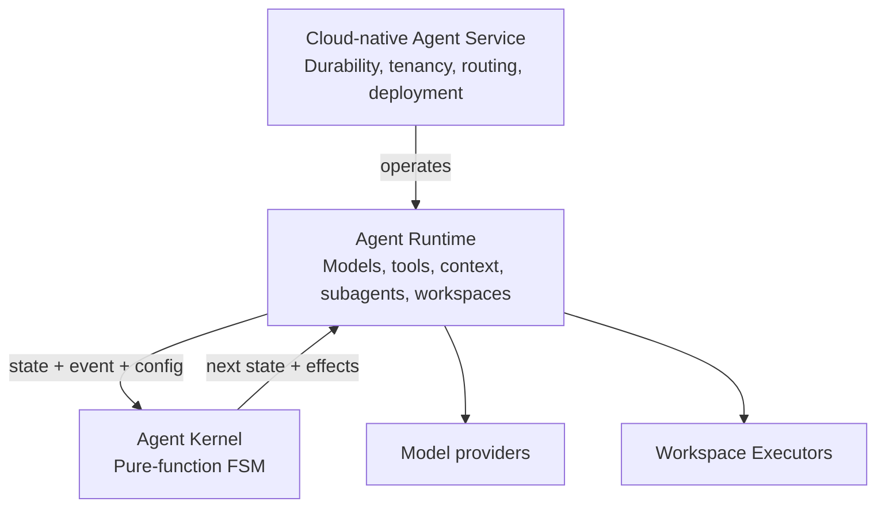

<p align="center">
  
  <picture>
    <source media="(prefers-color-scheme: dark)" srcset="packages/dashboard/public/brand/kala-wordmark-light.svg">
    
  </picture>
</p>

<p align="center">
  <a href="https://github.com/xingsy97/kala/actions/workflows/ci.yml"></a>
  <a href="https://github.com/xingsy97/kala/actions/workflows/integration.yml"></a>
  <a href="https://github.com/xingsy97/kala/actions/workflows/browser-security.yml"></a>
  <a href="https://github.com/xingsy97/kala/actions/workflows/release.yml"></a>
  <a href="https://github.com/xingsy97/kala/actions/workflows/private-cloud-release.yml"></a>
</p>

# Kala

Kala is a complete, self-hosted, cloud-native agent system for running agents
across models, workspaces, machines, and tenants. It combines
deterministic agent semantics, real-world execution, durable session
infrastructure, and multi-tenant operations in one architecture.

Its three layers form a single system: the Agent Kernel defines behavior, the
Agent Runtime executes it, and the cloud-native service operates it reliably at
deployment scale.

## One system, three layers

### Pure-function Agent Kernel

At the center of Kala is a pure-function finite-state machine:

```text
step(state, event, config) → { next, effects }
```

This function defines how an agent moves through model calls, tool execution,
approval, cancellation, and completion. It returns explicit effects instead of
performing I/O, keeping agent behavior predictable across providers,
workspaces, and deployments.

The result is an Agent Kernel that remains small enough to understand and
strict enough to act as the common behavioral contract for every deployment.
See the
[kernel implementation](packages/kernel/src/core.ts) and
[pure-reducer design](docs/meta/adr/0001-pure-reducer.md).

### Agent Runtime

A pure core does not call a model or edit a file. The Agent Runtime turns its
effects into real work: it connects model providers, streams their output,
coordinates tools and subagents, manages context, and sends workspace
operations to remote Executors.

That separation keeps model integration and workspace-specific behavior out of
the Kernel while preserving one deterministic execution contract throughout
Kala.

### Cloud-native Agent Service

Kala's service layer operates Agent Runtimes as a durable system across
processes, workspaces, machines, and tenants. It provides persistent sessions,
remote workspace connectivity, concurrent task and subagent coordination,
recovery, deployment control, and a consistent surface through the Dashboard,
Desktop client, APIs, and automation. The versioned
[Product API](docs/api/v1.md) exposes the same durable Session and DAG
authorities with OpenAPI and a typed client.

For Private Cloud, isolated Tenant Runtime Units share the surrounding
platform instead of requiring a complete service stack for every tenant. This
is designed to keep multi-tenant deployments cost-efficient while preserving
separate sessions, workspaces, Executors, artifacts, and runtime state.
Dedicated and Portable deployments use the same Agent Kernel and Runtime with
simpler operating topologies.



## Deployment modes

| Mode | Tenancy | Shape |
|---|---|---|
| **Portable** | Effectively single-tenant | One directly managed runtime for local and small installations |
| **Dedicated** | Single-tenant | The complete Platform dedicated to one organization |
| **Private Cloud** | Multi-tenant | A shared Platform with isolated Tenant Runtime Units |

The deployment topology changes; agent behavior does not. All three modes share
the same Kernel, Runtime contracts, workspace Executor model, and Dashboard.
See the
[deployment mode contract](docs/architecture/deployment-mode-contract.md)
for the normative boundaries.

## What you can do

- **Work across machines** — connect workspace executors, see their online
  status, and switch between sessions from one dashboard.
- **Plan and track dependent work** — map dependencies, see what is done or
  blocked, and follow delegated subagents alongside their messages and tool
  activity.
- **Keep context in view** — check context usage, inspect attachments and
  conversation history, thinking, and runtime state.
- **Inspect without leaving the session** — use the right panel for files, Git
  changes, a workspace terminal, and runtime status and trace events.
- **Stay in control** — review approvals and choose a model. Workspace tools
  run through outbound executors rather than exposing your workstation
  directly.

## Quick start from source

```bash
corepack enable
corepack prepare pnpm@11.3.0 --activate
pnpm install --frozen-lockfile
pnpm run build
```

Run the Host and Dashboard in separate terminals:

```bash
# Terminal 1 — any OpenAI-compatible /v1 endpoint
KALA_PROVIDER=openai OPENAI_BASE_URL=https://api.example.com/v1 \
  OPENAI_API_KEY='replace-with-your-key' HOST_MODEL='your-model-id' pnpm host:dev
# Terminal 2
pnpm dashboard:dev
```

Open the Dashboard URL printed by Vite. For workspace tools, start an executor
from the workspace you want Kala to operate on:

```bash
pnpm --dir packages/executor dev -- --host http://localhost:3000 --sandbox-root '/absolute/path/to/workspace'
```

Provider endpoints and model choices can also be configured in Dashboard
Settings. Never commit provider credentials or local configuration.

## Releases

GitHub Releases distribute Kala's portable Host and Dashboard. No GitHub CLI
is needed: on Linux or macOS, use the latest published release (requires `curl`,
`bash`, `wget`, and `sha256sum` or `shasum`):

```bash
set -o pipefail; curl --proto '=https' --tlsv1.2 -fsSL https://github.com/xingsy97/kala/releases/latest/download/run.sh | bash
```

Run this from Bash or another shell supporting `pipefail`, so download errors
are not hidden by the pipe. Review the download source before running network
code. The bootstrapper checks release assets against `SHA256SUMS`; checksums do
not establish publisher identity. The command requires a published Kala
release and fails if none exists. Do not run it with `sudo`. Configure a model
provider and connect a workspace Executor after the Host starts.

For the **Linux Desktop client** connecting to an existing trusted Kala server,
open that server's `/downloads/desktop/index.html` and copy its one-command
`curl` installer. It verifies an immutable package before installation. It is
not a Host installer, and the page only offers it when a Desktop package exists.
Dedicated and Private Cloud bundles are preview artifacts, not certified
installations in this bootstrap release; consult the operator runbooks and do
not pipe a script into a privileged shell.

Release and deployment details live in the runbooks instead of this README:

- [Public release readiness](docs/operations/public-release-readiness.md)
- [Linux desktop release](docs/operations/linux-desktop-release.md)
- [Dedicated operator CLI](docs/operations/dedicated-operator-cli.md)
- [Private Cloud release](docs/operations/private-cloud-release.md)
- [Release support policy](docs/operations/release-support-policy.md)

## Repository map

- [packages/kernel](packages/kernel/) — pure Agent Kernel, FSMs, effects, and
  runtime contracts
- [packages/host](packages/host/) — Agent Runtime, persistence, providers,
  session services, HTTP, and Socket.IO
- [packages/executor](packages/executor/) — isolated outbound workspace and
  tool execution
- [packages/dashboard](packages/dashboard/) — responsive product UI and PWA
- [deploy](deploy/) — cloud-native Dedicated, Private Cloud, Identity, and
  evaluation deployment assets
- [docs](docs/) — architecture, operations, protocols, and design notes
- [scripts](scripts/) — build, verification, security, release, and acceptance tooling

Start with the [documentation index](docs/README.md),
[contribution guide](CONTRIBUTING.md), and [security policy](SECURITY.md).

## Development checks

```bash
pnpm run typecheck
pnpm run test:fast
pnpm run privacy:check
```

Release candidates require the broader evidence set described in the
[public release readiness runbook](docs/operations/public-release-readiness.md).

## License

Kala is available under the [MIT License](LICENSE). Third-party components remain
governed by their own licenses and notices.
