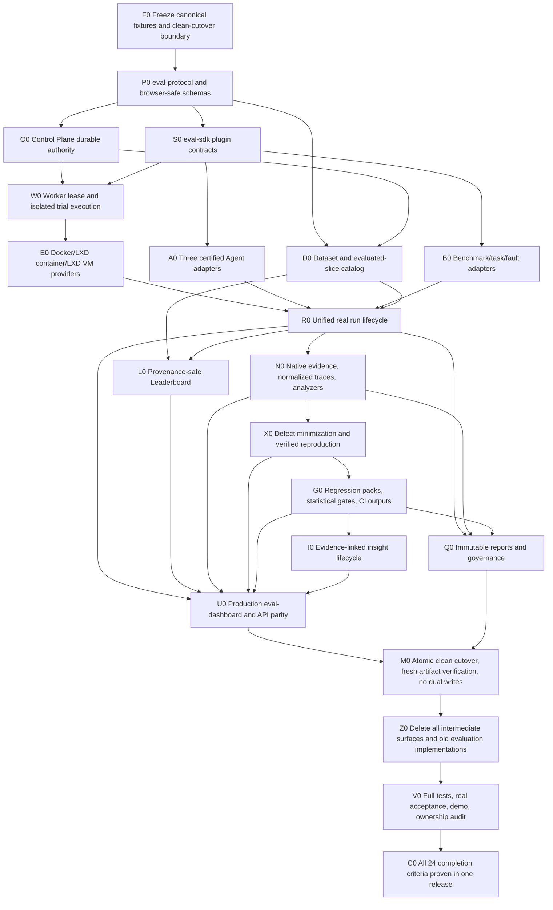

# Agent Evaluation Platform Implementation Ledger

Status: historical implementation ledger; current release reconciliation is IMPLEMENTED_UNVERIFIED pending clean-checkout acceptance
Authority: [`agent-evaluation-platform-refactor.md`](./agent-evaluation-platform-refactor.md)
Rule: an item is complete only when the listed authoritative evidence exists and passes in the same release. File presence, mocks, static source scans, or a narrower smoke test are not sufficient evidence.

## 1. Status vocabulary

| State | Meaning |
|---|---|
| `OPEN` | Required work or authoritative evidence is missing. It blocks platform completion. |
| `CONTRADICTED` | Current source/runtime state proves the target invariant is false. It blocks platform completion. |
| `IMPLEMENTED_UNVERIFIED` | Implementation exists, but the full required acceptance evidence is missing. It blocks platform completion. |
| `VERIFIED` | The implementation and all required evidence pass against the current release candidate. |

No state in this ledger means “deferred”, “optional”, “MVP”, “backend complete”, or “UI later”.

## 2. Dependency task graph

The critical path is architectural rather than package-order only: protocols and frozen canonical fixtures precede the sole durable authority; Worker isolation, adapters, tasks, and dataset identity converge into fresh real runs; analysis/reproduction/regression/insights and the production UI consume those authoritative runs; only then can clean cutover and deletion remove the old implementation.

## 3. Workstream ledger

### WS-A — Contracts and clean-cutover evidence

Dependencies: none. Unblocks every other workstream.

| ID | Required deliverable | Required evidence | State |
|---|---|---|---|
| A01 | Inventory all current evaluation modules and owners | Checked-in source/target ownership manifest covering Host, shared, Dashboard, scripts, fixtures, and bins | `VERIFIED`: the machine-readable ownership manifest covers canonical owners and migration source groups; `pnpm verify:evaluation-boundaries` passes against the post-cutover source tree and rejects every named old Host, Shared, Dashboard, script, fixture, and bin surface |
| A02 | Freeze canonical standalone run/result fixtures | Immutable canonical fixture corpus plus semantic stability tests | `VERIFIED`: the checked-in standalone run/result fixtures parse under strict protocol v1, commit stable run hash `78e8c470f78a5ff9704eaf3491cbb4b30930513b5ab3500fb08c094256cbe319`, result hash `a7c1ba253369b5757c063b65d0d4e51a99c53b7eac21d20dcabb733d27aaae81`, and manifest hash `6c379fab8e796ff79a38f8eab9734a7c0e06bde52b55329508337a2b125b3f48`, and reject semantic tampering in the same full-workspace release acceptance; consolidated evidence is `docs/evidence/evaluation/protocol-contracts-acceptance-20260803.json`, SHA-256 `ef0ec84188dc7f8fbf645b656763ecea89c33419a72dbfc086b1ba24fd1e0175` |
| A03 | Enforce clean-cutover exclusion of pre-refactor Host artifacts | Non-discovery/rejection tests and absence of import code | `VERIFIED`: standalone clean-cutover verification passes `reject-and-never-discover`; product Host regression coverage rejects the removed evaluation actions, the old `/eval/swebench/plan` route is asserted absent, and the import implementation is absent |
| A04 | Create browser-safe, versioned `eval-protocol` | Independent package build/typecheck and browser import test | `VERIFIED`: typecheck/build pass and browser bundle contains zero Node builtin imports on 2026-08-03 |
| A05 | Canonical immutable run spec and accepted-spec hash | Schema/property tests proving runtime/secrets/results are separate | `VERIFIED`: strict unknown runtime/result/secret rejection plus fixed canonical hash/tamper tests pass |
| A06 | Canonical run/trial states and monotonic event contracts | Reducer/event replay/property tests | `VERIFIED`: typed reducer tests accept only legal run/trial transitions, require contiguous monotonic durable sequences, replay deterministically, and property-check 200 generated histories with sequence-corruption rejection; consolidated protocol evidence is `docs/evidence/evaluation/protocol-contracts-acceptance-20260803.json`, SHA-256 `ef0ec84188dc7f8fbf645b656763ecea89c33419a72dbfc086b1ba24fd1e0175` |
| A07 | Canonical evidence levels and failure taxonomy | Schema tests; smoke-to-official rejection test; structured responsibility classification | `VERIFIED`: canonical evidence hashes and artifact manifests reject tampering, smoke/ungraded evidence cannot claim official authority, and normalized failures enforce category/responsibility/retry safety including indeterminate-side-effect constraints; consolidated protocol evidence is `docs/evidence/evaluation/protocol-contracts-acceptance-20260803.json`, SHA-256 `ef0ec84188dc7f8fbf645b656763ecea89c33419a72dbfc086b1ba24fd1e0175` |
| A08 | Dataset version and evaluated-slice contracts | Full/subset/explicit/sample invariant and truthful-label property tests | `VERIFIED`: full, official subset, named subset, explicit-ID, and sampled selections bind immutable task-ID manifests; schema/property tests enforce selected counts, coverage ratios, seeded sampling provenance, dataset licensing, and truthful UI labels across 300 generated samples; consolidated protocol evidence is `docs/evidence/evaluation/protocol-contracts-acceptance-20260803.json`, SHA-256 `ef0ec84188dc7f8fbf645b656763ecea89c33419a72dbfc086b1ba24fd1e0175` |
| A09 | Agent, benchmark, sandbox, detector, artifact, lease, analysis-job contracts | Version/capability negotiation tests and browser-safe exports | `VERIFIED`: the 27-file browser-safe protocol package exports strict Agent, benchmark, sandbox, detector, artifact, lease, and analysis-job contracts; tests prove capability negotiation/refusal, namespaced external-plugin constraints, contained unique artifact paths, and valid lease deadlines; consolidated protocol evidence is `docs/evidence/evaluation/protocol-contracts-acceptance-20260803.json`, SHA-256 `ef0ec84188dc7f8fbf645b656763ecea89c33419a72dbfc086b1ba24fd1e0175` |
| A10 | Defect, reproduction, regression, insight, report, audit contracts | Round-trip/schema migration tests | `VERIFIED`: strict canonical schemas cover defect, reproduction, regression, insight, report, and audit records; publication guards reject unsafe reproductions, incomplete reports, and unsupported validated insights, while explicit forward-only migration rejects historical/noncanonical inputs and missing migration paths; consolidated protocol evidence is `docs/evidence/evaluation/protocol-contracts-acceptance-20260803.json`, SHA-256 `ef0ec84188dc7f8fbf645b656763ecea89c33419a72dbfc086b1ba24fd1e0175` |
| A11 | Kernel remains benchmark-agnostic | Dependency-boundary test and source audit | `VERIFIED`: package/source boundary gate passes with zero Kernel workspace dependencies on 2026-08-03 |

### WS-B — Control Plane, data plane, and production Web UI foundation

Dependencies: WS-A.

| ID | Required deliverable | Required evidence | State |
|---|---|---|---|
| B01 | Independently buildable/deployable `eval-orchestrator` | Package build, service startup, protocol compatibility and deployment tests | `VERIFIED`: current-source image `sha256:db25284189d3c1676ebdf71f0a06c45dcf4e2eee071477f9a1df677c4c271d73` built and started healthy in a fresh isolated Compose deployment; the Control Plane stopped for 8 s and recovered while the same analyzer container remained healthy with restart count zero, then protocol-v1 grading and detector jobs completed in run `fresh-compose-msd94bpf-92fc1e2e`; `docs/evidence/evaluation/compose-rolling-recovery-20260803.json` SHA-256 `56e99d062f2aa0120ae01c773a15d88c6ac26274a052e8525d93d969b38a621f` |
| B02 | Sole durable run/trial/spec/event/projection store | Restart/replay tests; source audit proving no second writer | `VERIFIED`: `pnpm verify:evaluation-control-plane-authority -- --output docs/evidence/evaluation/control-plane-authority-acceptance-20260803.json` audits 585 production source files and finds durable writer markers only in the five expected `eval-orchestrator` entry/journal/model/projection files, with no second writer; seven acceptance tests prove atomic append-then-apply, restart replay, torn-tail exclusion, hash-chain tamper rejection, and catalog/analysis/run/trial/result recovery; artifact SHA-256 `7fcc5377617856b5dcf5d096744f16916871967e95f1fe5e34283c39583268e8` |
| B03 | Idempotent command API and committed acknowledgements | Duplicate-idempotency-key integration tests | `VERIFIED`: the real HTTP integration persists each acknowledgement atomically with its domain transaction, returns the identical committed acknowledgement for the same key/payload before and after Control Plane restart without increasing transaction count, and rejects the same key with a different payload as HTTP 409 without mutation; `docs/evidence/evaluation/control-plane-parity-acceptance-20260803.json` SHA-256 `acd6c0919619fea094eceaacaeb2aa2bb32de147b7869c986f7aa548e1912224` |
| B04 | Query API for catalogs/runs/trials/artifacts/reports/Leaderboards/defects/insights | Contract and pagination/filter integration tests | `VERIFIED`: the strict protocol-v1 `EvaluationQuerySchema`, shared SDK HTTP client, and sole Control Plane projection serve all 16 required resource classes through `/api/v1/query`; five focused integration tests prove catalog coverage, maximum page limits, malformed-cursor rejection, cursor continuation, totals, run/trial/artifact filtering, slice-isolated Leaderboards, durable analysis outputs/capability vectors/platform metrics, and defects/reproductions/regressions/reports/insights/audit; `docs/evidence/evaluation/query-api-acceptance-20260803.json` SHA-256 `98dc4ac9e2b926a3888102817ad2df771c8b629703f58a7938d871a4b2c4366c` |
| B05 | Ordered non-authoritative live events with durable catch-up | Dropped-event/reconnect integration and browser tests | `VERIFIED`: protocol-v1 SSE emits ordered durable sequence IDs and supports both explicit `after` cursors and `Last-Event-ID`; the Dashboard rejects gaps and duplicates, reconnects from the last contiguous sequence, exposes reconnecting state, and treats events only as notifications before re-querying the authoritative projection; four integration tests plus real Chromium prove a dropped sequence 1 is recovered before sequence 2 and produces three authoritative queries without replaying acknowledged events; `docs/evidence/evaluation/live-event-recovery-acceptance-20260803.json` SHA-256 `3debd200497a521c04bccfe0e281cc7830f45f091f7d83710c0be9598d55701f` |
| B06 | Durable scheduler: fairness, limits, backpressure, budgets, selective retry | Deterministic scheduler/property tests | `VERIFIED`: deterministic Control Plane tests prove compatible-run fairness, explicit priority, backend/provider concurrency ceilings, Worker resource backpressure, canonical lease limits, token/cost/wall-time budgets, retry backoff, and selective retry restricted to declared observed-safe categories; `docs/evidence/evaluation/scheduler-recovery-acceptance-20260803.json` records all four scheduler checks and 14 required coverage classes, SHA-256 `905a0d39bc26fe1a2085526b9081c65615cd4625fad48cbf35d918fe31ff2f0c` |
| B07 | Lease/heartbeat/expiry/orphan recovery and idempotent result commit | Worker-death, lease-expiry, duplicate-completion fault tests | `VERIFIED`: five Control Plane/Worker integration checks prove capability-compatible leasing, heartbeat renewal against the Control Plane clock, lease expiry, labelled orphan cleanup on Worker startup, hard Worker-death classification, result-hash idempotency, and durable lost-ACK retry; evidence is `docs/evidence/evaluation/scheduler-recovery-acceptance-20260803.json`, SHA-256 `905a0d39bc26fe1a2085526b9081c65615cd4625fad48cbf35d918fe31ff2f0c` |
| B08 | Cancellation and no blind replay after indeterminate effects | Lost-ACK/cancel/restart fault tests | `VERIFIED`: four fault-oriented checks prove pre-execution-only automatic requeue, durable cancellation propagation to the live Agent, timeout cleanup before commit, restart-safe indeterminate classification, and explicit operator confirmation before retrying ambiguous side effects; evidence is `docs/evidence/evaluation/scheduler-recovery-acceptance-20260803.json`, SHA-256 `905a0d39bc26fe1a2085526b9081c65615cd4625fad48cbf35d918fe31ff2f0c` |
| B09 | Independently buildable/deployable `eval-worker` process | Package build, process deployment, Control Plane protocol integration | `VERIFIED`: production-form Worker image `sha256:83718e975fc67e09d7c445a3df7fcc8fe194226eb6e8da39d842c34067492dbb` was independently built and deployed in isolated Compose project `agent-eval-worker-current-20260803`; protocol-v1 registration advertised Docker and `custom-command`, and real trial `fresh-worker-msd22o52-6c757265` completed the full lease-to-analysis lifecycle with canonical hashes, a 177-byte final diff, an imported allowlisted native verifier result, restart count zero, and zero residual managed trial containers; the complete 35-project workspace test and build commands pass; `docs/evidence/evaluation/worker-deployment-acceptance-20260803.json` SHA-256 `174016c4b5873e570a3f9496d04be2dd7d6e4d46fda8f399dc5b35968cb857e7` and `worker-deployment-runtime-20260803.json` SHA-256 `af9590ca960ec20ea7aa38d1b5086024aabb7ef0959b88ed528ed37a712f4678` record the runtime/source identity |
| B10 | Worker owns sandbox, Agent, verifier, artifact staging, cleanup | Process-boundary and source dependency audit | `VERIFIED`: `pnpm verify:evaluation-worker-boundary -- --output docs/evidence/evaluation/worker-boundary-acceptance-20260803.json` proves the ordered Worker-only create → Agent → verifier → collect → stage/verify → cleanup → committed-result chain, audits 28 non-Worker source files and production dependencies, confirms Worker is the sole Docker-socket consumer, and cross-checks real run `fresh-worker-msd22o52-6c757265`, 21/21 provider isolation checks, and six fresh RunLab sandboxes with verified cleanup; artifact SHA-256 `78b65ead581b9c100d320c856ef575a2dff4429feaca214ec5a78e6e6cae5adb` |
| B11 | Docker trial sandbox provider | Sandbox conformance suite | `VERIFIED`: the shared real-provider conformance command passed all 7/7 Docker checks against pinned image `alpine@sha256:28bd5fe8b56d1bd048e5babf5b10710ebe0bae67db86916198a6eec434943f8b`, including host-path exclusion, trial isolation, denied networking, resource bounds, descendant cancellation, complete cleanup, and reproducible environment locks; `docs/evidence/evaluation/sandbox-conformance-20260803.json` SHA-256 `8b6db08997327c47ba2fcd09b66fe094c35f8ebd800fa7ec2af9a8bf32a0174a` records source bundle `475c51312cd83dc1a8a278358063bfa2fadb4194d1fb0f3bf7f8c3e21ab64960` |
| B12 | CLI and HTTP as equal clients of the same Control Plane | CLI/API parity and committed-ack tests | `VERIFIED`: a real `eval-cli` child process and the public SDK client submit the same versioned HTTP command/query payloads and receive byte-equivalent parsed acknowledgement/projection results; the eval Dashboard delegates UI commands to that same shared client, loads normalized traces only through the contained artifact API, and returns committed acknowledgements; five required parity/durability tests are recorded in `docs/evidence/evaluation/control-plane-parity-acceptance-20260803.json`, SHA-256 `acd6c0919619fea094eceaacaeb2aa2bb32de147b7869c986f7aa548e1912224` |
| B13 | Independently buildable/deployable `eval-dashboard` | Package build/deploy and protocol refusal/capability tests | `VERIFIED`: package tests 28/28, typecheck, production build, protocol refusal, live-event recovery, top-level non-destructive Error Boundary, persisted English/Simplified Chinese navigation, and real-browser gate pass; current-source nginx image `sha256:6919b3e0a00dcde46804b0209f7bd39ae5a7964f961e78df774d6b415eda86c8` independently built and reached healthy in the fresh isolated Compose deployment recorded by `compose-rolling-recovery-20260803.json` |
| B14 | Production shell, operator continuity, confirmations, authoritative API client | Real-browser navigation/session/destructive-action tests | `VERIFIED`: the production bundle uses the shared protocol/SDK client, persists one local operator session plus pending/failed/committed commands, restores run/trial/filter URL state, validates and previews canonical RunSpecs before submission, resumes interrupted or failed commands with the identical idempotency key, and re-queries the authoritative projection after committed acknowledgement; real Chromium proves session continuity, zero-preconfirmation RunSpec submission, exact Cancel/Publish/Delete confirmation, authoritative deletion-impact hash binding, protected-reference blocking, and failed-command refresh/retry continuity; `docs/evidence/evaluation/dashboard-browser-acceptance-20260803.json` SHA-256 `8a8436030273f3c9de4d8ed5e60e960bb4344961af25645126172f1077ebe3db` |
| B15 | Ten production routes: Overview, Test Library, Runs, Leaderboard, Analysis, Defects, Regression, Insights, Reports, Administration/Audit | Route inventory and real-browser acceptance | `VERIFIED`: `docs/evidence/evaluation/dashboard-browser-acceptance-20260803.json` SHA-256 `8a8436030273f3c9de4d8ed5e60e960bb4344961af25645126172f1077ebe3db` records all ten URL-addressable production routes in Chromium |
| B16 | Loading, empty, unavailable, partial, error, reconnect/offline/stale states on every route | State-matrix browser tests for all ten routes | `VERIFIED`: the browser artifact records 90/90 per-route loading, ready, empty, partial, error/retry, protocol/capability refusal, offline/reconnect, and stale-data retention/recovery checks |
| B17 | Responsive, keyboard, focus, screen-reader, contrast acceptance | Desktop/tablet/mobile browser and automated/manual accessibility evidence | `VERIFIED`: the browser artifact records 30/30 responsive checks, named navigation, landmarks/headings, keyboard navigation, skip-link/focus-visible behavior, scroll-region reachability, and text-token contrast ratios from 7.21:1 to 17.6:1 |
| B18 | Virtualized/paginated large tables/traces within performance budgets | Large-run browser performance artifacts and thresholds | `VERIFIED`: the browser artifact records 10/10 first-page large-result checks, an API page ceiling of 100, contained keyboard-scrollable tables, no root horizontal overflow, every route below the 3 s budget, and a real 100+ event normalized trace with bounded virtual rendering plus a complete keyboard-reachable table |

### WS-C — Three certified Agent backends

Dependencies: WS-A, WS-B Worker boundary, WS-D sandbox interfaces.

| ID | Required deliverable | Required evidence | State |
|---|---|---|---|
| C01 | Agent RunLab adapter using public runtime interfaces | Adapter tests and dependency audit excluding private Host eval modules | `VERIFIED`: all three production source files and the production dependency set are audited; the adapter depends only on protocol/SDK, public shared wire types, and Socket.IO, imports no private Host/Dashboard eval module, passes its focused tests plus 10/10 shared certification, and has fresh RunLab native traces in both final three-Agent runs; consolidated evidence records 69 adapter tests and 30 certification checks in `docs/evidence/evaluation/agent-adapters-acceptance-20260803.json`, SHA-256 `61c97a115984dfe32675dc0eeaa30bcacb7a17c9cc96d45da79ef646b5ef55ed` |
| C02 | Fresh Host and fresh Executor co-located inside every RunLab trial sandbox | Process-topology acceptance evidence and cleanup proof | `VERIFIED`: checked-in real runners require RunLab native evidence for fresh Host/Executor versions and readiness; final fresh SDLC run `fresh-sdlc-journey-20260803052811-19080` and final fresh SWE-Bench run `fresh-swe-bench-astropy__astropy-12907-20260803052938-37670` passed with cleanup verified |
| C03 | Claude Code isolated SDK/CLI adapter | Certification and native-event evidence | `VERIFIED`: the isolated unprivileged CLI uses an isolated config/MCP directory, stream-json, no session persistence, strict MCP config, and refuses root execution; focused isolation tests, 10/10 certification, fresh SDLC 8/8, and fresh official SWE-Bench resolved native traces pass in consolidated adapter evidence SHA-256 `61c97a115984dfe32675dc0eeaa30bcacb7a17c9cc96d45da79ef646b5ef55ed` |
| C04 | Codex formal app-server/JSON adapter with CLI fallback and isolated home/config | Certification and native-event evidence | `VERIFIED`: both formal app-server RPC and ephemeral `exec --json` fallback use isolated `CODEX_HOME` and explicit provider config; separate fresh LXD SDLC Sessions `fresh-sdlc-journey-20260803082358-22094` and `fresh-sdlc-journey-20260803082241-11931` each passed 8/8 with native traces, no Worker errors, and verified cleanup; transport artifacts have SHA-256 `a640109e515a97c5bbff6d70a950c2f4c51c0b9a345be4760cb0211f9684e953` and `6ac9dfb96e4b9f20f472bd98507b200147e1964cb1f97735aa44e1cc2618542d`, consolidated by adapter evidence SHA-256 `61c97a115984dfe32675dc0eeaa30bcacb7a17c9cc96d45da79ef646b5ef55ed` |
| C05 | Custom-command development adapter remains non-ranked | Eligibility rejection test | `VERIFIED`: its descriptor is fixed `ranked: false`, official-required run specs reject it, the Leaderboard schema admits only the three official Agent types, and the expanded eligibility matrix explicitly rejects custom-command; consolidated adapter evidence SHA-256 `61c97a115984dfe32675dc0eeaa30bcacb7a17c9cc96d45da79ef646b5ef55ed` |
| C06 | Smoke backend remains non-evidence utility | Official/ranked publication rejection test | `VERIFIED`: smoke remains a protocol-only evidence level with no adapter package, runtime registration, deployment image, or publishable plugin; schemas reject ranked/non-smoke smoke descriptors, official-required smoke runs, official authority on smoke results, and all smoke Leaderboard entries; consolidated adapter evidence SHA-256 `61c97a115984dfe32675dc0eeaa30bcacb7a17c9cc96d45da79ef646b5ef55ed` |
| C07 | Shared 10-case adapter certification suite | All cases pass separately for all three official adapters | `VERIFIED`: 30/30 shared certification cases pass on 2026-08-03 |
| C08 | Same deterministic task runs in three fresh environments | Real three-Agent acceptance artifacts | `VERIFIED`: checked-in `run-real-task-pack.mjs` and `run-real-swe-bench.mjs` each created three distinct fresh LXD sandboxes; final evidence `final-fresh-sdlc-journey-20260803.json` and `final-fresh-swe-bench-astropy-12907-20260803.json` records equal environment locks and verified cleanup |
| C09 | Native/normalized events, versions/config, diff, verifier result; unavailable usage explicit | Per-trial artifact manifests and schema checks | `VERIFIED`: final fresh SDLC and official SWE-Bench three-Agent matrices passed canonical evidence/hash checks, non-empty diff and trace checks, and credential non-disclosure; final SWE-Bench normalized event counts were RunLab 82, Claude Code 84, Codex 315 |

### WS-D — Task, dataset, sandbox, and Leaderboard system

Dependencies: WS-A; provider work also depends on Worker boundary; real acceptance depends on WS-C.

| ID | Required deliverable | Required evidence | State |
|---|---|---|---|
| D01 | SWE-Bench adapter including official grading | Adapter tests and small real official-grade run | `VERIFIED`: adapter 6/6 tests plus fresh-source checked-in runner and final run `fresh-swe-bench-astropy__astropy-12907-20260803052938-37670`; all three Agents produced official `resolved=true`, `completed=true`, `patchApplied=true` evidence |
| D02 | Terminal-Bench adapter preserving native semantics | Adapter tests and real run | `VERIFIED`: adapter tests and the shared sandbox/verifier lifecycle pass, then fresh Codex Session `fresh-terminal-bench-20260803084645-27768` executed the public release-ledger task through Control Plane → Worker → isolated LXD → native verifier → grader/analyzer; canonical evidence records reward 1, resolved=true, 207 normalized events, non-empty artifact/diff hashes, zero Worker errors, and cleanup; consolidated evidence `docs/evidence/evaluation/benchmark-agent-lifecycles-acceptance-20260803.json` SHA-256 `a31109bd40c780ce47bd0173086abbf590397885348d9afdd58f773cc6e57a27` |
| D03 | ProgramBench adapter preserving compile/test semantics | Adapter tests and real run | `VERIFIED`: adapter tests and the shared compile/test lifecycle pass, then fresh Codex Session `fresh-program-bench-20260803084732-34165` implemented the public greeting CLI through the unified Control Plane/Worker/LXD lifecycle; the native contract, compile, and hidden-input tests all pass, with 196 normalized events, canonical hashes, completed grader/analyzer jobs, zero Worker errors, and cleanup; consolidated evidence `docs/evidence/evaluation/benchmark-agent-lifecycles-acceptance-20260803.json` SHA-256 `a31109bd40c780ce47bd0173086abbf590397885348d9afdd58f773cc6e57a27` |
| D04 | SWE-Marathon adapter | Adapter tests and real lifecycle run | `VERIFIED`: standalone adapter tests pass, and fresh run `fresh-swe-marathon-lifecycle-20260803115230-21515` completed accepted-spec → Control Plane → Worker → fresh Docker sandbox → native verifier → canonical evidence → grader/analyzer with 2/3 resolved tasks and cleanup; `docs/evidence/evaluation/swe-marathon-lifecycle-acceptance-20260803.json` SHA-256 `2b04806473745ede09500862060da35c706058f492b8cfcdf17d2a92068a3129` |
| D05 | Custom task-pack adapter/authoring system | SDK contract and external sample | `VERIFIED`: adapter 2/2 tests pass and clean-workspace contributor acceptance installs packed public protocol/SDK packages, builds and loads an external benchmark-adapter plugin plus licensed synthetic task without workspace links or private imports, while orchestrator internals remain unchanged; consolidated benchmark evidence SHA-256 `a31109bd40c780ce47bd0173086abbf590397885348d9afdd58f773cc6e57a27` and source contributor evidence SHA-256 `05fba8589035eea35801dee8b7f673d4de469c112e4a7387b7bc280fb139acd3` |
| D06 | Code-understanding v1 with declared localization metrics | Fixture/property tests and measured run | `VERIFIED`: the adapter strictly derives all six declared metrics from verifier-owned oracle data, Agent localization output, and native command-read events; 6 fixture/property tests including 300 generated cases pass, and fresh Codex/LXD Session `fresh-code-understanding-20260803094524-36650` produced file/symbol recall 1, first relevant read rank 2, irrelevant read ratio 0.4359, dependency-edge precision 0.5, dependency-edge recall 0.5, 256 normalized events, complete grader/analyzer hashes, zero Worker errors, and verified cleanup; acceptance evidence `docs/evidence/evaluation/code-understanding-acceptance-20260803.json` SHA-256 `881d5b7dd82e37badff38d16154e6a0fa65037cce46d07f28acded6081d87d20` |
| D07 | Memory/planning v1 | Isolation, retention, plan-graph tests and measured run | `VERIFIED`: the strict adapter independently derives 8 memory and 9 planning dimensions for recall/precision, stale use, correction, deletion, cross-workspace isolation, compaction/long-term retention, dependency/parallel graph quality, blocked starts, replanning, execution alignment, evidence-backed completion, bloat, and convergence; 6 fixture/property tests including 300 generated cases pass, and fresh Codex/LXD Session `fresh-memory-planning-20260803094524-36651` completed the public compacted release-handoff task with all positive rates 1, all violation/bloat rates 0, plan convergence true, 375 normalized events, complete grader/analyzer hashes, zero Worker errors, and verified cleanup; acceptance evidence `docs/evidence/evaluation/memory-planning-acceptance-20260803.json` SHA-256 `be5b6f11fdf111e60631c6a09e45352d3574474d72664852d3e6f5ee49db7b3f` |
| D08 | SDLC Journey v1 covering investigate through rollback/recovery | Full real build/test/package/deploy/health/rollback run | `VERIFIED`: versioned task pack and checked-in runner produced final fresh three-Agent run `fresh-sdlc-journey-20260803052811-19080`; RunLab, Claude Code, and Codex each passed all 8/8 stages and cleanup verification |
| D09 | Versioned production fault scenarios and responsibility labels | Deterministic injection/recovery tests | `VERIFIED`: canonical responsibility policy permits Agent/model blame only when observed state supports a safer recovery choice, otherwise possible side effects become indeterminate and non-retryable; protocol 26/26, Worker 16/16, Control Plane 22/22, and the consolidated 15/15 matrix cover observable Agent failure, provider 429/timeout, environment setup/resource exhaustion, verifier timeout, lease-expiry ambiguity, durable cancellation/acknowledgement/restart, plus fresh LXD rollback and fault-recovery lifecycles with zero residue; `docs/evidence/evaluation/fault-responsibility-matrix-20260803.json` SHA-256 `fae1f69c0a8f9ea098646f9e25166a8068cb26857bbbd2fcb2e78648e6c4b9ae` |
| D10 | Metamorphic variant generator | Semantic-equivalence and memorization-sensitivity tests | `VERIFIED`: public SDK generator v1 produces deterministic, path-contained, content-hashed variants for path/directory renames, requirement rewording, irrelevant files, function order, test-output formatting, and non-semantic config; SDK 10/10 tests pass, all six public CLI variants preserve the exact native verifier behavior signature across arbitrary inputs and invalid arity, while a hard-coded-path candidate fails only the renamed variant and a semantic prefix mutation is rejected; `docs/evidence/evaluation/metamorphic-variants-acceptance-20260803.json` SHA-256 `aa9030d24b3737241cfbdb7792382ef0f8000563aba60963589caf84b3ad14e6` |
| D11 | Docker, LXD system-container, and LXD VM providers | Same sandbox conformance suite passes all three | `VERIFIED`: `pnpm verify:evaluation-sandbox-conformance -- --output docs/evidence/evaluation/sandbox-conformance-20260803.json` passed the same 7/7 real checks for Docker 29.6.0, LXD container 5.21.5 LTS, and LXD VM 5.21.5 LTS against pinned image digests, then left zero managed containers, instances, networks, or ACLs; artifact SHA-256 `8b6db08997327c47ba2fcd09b66fe094c35f8ebd800fa7ec2af9a8bf32a0174a`, source bundle `475c51312cd83dc1a8a278358063bfa2fadb4194d1fb0f3bf7f8c3e21ab64960` |
| D12 | Per-Agent fresh sandbox, equal environment lock and security policy | Cross-trial isolation and environment-lock replay tests | `VERIFIED`: both fresh three-Agent matrices created three unique LXD sandboxes, asserted one canonical environment lock, and verified instance/network/ACL cleanup; no `eval-*`, `ae-n-*`, or `ae-a-*` resources remained after audit |
| D13 | Immutable dataset/version/slice catalog | Catalog lineage and hash verification tests | `VERIFIED`: accepted specs durably journal dataset/task-pack/slice/task lineage, restart restores the catalog without startup input, and hash-bound task IDs plus cursor-paginated catalog queries pass; `docs/evidence/evaluation/catalog-leaderboard-acceptance-20260803.json` SHA-256 `a45715e80a249e665c9c9b96ce93aa88d56636268468c96a2775647a325f3687` |
| D14 | Full, official subset, named subset, explicit-ID, sampled manifests | Invariant/property and UI label tests | `VERIFIED`: all five selection kinds bind immutable task-ID manifests; 300 generated samples enforce count/coverage/seed/stratification/filter invariants, and real-browser labels expose selection kind, selected/total, coverage, seed, and filters; `docs/evidence/evaluation/catalog-leaderboard-acceptance-20260803.json` SHA-256 `a45715e80a249e665c9c9b96ce93aa88d56636268468c96a2775647a325f3687` |
| D15 | Leaderboard eligibility and native primary metric policy | Evidence/completion/verifier/repeat/dataset/slice rejection tests | `VERIFIED`: the complete eligibility matrix rejects smoke/native evidence for official datasets, incomplete repeats, zero repeats, and missing verifier identity; comparability additionally requires the exact dataset/version/split/slice/verifier/repeat-policy/evidence tuple, while publication derives the benchmark-native primary metric from canonical verifier evidence; `docs/evidence/evaluation/catalog-leaderboard-acceptance-20260803.json` SHA-256 `a45715e80a249e665c9c9b96ce93aa88d56636268468c96a2775647a325f3687` |
| D16 | Model, Agent Type, Test Dataset pivots without cross-slice rank mixing | Projection tests and real-browser acceptance | `VERIFIED`: one authoritative projection serves Model, Agent Type, and Test Dataset pivots, filters by exact `sliceManifestHash`, returns explicit ranking groups, replays identically after restart, auto-supersedes matching entries, supports explicit invalidation and active/audit views, exports exact-slice CSV/JSON provenance, and requires an explicit warning before unranked cross-slice comparison; `docs/evidence/evaluation/catalog-leaderboard-acceptance-20260803.json` SHA-256 `a45715e80a249e665c9c9b96ce93aa88d56636268468c96a2775647a325f3687` and Chromium acceptance pass |

### WS-E — Defect mining and verified reproduction

Dependencies: authoritative native and normalized trial evidence from WS-B/C/D.

| ID | Required deliverable | Required evidence | State |
|---|---|---|---|
| E01 | Versioned constraint lifecycle and instruction-drift detector | Seeded corpus precision/recall | `VERIFIED`: current source passed 8 versioned public synthetic cases at precision/recall/F1 1.0 in `docs/evidence/evaluation/detector-validation-v1.json`; artifact SHA-256 `bac49b1a6c7533cb5940e1cf982a995d71fbe9851e9d9f5ee1a354b3da335ea3` |
| E02 | Context-forgetting detector including compaction/stale memory | Seeded corpus precision/recall | `VERIFIED`: current source passed 8 retention/compaction cases at precision/recall/F1 1.0 in the detector artifact |
| E03 | Test-gaming/verifier-tampering detector | Protected/hidden/mutation fixture precision/recall | `VERIFIED`: current source passed 8 hidden-verifier mutation/control cases at precision/recall/F1 1.0 in the detector artifact |
| E04 | Tool-grounding/recovery detector including indeterminate replay | Seeded corpus precision/recall | `VERIFIED`: current source passed 8 observed-state and ambiguous-replay cases at precision/recall/F1 1.0 in the detector artifact |
| E05 | Planning/execution detector | Plan/event graph precision/recall | `VERIFIED`: current source passed 8 critical-plan verification/control cases at precision/recall/F1 1.0 in the detector artifact |
| E06 | Trace alignment and first meaningful divergence | Successful/failed and cross-Agent alignment tests | `VERIFIED`: meaningful-event projection ignores volatile cross-Agent fields, aligns same-task successful/failed traces, and reports the first semantic divergence, missing successful action, additional failed loop cost, and post-divergence event/wall/currency cost; a standalone `trace-alignment` job writes hash-verified canonical artifacts and replays after restart in fresh run `fresh-analysis-mining-20260803130402-16759`; consolidated evidence `docs/evidence/evaluation/analysis-mining-acceptance-20260803.json` SHA-256 `7e1c7b4def7a2337b3bdc1db82f029985ee3d8f0fb2d9a6b20099bf4ee522b6d` |
| E07 | Unknown clustering with deterministic fallback and human promotion | Cluster fixture and promotion audit | `VERIFIED`: unknown findings cluster deterministically by SHA-256 of normalized action/error sequences, analyzer output remains `unknown`, and only an explicit reviewer/operator command can create a durable human-named taxonomy promotion; promotion actor, authority, cluster, source job, and time are journaled, audited, queried, and replayed in the fresh consolidated run; evidence SHA-256 `7e1c7b4def7a2337b3bdc1db82f029985ee3d8f0fb2d9a6b20099bf4ee522b6d` |
| E08 | Counterfactual continuation | Checkpoint/corrected-action/backend/model/tool/fault tests | `VERIFIED`: an immutable failed-trace checkpoint and verifier-bound source failure fingerprint drive corrected-action, different-backend, different-model, corrected-tool-result, and fault-removed continuations through an injectable or bounded JSON command harness; contiguous continuation events are canonical output, and the Control Plane independently recomputes source, checkpoint, continuation, and outcome fingerprints before accepting exactly one result per intervention; all five interventions and restart replay pass in fresh run `fresh-analysis-mining-20260803130402-16759`; evidence SHA-256 `7e1c7b4def7a2337b3bdc1db82f029985ee3d8f0fb2d9a6b20099bf4ee522b6d` |
| E09 | Delta-debugging reproduction minimizer | Failure-preservation invariants | `VERIFIED`: analyzer invariants pass and fresh run `fresh-reproduction-20260803125224-29487` reduced 3 units to the one failure-preserving config unit over 4 ddmin attempts |
| E10 | Complete signed/checksummed defect bundle and one-command reproduction | Fresh-environment repeated reproduction and control | `VERIFIED`: `docs/evidence/evaluation/flagship-fresh-reproduction-20260803.json` records 8 unique fresh LXD executions, 2/2 same-fingerprint reproductions, a fresh success control, one retained `analyzer.detect` plus three successful `reproduction.verify` spans, Ed25519 signature/checksums, minimized workspace, replay script, and cleanup proof; artifact SHA-256 `82b7d113d4137bd70d4e7edbb7ebda78b6783121cd3738a47f924ddc2ebd41a8` |
| E11 | Privacy scan/redaction and no private absolute paths | Secret/path seeded tests and publication rejection | `VERIFIED`: bundle generation rejects seeded secret/private paths, records all three privacy gates, and one-command CLI enforces signed regular-file containment with symlink/realpath checks |

### WS-F — Regression, reports, and CI integrations

Dependencies: WS-E reproduction and WS-D immutable slices; UI portions depend on WS-B Dashboard.

| ID | Required deliverable | Required evidence | State |
|---|---|---|---|
| F01 | Versioned regression-pack registry and defect promotion | Promotion integration test with immutable refs | `VERIFIED`: the release runner records durable human-validated defect promotion with signed reproduction, immutable environment/verifier refs, replay, and query acceptance |
| F02 | Paired baseline/candidate runner | Matched-task/config evidence tests | `VERIFIED`: `docs/evidence/evaluation/regression-reporting-acceptance-20260803.json` records exact paired task/repeat/config evidence for blocking and improving candidates; artifact SHA-256 `02b353f7e02669b087f6bf4e747e85ce7d173a9a269a091dfcea398e23bd3ca5` |
| F03 | Confidence intervals, paired statistics, repeat variance | Statistical correctness/property tests | `VERIFIED`: the artifact records success deltas, paired wins/losses/ties, exact McNemar p-values, and 95% confidence intervals |
| F04 | Flake-aware blocking gates and infrastructure classification | Seeded regression blocks; flaky task classified | `VERIFIED`: deterministic regression blocks, improvement passes, and a 50% flaky task is excluded and reported without a false deterministic block |
| F05 | JSON, CSV, JUnit, SARIF, Markdown outputs from immutable evidence | Deterministic golden tests | `VERIFIED`: five machine/CI formats passed content and stable-hash checks across reordered immutable inputs |
| F06 | Static HTML and print/PDF reports with all ten required sections/repeats | Reproducibility and rendering tests | `VERIFIED`: HTML print CSS, PDF structure, all ten sections, and all six configured task/repeat coordinates passed |
| F07 | Reports catalog/preview/download with provenance and redaction status | Real-browser and artifact-integrity tests | `VERIFIED`: Reports browser route passed state/responsive/large-page acceptance; durable report catalog and contained hash-checked format reads passed; manifest records evidence hash and redaction |
| F08 | GitHub Actions tested integration | Integration workflow fixture passes | `VERIFIED`: the verifier extracts the workflow's declared `eval-ci` command, executes it verbatim in an isolated workspace, and checks `always()` artifact upload plus all five outputs and pass/block/indeterminate exit codes; `docs/evidence/evaluation/ci-integrations-acceptance-20260803.json` SHA-256 `f5f98ef31c30fa58ea600b7e78003de4c52cfe8b8d2afe7f68b518778362b25a` |
| F09 | GitLab CI tested integration | Integration fixture passes | `VERIFIED`: the verifier extracts and executes the declared command verbatim, then proves `when: always`, JUnit publication, five output formats, and the shared three-exit-code contract in the same CI evidence |
| F10 | Jenkins tested integration | Integration fixture passes | `VERIFIED`: the verifier extracts and executes the declared pipeline command verbatim, then proves `post/always` archive and JUnit preservation plus the same output and exit-code contract |

### WS-G — Insights, administration, governance, and open-source readiness

Dependencies: WS-E/F; UI surfaces depend on WS-B Dashboard.

| ID | Required deliverable | Required evidence | State |
|---|---|---|---|
| G01 | Durable insight lifecycle linking evidence, impact, recommendation, owner, regression, validation | End-to-end insight state and audit tests | `VERIFIED`: release evidence records a validated insight linking finding and improving gate to affected rate, recommendation, expected metric, regression pack, owner, and post-fix validation; durable audit/replay test passed |
| G02 | Administration/Audit registries and immutable operation/publication audit | API/UI/governance tests | `VERIFIED`: `docs/evidence/evaluation/governance-acceptance-20260803.json` records ordered immutable audit/replay, nine Administration route-state browser checks, persisted English/Simplified Chinese navigation, normalized-trace governance, and a non-destructive Error Boundary; artifact SHA-256 `9f8f24c4a49c489c2f49e744f165fd5165eb56726cbbc1ef0a3a6e25ce8ff25e` |
| G03 | Credential references only; no persisted plaintext | Secret-seeded storage/artifact/metric tests | `VERIFIED`: four current-source gates reject plaintext fields, redact generic/referenced secrets and private paths, keep secrets out of Docker/LXD host argv, use 0600 transfer files, and delete those files |
| G04 | Path-contained local artifact APIs | Traversal/symlink/allowlist tests | `VERIFIED`: five current-source gates reject traversal, absolute paths, symlinks, non-allowlisted imports, hash mismatches, and private report paths |
| G05 | Transitive retention/deletion | Derived-artifact deletion tests | `VERIFIED`: durable integration previews a hashed impact, rejects stale hash, requires exact confirmation, transitively deletes trials/reports/reproductions/packs/insights/files, and preserves the deletion across replay |
| G06 | Historical read-only import/checksum controls | Migration/governance tests | `VERIFIED` under the stricter requested policy: historical Host state has no import surface and is rejected/never discovered; source and ownership scans pass |
| G07 | License/permission/provenance controls for task packs/public data | Catalog validation and publication rejection tests | `VERIFIED`: protocol/catalog publication rejects unknown/denied/unreviewed license or permission, and SWE-Bench rejects mismatched image lineage and unpinned harnesses |
| G08 | Public `eval-sdk`, sample adapter, starter template | External-package conformance test without orchestrator edits | `VERIFIED`: `docs/evidence/evaluation/external-contributor-acceptance-20260803.json` records three clean temporary workspaces built from packed public protocol/SDK packages, runtime-loaded Agent/task-pack/detector starters, zero private imports, and unchanged orchestrator internals; artifact SHA-256 `05fba8589035eea35801dee8b7f673d4de469c112e4a7387b7bc280fb139acd3` |
| G09 | Task-pack and detector plugin guides plus synthetic examples | Clean-clone contributor acceptance | `VERIFIED`: the external-contributor artifact validates the public synthetic task fixture plus positive/negative detector corpus and checks the contributor guide contract from clean workspaces |
| G10 | Docker Compose standalone quick start | Clean-machine installation and health acceptance | `VERIFIED`: `docs/evidence/evaluation/compose-deployment-acceptance-fresh-20260803.json` records a new-project/new-volume standalone Compose deployment with healthy services, one durable canonical trial, completed grader and analyzer jobs, and cleanup; artifact SHA-256 `79202674a1186f3c1068e58f3a555a3d45f00b3b9ab70ade76fe0363c66bf8a7` |
| G11 | Contribution, security, compatibility, release docs | Documentation link/check and contributor acceptance | `VERIFIED`: clean contributor acceptance hash-checks contribution, security, direct protocol compatibility with no `legacy-v1`, release/rollback, and Compose quick-start documentation |
| G12 | Five-task three-Agent demo under ten minutes, no private data | Timed clean-install demo artifact | `VERIFIED`: `docs/evidence/evaluation/flagship-closed-loop-baseline-20260803.json` records run `fresh-fault-scenarios-20260803100157-8557` over five public synthetic tasks across Agent RunLab, Claude Code, and Codex in 15 fresh LXD sandboxes, 15/15 recovered, cleanup verified, in 261106 ms; artifact SHA-256 `9e92b222a289fcbc9a18a69ffcae919908840667a74c58ca4302b98f755a2c0c` |

## 4. Atomic migration and deletion gates

### 4.1 Binding migration sequence

| ID | Required atomic migration step | Dependencies | Exit evidence | State |
|---|---|---|---|---|
| M01 | Freeze canonical fixtures and clean-cutover boundary | none | A01–A03 verified | `VERIFIED`: A01–A03 are verified by the machine-readable ownership manifest, immutable fixture hash/tamper acceptance, and `reject-and-never-discover` clean-cutover gate |
| M02 | Create `eval-protocol`; switch callers directly to canonical schemas | M01 | A04–A10 verified; canonical fixture tests pass | `VERIFIED`: A04–A10 and canonical fixture stability pass through the browser-safe protocol build plus 16 consolidated contract/property tests in `protocol-contracts-acceptance-20260803.json` |
| M03 | Extract durable run store/orchestration; prove CLI/HTTP parity | M02 | B01–B08, B12 verified | `VERIFIED`: B01–B08 and B12 are independently verified, including deployment/restart, sole-writer replay, query/command APIs, SSE recovery, scheduler/lease/cancellation faults, and real CLI/SDK/Dashboard parity |
| M04 | Extract Worker/sandbox execution; remove execution from Host routes | M03 | B09–B11 plus isolation/restart tests | `VERIFIED`: B09–B11, Worker-only process ownership, three-provider conformance, real lease-to-result execution, cleanup, and Host/source boundary rejection all pass |
| M05 | Extract official Agent and benchmark adapters | M04 | WS-C and D01–D05 verified | `VERIFIED`: WS-C is closed by 30/30 certification plus fresh three-Agent official/SDLC evidence; D01–D05 now include official SWE-Bench, fresh real-Agent Terminal-Bench and ProgramBench Sessions, SWE-Marathon lifecycle, and clean-workspace custom task-pack SDK acceptance |
| M06 | Extract analyzer, regression, reporting, dataset catalog, Leaderboard | M05 | WS-E/F and D13–D16 verified | `VERIFIED`: WS-E/F and D13–D16 are closed; `eval-analyzer` now independently owns detector, alignment, clustering, counterfactual, minimization, and reproduction execution while `eval-orchestrator` owns regression/report/catalog/Leaderboard authority, with package boundaries excluding product Host/Dashboard dependencies; fresh analysis evidence SHA-256 `7e1c7b4def7a2337b3bdc1db82f029985ee3d8f0fb2d9a6b20099bf4ee522b6d` and current Control Plane authority evidence SHA-256 `7fcc5377617856b5dcf5d096744f16916871967e95f1fe5e34283c39583268e8` |
| M07 | Move evaluation Web UI; replace local-file reads with Control Plane clients | M03, M06 | B13–B18 verified | `VERIFIED`: B13–B18 are closed by independent production build/deployment and Chromium route/state/responsive/accessibility/performance acceptance; production `eval-dashboard` source depends only on `eval-protocol`/`eval-sdk`, has no Node filesystem or product Host/Dashboard import, and uses the shared Control Plane client for authoritative reads and committed commands |
| M08 | Verify fresh canonical artifacts without dual writes | M03, M06, M07 | Fresh-run artifact audit and single-writer proof | `VERIFIED`: fresh standalone analysis run `fresh-analysis-mining-20260803130402-16759` accepted only hash-verified Control Plane artifacts and replayed them after restart without Host/legacy input; the current authority audit scanned 585 production source files, found only the five expected `eval-orchestrator` writer surfaces, and found no second writer; clean-cutover remains `reject-and-never-discover` |
| M09 | Remove product evaluation surfaces and link to standalone platform | M08 | Product regression tests and capability audit | `VERIFIED`: Host, Shared, and product Dashboard evaluation routes/actions/capabilities/pages/scripts are absent; the product `profile-session` operation remains product-owned; Host 657/657 and Dashboard 730/730 tests pass; the only allowed Product integrations—standalone platform link, governed Session task-candidate export, and explicit same-Session run/defect references—pass in `docs/evidence/evaluation/product-dashboard-integration-acceptance-20260803.json`, SHA-256 `67893fcf26eb958faeb5e049bb420effdd786bed2e512ead53663bdcc4d942de` |
| M10 | Execute complete real acceptance and migration tests | M09 | Section 6 evidence passes | `VERIFIED`: all 24 Section 6 criteria are verified in the current release; the completion matrix covers ten declared benchmark/task-pack lifecycles, seven unit/property groups, and eight integration groups with zero failures and zero managed runtime residue; `docs/evidence/evaluation/completion-matrix-acceptance-20260803.json` SHA-256 `983972a030235b6d1209d58b1586943e300d9a141f2d24c864f035d345d91f48` |
| M11 | Delete every intermediate surface and old evaluation implementation | M10 | Deletion list below and product regression pass | `VERIFIED`: X01–X07 are absent and named by the boundary gate; product regression and the complete workspace test/build commands pass |
| M12 | Source-tree ownership/dependency audit proves no duplicate implementation | M11 | Machine-readable ownership report and boundary CI | `VERIFIED`: `pnpm verify:evaluation-boundaries` reports 13 package rules, two source rules, 27 ownership sources, and `reject-and-never-discover` with no findings |

At no stage may both stacks accept authoritative writes. The cutover configuration and test must identify exactly one writer.

### 4.2 Required migration rules

All eight rules are gates: move implementation and tests together; freeze canonical behavior before movement; replace private imports before deletion; do not release forwarding compatibility surfaces; exclude pre-refactor Host evaluation artifacts; keep Agent product runtime code in the product; enforce explicit package dependency allowlists; give every temporary compile surface a named removal test and delete it before acceptance. Evidence for each rule is recorded in the final ownership report.

### 4.3 Final deletion list

| ID | Required deletion | Current state | Deletion proof |
|---|---|---|---|
| X01 | `packages/host/src/eval/` | `VERIFIED`: directory is absent | Source absence plus migrated-owner/test manifest |
| X02 | Evaluation implementation imports/routes in `packages/host/src/http/routes.ts` | `VERIFIED`: old routes/actions and evaluation imports are absent; rejection coverage passes | Boundary/source audit and product route tests |
| X03 | Benchmark orchestration exports from `packages/host/src/index.ts` | `VERIFIED`: old exports are absent | Public export audit |
| X04 | Evaluation-only schemas from `packages/shared/src/` | `VERIFIED`: `benchmark-orchestrator.ts`, `eval-types.ts`, and `swebench-types.ts` are absent | Shared export/dependency audit |
| X05 | `packages/dashboard/src/features/benchmarks/` | `VERIFIED`: directory is absent and the product Dashboard build/tests pass | Product Dashboard build and source absence |
| X06 | Evaluation-only artifact views in product Dashboard | `VERIFIED`: BadCases/EvalRuns/RunBenchmarkWizard and the mixed artifact view are absent; product-only artifact views remain | Product Dashboard build and source absence |
| X07 | All temporary compile surfaces and duplicate tests | `VERIFIED`: obsolete benchmark wizard/browser scripts and old implementation tests are deleted and pinned by the named removal gate | Named removal test and ownership report |

Product-owned Kernel FSM, Session/event log, Host loop/model adapters, Executor tools, memory/compaction/planning/skills/approvals/sub-agents, product connectivity/recovery, product Session Dashboard, and generic artifacts/traces must remain functional and must not acquire an `eval-*` runtime dependency.

## 5. Verification graph

| Gate | Required scope | Authoritative evidence | State |
|---|---|---|---|
| V01 | Unit/property | Schemas/migrations, reducers/replay, leases/retries, conformance, detectors, minimizer, statistics/reports, privacy | `VERIFIED`: the current-source completion matrix records all seven required groups true—schemas/migrations, reducers/replay, leases/retries, three-provider conformance, detectors, minimizer/privacy, and statistics/reports—with zero failures; artifact SHA-256 `983972a030235b6d1209d58b1586943e300d9a141f2d24c864f035d345d91f48` |
| V02 | Integration | CLI/API parity, Control Plane/Worker, restart/cancel, artifacts, adapter normalization, official grader, defect promotion, Product Dashboard links | `VERIFIED`: the current-source completion matrix records all eight required groups true—CLI/API parity, Control Plane/Worker, restart/cancel, artifacts, adapter normalization, official grader, defect promotion, and the three governed Product Dashboard integration points—with zero failures; artifact SHA-256 `983972a030235b6d1209d58b1586943e300d9a141f2d24c864f035d345d91f48` |
| V03 | Fault injection | Worker death, Control Plane restart, provider 429/timeout, lost ACK, setup failure, interrupted artifact, verifier timeout, duplicate completion, lease expiry, resource exhaustion, rollback | `VERIFIED`: `docs/evidence/evaluation/fault-matrix-20260803.json` records 15/15 fresh fault-injection and fresh-sandbox lifecycle scenarios, including a real interrupted HTTP request body and verified retry, with zero managed LXD residue; artifact SHA-256 `e5cf6b560d33d4781d8c7e50aa8ce2a0f904582a9ef1e14cf0fb1ce249d3d729` |
| V04 | Real three-Agent deterministic fixture | Fresh sandbox per official backend, complete evidence | `VERIFIED`: `docs/evidence/evaluation/final-fresh-sdlc-journey-20260803.json` records three distinct fresh sandboxes, equal environment locks, canonical artifacts, and verified cleanup; artifact SHA-256 `42b6117f9310850020845c985239644ba9c7a60448b23db7204202149f3417b4` |
| V05 | Small paired SWE-Bench with official grading | Matched slices and official result ingest | `VERIFIED`: `docs/evidence/evaluation/final-fresh-swe-bench-astropy-12907-20260803.json` records one matched explicit-ID slice and three official resolved results from pinned harness/image lineage; artifact SHA-256 `e458fcc3e3d4529cb7a99f3dd47ee7d72f267f03b53ff841db3ed43d1b033a78` |
| V06 | Terminal-Bench or full SDLC Journey | Full lifecycle evidence | `VERIFIED`: final fresh three-Agent SDLC evidence records 8/8 investigate/build/test/package/deploy/health/rollback stages for every Agent |
| V07 | Fault-recovery pack | Deterministic injection and measured recovery | `VERIFIED`: versioned config-schema fault passed fresh Agent recovery, 5/5 verifier lifecycle, and repeated minimized fresh-sandbox reproduction plus success control |
| V08 | Baseline/candidate CI regression demonstration | Statistical/flake-aware decision and outputs | `VERIFIED`: release evidence records block, pass, and non-blocking flake-aware decisions with paired statistics and seven deterministic report/CI outputs |
| V09 | Flagship closed-loop demo | All ten demo steps, including defect, reproduction, regression, gate, validated insight | `VERIFIED`: `docs/evidence/evaluation/flagship-closed-loop-20260803.json` records 10/10 steps, strict five-coordinate immutable pairing, signed minimized reproduction promotion, passing gate, validated insight, seven-format report, and durable replay of all closed-loop resources over a verified 328-transaction hash chain; artifact SHA-256 `74e3ca5859e4ce7ef5aa1f60d53d50c935f39171021ce6ca2a84dabdc8ac05d0` |
| V10 | Production browser acceptance | All routes/states, pivots, reconnect, responsive, a11y, performance | `VERIFIED`: fresh production-bundle Chromium acceptance passed 90 route-state, 30 responsive, 10 large-page, three exact-slice pivot, live-event recovery, five operator-command, eight product-workflow, keyboard/focus, landmark/name, contrast, internationalization, virtualized normalized-trace, and telemetry assertions with zero failures |
| V11 | Migration/ownership acceptance | Canonical fixtures, clean-cutover exclusion, product independence, standalone independence, no reverse imports, no legacy/duplicate code | `VERIFIED`: boundary and clean-cutover gates and the complete workspace test/build commands pass, product evaluation surfaces are absent, and no compatibility reader or reverse dependency remains |

## 6. The 24 completion criteria and proof matrix

| Criterion | Depends on | Evidence that must pass in the same release | State |
|---|---|---|---|
| CC01 Independent orchestration | A, B, M12, X01–X04 | Standalone service acceptance; product absent; dependency/ownership audit | `VERIFIED`: all A- and B-series gates pass, including independently deployed Control Plane/Dashboard/Worker processes, sole-writer replay, Worker isolation, protocol/API parity, and production-browser operator continuity; M12 and X01–X04 prove package ownership, product-source absence, and no reverse dependency or duplicate evaluation implementation |
| CC02 Independently buildable/deployable compatible UI/Control Plane/Worker | B01, B09, B13 | Three builds/deployments and protocol negotiation/rolling tests | `VERIFIED`: independently built Control Plane and Dashboard images pass fresh Compose startup and Control Plane rolling recovery, while independently built Worker image `sha256:83718e975fc67e09d7c445a3df7fcc8fe194226eb6e8da39d842c34067492dbb` negotiated protocol v1 and completed real Docker trial `fresh-worker-msd22o52-6c757265`; B01, B09, and B13 have direct deployment evidence |
| CC03 All ten production routes | B15 | Route inventory plus real-browser navigation | `VERIFIED`: all ten routes are recorded in fresh Chromium evidence |
| CC04 Complete route state/responsive/a11y/performance acceptance | B16–B18, V10 | Full per-route state matrix and browser artifacts | `VERIFIED`: `docs/evidence/evaluation/dashboard-browser-acceptance-20260803.json` SHA-256 `8a8436030273f3c9de4d8ed5e60e960bb4344961af25645126172f1077ebe3db` records 130 route/state/responsive/large-page checks plus keyboard, contrast, reconnect, operator continuity, internationalization, normalized-trace virtualization, Error Boundary, and zero-error telemetry evidence |
| CC05 Three certified first-class backends | C01–C09 | 30 certification results plus real matrix run | `VERIFIED`: C01–C09 are closed by 30/30 common certification, focused public-boundary/isolation/transport tests, two final fresh three-Agent matrices, and separate fresh Codex app-server/fallback Sessions; consolidated adapter evidence SHA-256 `61c97a115984dfe32675dc0eeaa30bcacb7a17c9cc96d45da79ef646b5ef55ed` |
| CC06 UI and CLI share durable APIs/acks | B03, B12 | Parity/idempotency integration tests | `VERIFIED`: real CLI, SDK/Web-style client, and Dashboard command delegation share the versioned Control Plane HTTP command/query API; restart-stable committed acknowledgements, same-payload idempotency, different-payload collision rejection, and contained normalized-trace loading pass in artifact SHA-256 `acd6c0919619fea094eceaacaeb2aa2bb32de147b7869c986f7aa548e1912224` |
| CC07 Untrusted work only in isolated Workers; RunLab Host+Executor co-located | B09–B11, C02, D12 | Process topology, boundary, isolation and cleanup proof | `VERIFIED`: the Worker boundary artifact SHA-256 `78b65ead581b9c100d320c856ef575a2dff4429feaca214ec5a78e6e6cae5adb` records the sole untrusted-execution chain and Docker-socket owner; deployed Worker run `fresh-worker-msd22o52-6c757265` completed with zero residual trial containers, all three sandbox providers passed 21/21 isolation/cleanup checks, and the fresh SDLC/SWE-Bench RunLab trials required in-sandbox Host/Executor version and readiness markers across six destroyed sandboxes |
| CC08 Docker/LXD container/LXD VM conformance | D11 | Full conformance suite for each provider | `VERIFIED`: the shared real-provider suite passed 21/21 checks across Docker, LXD container, and LXD VM with pinned environment identity, reproducible locks, verified cancellation/cleanup, and no managed runtime residue; `docs/evidence/evaluation/sandbox-conformance-20260803.json` SHA-256 `8b6db08997327c47ba2fcd09b66fe094c35f8ebd800fa7ec2af9a8bf32a0174a` |
| CC09 All declared benchmarks/task packs use unified lifecycle | D01–D10 | Per-adapter lifecycle matrix | `VERIFIED`: the completion matrix directly verifies ten declared benchmark/task-pack classes through accepted spec, Control Plane, Worker or public plugin contract, isolated sandbox, native verifier, canonical evidence, grading/analysis, and cleanup; SWE-Marathon and all six metamorphic variants have fresh full Docker lifecycles; artifact SHA-256 `983972a030235b6d1209d58b1586943e300d9a141f2d24c864f035d345d91f48` |
| CC10 Official coding benchmark and full SDLC on three-Agent matrix | C08, D01, D08, V05–V06 | Real immutable run artifacts | `VERIFIED`: final fresh official SWE-Bench run `fresh-swe-bench-astropy__astropy-12907-20260803052938-37670` resolved for all three Agents; final fresh SDLC run `fresh-sdlc-journey-20260803052811-19080` passed 8/8 for all three Agents |
| CC11 Immutable dataset version/slice provenance every run | A05, A08, D13–D14 | Schema/catalog tests and real-run audit | `VERIFIED`: immutable accepted-spec identity, five slice-kind invariants, durable catalog replay, and final fresh SWE-Bench/SDLC environment/spec hash evidence pass; consolidated catalog artifact SHA-256 `a45715e80a249e665c9c9b96ce93aa88d56636268468c96a2775647a325f3687` |
| CC12 Three Leaderboard pivots, truthful slice labels, no rank mixing | D16, V10 | Projection/property/browser tests | `VERIFIED`: Control Plane integration rejects cross-slice mixing and the browser artifact records Model, Agent Type, and Test Dataset requests preserving one exact slice hash, sampled-subset kind, 500/5000 coverage, 10%, seed, stratification, and filter provenance |
| CC13 Ranked-entry eligibility rules | D15 | Comprehensive rejection/acceptance matrix | `VERIFIED`: official evidence, completion count, positive repeats, verifier identity, exact dataset/version/split/slice, repeat policy, and evidence-level identity are covered by the rejection/acceptance matrix in artifact SHA-256 `a45715e80a249e665c9c9b96ce93aa88d56636268468c96a2775647a325f3687` |
| CC14 Native evidence and normalized traces per trial | C09, WS-E input | Artifact manifest/schema/real-run audit | `VERIFIED`: both new three-Agent matrices passed `verifyTrialEvidence`, manifest byte/SHA-256 checks, non-empty normalized trace checks, non-empty final diff checks, and resolved-credential exclusion |
| CC15 Five required detectors have measured validation | E01–E05 | Versioned seeded corpus precision/recall reports | `VERIFIED`: current source generated five versioned reports over 40 public synthetic cases; each detector has four positive/four negative cases and measured precision/recall/F1 1.0 |
| CC16 Minimized, privacy-checked, reproduced defect bundle | E09–E11 | Fresh repeated reproduction/control and signed manifest | `VERIFIED`: release evidence `flagship-fresh-reproduction-20260803.json` covers 3→1 ddmin, 2/2 fresh reproductions, fresh success control, one `analyzer.detect` and three successful `reproduction.verify` spans, privacy gates, signed checksummed bundle, and replay script; SHA-256 `82b7d113d4137bd70d4e7edbb7ebda78b6783121cd3738a47f924ddc2ebd41a8` |
| CC17 Defect promotion into CI regression packs | F01 | End-to-end promotion integration | `VERIFIED`: durable promotion/reproduction/pack registry integration passed in the release runner |
| CC18 Statistical and flake-aware baseline/candidate gates | F02–F04 | Statistical tests and seeded blocking/non-blocking demo | `VERIFIED`: release evidence records seeded block, improvement pass, and correctly classified non-blocking flake with paired statistics |
| CC19 JSON/CSV/HTML/PDF/JUnit/SARIF/Markdown from immutable evidence | F05–F07 | Deterministic generation/render tests | `VERIFIED`: all seven formats passed deterministic generation, content/render, provenance, redaction, and hash checks |
| CC20 GitHub/GitLab/Jenkins examples pass | F08–F10 | Three integration fixtures | `VERIFIED`: all three platform files had their declared commands extracted and executed verbatim in isolated workspaces; always-upload/JUnit declarations, pass=0/block=1/indeterminate=2 behavior, and JSON/CSV/JUnit/SARIF/Markdown outputs passed in artifact SHA-256 `f5f98ef31c30fa58ea600b7e78003de4c52cfe8b8d2afe7f68b518778362b25a` |
| CC21 Insights link evidence/recommendation/owner/regression/post-fix validation | G01 | Closed-loop state/audit acceptance | `VERIFIED`: validated insight schema and durable query/audit/replay acceptance link every required field to the improving gate |
| CC22 Retention/deletion/credentials/path/audit/clean-cutover governance | G02–G07 | Governance test suite | `VERIFIED`: release governance evidence SHA-256 `9f8f24c4a49c489c2f49e744f165fd5165eb56726cbbc1ef0a3a6e25ce8ff25e` records credential, containment, deletion, audit, publication/provenance, nine Administration states, internationalization/trace/Error-Boundary controls, and reject-and-never-discover clean-cutover gates |
| CC23 Restart/lease/duplicate/artifact/cancel/rollback fault tests | B07–B08, V03 | Complete fault matrix | `VERIFIED`: 15/15 scenarios in `docs/evidence/evaluation/fault-matrix-20260803.json`, with source hashes, exact test identities, fresh LXD rollback/recovery evidence, and zero managed runtime residue; artifact SHA-256 `e5cf6b560d33d4781d8c7e50aa8ce2a0f904582a9ef1e14cf0fb1ce249d3d729` |
| CC24 Public SDK/docs/demo supports external adapter/task pack without orchestrator edits | G08–G12, V09 | Clean-clone external contributor acceptance | `VERIFIED`: clean packed-package contributor acceptance covers external Agent/task-pack/detector plugins without orchestrator edits; fresh Compose and the five-task three-Agent ten-step closed-loop artifacts cover the documented standalone demo |

## 7. Current-state audit

Recorded against the working tree on 2026-08-03 after the standalone implementation, clean product cutover, fresh SDLC acceptance, and fresh-source SWE-Bench acceptance:

- `eval-protocol`, `eval-sdk`, `eval-orchestrator`, and `eval-worker` exist; all current standalone/adapters packages pass typecheck, build, and tests, the complete 35-project workspace test and build commands pass, and the independently deployed Worker completed real protocol-v1 Docker trial `fresh-worker-msd22o52-6c757265` with canonical evidence and cleanup;
- the shared official-Agent certification suite passes 30/30 cases;
- Agent RunLab, Claude Code, Codex, custom-task-pack, SWE-Bench, Docker, LXD container, and LXD VM packages exist;
- final fresh run `fresh-swe-bench-astropy__astropy-12907-20260803052938-37670` fetched its official record during the run and produced three attempt-1 official resolved results with non-empty diffs, normalized traces, verified artifact hashes, equal environment locks, and cleanup proof;
- final fresh run `fresh-sdlc-journey-20260803052811-19080` produced three 8/8 SDLC results, including build, test, package, deployment, health, and rollback verification;
- `eval-analyzer`, `eval-dashboard`, and standalone adapters for Terminal-Bench, ProgramBench, SWE-Marathon, SDLC Journey, code-understanding, memory/planning, fault scenarios, and non-ranked deployment acceptance exist; the complete current 35-project workspace test and build commands pass;
- `packages/host/src/eval/`, Host evaluation routes/exports/CLI runners, evaluation-only Shared schemas, product Dashboard benchmark pages/artifact views, and obsolete wizard acceptance scripts are deleted;
- product-owned session profiling remains available from `packages/host/src/session-profile.ts`, without restoring an evaluation compatibility surface;
- analyzer and grader polling survive transient Control Plane connection failures in focused retry/fail-closed tests and in fresh current-source Compose rolling acceptance: the same analyzer container stayed healthy at restart count zero through an 8 s Control Plane outage, and after recovery completed both durable job kinds for run `fresh-compose-msd94bpf-92fc1e2e`; evidence SHA-256 is `56e99d062f2aa0120ae01c773a15d88c6ac26274a052e8525d93d969b38a621f`;
- the shared sandbox conformance harness passes all 21/21 checks against Docker, LXD container, and LXD VM with pinned images and zero managed runtime residue; evidence SHA-256 is `8b6db08997327c47ba2fcd09b66fe094c35f8ebd800fa7ec2af9a8bf32a0174a`;
- the current-source completion matrix verifies ten benchmark/task-pack lifecycles, seven unit/property groups, and eight integration groups with zero failures and zero managed runtime residue; evidence SHA-256 is `983972a030235b6d1209d58b1586943e300d9a141f2d24c864f035d345d91f48`.

The historical rows below record the evidence available when they were written. A subsequent source-level review found that those rows overclaimed release verification because authentication, trusted evidence signing, lease fencing, clean-source images, deployment profiles, and same-release CI reproduction were incomplete. Those defects have now been implemented and a container-only working-tree acceptance passes, recorded in `docs/evidence/evaluation/container-acceptance-current.json`. However, the current tree is still dirty and the detector corpus is explicitly synthetic-derived. Therefore the current aggregate release state is `IMPLEMENTED_UNVERIFIED`, not `VERIFIED`, until the changes are committed and the final clean-checkout container acceptance regenerates all release evidence. Historical per-row `VERIFIED` labels are retained only as historical statements and do not override this aggregate state.

## 8. Updating this ledger

For every transition to `VERIFIED`, record the exact command, artifact/run ID, checksum where applicable, and source revision. If later source or runtime evidence contradicts the invariant, return the item to `CONTRADICTED` or `OPEN`. The final completion audit must inspect every row rather than infer completion from a top-level green command.
