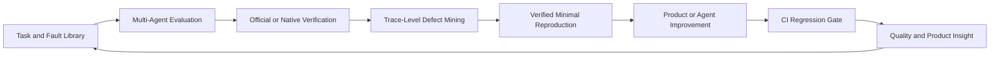
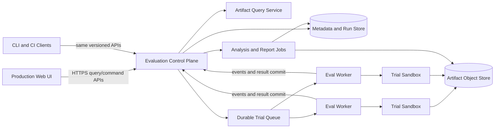

# Agent Evaluation Platform Refactor

Status: complete target architecture and all-or-nothing delivery contract
Scope: production-level standalone Web platform evaluating Agent RunLab, Claude Code, and Codex as first-class Code Agent backends
Principle: Web UI, Control Plane, and execution/data plane are independently deployable and versioned, but coordinated through one durable protocol and source of truth
Delivery rule: this document contains no deferred product capability; completion requires the entire platform, UI, Leaderboard, analysis, regression, and operational acceptance described below

## 1. Executive summary

Agent RunLab currently contains both a product-facing Agent runtime and substantial evaluation functionality. The evaluation side already includes benchmark adapters, durable run state, official grading, multiple Agent backends, bad-case mining, artifacts, and Dashboard views. The main limitation is architectural: evaluation remains a Host feature, Agent RunLab is treated as the native path, benchmark-specific workflows are fragmented, and defect analysis stops short of a reproducible quality-control loop.

This refactor creates an independent, standalone **Agent Evaluation and Defect Mining Platform** deployed as one operator-controlled installation with three first-class Code Agent backends:

- Agent RunLab;
- Claude Code;
- Codex.

The platform will provide a complete production Web UI, execute real development journeys in isolated workers, normalize evidence without flattening native semantics, identify characteristic Agent failures, generate verified reproduction bundles, publish provenance-safe Leaderboards, and turn accepted defects into CI regression packs. Agent RunLab remains a product and an evaluation backend; it no longer owns evaluation orchestration through internal implementation coupling.

The target closed loop is:



## 2. Goals

### 2.1 Product goals

1. Evaluate Agent RunLab, Claude Code, and Codex through the same evidence contract.
2. Cover real development journeys from issue understanding through build, test, package, deploy, health verification, and rollback.
3. Run multiple Agents and tasks concurrently in isolated, reproducible environments.
4. Preserve complete process evidence: prompts, normalized actions, tool calls, workspace changes, terminal output, timing, usage, cost, patches, deployment evidence, and verifier results.
5. Automatically detect instruction drift, context forgetting, test gaming, invalid tool grounding, recovery failure, and planning/execution divergence.
6. Produce a one-command, privacy-safe, verified reproduction bundle for high-value defects.
7. Convert accepted defects into versioned CI regression cases.
8. Generate product insights with measurable impact, ownership, and validation status.
9. Deliver a complete production Web UI for task authoring, run control, live observability, Leaderboards, analysis, defects, regression, insights, administration, and audit.
10. Publish Leaderboards that can pivot by model, Agent type, and test dataset while preserving exact dataset/subset coverage and evidence authority.

### 2.2 Engineering goals

1. Keep the pure Agent Kernel benchmark-agnostic.
2. Remove direct evaluation dependencies on Agent RunLab Host internals.
3. Introduce browser-safe, versioned evaluation protocols.
4. Run untrusted benchmark workloads outside the Control Plane process.
5. Make the Web UI and CLI equal clients of one durable Control Plane; neither client directly reads Worker files or mutates execution state.
6. Support restart recovery without silently replaying ambiguous Agent or provider work.
7. Preserve benchmark-native score semantics and raw official results.
8. Provide plugin contracts for Agent backends, benchmark adapters, trial sandbox providers, and defect detectors.

### 2.3 Explicit exclusions from the complete product

- Supporting every public Code Agent.
- Any hosted account or multi-installation service model; the product is standalone and single-operator.
- Replacing official benchmark graders with one universal score.
- Using an LLM judge as the only source of correctness.
- Training models inside the evaluation service.
- Moving Agent product Session/Tool/Memory implementation into the evaluation platform.

## 3. Existing foundation

The repository already contains meaningful building blocks:

- `BenchmarkRunService` and durable run events;
- Agent RunLab, Claude Code, custom-command, and smoke backend concepts;
- SWE-Bench, Terminal-Bench, ProgramBench, and SWE-Marathon adapters;
- official SWE-Bench grading and result ingest;
- Session, trace, patch, logs, usage, timing, and artifact retention;
- bad-case mining, annotation, and SFT/RL export;
- Benchmark Dashboard with run list, details, backend comparison, bad cases, and artifacts;
- historical result import in the pre-refactor Host implementation (not migrated into the standalone platform);
- reliability, regression-gate, artifact, and rollout infrastructure.

The refactor should migrate and generalize these assets rather than rewrite them from scratch.

## 4. Gap analysis against the target role

### 4.1 Code Agent framework iteration

The Agent product already implements tools, multi-turn state, compaction, memory, planning, and sub-agents. The evaluation platform must add explicit capability measurement for:

- code localization and repository understanding;
- tool grounding and recovery;
- long-horizon constraint retention;
- memory precision, staleness, deletion, and isolation;
- planning quality and dynamic replanning;
- completion claims backed by verification.

### 4.2 Systematic evaluation of mainstream Code Agents

The complete supported Agent matrix is:

| Backend | Required integration |
|---|---|
| Agent RunLab | Self-contained backend that starts Host and Executor together inside the trial sandbox |
| Claude Code | Claude Agent SDK or CLI adapter with isolated configuration |
| Codex | Codex CLI/app-server adapter with isolated home/config and JSON event capture |

A generic custom-command backend is included as a non-ranked development utility, but it is not sufficient evidence for these three official integrations.

### 4.3 Real tasks and full toolchain

Existing coding benchmarks emphasize patch and test outcomes. The platform must add complete SDLC task packs:

```text
issue understanding
→ code localization
→ implementation
→ unit/integration test
→ build/package
→ deploy to disposable environment
→ health and behavior verification
→ rollback or recovery
```

### 4.4 Automated evaluation platform

Missing platform-level capabilities include:

- independent worker service;
- resource-aware scheduler and leases;
- provider/backend concurrency limits;
- queue backpressure;
- Worker heartbeat and orphan recovery;
- environment conformance testing;
- unified trace hierarchy and platform SLOs;
- static and machine-readable report generation;
- CI baseline/candidate regression gates.

### 4.5 Defect mining innovation

Current bad-case mining is useful but mostly taxonomy-driven. The new analyzer must support:

- trace sequence alignment and first divergence;
- constraint lifecycle analysis;
- memory/context retention probes;
- test-gaming and verifier-tampering checks;
- unknown failure clustering;
- metamorphic task variants;
- counterfactual continuation;
- automated failure minimization.

### 4.6 Product insight

A failure list is not yet a product insight. The platform needs a durable insight workflow linking evidence, impact, suspected layer, proposed change, owner, regression pack, and post-fix validation.

## 5. Architectural boundary

### 5.1 Agent product responsibilities

Agent RunLab product runtime owns:

- product Sessions and user interaction;
- Agent state and multi-turn loop;
- tool registry and execution;
- memory, compaction, planning, and sub-agents;
- Host/Executor connectivity;
- approvals and product reliability;
- product Dashboard and operational lifecycle.

### 5.2 Evaluation platform responsibilities

The evaluation platform owns:

- task and benchmark registry;
- Agent backend registry;
- environment provisioning;
- scheduling and resource policy;
- evidence collection and normalization;
- official/native grading;
- defect mining and reproduction;
- comparisons and statistical reports;
- CI regression packs and gates;
- product insight lifecycle.

### 5.3 Required dependency direction

```text
Agent RunLab backend adapter ──uses──> public Agent RunLab interfaces
Evaluation platform ───────────uses──> backend adapter contract
Agent RunLab runtime ──────────does not import──> evaluation orchestration
Kernel ────────────────────────does not know──> benchmarks or evaluation
```

The platform is a standalone single-installation product and may live in the same monorepo as Agent RunLab. Web UI, Control Plane, Worker/data plane, and Agent product runtime remain independently buildable, testable, and versioned inside that installation so process boundaries and restart behavior remain sound. This separation exists for reliability and maintainability, not customer isolation.

## 6. Web UI, Control Plane, and data plane architecture

### 6.0 Standalone deployment model

The product is deployed as one standalone installation owned by one operator. It has no hosted account, organization, invitation, billing, or cross-customer routing model.

A complete installation contains:

```text
Standalone installation
  eval-dashboard static Web application
  eval-orchestrator Control Plane service
  metadata/run database
  local or configured object/artifact store
  one or more eval-worker processes
  Docker/LXD sandbox providers
  local credential-reference/config store
```

Workers may run as additional processes on the same machine or on operator-managed machines for capacity, but they belong to the same installation and trust domain. This is horizontal execution capacity within one standalone deployment. The Control Plane remains the only durable authority, and every Worker still creates an isolated sandbox per trial.

The default bind policy is loopback/local-network operator access. TLS or an operator-supplied reverse proxy may protect a non-loopback deployment, but the platform does not implement hosted account management.

### 6.1 Plane ownership

The production system has three explicit planes:



#### Web UI

The Web UI owns presentation and operator interaction only:

- local operator navigation and safety-sensitive action confirmation;
- run creation and command submission;
- live projections and historical queries;
- Leaderboard, analysis, defect, regression, insight, and administration views;
- client-side draft state, filters, column/layout preferences, and accessibility behavior.

It does not:

- execute Agents or verifiers;
- read Worker files directly;
- infer durable state from WebSocket deltas;
- write artifacts;
- calculate authoritative benchmark scores;
- implement scheduler or retry policy.

#### Control Plane

The Control Plane is the sole authority for:

- immutable run and dataset-slice specifications;
- Agent/model/backend registry;
- task/dataset catalog and lineage;
- scheduling, leases, budgets, cancellation, and retry decisions;
- durable run/trial state transitions;
- artifact metadata, local file-serving policy, and path containment;
- analysis/report job orchestration;
- Leaderboard eligibility and materialized projections;
- regression gates, audit log, and product insight workflow.

#### Execution and data plane

The execution/data plane consists of Workers, trial sandboxes, verifier processes, event ingestion, and artifact storage. It owns:

- sandbox creation and destruction;
- Agent process topology inside a sandbox;
- workspace and fault injection;
- native and normalized event streaming;
- verifier execution;
- raw evidence staging and integrity hashes;
- Worker heartbeat and lease-scoped result commit.

Workers cannot directly mutate Leaderboards, final run summaries, regression decisions, or product insights. They submit signed/hashed evidence and typed events; the Control Plane validates and projects them.

### 6.2 Coordination contracts

All coordination uses versioned contracts:

- command API for create/start/cancel/retry/grade/analyze/publish;
- query API for catalogs, runs, trials, artifacts, reports, Leaderboards, defects, and insights;
- ordered event API for live progress and reconnect catch-up;
- lease protocol between Control Plane and Workers;
- artifact manifest protocol between Workers and object storage;
- analysis job protocol with immutable input references and deterministic output manifests.

WebSocket/SSE events are non-authoritative notifications carrying durable sequence numbers. After reconnect, the Web UI fetches the authoritative projection using the last durable sequence; it never assumes every live event was received.

Mutating UI operations carry an idempotency key and return a committed acknowledgement. The same API is used by CLI and CI clients.

### 6.3 Web UI production requirements

The Web UI is a mandatory product surface, not a debugging accessory. It must include:

- standalone operator session continuity and destructive-action confirmations;
- responsive desktop/tablet/mobile layouts;
- keyboard navigation, focus management, screen-reader semantics, and contrast compliance;
- reconnect, offline, stale-data, retry, and partial-failure states;
- URL-addressable pages, filters, tabs, selected run/trial, and Leaderboard views;
- virtualized large tables and traces;
- paginated/server-filtered datasets, trials, defects, and artifacts;
- optimistic UI only where committed acknowledgements make it safe;
- error boundaries and non-destructive recovery;
- internationalization-ready text;
- downloadable reports and accessible chart/table alternatives;
- Web performance budgets and browser telemetry without sensitive content.

Every page must have loading, empty, capability-unavailable, partial-data, and error states. Production acceptance includes real-browser testing, mobile viewport testing, reconnect testing, large-run performance, and accessibility checks.

### 6.4 Deployment independence

`eval-dashboard`, `eval-orchestrator`, and `eval-worker` are built and versioned separately. Compatibility is governed by protocol versions and advertised capabilities:

- the UI refuses unsupported Control Plane protocol versions;
- Workers register supported sandbox, Agent adapter, and protocol versions;
- the Control Plane schedules only compatible leases;
- rolling deployment preserves in-flight lease semantics;
- schema migration is backward-readable for runs and reports created by the standalone platform from canonical protocol v1 onward. Pre-refactor Host evaluation artifacts are outside the migration boundary.

## 7. Target package layout

```text
packages/
  eval-protocol/
  eval-orchestrator/
  eval-worker/
  eval-analyzer/
  eval-sdk/
  eval-dashboard/

adapters/
  agents/
    agent-runlab/
    claude-code/
    codex/
  benchmarks/
    swe-bench/
    terminal-bench/
    program-bench/
    swe-marathon/
    sdlc-journey/
    custom-task-pack/
  environments/
    docker/
    lxd-container/
    lxd-vm/
```

Migration may begin under existing packages, but new interfaces must follow this ownership model.

## 8. Core protocols

### 8.1 Immutable evaluation specification

```typescript
type EvaluationRunSpec = {
  schemaVersion: 1
  runId: string
  taskPack: {
    id: string
    version: string
    taskIds?: string[]
    sample?: { count: number; seed: number }
  }
  agents: AgentVariantSpec[]
  execution: {
    repeats: number
    maxConcurrency: number
    timeoutMs: number
    inactivityTimeoutMs: number
    retryPolicy: RetryPolicy
    budget?: { maxUsd?: number; maxTokens?: number; maxWallMs?: number }
  }
  sandbox: SandboxPolicy
  verification: VerificationPolicy
  analysis: AnalysisPolicy
  createdAt: string
}
```

The accepted spec is immutable and hashed. Runtime state, secrets, and results are stored separately.

### 8.2 Dataset identity and evaluated-slice contract

A benchmark name is not enough to identify what was evaluated. Every run must bind to an immutable dataset version and an explicit evaluated slice:

```typescript
type DatasetVersionRef = {
  datasetId: string
  displayName: string
  version: string
  sourceRevision: string
  manifestHash: string
  split?: string
  totalItems: number
  officialBenchmark: boolean
}

type EvaluatedSlice = {
  sliceId: string
  dataset: DatasetVersionRef
  selectionKind: 'full' | 'official_subset' | 'named_subset' | 'explicit_ids' | 'sampled'
  selectionSpec: {
    officialSubsetId?: string
    namedSubsetId?: string
    taskIdsHash?: string
    sample?: { count: number; seed: number; stratification?: string }
    filters?: Record<string, string | number | boolean>
  }
  selectedItems: number
  coverageRatio: number
  taskIdsManifestRef: string
  sliceManifestHash: string
}
```

Required semantics:

- `full` is valid only when `selectedItems === totalItems` for the declared dataset version/split and the task-ID manifest matches the complete catalog;
- an official published subset is labeled with its own official subset name and must not be displayed as the parent full benchmark;
- a platform-defined named subset has a versioned definition and manifest hash;
- explicit task IDs are labeled `custom subset`;
- sampled slices always show count, seed, stratification, filters, and coverage;
- retries or missing/invalid trials do not silently shrink the denominator; coverage and completion are separate fields;
- two results are directly rank-comparable only when dataset version, split, slice manifest, verifier version, repeat policy, and evidence level satisfy the same Leaderboard policy.

Examples of truthful labels:

```text
SWE-Bench Verified · full · 500/500
SWE-Bench Verified · official subset "Lite" · 300/500 parent coverage
SWE-Bench Verified · named subset "Django-50 v2" · 50/500
SWE-Bench Verified · sampled subset · 30/500 · seed 42 · stratified by repository
```

The UI must never abbreviate the last three examples to only `SWE-Bench Verified`.

### 8.3 Agent backend contract

```typescript
interface AgentBackend {
  readonly descriptor: AgentBackendDescriptor
  preflight(config: AgentVariantSpec): Promise<PreflightResult>
  start(input: AgentRunInput, signal: AbortSignal): Promise<AgentRunHandle>
  events(handle: AgentRunHandle): AsyncIterable<NormalizedAgentEvent>
  cancel(handle: AgentRunHandle): Promise<void>
  collect(handle: AgentRunHandle): Promise<AgentRunArtifacts>
}
```

Required capabilities:

- non-interactive execution;
- workspace injection;
- environment/config isolation;
- model and version capture;
- cancellation and absolute deadline;
- transcript or event stream;
- terminal/tool events where available;
- final workspace diff;
- usage/cost where available;
- raw native artifacts retained alongside normalization.

### 8.4 Trial sandbox contract

An environment is one self-contained sandbox for one trial. It is not a remote tool transport and it never refers to a long-lived product workspace.

```typescript
interface TrialSandboxProvider {
  readonly descriptor: SandboxDescriptor
  create(task: ResolvedTask, policy: SandboxPolicy): Promise<TrialSandboxHandle>
  startAgent(handle: TrialSandboxHandle, backend: AgentVariantSpec): Promise<AgentProcessHandle>
  execute(handle: TrialSandboxHandle, request: ExecRequest): Promise<ExecResult>
  snapshot(handle: TrialSandboxHandle): Promise<SandboxSnapshot>
  collect(handle: TrialSandboxHandle): Promise<EnvironmentArtifacts>
  destroy(handle: TrialSandboxHandle): Promise<void>
}
```

The sandbox contains the repository, Agent process, tools/runtime required by that Agent, build/test/deploy targets, and evidence collectors. All components that form one Agent execution topology must live inside the same sandbox boundary unless a task explicitly evaluates a distributed system.

### 8.5 Benchmark adapter contract

```typescript
interface BenchmarkAdapter {
  readonly descriptor: BenchmarkDescriptor
  resolveTasks(input: TaskPackInput): Promise<ResolvedTask[]>
  prepareTask(task: ResolvedTask, sandbox: TrialSandboxHandle): Promise<void>
  verify(input: VerificationInput): Promise<BenchmarkNativeResult>
  explain(result: BenchmarkNativeResult): ScoreExplanation
  normalizeFailure(result: BenchmarkNativeResult): NormalizedFailure | null
}
```

Official score semantics remain native. Normalized capability and failure dimensions are additive views, not replacements.

### 8.6 Defect detector contract

```typescript
interface DefectDetector {
  readonly descriptor: DefectDetectorDescriptor
  analyze(input: AnalysisInput): Promise<DefectFinding[]>
  minimize?(finding: DefectFinding, harness: ReproductionHarness): Promise<MinimalReproduction>
}
```

## 9. First-class Agent adapters

### 9.1 Agent RunLab adapter

Each Agent RunLab trial must start a fresh Host and a fresh Executor **inside the same trial sandbox**. The pair uses loopback or an internal sandbox-local socket, shares only that trial's ephemeral workspace, and is destroyed together. Formal evaluation must not attach a sandboxed Host to an Executor running on the developer machine or to a long-lived product workspace.

```text
Trial Sandbox
  Agent RunLab Host
    ↕ loopback / sandbox-local transport
  Agent RunLab Executor
    ↕
  Ephemeral Task Workspace
```

This topology ensures that Host configuration, Executor capabilities, filesystem state, process lifecycle, network policy, resource limits, and cleanup all belong to the same reproducible environment. It also prevents Host/Executor network variance or an unrelated product Executor from contaminating Agent capability measurements.

The adapter must use public runtime entry points and preserve:

- session/event ledger;
- tool calls and structured failures;
- sub-agent lineage;
- compaction and memory events;
- workspace diff;
- usage and model metadata;
- complete artifact references.

Evaluation memory must be isolated. Benchmark sessions must not access product workspace/global memory unless the task explicitly tests memory behavior.

### 9.2 Claude Code adapter

The adapter must run Claude Code with isolated settings and capture:

- SDK or CLI version;
- model and base endpoint identity without credentials;
- allowed tools and permission mode;
- message/tool event stream;
- debug/native SDK artifacts;
- final workspace diff;
- usage/cost where available;
- cancellation and timeout classification.

### 9.3 Codex adapter

Codex becomes a formal backend, not a generic shell command. The adapter should prefer a structured Codex interface such as app-server/JSON events where supported, with CLI fallback.

It must isolate:

- home/config directory;
- credentials by reference, never persisted plaintext;
- working directory;
- approval/sandbox mode;
- session/resume state;
- model and reasoning configuration.

It must capture:

- Codex version;
- model/config hash;
- item/event stream;
- command/tool execution events;
- final response and workspace diff;
- usage where exposed;
- native logs required for diagnosis.

### 9.4 Adapter certification suite

Every official backend must pass the same conformance tests:

1. preflight reports missing credentials/config without leaking values;
2. one deterministic task can start and finish;
3. cancellation terminates descendants;
4. timeout is absolute and classified;
5. workspace changes are isolated;
6. final diff is collected;
7. raw and normalized event order is stable;
8. version/model/config are recorded;
9. unavailable evidence is explicit, not fabricated;
10. repeated execution uses a fresh environment.

## 10. Task and benchmark system

### 10.1 Public benchmark layer

Required adapters:

- SWE-Bench;
- Terminal-Bench;
- ProgramBench;
- SWE-Marathon.

The completed platform includes every benchmark adapter and custom task-pack system listed in the completion criteria. Other external benchmarks are outside the declared product scope.

### 10.2 Code understanding task pack

Tasks should independently measure:

- file localization;
- symbol localization;
- cross-file call chain understanding;
- configuration-to-runtime tracing;
- impact analysis;
- relevant context selection in large repositories.

Metrics:

```text
file_recall_at_k
symbol_recall_at_k
first_relevant_read_rank
irrelevant_read_ratio
dependency_edge_precision
dependency_edge_recall
```

### 10.3 Long-horizon SDLC Journey benchmark

Create a custom task pack covering:

```text
investigate
→ plan
→ implement
→ add/update tests
→ run unit/integration tests
→ build/package
→ deploy disposable service
→ health and behavior check
→ rollback/recover when required
```

Task families:

- multi-package feature implementation;
- dependency or build repair;
- flaky test diagnosis;
- configuration migration;
- release artifact generation;
- container deployment and health verification;
- graceful restart and state recovery;
- rollback after failed deployment;
- incident diagnosis from logs and metrics.

### 10.4 Memory benchmark

Measure:

- memory precision and recall;
- stale-memory use;
- update/correction compliance;
- explicit forgetting/deletion compliance;
- cross-task and cross-workspace contamination;
- compaction retention;
- long-term recall with distractors.

### 10.5 Planning benchmark

Measure:

- prerequisite edge correctness;
- parallel branch recognition;
- blocked-task violations;
- replanning after new evidence;
- plan-execution alignment;
- completion claims with verifier evidence;
- plan bloat and non-convergence.

### 10.6 Production fault scenarios

Versioned fault injectors should cover:

- stale/ambiguous edits;
- path drift;
- missing dependency or cache corruption;
- Executor disconnect/reconnect;
- lost acknowledgement with known execution receipt;
- foreground command timeout;
- provider rate limit/unavailability;
- sub-agent partial timeout;
- context compaction;
- tool schema evolution;
- flaky verifier or environment failure.

Infrastructure responsibility must be separated from Agent responsibility. The Agent is penalized only when it observes enough state to choose a safer action and fails to do so.

### 10.7 Metamorphic task variants

Create semantically equivalent variants by changing:

- filenames and directory layout;
- requirement wording;
- irrelevant files;
- function order;
- test output formatting;
- non-semantic configuration details.

This detects benchmark memorization, brittle path assumptions, and template overfitting.

## 11. Orchestration and scheduling

### 11.1 Durable lifecycle

Run states:

```text
draft → validating → preparing → running → verifying → analyzing → reporting → completed
      ↘ blocked / failed / cancelled / interrupted
```

Trial states:

```text
queued → leased → environment_preparing → agent_running
       → artifacts_collecting → verifying → analyzing → completed
       ↘ blocked / timeout / cancelled / agent_error /
          environment_error / verifier_error / indeterminate
```

Every transition is appended to a monotonic event log. Projections are rebuildable.

### 11.2 Scheduler policy

```typescript
type SchedulingPolicy = {
  priority: number
  maxConcurrencyPerBackend: number
  maxConcurrencyPerProvider: number
  resources: { cpu: number; memoryMb: number; gpu?: number; diskMb?: number }
  timeoutMs: number
  leaseMs: number
  budget?: { maxUsd?: number; maxTokens?: number }
  retry: {
    maxAttempts: number
    retryableCategories: string[]
    backoffMs: number
  }
}
```

Required behavior:

- fair queueing across runs;
- provider/backend rate limiting;
- backpressure;
- Worker heartbeat and lease expiry;
- orphan recovery;
- idempotent result commit;
- cancellation propagation;
- no blind replay after indeterminate side effects;
- budget stop gates;
- skip-completed and selective retry.

### 11.3 Worker isolation

The Worker is a separate process from the Control Plane and owns sandbox creation, Agent process execution, verifier invocation, artifact staging, and sandbox cleanup. A Worker may run on the same machine as the Control Plane or on another machine, but this placement does not change the trial environment abstraction.

For every lease, the Worker creates one fresh `TrialSandbox`. The Agent backend starts all processes required for that Agent inside it. In particular, the Agent RunLab backend starts both Host and Executor inside the same sandbox; the Worker never routes the trial through an already-connected product Executor.

A Worker crash must not corrupt run state. A Control Plane restart must reconstruct leases and classify in-flight trials before resuming.

## 12. Environment isolation

### 12.1 Required sandbox providers

- Docker sandbox for portable code, build, and test trials;
- LXD system-container sandbox for systemd, deployment, restart, and network-service journeys;
- LXD VM sandbox when stronger kernel isolation or VM-specific behavior is required.

Formal trials never use a long-lived product workspace as their environment. Workers may be deployed on multiple machines, but this is only a Worker-fleet placement detail; each Worker still creates one of the required sandbox types for every trial.

The required production implementation includes Docker, LXD system-container, and LXD VM sandbox providers. Other sandbox technologies are outside this document's scope and are not completion dependencies.

### 12.2 Per-Agent sandbox topology

Each Agent variant receives a separate sandbox created from the same task/environment lock:

```text
Trial A Sandbox                 Trial B Sandbox            Trial C Sandbox
  Agent RunLab Host               Claude Code                Codex
  Agent RunLab Executor           isolated HOME/config       isolated HOME/config
  task workspace                  task workspace             task workspace
  verifier target                 verifier target            verifier target
```

No process is shared between Agent variants. Agent RunLab's Host and Executor are two processes in one sandbox, not two independently provisioned environments. Their internal socket connection is part of the Agent implementation being evaluated, while Docker/LXD provides the outer trial isolation.

For fairness, all three sandboxes use the same base revision, task fixtures, resource limits, network policy, timeout, and verifier semantics. Agent-specific configuration differences are recorded as variant metadata.

### 12.3 Default security policy

- read-only base image;
- ephemeral writable overlay;
- per-trial workspace;
- network denied unless task policy allows destinations;
- CPU, memory, PID, disk, and wall-clock limits;
- no host filesystem access;
- secret injection by short-lived reference;
- secret cleanup after execution;
- process-tree termination on cancel;
- artifact allowlist;
- environment destruction verification.

### 12.4 Environment lock

Every trial records:

- image digest;
- repository/base revision;
- dependency lock hashes;
- environment variables after redaction;
- resource policy;
- network policy;
- toolchain versions;
- fixture and fault-injector versions.

### 12.5 Sandbox conformance suite

Tests must prove:

- host paths are inaccessible;
- one trial cannot modify another;
- disabled network is actually disabled;
- resource exhaustion is bounded and classified;
- cancellation kills descendants;
- cleanup leaves no process or writable volume;
- a locked environment reproduces the same verifier result.

## 13. Evidence and observability

### 13.1 Unified trace hierarchy

```text
evaluation.run
  evaluation.trial
    environment.prepare
    agent.execute
      model.call
      tool.call
      subagent.run
      compaction
      memory.read/write
    workspace.snapshot
    verifier.execute
    analyzer.detect
    reproduction.verify
```

Every span carries low-cardinality run/trial/backend/task identifiers through controlled references. Sensitive prompts, file content, credentials, and full paths are artifacts with access policy, not metric labels.

### 13.2 Trial evidence

```text
trials/<task-id>/<agent-variant>/
  input.json
  environment.lock.json
  agent-config.json
  native-events.jsonl
  normalized-events.jsonl
  trace.jsonl
  stdout.log
  stderr.log
  workspace.before.json
  workspace.after.json
  final.diff
  usage.json
  verifier-result.json
  result.json
```

### 13.3 Platform metrics

- task queue age;
- Worker utilization;
- environment preparation latency;
- first-token and model-call latency;
- tool-call duration and failure category;
- artifact upload failures;
- grader failure rate;
- orchestrator recovery time;
- cost and token rate;
- trial terminal outcomes;
- flaky task and flaky verifier rate.

### 13.4 Platform SLOs

Required SLOs:

- durable run state survives Control Plane restart;
- committed trial results are not duplicated;
- cancelled trials terminate within a bounded interval;
- artifact manifest integrity is verifiable;
- infrastructure errors are not counted as Agent failures;
- official score claims appear only after official result ingest.

## 14. Evaluation and comparison methodology

### 14.1 Preserve native scores

Examples:

- SWE-Bench resolved;
- Terminal-Bench reward/test result;
- ProgramBench compile/test semantics;
- deployment journey health/rollback result.

Do not collapse these into one pass boolean.

### 14.2 Normalized capability vector

An additive comparison view may include:

```typescript
type CapabilityVector = {
  taskSuccess: number
  codeUnderstanding: number
  instructionFollowing: number
  toolGrounding: number
  recovery: number
  contextRetention: number
  memoryQuality: number
  planning: number
  testIntegrity: number
  efficiency: number
  reproducibility: number
}
```

Every component must link to explicit detectors/verifiers and methodology.

### 14.3 Paired comparison

Agent RunLab, Claude Code, and Codex must run the same task revision and environment policy. Reports include:

- paired wins/losses/ties;
- task-level delta;
- bootstrap confidence intervals;
- McNemar or another appropriate paired binary test;
- cost/latency/quality Pareto frontier;
- repeated-run variance;
- evidence completeness.

Do not compare unmatched task subsets as if they were paired evidence.

### 14.4 Leaderboard projection and eligibility

The Leaderboard is a materialized Control Plane projection over immutable, officially eligible run results. It has three primary analytical dimensions:

1. **Model**: the underlying model identity/version used by a run;
2. **Agent type**: Agent RunLab, Claude Code, or Codex, including Agent version/config hash;
3. **Test dataset**: exact dataset version and evaluated slice, never only a benchmark display name.

A row represents an eligible tuple:

```typescript
type LeaderboardEntry = {
  entryId: string
  model: {
    provider?: string
    modelId: string
    modelVersion?: string
  }
  agent: {
    type: 'agent-runlab' | 'claude-code' | 'codex'
    version: string
    configHash: string
  }
  evaluatedSlice: EvaluatedSlice
  verifierVersion: string
  repeats: number
  completedTrials: number
  expectedTrials: number
  primaryMetric: { name: string; value: number; unit: string }
  confidenceInterval?: { level: number; lower: number; upper: number }
  secondaryMetrics: Record<string, number>
  evidenceLevel: 'official' | 'native' | 'predictions_only' | 'smoke'
  runRefs: string[]
  publishedAt: string
}
```

Eligibility rules:

- smoke results never enter ranked Leaderboards;
- incomplete coverage is not ranked as a completed slice unless the dataset policy explicitly defines partial-result ranking;
- official benchmark ranking requires official grader evidence;
- config, Agent version, model identity, verifier version, dataset manifest, and slice manifest are immutable;
- results from different slice manifests are displayed in separate ranking groups;
- a full-dataset board and any subset board are separate boards;
- sampled results with different seeds are separate unless aggregated by a declared repeated-sampling policy;
- only results created through the standalone platform's canonical lifecycle are eligible; pre-refactor Host results are not imported or ranked;
- superseded or invalidated entries remain auditable but are removed from active rank.

The platform may provide a cross-slice exploratory comparison, but it must be labeled `not directly rank-comparable` and must never merge unlike denominators into one rank.

### 14.5 Leaderboard metrics and ranking policy

Each dataset/slice declares one native primary metric and deterministic tie-breakers. Examples:

- SWE-Bench: official resolved rate, then cost and p95 duration as non-quality tie-break/context;
- Terminal-Bench: benchmark-native reward/pass semantics;
- SDLC Journey: journey completion rate, then verification completeness, rollback correctness, cost, and latency;
- code understanding: declared localization/recall metric.

The Leaderboard displays confidence intervals and repeat count. It does not rank by an opaque universal score across unrelated datasets. Capability vectors and cost-quality Pareto views are analytical views, not substitutes for native dataset boards.

## 15. Defect mining engine

### 15.1 Failure taxonomy

Separate:

- model/Agent failure;
- invalid action;
- unmet precondition;
- environment failure;
- provider failure;
- verifier failure;
- cancellation;
- timeout;
- indeterminate side effect.

Free-form error strings are not the canonical taxonomy.

### 15.2 Instruction drift detector

Compile task requirements into versioned constraints:

```typescript
type TaskConstraint = {
  id: string
  kind: 'must' | 'must_not' | 'scope' | 'ordering' | 'evidence'
  sourceRef: string
  verifier: ConstraintVerifier
}
```

Track lifecycle:

```text
introduced → acknowledged → acted_on → satisfied / violated → recovered
```

### 15.3 Context forgetting detector

Use long-horizon canaries and event evidence to measure:

- constraint retention across many observations;
- post-compaction violation;
- repeated need for reminders;
- loss of task/plan state;
- stale memory overriding corrected facts.

### 15.4 Test-gaming detector

Combine:

- protected test/fixture/config taint tracking;
- independent hidden verifier sandbox;
- detection of skipped/deleted tests;
- suspicious test selection;
- hard-coded expected outputs;
- mutation testing on selected tasks;
- verifier leakage checks;
- patch-scope analysis.

### 15.5 Tool grounding and recovery detector

Measure:

- schema-valid action rate;
- action executable under current capability;
- failure responsibility;
- correct recovery action;
- repeated same-category failure;
- unsafe replay after indeterminate side effects;
- steps and cost to recovery.

### 15.6 Planning/execution detector

Compare plan graph with actual events:

- dependency correctness;
- blocked starts;
- abandoned critical tasks;
- plan churn;
- unverified completion;
- missing replanning after contradiction;
- plan-action alignment.

### 15.7 Trace alignment and first divergence

For the same task, align normalized event sequences across Agents or across successful/failed repeats. Report:

- common prefix;
- first meaningful divergence;
- missing successful action;
- additional loop or failed recovery;
- cost accumulated after divergence.

### 15.8 Unknown failure clustering

Represent traces using a combination of:

- normalized action/error sequence;
- tool names and structured outcomes;
- state transitions;
- timing/cost features;
- verifier diagnostics;
- privacy-safe embeddings of redacted summaries, with a deterministic non-embedding fallback and recorded embedding model/version.

Cluster unknown failures, then require human naming/validation before promotion to the canonical taxonomy.

### 15.9 Counterfactual continuation

Resume a failed task from a selected checkpoint using:

- the same Agent with one corrected action;
- another Agent backend;
- another model/config;
- a corrected Tool result;
- no injected fault.

This estimates whether the primary cause lies in model choice, prompt, tool interface, runtime, or environment.

## 16. Reproducible defect bundles

### 16.1 Bundle layout

```text
defect-bundle/
  defect.json
  task.json
  environment.lock.json
  agent-config.json
  tool-registry.json
  minimal-workspace.tar.zst
  replay.jsonl
  trace.jsonl
  final.diff
  verifier-result.json
  analysis.json
  expected.json
  reproduce.sh
  SHA256SUMS
```

### 16.2 Automatic minimization

Use delta-debugging style reduction over:

- task setup;
- changed files;
- irrelevant repository files;
- injected faults;
- event prefix;
- reproduction steps.

A minimized bundle is accepted only if it still reproduces the same normalized failure.

### 16.3 Reproduction verification

Before publication or regression promotion:

1. run in a fresh environment;
2. reproduce the failure multiple times where stochasticity applies;
3. run the expected-success control;
4. record reproduction rate;
5. verify that redaction and secret scanning pass;
6. sign the manifest/checksums.

## 17. Product insight workflow

```typescript
type ProductInsight = {
  insightId: string
  evidenceRefs: string[]
  failureCluster: string
  affectedTaskRate: number
  severity: 'low' | 'medium' | 'high' | 'critical'
  suspectedLayer: 'model' | 'prompt' | 'tool' | 'runtime' | 'environment' | 'verifier'
  confidence: number
  recommendation: string
  expectedMetric: string
  regressionPackId: string
  owner?: string
  status: 'proposed' | 'accepted' | 'implemented' | 'validated' | 'rejected'
}
```

Workflow:

```text
failure cluster
→ frequency/severity/cost
→ root-cause evidence
→ proposed Agent or product change
→ accepted regression pack
→ implementation
→ baseline/candidate rerun
→ validated or rejected insight
```

The Dashboard must show both unresolved recommendations and validated impact. A generated paragraph without evidence and regression linkage is not a product insight.

## 18. Regression packs and CI/CD

### 18.1 Regression pack

A versioned pack contains:

- task and environment locks;
- expected verifier semantics;
- selected fault scenarios;
- severity and ownership;
- allowed flake policy;
- baseline evidence;
- promotion source defect.

### 18.2 Baseline/candidate gate

```yaml
evaluation:
  baseline: main
  candidate: pull-request
  taskPack: code-agent-regression-v1
  repeats: 3
  blocking:
    maxSuccessRateDropPp: 2
    maxNewCriticalDefects: 0
    maxTestGamingRate: 0
    maxP95CostIncreasePct: 15
```

### 18.3 CI outputs

- meaningful process exit code;
- JUnit for task outcomes;
- JSON and CSV summaries;
- SARIF for code-linked findings where applicable;
- Markdown PR comment;
- artifact/report URL;
- explicit flaky/infrastructure classification;
- baseline and candidate config hashes.

The complete product ships a generic CI CLI plus GitHub Actions, GitLab CI, and Jenkins integration documentation and tested examples, all consuming the same machine-readable gate contract.

## 19. Production Web UI product design

The completed Web application has persistent top-level navigation for **Overview, Test Library, Runs, Leaderboard, Analysis, Defects, Regression, Insights, Reports, and Administration**. These are production routes backed by Control Plane query/command APIs, not panels that inspect local artifact directories.

### 19.1 Overview

The landing page shows:

- platform health and SLO status;
- active/queued/completed runs;
- Worker and sandbox capacity;
- current spend/token budget;
- latest published Leaderboard changes;
- new critical defects and regressions;
- recent validated insights;
- stale or blocked operations requiring attention.

Every card links to the filtered authoritative page and displays data freshness.

### 19.2 Test Library

- public benchmarks;
- SDLC Journey packs;
- code-understanding packs;
- memory/planning packs;
- fault scenarios;
- regression packs;
- versions, ownership, coverage, flake status.

### 19.3 Runs

- Agent RunLab / Claude Code / Codex matrix;
- model/config variants;
- dataset version and explicit slice selector;
- full/subset/sample coverage preview before submission;
- queue and Worker state;
- budget and progress;
- per-trial evidence;
- cancel/retry/resume;
- publish-to-Leaderboard eligibility status.

The run wizard cannot submit with only a benchmark name. It must resolve and display the immutable dataset version, selection kind, selected/total count, coverage ratio, task manifest hash, verifier version, repeat policy, and evidence level.

### 19.4 Leaderboard

The Leaderboard route provides three first-class pivot dimensions:

- **By Model**: compare model identities across Agent types on one exact evaluated slice;
- **By Agent Type**: compare Agent RunLab, Claude Code, and Codex across models on one exact evaluated slice;
- **By Test Dataset**: inspect all eligible Agent/model combinations within one exact dataset version and slice.

UI requirements:

- the active dataset/slice appears in a persistent header badge;
- labels explicitly distinguish full, official subset, named subset, custom subset, and sampled subset;
- selected/total count and coverage percentage are always visible;
- sampled slices show seed, filters, and stratification;
- separate tabs/groups exist for different slice manifests;
- full-dataset and subset ranks are never mixed;
- incompatible rows can be selected for exploratory comparison only after a warning and are never assigned a shared rank;
- columns include native primary metric, CI, repeats, completed/expected trials, cost, p50/p95 duration, evidence level, Agent version, model version, verifier version, and publication time;
- row expansion links to contributing runs, task-level results, methodology, and artifacts;
- filters and sort state are URL-addressable;
- CSV/JSON export preserves slice provenance;
- invalidated/superseded entries are available through audit history but visually excluded from active ranking.

A compact row label must be truthful, for example:

```text
#1  Claude Code · model-x · SWE-Bench Verified / Django-50 v2 · 50/500 (10%)
```

It must not display only `SWE-Bench Verified` for that row.

### 19.5 Analysis

- native benchmark scores;
- capability vector;
- paired comparison;
- confidence intervals;
- cost/latency Pareto;
- trace divergence;
- failure taxonomy;
- environment/platform health;
- slice coverage and comparability diagnostics.

### 19.6 Defects

- clusters and detectors;
- evidence and first divergence;
- reproduction status;
- annotations;
- minimization status;
- promote to regression pack;
- compare across Agents.

### 19.7 Regression

- baseline/candidate runs;
- blocking rules;
- new/fixed/persistent defects;
- flake classification;
- release decision;
- owner and links.

### 19.8 Insights

- affected rate and severity;
- suspected layer;
- recommendation;
- expected metric;
- owner/status;
- pre/post validation evidence.

### 19.9 Reports

- report catalog and generation status;
- static HTML and PDF preview;
- methodology and dataset-slice provenance;
- signed artifact manifest;
- local export/download with explicit redaction status and no public sharing service.

### 19.10 Administration and Audit

- Agent/model/credential-reference registry;
- Worker and sandbox capability registry;
- dataset/version/subset catalog;
- verifier and detector versions;
- protocol compatibility;
- retention and artifact policy;
- local safety policy and destructive-action confirmations;
- immutable operation and Leaderboard publication audit.

### 19.11 Operator workflows

The standalone installation has one local operator model rather than multiple account types. The operator may switch between these workflows:

| Workflow | Primary question |
|---|---|
| Agent development | Where did the Agent fail and how is it reproduced? |
| Evaluation engineering | Is the task/verifier/environment trustworthy? |
| Training-data review | Which failures are suitable for training or curriculum design? |
| Product analysis | Which user journeys fail most and what change has measurable impact? |
| Release decision | Does this candidate regress quality, cost, safety, or reliability? |

## 20. Reports

Every completed comparison produces:

- versioned JSON summary;
- CSV task-level table;
- static HTML report;
- print-ready and PDF rendering;
- methodology and limitations;
- artifact and reproduction links.

Report sections:

1. Executive Summary;
2. Run and Environment Identity;
3. Native Benchmark Results;
4. Capability Breakdown;
5. Paired Agent Comparison;
6. Cost, Latency, and Reliability;
7. Failure Taxonomy;
8. Top Regressions and Improvements;
9. Defect/Reproduction Index;
10. Methodology, Confidence, and Limitations.

Reports must include all configured repeats/seeds, not only the best run.

## 21. Data governance

- credentials are references, never persisted plaintext;
- prompts/code/traces remain local artifacts served only through path-contained Control Plane APIs;
- metrics contain no full paths, prompts, code, or secrets;
- task packs record license and training/evaluation permission;
- retention and deletion apply transitively to derived artifacts;
- public reports use redacted summaries and synthetic/minimized examples;
- pre-refactor Host experiments are excluded from discovery and import; canonical standalone artifacts carry integrity hashes from creation;
- private workspace data cannot enter public task packs without explicit operator review, redaction, and provenance approval.

## 22. Complete implementation workstreams

### Workstream A: contracts and evidence compatibility

Deliverables:

- inventory current eval modules;
- capture canonical run/result fixtures for the standalone protocol;
- define `eval-protocol` schemas;
- freeze evidence levels and failure outcome taxonomy;
- record and enforce the clean-cutover boundary excluding pre-refactor Host runs, sessions, and artifacts.

Acceptance:

- canonical protocol fixtures parse under the standalone platform packages;
- Kernel has no new evaluation dependency;
- smoke evidence cannot appear as official result.

### Workstream B: Control Plane, data plane, and production Web UI foundation

Deliverables:

- `eval-orchestrator` service;
- independent `eval-worker` process;
- lease/heartbeat/cancel/recovery;
- Docker trial sandbox provider;
- CLI and HTTP parity;
- production standalone Web shell, operator-session continuity, safety confirmations, reconnect model, and authoritative query/command client;
- Overview, Test Library, Runs, Leaderboard, Analysis, Defects, Regression, Insights, Reports, and Administration routes with complete loading/error/capability-unavailable states.

Acceptance:

- Control Plane restart during a run is recovered deterministically;
- Worker crash produces one classified terminal/retry outcome;
- no ambiguous Agent call is silently duplicated;
- Web UI and CLI read the same authoritative state;
- UI reconnect and missed-event recovery are verified;
- large run tables/traces meet the Web performance budget;
- responsive and accessibility acceptance passes.

### Workstream C: three certified Agent backends

Deliverables:

- Agent RunLab adapter;
- Claude Code adapter;
- Codex adapter;
- conformance test suite;
- same-task three-Agent comparison.

Acceptance:

- each backend passes certification;
- one task runs in three fresh isolated environments;
- final diff, native events, normalized events, version/config, and verifier result are available;
- unavailable usage evidence is marked explicitly.

### Workstream D: complete task, dataset, sandbox, and Leaderboard system

Deliverables:

- migrate existing benchmark adapters;
- SDLC Journey v1;
- code-understanding v1;
- memory/planning v1;
- LXD container and VM trial sandbox providers;
- fault-scenario framework;
- immutable dataset/version/slice catalog;
- full, official subset, named subset, explicit-ID, and sampled-slice manifests;
- three-dimensional Leaderboard projection and publication policy.

Acceptance:

- one full build/test/deploy/health/rollback journey executes end to end;
- environment lock reproduces verifier result;
- fault scenarios have deterministic injection and expected recovery labels;
- full and subset Leaderboards remain separate and truthfully labeled;
- sampled results preserve seed, filters, stratification, selected/total count, and coverage;
- Model, Agent Type, and Test Dataset pivots pass real-browser acceptance.

### Workstream E: defect mining and verified reproduction

Deliverables:

- constraint drift detector;
- context forgetting detector;
- test-gaming detector;
- tool grounding/recovery detector;
- plan/execution detector;
- trace alignment;
- defect bundle generation and verification.

Acceptance:

- seeded defects are detected with measured precision/recall;
- an unknown failure can be clustered and human-promoted;
- at least one real failure is minimized and reproduced in a fresh environment;
- bundle contains no secrets or private absolute paths.

### Workstream F: regression, reports, and CI integrations

Deliverables:

- regression pack registry;
- baseline/candidate paired runner;
- confidence intervals and gates;
- CI CLI/JUnit/SARIF/Markdown outputs;
- static HTML report;
- Regression Web UI;
- report catalog/preview route;
- GitHub Actions, GitLab CI, and Jenkins tested examples.

Acceptance:

- a seeded Agent regression blocks CI;
- a flaky task is classified rather than blocking as deterministic failure;
- report is reproducible from immutable run artifacts;
- candidate improvement is linked to its source defect and insight.

### Workstream G: insight workflow, administration, and open-source readiness

Deliverables:

- Insights lifecycle;
- Agent Adapter SDK and starter template;
- Task Pack authoring guide;
- Defect Detector plugin guide;
- synthetic example datasets;
- Docker Compose quick start;
- contribution, security, compatibility, and release documentation.

Acceptance:

- a new sample Agent adapter can be added without modifying the orchestrator;
- a user can run a five-task three-Agent demo and inspect a defect within ten minutes;
- public demo contains no private data;
- architecture and plugin compatibility are documented;
- Administration/Audit and Insights Web UI acceptance passes.

These workstreams are implementation organization only. None is an independently shippable reduced product, and no workstream may be marked as platform completion while another remains incomplete.

## 23. Extraction and migration map

This section is the binding file-level extraction plan. The implementation must move ownership rather than copy code into a second evaluation stack. No legacy or forwarding compatibility entry point is created: callers switch directly to the standalone Control Plane, and only one durable run store, scheduler, analyzer, Leaderboard projector, and report implementation may exist.

### 23.1 Migration rules

1. Move implementation and tests together; do not leave unowned tests in Agent Host.
2. Preserve reusable behavior with new canonical fixtures before moving a module; compatibility with pre-refactor serialized runs and sessions is not required.
3. Replace internal imports with package APIs before deleting old files.
4. Product Host evaluation routes and CLI commands are removed at cutover rather than retained as public proxies.
5. Pre-refactor Host evaluation runs, sessions, and artifacts are not imported, indexed, discovered, or parsed by the standalone platform. All acceptance evidence is generated by fresh platform runs.
6. Agent runtime code is not moved merely because evaluation consumes it. Evaluation accesses it through the Agent RunLab adapter.
7. Every extracted package must have an explicit dependency allowlist preventing reverse imports into Agent product packages.
8. Temporary internal compile shims, if unavoidable while moving callers in one change sequence, have named removal tests and are deleted before acceptance; no released compatibility shim remains.

### 23.2 Source-to-target ownership table

#### Shared evaluation protocols → `packages/eval-protocol`

| Current source | Target ownership | Action |
|---|---|---|
| `packages/shared/src/benchmark-orchestrator.ts` | `packages/eval-protocol/src/run-spec.ts`, `run-events.ts`, `agent-backend.ts` | Move evaluation-only schemas/types; switch callers directly and delete the old shared module |
| evaluation-only parts of `packages/shared/src/eval-types.ts` | `packages/eval-protocol/src/results.ts`, `failure.ts`, `metrics.ts` | Split from generic product/session types |
| evaluation-only parts of `packages/shared/src/swebench-types.ts` | `adapters/benchmarks/swe-bench/protocol.ts` | Move benchmark-native types to the adapter; retain only genuinely shared generic types |
| new dataset/slice/Leaderboard schemas defined in this document | `packages/eval-protocol/src/datasets.ts`, `leaderboard.ts` | Implement as browser-safe versioned schemas |
| defect, reproduction, regression, insight, artifact-manifest contracts | `packages/eval-protocol/src/{defects,reproduction,regression,insights,artifacts}.ts` | New canonical ownership |

`@agent-kernel/shared` remains the product/runtime protocol package. It must not become a permanent alias for evaluation protocols.

#### Orchestration and durable state → `packages/eval-orchestrator`

| Current source | Target module | Action |
|---|---|---|
| `packages/host/src/eval/core/benchmark-run-service.ts` | `src/runs/run-service.ts` | Move and generalize to all adapters |
| `packages/host/src/eval/core/adapter-registry.ts` | `src/registry/benchmark-registry.ts` | Move |
| `packages/host/src/eval/core/agent-backend.ts` | `src/registry/agent-registry.ts` | Split descriptors/registry from concrete adapters |
| `packages/host/src/eval/core/run-registry.ts` | `src/runs/run-store.ts` | Replace benchmark-specific naming with canonical run store |
| `packages/host/src/eval/core/benchmark-stop-gates.ts` | `src/policy/stop-gates.ts` | Move |
| `packages/host/src/eval/core/legacy-swebench-import.ts` | no target | Delete; pre-refactor historical imports are outside the clean-cutover boundary |
| `packages/host/src/eval/core/benchmark-cli.ts` | `src/cli/benchmark.ts` | Move CLI client/service entry point |
| `packages/host/src/eval/core/eval-bench-cli.ts` | `src/cli/eval-bench.ts` | Consolidate into one CLI command family |
| evaluation actions and run state currently assembled in `packages/host/src/http/routes.ts` | `src/http/*` | Extract into Control Plane HTTP/query/command APIs |

The new store owns immutable run specs, run/trial events, projections, dataset/slice catalog, leases, budgets, Leaderboard publication, regression decisions, and insight state.

#### Trial execution → `packages/eval-worker`

Execution logic currently embedded in benchmark runners and Host actions is decomposed into:

```text
src/worker/lease-client.ts
src/worker/trial-runner.ts
src/worker/process-supervisor.ts
src/worker/artifact-stager.ts
src/worker/verifier-runner.ts
src/worker/cleanup.ts
src/sandbox/docker.ts
src/sandbox/lxd-container.ts
src/sandbox/lxd-vm.ts
```

Move or extract the following responsibilities from current benchmark implementations:

- workspace/repository preparation;
- Agent process launch and cancellation;
- timeout and inactivity enforcement;
- process-tree cleanup;
- patch/workspace snapshot capture;
- verifier process launch;
- raw log and artifact staging;
- typed terminal-result commit.

`eval-worker` must not import the Agent RunLab Host server or Dashboard. The Agent RunLab adapter launches Host and Executor as child processes inside the same trial sandbox.

#### Official Agent adapters → `adapters/agents/*`

| Current source | Target | Action |
|---|---|---|
| behavior in `packages/host/bin/run-agent-runlab-swebench.ts` and `run-agent-runlab-prompt.ts` | `adapters/agents/agent-runlab/` | Extract reusable backend; Host and Executor co-located in trial sandbox |
| behavior in `packages/host/bin/run-claude-code-swebench.ts` and `run-claude-code-prompt.ts` | `adapters/agents/claude-code/` | Extract SDK/CLI adapter and native-event collector |
| no current formal backend | `adapters/agents/codex/` | Add Codex app-server/JSON-event adapter with CLI fallback |
| current custom-command backend | `adapters/agents/custom-command/` | Move as non-ranked development utility |
| current smoke backend | `adapters/agents/smoke/` | Move as non-evidence conformance utility |

The concrete adapters implement `AgentBackend`; `eval-orchestrator` contains no Agent-specific command construction.

#### Benchmark implementations → `adapters/benchmarks/*`

| Current directory | Target adapter |
|---|---|
| `packages/host/src/eval/swebench/*` | `adapters/benchmarks/swe-bench/` |
| `packages/host/src/eval/terminal-bench/*` | `adapters/benchmarks/terminal-bench/` |
| `packages/host/src/eval/programbench/*` | `adapters/benchmarks/program-bench/` |
| `packages/host/src/eval/swe-marathon/*` | `adapters/benchmarks/swe-marathon/` |

Each move includes source/fixture/result loaders, native verifier integration, score explanation, failure normalization, and tests. Generic scheduling/storage code is removed from adapters.

New adapters owned directly by the evaluation platform:

```text
adapters/benchmarks/sdlc-journey/
adapters/benchmarks/code-understanding/
adapters/benchmarks/memory-planning/
adapters/benchmarks/fault-scenarios/
adapters/benchmarks/custom-task-pack/
```

#### Analysis → `packages/eval-analyzer`

| Current source | Target module | Action |
|---|---|---|
| `packages/host/src/eval/badcases/badcase-mining.ts` | `src/mining/failure-taxonomy.ts` | Move and generalize |
| `badcase-annotations.ts` | `src/annotations/store.ts` | Move |
| `badcase-export.ts` | `src/export/training-data.ts` | Move; verified reward remains external |
| `rollout-export.ts` | `src/export/rollouts.ts` | Move |
| `packages/host/src/eval/session/generic.ts` | `src/scoring/session-profile.ts` | Move evaluation scoring only |
| `cost-aggregate.ts` | `src/metrics/cost.ts` | Move |
| `profile-budget.ts` | `src/policy/profile-budget.ts` | Move |
| `regression-gate.ts` | `packages/eval-orchestrator/src/regression/gate.ts` | Move decision authority to Control Plane; analyzer supplies metrics |

New analyzer modules include instruction drift, context forgetting, test gaming, tool grounding/recovery, planning/execution, trace alignment, unknown clustering, counterfactual continuation, and reproduction minimization.

#### Web UI → `packages/eval-dashboard`

Move the complete evaluation product surface out of the Agent product Dashboard:

| Current source | Target ownership |
|---|---|
| `packages/dashboard/src/features/benchmarks/*` | `packages/eval-dashboard/src/features/*` |
| evaluation-specific `packages/dashboard/src/features/artifacts/BadCases*.tsx` | `features/defects/*` |
| evaluation-specific `EvalRunsView.tsx` | `features/runs/*` |
| evaluation-specific `RunBenchmarkWizard.tsx` and wizard code in `artifact-views.tsx` | `features/runs/create/*` |
| benchmark artifact models/views | `features/artifacts/*` and typed Control Plane clients |
| evaluation i18n strings | `packages/eval-dashboard/src/i18n/*` |

The new Web UI adds Overview, Test Library, Leaderboard, Analysis, Regression, Insights, Reports, and Administration/Audit routes. It queries Control Plane APIs and never scans artifact directories directly.

The Agent product Dashboard retains only integration links:

- open the standalone evaluation platform;
- export a product Session as a governed task-candidate reference;
- link a product Session to an evaluation run/defect when an explicit reference exists.

It does not retain benchmark run state, Leaderboard, bad-case analyzer, report generation, or eval artifact browsing.

### 23.3 Host and product cutover surfaces

During an internal change sequence, these existing surfaces may remain only until their direct replacement is wired. They are removed at cutover and are not released as forwarding compatibility surfaces:

- benchmark/eval CLI commands exposed by the Host package;
- `/eval/*`, benchmark, bad-case, and evaluation-action HTTP routes in `packages/host/src/http/routes.ts`;
- the product Dashboard benchmark route/navigation entry;
- selected exports from `packages/host/src/index.ts` and `@agent-kernel/shared`.

Intermediate-surface requirements:

1. keep an intermediate working tree buildable only; do not read old serialized runs or expose a second public evaluation API;
2. write no independent run state or artifact index;
3. contain no benchmark-specific execution or analysis logic;
4. be absent from released capability metadata;
5. have replacement tests against direct Control Plane clients;
6. be deleted before the all-or-nothing completion gate passes.

### 23.4 Product code that must remain in Agent RunLab

The following are product runtime capabilities and must not be moved:

- Kernel FSM, reducer, effects, and state;
- Session/event-log implementation used by the product Agent;
- Host Agent loop and model adapters;
- Executor tool runtime and filesystem/shell implementation;
- memory, compaction, planning/Todo Graph, skills, approvals, and sub-agents;
- Host/Executor product connectivity and recovery;
- product Session Dashboard and product operational controls;
- generic product artifacts and traces not specific to evaluation.

The evaluation platform may consume these only through public Agent/backend protocols. Shared source ownership must not be justified merely to avoid writing an adapter.

### 23.5 Dependency enforcement

Required package rules:

```text
kernel ─X→ eval-*
executor ─X→ eval-*
host runtime ─X→ eval-orchestrator/eval-worker/eval-analyzer/eval-dashboard
product dashboard ─X→ eval implementation packages

eval-protocol ─→ browser-safe generic dependencies only
eval-orchestrator ─→ eval-protocol, registries, storage clients
eval-worker ─→ eval-protocol, sandbox providers, adapter SDK
eval-analyzer ─→ eval-protocol and artifact readers
eval-dashboard ─→ eval-protocol and generated API client
agent/benchmark adapters ─→ eval-sdk/eval-protocol and their native tools
```

Enforce with TypeScript project references, package exports, dependency-lint tests, and a CI boundary script.

### 23.6 Migration sequence and atomic cutover

The implementation may proceed internally in this order, but completion is one release:

1. freeze canonical behavior fixtures and record the clean-cutover boundary;
2. create `eval-protocol` and switch callers to canonical schemas;
3. extract durable run store/orchestration and prove CLI/HTTP parity;
4. extract Worker/sandbox execution and remove execution from Host routes;
5. extract Agent and benchmark adapters;
6. extract analyzer, regression, reporting, dataset catalog, and Leaderboard;
7. move evaluation Web UI and replace local-file reads with Control Plane clients;
8. verify new canonical artifacts from fresh runs without dual writes;
9. remove product evaluation surfaces and route operators to the standalone platform;
10. execute complete real acceptance and migration tests;
11. delete all shims and old evaluation implementations;
12. run source-tree ownership audit proving no duplicated implementation remains.

There is no period in which both old and new services may accept authoritative writes. The standalone Control Plane becomes the only writer; the old Host evaluation surfaces are removed, not retained as readers.

### 23.7 Required migration tests

- semantic stability for immutable canonical run specs produced by new clients;
- standalone CLI versus standalone HTTP API parity;
- explicit rejection or non-discovery of pre-refactor Host evaluation artifacts;
- no duplicate run IDs or result commits during restart/cutover;
- product Agent sessions, tools, memory, and Dashboard remain functional without eval packages;
- standalone evaluation platform runs when product Dashboard is absent;
- three Agent adapters run without importing private Host evaluation modules;
- source scan finds no evaluation implementation under `packages/host/src/eval` or evaluation pages under product Dashboard after cutover;
- dependency-boundary tests reject reverse imports;
- standalone-platform run schema migration remains backward-readable from canonical protocol v1 onward.

### 23.8 Final deletion and ownership gate

Before platform completion, delete:

```text
packages/host/src/eval/
evaluation implementation imports/routes from packages/host/src/http/routes.ts
benchmark orchestration exports from packages/host/src/index.ts
evaluation-only schemas from packages/shared/src/
packages/dashboard/src/features/benchmarks/
evaluation-only views embedded in packages/dashboard/src/features/artifacts/
all compatibility shims and duplicate tests
```

Deletion is conditional on moving any generic, genuinely product-owned utility to an appropriate product package first. A final ownership report lists every removed source path, its new owner, compatibility evidence, and the test proving deletion is safe.

The migration is accepted only when:

- exactly one implementation owns each evaluation capability;
- Agent RunLab contains only product runtime plus its public adapter surface;
- the standalone platform contains all evaluation control/data/UI logic;
- canonical standalone-platform artifacts remain readable across its own schema migrations;
- no compatibility shim remains;
- no evaluation package is required to build or run the core Agent product.


## 24. Verification strategy

### 24.1 Unit and property tests

- schemas and migrations;
- reducers and event replay;
- scheduler leases and retries;
- backend/environment conformance;
- detector rules;
- minimization invariants;
- statistics and report generation;
- privacy/redaction.

### 24.2 Integration tests

- CLI/HTTP parity;
- Control Plane/Worker protocol;
- restart and cancellation;
- artifact integrity;
- Agent adapter event normalization;
- official grader ingest;
- defect promotion to regression pack.

### 24.3 Fault injection tests

- Worker death;
- Control Plane restart;
- provider 429/timeout;
- lost ACK;
- environment setup failure;
- artifact upload interruption;
- verifier timeout;
- duplicate completion;
- lease expiry;
- disk/resource exhaustion.

### 24.4 Real acceptance runs

1. one deterministic fixture task on all three Agents;
2. a small paired SWE-Bench run with official grading;
3. a Terminal-Bench or SDLC Journey run;
4. a fault-recovery pack;
5. a baseline/candidate CI regression demonstration.

## 25. Demo scenario

The flagship demo should show the complete loop:

1. select Agent RunLab, Claude Code, and Codex;
2. select a small SDLC/fault task pack;
3. run isolated trials concurrently;
4. inspect live normalized traces and native evidence;
5. verify build/test/deploy results;
6. automatically identify a recovery or context defect;
7. compare the three Agents at the first divergence;
8. generate and verify a minimal reproduction bundle;
9. promote it to a regression pack;
10. rerun a candidate change and show the CI gate plus validated product insight.

This demonstrates platform engineering, evaluation methodology, defect algorithms, and product impact in one coherent flow.

## 26. Resume/project positioning

Recommended project name:

> **Multi-Agent Code Evaluation and Defect Mining Platform**

Accurate project description after implementation:

> Built an evaluation control plane for Agent RunLab, Claude Code, and Codex with isolated parallel execution, official/native graders, trace-level defect detection, verified minimal reproduction bundles, and CI regression gates; covered code understanding and full build/test/deploy journeys, and linked failure clusters to measurable Agent product improvements.

Quantitative bullets must use actual evidence only, for example:

- number of tasks/task packs and repeated trials;
- Worker concurrency and recovery results;
- detector precision/recall on seeded defects;
- reproduction success rate;
- evaluation throughput and cost;
- regressions caught before release;
- before/after quality changes validated by paired runs.

Do not claim support for an Agent, benchmark, detector, or CI gate until its conformance and real acceptance tests pass.

## 27. Completion criteria

The refactor is complete only when every item below passes in the same release:

1. evaluation orchestration runs independently of the Agent product runtime;
2. production Web UI, Control Plane, and Worker/data plane are independently buildable/deployable and protocol-compatible;
3. the Web UI includes Overview, Test Library, Runs, Leaderboard, Analysis, Defects, Regression, Insights, Reports, and Administration/Audit as production routes;
4. all routes pass loading, empty, capability-unavailable, partial-data, error, reconnect, responsive, accessibility, and large-data performance acceptance;
5. Agent RunLab, Claude Code, and Codex are certified first-class backends;
6. Web UI and CLI use the same durable Control Plane APIs and committed acknowledgements;
7. untrusted tasks execute only in isolated Workers/sandboxes, with Agent RunLab Host and Executor together inside each RunLab trial sandbox;
8. Docker, LXD system-container, and LXD VM providers pass sandbox conformance;
9. SWE-Bench, Terminal-Bench, ProgramBench, SWE-Marathon, custom task packs, code-understanding, memory/planning, SDLC Journey, and fault scenarios execute through the unified lifecycle;
10. at least one official coding benchmark and one full SDLC Journey run end to end on the three-Agent matrix;
11. every run records immutable dataset version and evaluated-slice provenance;
12. Leaderboard supports Model, Agent Type, and Test Dataset pivots, with full/subset/sample labeling and no cross-slice rank mixing;
13. ranked entries enforce evidence, completion, verifier, repeat, dataset, and slice eligibility rules;
14. native evidence and normalized traces are available per trial;
15. instruction drift, context forgetting, test gaming, tool recovery, and planning detectors have measured validation;
16. a defect bundle is automatically minimized, privacy-checked, and reproduced;
17. accepted defects can be promoted into CI regression packs;
18. baseline/candidate gates include statistical and flake-aware decisions;
19. JSON, CSV, static HTML, print/PDF, JUnit, SARIF, and Markdown outputs are generated from immutable evidence;
20. GitHub Actions, GitLab CI, and Jenkins examples pass integration tests;
21. product insights link evidence, recommendation, ownership, regression pack, and post-fix validation;
22. local data retention, deletion, credential references, artifact path containment, audit, clean-cutover exclusion, and canonical artifact controls pass governance tests;
23. Control Plane/Worker restart, lease expiry, duplicate completion, artifact interruption, cancellation, and rollback fault tests pass;
24. public SDK/docs/demo allow an external contributor to add an adapter or task pack without editing orchestrator internals.

There is no `MVP complete`, `backend complete`, or `UI later` state under this contract. Anything short of all 24 items is an incomplete implementation.
