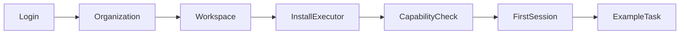

# Commercial Product Maturity Program

**Status:** active implementation contract

## Scope

This program matures Agent RunLab Dedicated and Private Cloud as user-operated Platform configurations. It explicitly excludes:

- stronger process/container execution isolation work;
- integration with Stripe or any external billing system.

Internal usage metering, quotas, budgets, and plan-capability data remain in scope because they are required for safe operations.

## Product principles

1. **Complete journeys over visible controls.** A button is not complete until its network request, backend side effect, durable state, reload behavior, failure recovery, and cleanup are verified.
2. **Never disguise failure as loading.** Loading is bounded and must transition to ready, empty, actionable error, degraded, or offline.
3. **Identity and authorization are separate.** ZITADEL authenticates. RuntimeIngressGateway and the product control plane authorize Organization resources. RuntimeHost remains identity-free.
4. **Private Cloud retains the Agent workspace.** Its `agent` runtime profile hides Operations/Pipeline only. Workspace, Executor, File, Git, Shell, Artifacts, Agent, and Session remain product capabilities.
5. **Progress is factual.** Product-generated progress may expose stages, tools, elapsed time, recent progress, compaction, waits, and recovery, but never invent model reasoning.
6. **Mobile is a first-class surface.** Every dialog, sheet, preview, input, keyboard transition, safe area, orientation, and touch target is accepted on mobile browser and installed PWA.
7. **Errors preserve user work.** Drafts, queued messages, edits, and pending forms survive retryable failures. Destructive actions state scope and irreversibility.
8. **Defaults are useful and safe for the deployment boundary.** Dedicated and private Runtime Units default to `allow_all`; explicit operator policy may disable it.
9. **Secrets stay server-side.** Catalogs carry credential references only. Secrets never enter Dashboard payloads, Session logs, tenant catalogs, images, or diagnostics.
10. **Container Private Cloud acceptance precedes isolated Dedicated and production Dedicated acceptance.** Production remains the final release action.

## Information architecture

- **Agent:** Sessions, transcript, Composer, approvals, Queue, progress.
- **Workspace:** Executor connection, Files, Git, Shell, lifecycle and diagnostics.
- **Artifacts:** durable generated outputs and previews.
- **Operations:** background work, service status, diagnostics, audit and recovery.
- **Settings:** Personal, Workspace, Agent, Organization Administration.

## Unified state contract

Every product surface uses one of:

| State | Required presentation |
|---|---|
| Loading | named operation, bounded wait, no false success |
| Empty | reason, primary next action, example/help |
| Ready | usable content and current freshness |
| Offline | affected dependency, preserved work, reconnect action |
| Unauthorized | session-expired/sign-in action; protected clients stopped |
| Forbidden | missing role/capability and escalation path |
| Degraded | available functions, unavailable functions, retry/status link |
| Retryable error | plain-language cause, retry, diagnostics ID |
| Fatal error | safe state, support bundle, recovery/reload path |

## First-use journey

Progress is durable and resumable. Executor installation reports preparing, waiting, connected, incompatible, permission failure, and diagnostic states.

## Organization and RBAC boundary

Roles:

- **Owner:** Organization lifecycle, roles, retention, quotas, providers.
- **Admin:** members, Workspaces, provider policy, operations and audit.
- **Member:** create/use permitted Workspaces and Sessions.
- **Viewer:** read permitted Sessions/Artifacts/operations; no mutation or shell.

ZITADEL subject maps to Organization membership in RuntimeIngressGateway control storage. Authorization happens before trusted Unit routing. RuntimeHost receives only Unit identity and scoped operation data.

## LLM governance

The product exposes model capability/context metadata, tenant default, Session selection, token usage, estimated internal cost, budgets, quotas, provider health, retries and fallback decisions. Budget exhaustion and provider failure are explicit terminal or degraded states, never indefinite Thinking.

No external billing provider is introduced.

## Support and operations

- low-cardinality service and journey metrics;
- user-visible service status;
- trace/diagnostic ID in failures;
- copy diagnostics and downloadable redacted support bundle;
- provider, Queue, tool, Executor, Socket, compact and recovery health;
- auditable membership, authorization, deletion and policy changes.

## Acceptance gates

1. Component and contract tests.
2. Desktop Chromium visual/state matrix.
3. Mobile Chromium browser/PWA/keyboard matrix.
4. Two-user/two-Organization isolation and RBAC.
5. Private Cloud real journey on Docker `13001/13002`.
6. Dedicated real journey on an isolated Box port.
7. Full tests, typecheck, production/PWA build, Compose and release verification.
8. Final Private Cloud deployment acceptance.
9. Final Dedicated `13000` deployment through graceful restart and continuation proof.
