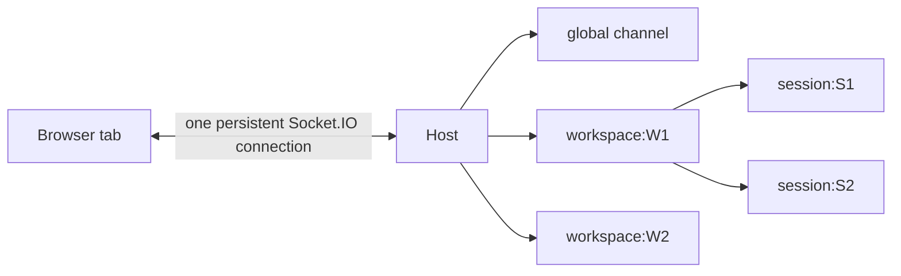
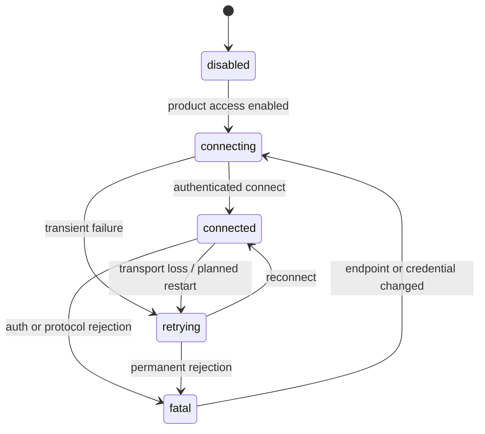
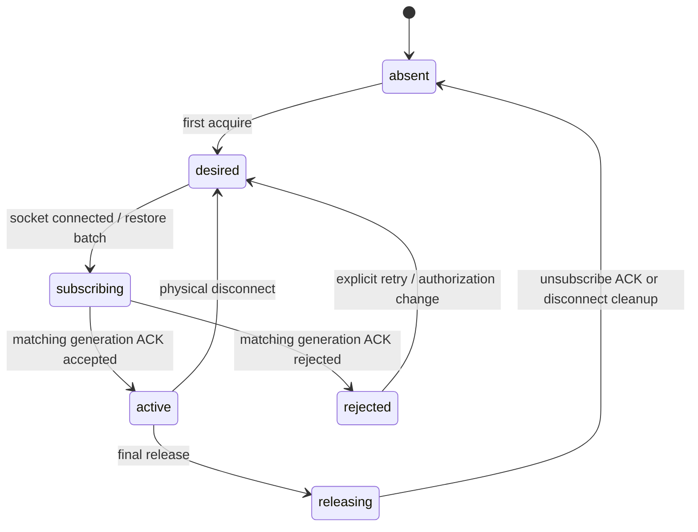
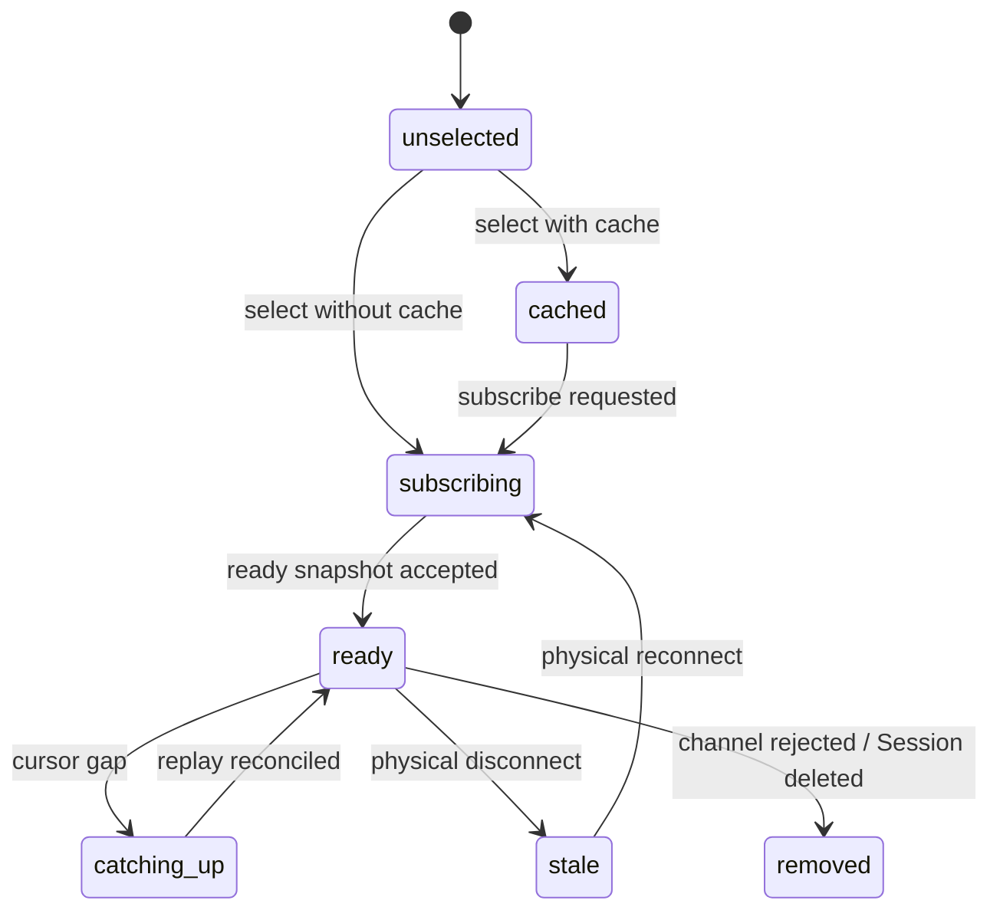

# Dashboard Multiplexed Connection — Source of Truth

**Status:** normative implementation contract
**Scope:** Browser Dashboard Socket.IO connection, Host dashboard namespace, Global/Workspace/Session subscriptions
**Decision:** one persistent physical Dashboard socket per browser tab; Workspace and Session are logical subscription channels

## 1. Problem

The legacy Dashboard creates a Socket.IO connection whose handshake is bound to the selected `sessionId`. Switching Sessions closes that socket and creates another one. This causes false connection-state transitions, repeated authentication and hydration, race conditions during rapid switching, and broken continuity for Workspace resources such as Terminal and background tasks.

A Session selection is UI state, not transport state. Changing selection MUST NOT reconnect the browser-to-Host transport.

## 2. Target architecture



Each browser tab owns exactly one physical Dashboard socket for a `(Host origin, authenticated principal)` pair. Components acquire logical subscriptions through a connection provider.

### Channel kinds

- `global` — Session summaries, Executor summaries, account/runtime controls and deployment notifications.
- `workspace:<workspaceId>` — Executor presence, Workspace metadata, Terminal, file/background-task resource notifications.
- `session:<sessionId>` — ready snapshot, state, timeline events, token deltas, approvals, queues and Session errors.

## 3. Connection handshake

The Dashboard handshake is connection-scoped:

```typescript
type DashboardHandshake = {
  role: 'dashboard'
  clientVersion: string
  clientId: string
  token?: string
  resumeToken?: string
}
```

It MUST NOT require a Session or Workspace ID. During migration, Host accepts legacy handshakes with `sessionId`, joins that legacy Session, and marks the connection as legacy. New clients use `clientId` and channel subscriptions.

Authentication, protocol negotiation, connection recovery and rate limiting occur once per physical connection.

## 4. Subscription protocol

```typescript
type DashboardChannel = 'global' | `workspace:${string}` | `session:${string}`

type ClientSubscribeChannels = {
  requestId: string
  generation: number
  channels: DashboardChannel[]
  cursors?: Record<string, number>
}

type ChannelSubscriptionResult = {
  requestId: string
  generation: number
  accepted: DashboardChannel[]
  rejected: Array<{ channel: DashboardChannel; code: string }>
  cursors: Record<string, number>
}
```

Events:

```text
client:subscribe_channels(payload, ack)
client:unsubscribe_channels(payload, ack)
client:restore_subscriptions(payload, ack)
```

Requirements:

1. subscribe/unsubscribe is idempotent;
2. Host authorizes each channel independently;
3. responses echo `generation`; stale responses cannot overwrite current UI state;
4. multiple channels can be restored in one request after reconnect;
5. Session cursors permit replay of only missing durable events;
6. unknown or unauthorized channels are rejected without closing the physical connection.

## 5. Dashboard Connection Provider

One top-level `DashboardConnectionProvider` owns:

- socket creation/destruction;
- physical connection status and RTT;
- subscription registry with reference counts;
- latest Session cursor per channel;
- reconnect restoration;
- event demultiplexing by `workspaceId` and `sessionId`;
- bounded listener and channel counts.

### Reference counting

```text
acquire(session:S1) first consumer -> subscribe once
acquire(session:S1) second consumer -> local refcount only
release one consumer              -> keep subscription
release final consumer            -> unsubscribe
```

The selected Session, preview cache, Terminal and sub-agent views may independently hold references. Components never call `socket.close()`.

## 6. Session switching

When selecting a new Session in the same or another Workspace:

1. acquire new Workspace and Session channels;
2. wait for the new Session snapshot or cached projection;
3. update visible selection using a generation guard;
4. release old foreground references after the new subscription is accepted;
5. keep background references required by running Terminal/sub-agents;
6. never reconnect the physical socket.

Rapid switching `A → B → C` may complete network responses out of order; only generation `C` may become visible.

## 7. Host authorization and room management

Host tracks per socket:

```text
connection identity
legacy primary Session, if any
subscribed global flag
subscribed Workspace IDs
subscribed Session IDs
subscription generation
```

Authorization:

- `global`: any authenticated Dashboard connection allowed by deployment policy.
- `workspace:W`: principal must be allowed to view/use W.
- `session:S`: principal must be allowed to view S; if S has Workspace W, authorization also validates W.
- Workspace operations require the corresponding Workspace channel and a Session/Workspace ownership check.
- Session mutations require the corresponding Session channel.

Client payload identifiers are never trusted merely because they were supplied. Host checks membership and current stored ownership on every sensitive operation.

Disconnect automatically removes all room memberships and ephemeral subscription state.

## 8. Event routing

Every event consumed by multiplexed clients carries its routing key:

- Session events: `sessionId` mandatory.
- Workspace events: `workspaceId` mandatory.
- Global events: no resource key required.

Client demultiplexers discard events with missing/mismatched routing keys. Durable Session events retain monotonic `seq`; ephemeral Terminal/token/presence events are never replayed as durable history.

## 9. Reconnect and recovery

Physical reconnection is reserved for real transport loss, Host restart, auth refresh or endpoint change.

On reconnect:

1. Provider authenticates once;
2. sends one `restore_subscriptions` containing all live refcounted channels and Session cursors;
3. Host rejoins authorized rooms;
4. Host replies with accepted/rejected channels and current cursors;
5. client requests/reconciles missing Session history where needed;
6. ephemeral Workspace resources refresh their snapshots;
7. Connection Indicator transitions once for the physical reconnect.

No component independently reconnects or restores its own socket.

## 10. Connection Indicator semantics

The top-right indicator reports only **Browser ↔ Host physical transport**:

- Connected
- Connecting/Reconnecting
- Disconnected/Error

It MUST remain Connected while switching Session or Workspace.

Separate UI surfaces report:

- Workspace Executor online/offline;
- Session synchronizing/ready/error;
- Terminal running/exited.

These states must not be collapsed into the physical connection indicator.

## 11. Backpressure and limits

- Maximum subscribed Workspaces and Sessions per tab is bounded and configurable.
- Current Session control/approval events have highest priority.
- Durable Session deltas are ordered per Session.
- Terminal output is bounded and may be coalesced; it cannot starve control events.
- Reconnect restoration is one batched request with jitter, not one request per component.
- Listener counts and subscription refcounts are observable in diagnostics.

## 12. Compatibility migration

1. Add new contracts while retaining legacy `sessionId` handshake.
2. Host supports both legacy auto-join and new channel subscribe.
3. Create top-level persistent Dashboard connection and move control-plane traffic first.
4. Move selected Session hydration/events to logical Session subscription.
5. Move Workspace resources and Terminal authorization to logical Workspace/Session subscriptions.
6. Remove `useSession` socket creation/close behavior.
7. Remove legacy handshake binding only after released clients have migrated.

At no point may old and new sockets both mutate the same selected Session without operation-id deduplication.

## 13. Acceptance criteria

### Physical connection

- [ ] Exactly one `/dashboard` physical socket exists per browser tab.
- [ ] Switching among 100 Sessions creates zero additional socket handshakes.
- [ ] Switching Workspace creates zero additional socket handshakes.
- [ ] Host endpoint/token change replaces the socket exactly once.
- [ ] Component mount/unmount never closes the socket.

### Subscriptions

- [ ] Global, Workspace and Session subscriptions are independently authorized.
- [ ] Duplicate subscribe/unsubscribe is idempotent.
- [ ] Reference counting emits one subscribe and one final unsubscribe.
- [ ] Rapid `A → B → C` cannot display stale A/B ready/history responses.
- [ ] Unauthorized channel rejection does not disconnect other channels.
- [ ] Disconnect cleans all Host room memberships.

### Session behavior

- [ ] Session switch preserves physical Connected indicator.
- [ ] Ready snapshot, history, queue, streaming, approval, errors and mutations target the selected Session only.
- [ ] Background subscribed Session events do not overwrite selected Session state.
- [ ] Cursor replay restores missing durable events without duplicates.
- [ ] Host restart resumes active Session work once, not once per subscription consumer.

### Workspace behavior

- [ ] Executor presence updates route through Workspace/global channels.
- [ ] Terminal continues while switching Sessions when its Session reference remains active.
- [ ] Terminal/file/background operations reject unsubscribed or mismatched Workspace/Session payloads.
- [ ] Executor offline state does not change Browser ↔ Host indicator.

### Reconnect

- [ ] Network loss causes one reconnect loop.
- [ ] Reconnect restores all live subscriptions in one batch.
- [ ] Current Session catches up from cursor; no full history reload when unnecessary.
- [ ] Rejected/removed resources surface a resource error without reconnect loops.

### Performance and observability

- [ ] No listener leak after 1,000 Session switches.
- [ ] Socket/room/subscription counts return to baseline after closing views.
- [ ] Current Session control events remain responsive under Terminal output load.
- [ ] Diagnostics distinguish physical connection, Workspace presence and Session sync.

### End-to-end

```text
open Dashboard
→ establish one socket
→ select Session A
→ select Session B in same Workspace
→ select Session C in another Workspace
→ return to A
→ run Session mutation
→ open Terminal and type
→ simulate network disconnect/reconnect
→ verify one socket reconnect and batched subscription restore
→ verify no event leakage or duplicated history
```

No deployment is accepted until an automated browser test records socket connection count and proves it is unchanged across Session/Workspace switches.

## 14. Formal state machines

### Physical transport



Only the connection manager may transition this machine. Session selection, Workspace presence and subscription ACKs never change physical transport state.

### Logical channel



A channel keeps `refCount`, `generation`, `cursor`, `desired`, `wireState`, and safe error code. ACKs with an older generation are ignored.

### Session synchronization



Composer availability is derived from physical transport + Workspace presence + mutation permissions. It is not disabled merely because Session synchronization is catching up when a safe operation-id mutation can be queued.

## 15. Failure model and policy

| Failure | Classification | Required behavior |
|---|---|---|
| Wi-Fi handoff / short packet loss | transient | one reconnect loop; preserve desired channels and cached projections |
| Host planned restart | transient/planned | suppress alarming error UI; batch restore on reconnect |
| auth expired / protocol incompatible | permanent until config changes | stop retries, show actionable fatal state |
| Workspace Executor offline | resource absence | physical Host remains connected; Files/Git/Terminal show Workspace-specific offline state |
| Session subscribe rejected/deleted | resource failure | only that Session fails; other channels remain active |
| subscribe ACK timeout | ambiguous | keep desired, retry idempotently with newer generation; do not duplicate refs |
| ACK arrives out of order | stale response | ignore by generation |
| event seq gap | durable sync gap | request history from cursor; do not apply later state blindly |
| duplicate event | replay overlap | dedupe by Session seq / operation ID |
| Terminal output flood | ephemeral pressure | coalesce/drop bounded tail before delaying control/approval events |
| browser hidden/frozen | client suspension | reconnect/restore on visibility; no independent component reconnects |

## 16. Implementation invariants

1. Multiplexed sockets never execute legacy pseudo-Session initialization.
2. A Session is hydrated/resumed only when its channel changes from inactive to active, not on duplicate subscribe.
3. Global and Workspace channels are idempotent membership sets; Session rooms are joined once per socket.
4. The manager owns all `connect`, `disconnect`, `connect_error` and restore listeners.
5. Feature hooks own only resource events and release their logical references on cleanup.
6. One physical socket has one reconnect policy and one batched restore request.
7. Every Workspace RPC either acquires a Workspace reference before use or is executed through a component that already owns one.
8. UI renders three distinct layers: Host transport, Workspace presence, Session synchronization.
9. Cached Session state remains visible during transient transport loss and is marked stale, not reset.
10. Permanent auth/protocol failure is never retried infinitely.
