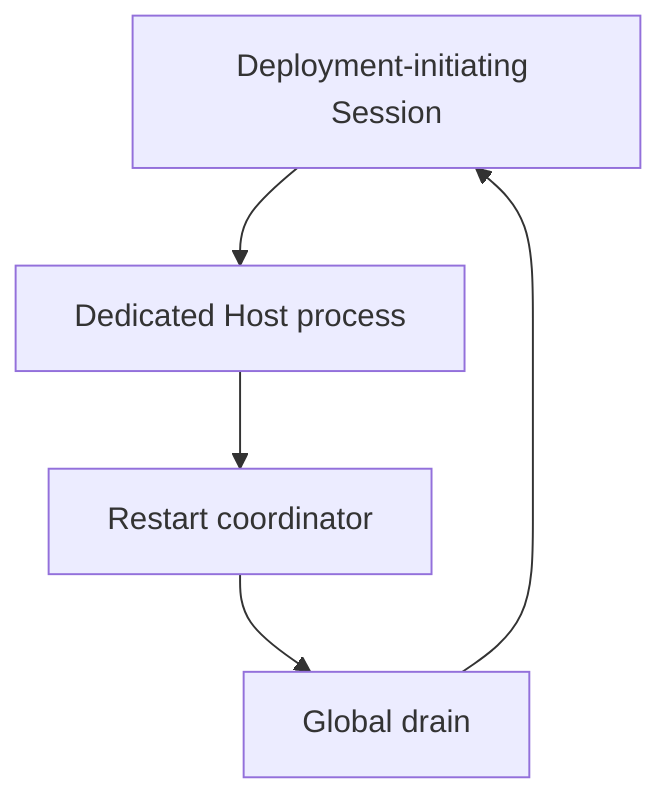
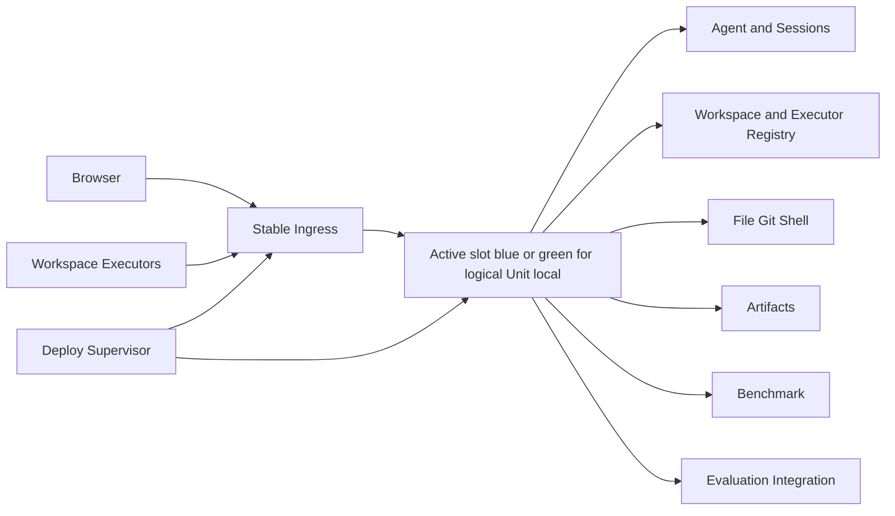
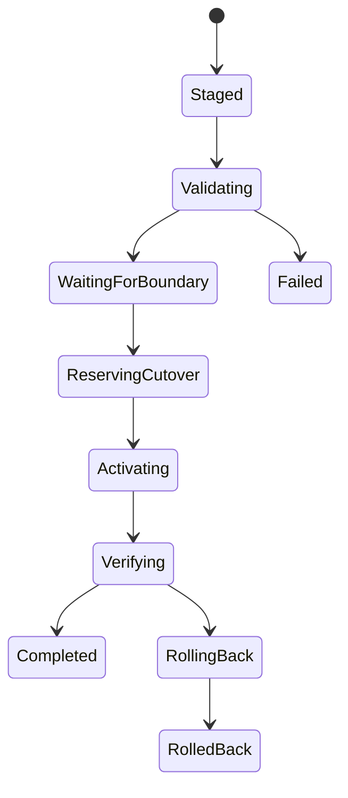

# Dedicated Platform Runtime Unit Refactor

**Status:** normative implementation and migration contract
**Scope:** production-grade Dedicated Platform systemd deployment; this installer currently targets one Linux host, while Dedicated itself means single-tenant rather than single-node
**Audience:** maintainers, operators, reviewers, and external contributors
**Product relationship:** Dedicated is `platform + single-tenant`; Private Cloud is `platform + multi-tenant`. Node count and infrastructure are orthogonal.

## 1. Executive summary

The legacy Dedicated composition ran public ingress, Dashboard, Agent runtime, Session loops, Executor registry, and restart coordination in one process. A deployment initiated by a Session hosted by that process could therefore wait for its own Session while globally rejecting work for unrelated Sessions.

The target composition separates three lifecycle owners:

1. **Stable Ingress** owns the public HTTP and WebSocket address.
2. **Dedicated Runtime Unit `local`**, materialized in alternating runtime slots `blue` and `green`, owns the complete Dedicated product runtime.
3. **Deploy Supervisor** owns immutable releases, deferred cutover, health verification, and rollback.

The components are separate systemd services in one Linux environment. Docker is not required. The same design works when that Linux environment is provided by a virtual machine or a system container.

Dedicated continues to expose Agent, Session, Workspace, Executor, File, Git, Shell, Artifacts, Benchmark, and Evaluation. Private Cloud continues to expose Agent-side capabilities while Benchmark and Evaluation remain disabled. Shared lifecycle does not imply identical capability profiles.

## 2. Problem statement

### 2.1 Current ownership cycle

In the current Dedicated process:



A checkpoint restart may:

- wait for the initiating Session to reach a checkpoint;
- prevent that Session from finishing its deployment Tool call;
- reject new messages for unrelated Sessions during the wait;
- couple deployment completion to the availability of the process being replaced.

Increasing the timeout does not solve the ownership error.

### 2.2 Required properties

The refactor must provide:

- no self-restart dependency;
- no long global drain while waiting for active work;
- stable Browser and Executor addresses;
- bounded unavailability during cutover;
- durable release and deployment receipts;
- automatic rollback after failed activation;
- no concurrent writers for one Unit data root;
- existing Session and Executor identity compatibility;
- complete Dedicated capabilities, including Benchmark and Evaluation;
- fail-closed Private Cloud capability disabling;
- installation and operation without Docker.

## 3. Target topology



The Linux service layout is:

```text
agent-runlab-dedicated-ingress.service
agent-runlab-dedicated-unit@blue.service
agent-runlab-dedicated-unit@green.service
agent-runlab-dedicated-deploy-supervisor.service
agent-runlab-dedicated-control-updater.service (static oneshot)
```

The services must be separate processes and separate cgroups. Restarting the Runtime Unit must not stop Ingress or Supervisor.

Dashboard is also an independent immutable release, although it is served by Stable Ingress
rather than another long-running process. Its route state has a separate monotonic
generation, release digest, asset digest, version, and protocol range. Dashboard deployment
is Supervisor-owned and must leave the Ingress, Runtime, Supervisor, Session, and Executor
process identities unchanged. Runtime deployment must never rewrite an existing Dashboard
route generation. Portable is the only architecture that uses the combined
`bundle-dashboard-with-runtime.cjs` artifact.

The active Dashboard route file is readable only by `root:agent-runlab` (`0640`). Published
Dashboard release directories are sealed read-only (`0555` directories and `0444` files),
including the initial release installed during migration. Archive validation permits only a
directory root entry (`.` or `./`); file paths must exactly equal the manifest and links,
absolute paths, parent traversal, and special entries are rejected.
The Dashboard root and releases parent are `root:agent-runlab` (`0750`) so the unprivileged
Ingress can traverse them without making deployment requests or receipts public. The
Supervisor may mark a Dashboard receipt completed only after Stable Ingress returns the
expected release and generation headers. Failed public verification restores the predecessor
at a newer generation; route generations never move backwards.

## 4. Runtime profiles and explicit composition

### 4.1 Profiles

A Runtime Profile is an explicit composition recipe, not an authorization shortcut.

```typescript
type RuntimeProfileName = 'full' | 'agent'

type RuntimeProfile = {
  readonly name: RuntimeProfileName
  readonly modules: readonly RuntimeModuleId[]
}
```

Required module sets:

| Module | `full` | `agent` |
|---|---:|---:|
| Agent and Session | enabled | enabled |
| Workspace and Executor | enabled | enabled |
| File, Git, Shell | enabled | enabled |
| Artifacts | enabled | enabled |
| Notifications | enabled | enabled |
| Benchmark | enabled | disabled |
| Evaluation integration | enabled | disabled |

### 4.2 Manual dependency injection

The Unit factory is the composition root. It resolves module factories, validates dependencies, constructs modules in topological order, and closes them in reverse order.

A large dependency-injection container, decorators, global service locators, and module-internal deployment-mode branching are prohibited.

```typescript
interface RuntimeModuleFactory {
  readonly id: RuntimeModuleId
  readonly requires: readonly RuntimeModuleId[]
  create(context: RuntimeUnitContext): Promise<RuntimeModule>
}
```

Capabilities are derived from installed modules and then checked against the profile contract. The Dashboard manifest and server route registration use the same installed-module result so UI and backend cannot drift.

## 5. Dedicated Runtime Unit

Dedicated creates exactly one **logical** Unit with two replaceable process slots:

```text
unitId = local
deployment = platform + single-tenant
runtimeProfile = full
dataRoot = shared logical Unit root
slots = blue | green
activeSlot = exactly one slot recorded by Stable Ingress
```

A slot is a process/release identity, not a second Workspace or tenant. Both slots refer to the same logical Unit data root, but the operating-system write lease permits at most one slot process to run against it. The inactive slot is stopped except while undergoing artifact/config self-test that does not open mutable Unit state.

The first implementation may wrap the mature Host runtime behind a private loopback listener. This preserves proven Agent behavior while moving public routing and process lifecycle outside the Unit.

The Unit owns:

- Session Store and Agent loops;
- durable message queues;
- Dashboard and Executor Socket.IO namespaces;
- Executor and Workspace identity registries;
- artifacts and Unit-scoped caches;
- Benchmark and Evaluation integration modules;
- Unit-local timers, hooks, and background tasks.

The Unit does not own:

- the public listening address;
- release activation;
- process replacement;
- rollback policy;
- user-to-Unit routing in Private Cloud.

## 6. Stable Ingress

Dedicated Ingress resolves trusted public traffic to the active slot recorded in an atomically replaced route-state file. The route contains a schema version, monotonically increasing generation, active slot, and both private origins. It is re-read without restarting Ingress. Existing WebSockets remain attached to the process that accepted them until that process stops; new HTTP/WebSocket connections use the current route. Private Cloud Ingress resolves trusted Gateway routes to tenant Units.

Ingress must proxy:

- independently activated Dashboard static requests;
- Engine.IO polling;
- WebSocket upgrades;
- Dashboard Socket.IO;
- Executor Socket.IO;
- Artifact and settings endpoints.

Ingress behavior while the Unit is unavailable:

- health endpoints remain available;
- new connections receive a bounded service-unavailable response with retry guidance;
- existing connections may disconnect and use normal client reconnection;
- Ingress must not terminate because the Unit is restarting.

The first production implementation may use a private loopback TCP origin. A Unix socket is optional and must not delay the lifecycle split.

## 7. Deployment model

### 7.1 Immutable release staging

A deployment creates an immutable release directory containing:

- Host/Dashboard bundle;
- Executor bundle;
- manifest and checksums;
- release notes;
- migration metadata;
- compatibility metadata.

The initiating Session may build, test, upload, and request deployment. It must not restart its own Runtime Unit or poll through a global drain.

### 7.2 Supervisor state machine



Waiting occurs before any global service interruption. While `WaitingForBoundary`, every Session remains usable.

### 7.3 Read-only quiescence

The Unit exposes an internal read-only quiescence snapshot:

```typescript
type UnitQuiescence = {
  readonly safe: boolean
  readonly activeLlmCalls: number
  readonly activeToolCalls: number
  readonly unsafeSessions: readonly {
    sessionId: string
    phase: string
    checkpointKind?: string
  }[]
}
```

Reading quiescence must never call `beginDrain()` or reject new messages.

### 7.4 Deferred cutover

The Supervisor polls quiescence outside the Unit process. If the Unit is busy, the deployment remains staged. It does not block unrelated work.

When the active slot is naturally safe, the Supervisor first self-tests the inactive slot's immutable release without opening mutable state. It then delegates an idempotent control update that installs and reloads the candidate systemd templates and proves replacement Ingress/Supervisor readiness while the predecessor Runtime still owns the write lease. Only after that persisted control-ready boundary does it obtain a short cutover reservation. Reservation starts checkpoint drain inside the active slot and waits for LLM/Tool checkpoints and queue mutations. Stable Ingress remains alive. The Supervisor stops the active slot to release the write lease, starts the inactive slot against the shared logical Unit data root, verifies it privately, and atomically updates route state. During the bounded replacement window:

- no new Agent turn starts;
- current durable writes finish;
- Browser and Executor connections enter their normal reconnect loop;
- the Unit releases its write lease;
- systemd replaces the Unit process;
- the new Unit is verified privately before Ingress resumes.

The implementation provides bounded Socket.IO reconnect rather than claiming
zero downtime. During write-lease handoff Stable Ingress durably accepts
idempotent user-message operations into its admission ledger before returning
`202`; ordinary upstream requests receive bounded retryable failure while no
verified Runtime is available. The ledger orders leases per Session, fences
them by route generation, and retains them until the Runtime proves the same
`operationId` is durable in Session JSONL. It does not own Agent state. A
candidate cannot accept public mutable Dashboard traffic before private
continuation and admission reconciliation followed by route commit. If
verification fails, the Supervisor restarts and verifies the predecessor
before restoring its route.

### 7.5 Receipts and idempotency

Every deployment request and transition is persisted. A receipt includes:

- deployment and release identifiers;
- requested and observed generations;
- state and timestamps;
- previous and target release digests;
- quiescence summary;
- activation PID;
- health and capability verification;
- rollback outcome;
- bounded, redacted error details.

Repeating the same operation ID returns the same receipt and must not trigger another activation.

## 8. Write lease and fencing

Only one Runtime Unit generation may write a Unit data root.

The migration starts with an operating-system lock owned by the Unit process. The production contract also records a monotonically increasing generation. A stale process must fail writes after a newer generation becomes active.

Candidate warm-up is limited to executable, manifest, environment, filesystem-permission, container-backend, and capability-profile self-tests that do not open mutable Unit state. The candidate Host process starts only after the old slot releases the lease. Two slots must never write the same Session Store concurrently.

## 9. Health, verification, and rollback

The Supervisor verifies:

- process liveness;
- exact write-lease ownership from the kernel lock table, matched by Runtime PID and lock-file device/inode without cross-user process introspection;
- Unit readiness;
- public Ingress routing;
- HTTP and Socket.IO reachability;
- expected release digest;
- expected Runtime Profile;
- Dedicated Benchmark and Evaluation capabilities;
- Executor reconnect and Workspace announcement;
- Session Store readability;
- no duplicate active writer.

Before Runtime handoff, the same deployment remains non-terminal while a
separate systemd oneshot Control Updater activates the release's Ingress,
Supervisor, unit templates, deployment profile, and updater policy. This
ordering guarantees that systemd starts the candidate slot from the candidate
template, including shared runtime-directory lifetime policy. The updater owns
a durable state machine and runs from a predecessor-pinned
`control-updater-current` symlink, so it can restore the predecessor control
release if the target Ingress or Supervisor does not become ready. Only a
completed updater receipt lets the Supervisor enter the planned-restart
boundary. The updater's own executable symlink advances last, after both
control processes are ready. Route commit remains the final deployment commit
after continuation, admission, and private Runtime verification.

If verification fails:

1. restore the previous release route;
2. restart the previous Unit generation;
3. verify previous readiness;
4. mark the receipt `rolled_back` or `rollback_failed`; a data rollback failure is fail-closed and the legacy service is not started against an empty state root;
5. retain the failed release and redacted diagnostics for inspection.

## 10. Data and compatibility migration

### 10.1 Preserve existing data roots

The migration must not require moving or rewriting existing Session, Artifact, Executor identity, Workspace alias, or notification data merely to introduce the Unit boundary.

The external cutover atomically renames the existing `.agent-kernel` state tree into the `local` Unit HOME only after the legacy service has stopped, then assigns the Unit service account as owner. The source and target must be on the same filesystem; this avoids duplicating large Session data, avoids ENOSPC during migration, and preserves inode identity. Bounded home configuration files used by the Host (provider/model, Agent prompt, hooks, and Socket.IO Admin settings) are copied separately with source-digest fencing. Release files remain separate from mutable data.

Migration compares a canonical settings fingerprint before and after activation. Provider IDs
and provider-qualified model references remain exact. A bare default-model ID is normalized
to its single provider-qualified reference only when the Runtime model catalog resolves it
unambiguously; ambiguous IDs remain unchanged and therefore fail closed instead of hiding a
real configuration drift.

The Finalizer must see both state parents through one mount object. Distinct
systemd `ReadWritePaths` entries create bind mounts and can make the rename
fail with `EXDEV` despite equal `st_dev` values. Before reserving the
boundary, it performs and reverses a probe-directory rename between the exact
parents; failure leaves the legacy Host running.

### 10.2 Migration procedure

1. inventory current service configuration and mutable roots;
2. create a read-only backup or snapshot;
3. install Ingress, Unit, and Supervisor services disabled;
4. validate configuration and release manifests;
5. stop the legacy service from an external control process;
6. persist a migration plan containing exact source/target ownership and provider-file digests, atomically move the compatible mutable state tree into the `local` Unit HOME, copy bounded provider settings, and verify ownership;
7. acquire the `local` Unit write lease;
8. start the Unit on its private origin;
9. start Ingress on the public address;
10. verify all capabilities and reconnect paths;
11. retain the legacy service definition, original data root, and previous release for rollback.

The one-shot Finalizer is itself a persisted state machine. Every externally
visible transition uses an atomically replaced and directory-synchronised
migration receipt. A restart resumes the recorded phase; rollback is likewise
staged and idempotent. If both source and target state roots exist, neither
exists, or a planned provider file changed, the Finalizer fails closed and does
not start either Host against uncertain data.

### 10.3 Rollback compatibility

The first cutover may not perform an irreversible data migration. If a later schema migration is required, it must declare forward and backward compatibility or produce a restorable snapshot before activation.

## 11. systemd packaging

### 11.1 Ingress service

- starts before the Unit;
- restarts independently;
- has no write access to Session data;
- can read only routing and health state;
- keeps the public address stable.

### 11.2 Unit service

- runs as a non-root service account;
- owns the data write lease;
- listens only on a private origin;
- uses explicit resource and stop limits;
- does not call systemd or the deployment Supervisor.

### 11.3 Supervisor service

- runs outside the Unit cgroup;
- owns release and receipt directories;
- accepts releases only through an operation-scoped, non-privileged submission dropbox, then re-verifies the exact manifest and hashes before atomic immutable publication;
- has narrowly scoped permission to start/stop the Unit service and update the active release;
- cannot modify Session content;
- can read the Unit write-lock inode and the kernel lock table solely to verify the active writer; it does not receive `CAP_SYS_PTRACE`;
- never accepts unauthenticated public requests.

The implementation should prefer systemd policy and a private Unix control socket over granting broad sudo or container-engine access.

### 11.4 Control Updater service

- is a separate static oneshot service, outside Ingress, Supervisor, and Unit cgroups;
- consumes only Supervisor-authored, operation-scoped update requests;
- verifies immutable target and predecessor release digests before mutation;
- persists monotonic `requested -> activating -> ingress_restarting -> ingress_ready -> supervisor_restarting -> completed` state;
- transitions through `rolling_back -> rolled_back|rollback_failed` on failure;
- atomically replaces systemd units and control-release symlinks, reloads systemd, and verifies changed Ingress/Supervisor PIDs;
- never reads or writes Session state.

## 12. Shadow migration environment

A major lifecycle migration must be validated in an isolated Linux environment before production cutover.

Rules:

- use independent ports, service names, release roots, and mutable data roots;
- use generated test data or a redacted copy of production-format data;
- never mount the active production data root read-write;
- never modify the current production service definition during development;
- exercise installation, upgrade, rollback, crash recovery, Browser reconnect, Executor reconnect, and capability checks;
- destroy or archive the environment after evidence is collected.

The Shadow environment is a release-validation tool, not a permanent production dependency.

## 13. Testing and acceptance

### 13.1 Component and integration tests

- Profile module graph validation and topological lifecycle;
- capabilities derived from installed modules;
- Dedicated capability superset and Private Cloud fail-closed profile;
- fixed `local` routing for Dedicated HTTP and WebSocket traffic;
- Executor routing through stable Ingress;
- read-only quiescence with no drain side effect;
- waiting deployment does not reject Session messages;
- idempotent deployment requests and persisted receipts;
- write-lease exclusion and stale-generation fencing;
- activation failure and automatic rollback;
- Supervisor recovery after process crash;
- migration from the legacy service layout.

### 13.2 End-to-end acceptance

The Shadow environment must exercise:

- Browser loading and Session creation;
- real Dashboard Socket.IO reconnect;
- real Executor reconnect and Workspace registry recovery;
- File, Git, Shell, and Artifact workflows;
- Agent turns with LLM and Tool activity;
- Benchmark and Evaluation entry points in Dedicated;
- absence and server denial of Benchmark/Evaluation in Private Cloud;
- deployment initiated from a Session hosted by the target Unit;
- unrelated Session messages while deployment waits;
- successful deferred cutover;
- failed release rollback;
- restart during Supervisor recovery;
- installation on a clean Linux environment.

Screenshots, console errors, failed requests, process logs, receipts, and digests are release evidence.

## 14. Production protection and current-instance safety

During this refactor, the current production instance is frozen:

- no service restart from the hosted development Session;
- no replacement of its active release;
- no systemd mutation;
- no write sharing with Shadow;
- no experimental listener on its public port.

Deployment tooling must reject legacy self-hosted restart when it can prove that the initiating Session belongs to the target Host and no external Supervisor contract is installed.

The final production cutover is an explicit external operation after all Shadow gates pass. It is not executed as an ordinary Tool call inside the Runtime Unit being replaced.

## 15. Gap closure for final redeployment

The refactor is not complete when code and unit tests pass. Completion requires all of the following:

1. production release artifacts include Ingress, Unit, Supervisor, systemd units, migration utility, and rollback utility;
2. a clean Shadow installation succeeds from those artifacts;
3. the immutable release digest is recorded;
4. current production configuration is inventoried without exposing it in public documentation;
5. a backup and restore check succeeds;
6. external cutover preflight reports no active deployment and no data-root writer conflict;
7. the external operator performs the bounded cutover;
8. public health, capabilities, Browser reconnect, Executor reconnect, Session recovery, Benchmark, and Evaluation are verified;
9. the previous service and release remain available during an observation window;
10. rollback is executed if any mandatory verification fails;
11. only after the observation window may legacy service files and retired releases be removed.

## 16. Incremental implementation order

1. Public contract and production freeze guard.
2. Runtime Profile and manual DI.
3. Real Dedicated `TenantRuntimeUnit(local)` composition.
4. Stable Ingress.
5. Read-only quiescence.
6. External Deploy Supervisor and receipts.
7. systemd packaging and privilege boundaries.
8. data write lease, migration, and rollback compatibility.
9. Shadow installation and fault injection.
10. release artifact and external production cutover.

Each step must leave existing tests passing and add focused regression coverage before the next step begins.

## 17. Non-goals

- Kubernetes or a distributed scheduler;
- Docker as a required Dedicated runtime;
- multi-node high availability;
- migration of in-memory LLM streams or JavaScript promises;
- simultaneous writers for one Session Store;
- exposing tenant identity to the Dedicated UI;
- reducing Dedicated capabilities to match Private Cloud.

## 18. Definition of done

The work is complete only when:

- Dedicated runs through Stable Ingress and `TenantRuntimeUnit(local)`;
- Supervisor is a separate process and lifecycle owner;
- a hosted Session can stage deployment without draining itself or other Sessions;
- deferred cutover and automatic rollback are proven in Shadow;
- Dedicated retains Benchmark and Evaluation;
- Private Cloud retains Workspace/Executor but denies Benchmark/Evaluation;
- existing mutable data remains compatible;
- production artifacts and external cutover runbook are complete;
- the current production instance remains intact until the external cutover Gate.
