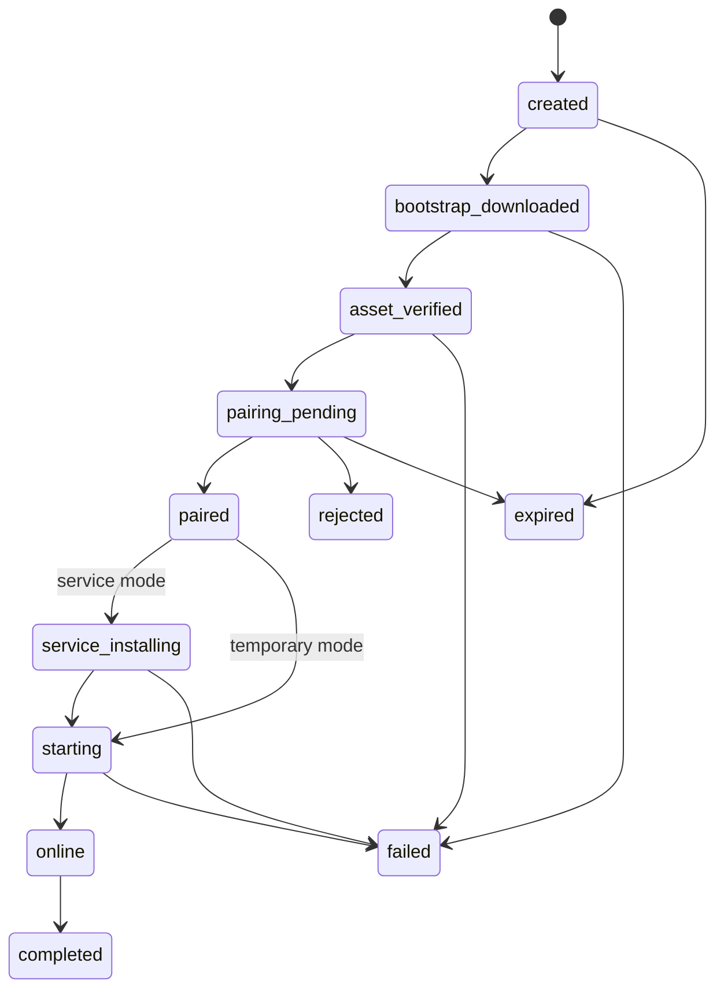
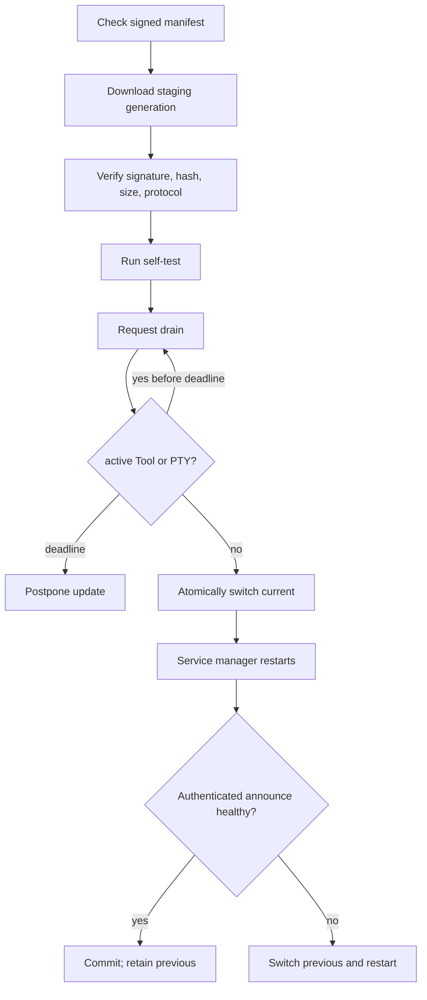

# Executor Installation, Service Lifecycle, and Updates — Source of Truth

**Status:** normative implementation contract
**Applies to:** `runlab-executor`, Host installation APIs, release assets, and Dashboard **Connect a new workspace**
**Supersedes:** ad-hoc `.cjs` download commands, long-lived Invite URLs, and in-place self-update behavior

## 1. Product contract

Agent RunLab distributes one Executor program named `runlab-executor`. The same executable supports:

1. **Temporary mode** — foreground execution; it stops when the terminal closes or the user sends Ctrl+C.
2. **Service mode** — OS-managed process; it starts at boot/login as configured, restarts after failure, and participates in managed updates.

The Dashboard must hide installation complexity. The default Connect Workspace flow exposes only:

- platform: Linux, macOS, Windows;
- run mode: **Install as service** (recommended) or **Run temporarily**;
- workspace root;
- one copyable, single-line command;
- live installation/pairing status.

The UI must not display systemd, launchd, Windows SCM, config paths, credentials, update flags, profile names, download checksums, or multi-line commands. Those details belong to the installer and Executor.

## 2. User-visible commands

The copied command is exactly one physical line and contains no newline.

### Linux and macOS

```bash
curl -fsSL 'https://HOST/install' | RUNLAB_SETUP_CODE='ONE_TIME_CODE' sh
```

### Windows PowerShell

```powershell
irm "https://HOST/install.ps1" | iex
```

Both installer URLs are stable and contain no Invite, bootstrap credential, installation ID, or query string. This is required so Cloudflare Access and other reverse proxies can allowlist exactly `/install` and `/install.ps1`, and so credentials never enter browser history, proxy/CDN access logs, referrers, screenshots, or shell history.

The Dashboard injects a short-lived setup code into a temporary process environment variable in the copied one-line command. The generic installer reads that variable and exchanges it in the POST body at `/api/executor-installs/claim`; interactive prompting exists only as a manual fallback. The Host rate-limits claims, stores only a hash, allows one successful claim, and returns the installation configuration plus a high-entropy bootstrap credential over TLS. The setup code is not an Executor Invite or long-term Executor credential.

The installation session already contains platform, service/temporary mode, workspace root, requested label, and Host origin. Consequently, the copied command needs no visible flags or secrets. Service mode defaults to a per-user systemd service / LaunchAgent and does not require `sudo`; system-wide installation is an explicit future advanced option that requests elevation only for the privileged registration step.

## 3. Connect Workspace modal

### 3.1 Layout

```text
Connect a new workspace

Platform
[ Linux ] [ macOS ] [ Windows ]

Run mode
● Install as service — Recommended
  Starts automatically, restarts after failure, and stays updated.
○ Run temporarily
  Runs only while this terminal remains open.

Workspace root
[ /home/user/workspace ]
Path must exist on the machine where this command runs.

[ command in one-line terminal card ] [ Copy ]

Installation status
○ Waiting for command
○ Downloading
○ Pairing required: 123456   [Approve] [Reject]
○ Installing service
○ Starting
○ Connected
```

### 3.2 State rules

- Platform detection selects a default but never locks the choice.
- Opening the modal creates an installation session, not an Invite.
- Changing platform, mode, root, or label atomically replaces or updates the installation session and command.
- Closing the modal stops all polling/SSE and expires unused sessions after their TTL.
- Invite is an Advanced compatibility path only and is not created until explicitly selected.
- Pairing approval errors, expiry, copy errors, and installer failures are visible and retryable.
- The modal never stores bootstrap or Executor credentials in localStorage, IndexedDB, URLs, analytics, or durable React Query cache.

## 4. Installation session

### 4.1 State machine



Every transition has a monotonically increasing `seq`, timestamp, safe error code, and optional non-secret metadata. Host-observed events override client claims: `online` requires an authenticated Executor announce associated with the installation ID.

### 4.2 API

Management endpoints require an authorized Dashboard administrator/owner in Private Cloud and authenticated operator access in Dedicated.

```text
POST   /api/executor-installs
GET    /api/executor-installs/:id
PATCH  /api/executor-installs/:id
DELETE /api/executor-installs/:id
GET    /api/executor-installs/:id/events     # SSE, Last-Event-ID aware
POST   /api/executor-installs/:id/approve
POST   /api/executor-installs/:id/reject
```

Bootstrap endpoints accept only the one-time bootstrap credential:

```text
GET  /install/:bootstrap
GET  /install/:bootstrap.ps1
POST /api/executor-installs/:id/events/client
POST /api/executor-installs/:id/redeem
```

Creation supports `Idempotency-Key`. Records persist only token hashes and non-secret status. Rate limits apply to create, download, redeem, pairing claim, and status reporting.

### 4.3 Required request fields

```typescript
type ExecutorInstallPlatform = 'linux' | 'macos' | 'windows'
type ExecutorInstallMode = 'service' | 'temporary'

type CreateExecutorInstall = {
  platform: ExecutorInstallPlatform
  mode: ExecutorInstallMode
  workspaceRoot: string
  workspaceName?: string
}
```

The Host returns a single command appropriate for the selected platform plus a status snapshot. It never returns long-term credentials.

## 5. Installer responsibilities

The shell and PowerShell installers are thin bootstraps generated by the Host. They perform the following transaction:

1. require HTTPS in production;
2. detect exact OS and architecture;
3. download the matching native `runlab-executor` asset and signed release manifest;
4. enforce response size and timeout limits;
5. verify publisher signature and SHA-256;
6. execute `runlab-executor install continue --session-file <protected-file>`;
7. report safe progress to the installation session;
8. remove bootstrap material on completion or failure.

The native program then:

1. validates the workspace root and service permissions;
2. discovers an existing legacy identity without mutating it;
3. initiates pairing and waits for Dashboard approval;
4. redeems approval exactly once for a long-term credential;
5. atomically persists identity and configuration;
6. runs in foreground or installs the platform service;
7. starts and waits for authenticated Host announce;
8. commits installation only after health succeeds;
9. otherwise rolls back files/service registration while preserving diagnostics.

The installer must never automatically terminate an unknown running Executor. A conflicting process or service produces a clear failure requiring explicit operator action.

## 6. Program command surface

Public binary:

```text
runlab-executor run
runlab-executor service install
runlab-executor service status
runlab-executor service logs [--follow] [--tail N]
runlab-executor service restart
runlab-executor service uninstall [--purge]
runlab-executor update check
runlab-executor update apply
runlab-executor update rollback
runlab-executor doctor
runlab-executor version
```

These commands exist for diagnostics and automation, but the default Dashboard flow invokes them inside the installer and does not expose their flags.

The legacy `kala-executor.cjs` command remains compatible for at least one release cycle. It must print a migration notice but must not auto-install or stop itself.

## 7. Platform service adapters

### 7.1 Linux

- system mode: systemd system unit;
- optional user mode: systemd user unit;
- `Restart=always`, bounded restart delay, network-online dependency, explicit graceful-stop timeout;
- service arguments contain only a config path;
- credentials are mode `0600`, directories `0700`;
- sandbox roots are validated against the service account's effective permissions;
- install is idempotent; conflicting unmanaged processes fail closed;
- `service logs` uses journalctl.

### 7.2 macOS

- system mode: LaunchDaemon in `/Library/LaunchDaemons`;
- user mode: LaunchAgent in `~/Library/LaunchAgents`;
- KeepAlive and RunAtLoad enabled;
- executable is signed and notarized; universal or architecture-specific asset selection is verified;
- credentials use Keychain where available, otherwise a protected file with explicit warning and permissions;
- install/uninstall uses modern `launchctl bootstrap/bootout/kickstart` semantics;
- `service logs` reads unified logging or configured protected log files.

### 7.3 Windows

- Windows Service registered through SCM with automatic start and recovery actions;
- binary/config under Program Files/ProgramData;
- long-term credential protected by DPAPI for the service identity;
- arguments and paths with spaces are correctly quoted;
- logs use Windows Event Log and a bounded diagnostic file;
- installer is signed; MSI/winget and Dashboard bootstrap converge on the same service layout;
- multiple profiles require unique service names, but the default UI creates one service only.

## 8. Identity and migration

- Workspace ID remains stable across temporary/service conversion and updates.
- Existing profile identity/token files are discovered read-only, validated with the Host, then copied atomically to the new layout.
- Migration is committed only after the new service announces successfully.
- Existing running Executors are never killed automatically.
- Host rejects simultaneous active claims for the same workspace unless executing an authenticated handoff protocol.
- Invite becomes genuinely one-time: first successful redemption consumes it.
- Pairing codes use cryptographic randomness; claim secrets remain high entropy.
- Approved long-term tokens must not be persisted in plaintext by the Host while waiting for claim; use an encrypted transient store or one-time exchange derivation.

## 9. Release and update contract

### 9.1 Installation source

```text
package-manager | dashboard-native | legacy-cjs | container
```

- package-manager installations update through that manager;
- container installations update by image replacement;
- dashboard-native installations use the RunLab generation updater;
- legacy CJS supports manual compatibility updates only until migrated.

### 9.2 Signed manifest

The manifest names every OS/architecture asset, byte size, SHA-256, protocol range, version, channel, and signature. Supported production targets:

```text
linux-x64, linux-arm64
macos-x64, macos-arm64 (or universal)
windows-x64, windows-arm64 when CI supports it
```

CI signs manifests/assets and publishes attestations. The installer pins the verification key or validates Sigstore identity against the expected repository/workflow. Downloading `SHA256SUMS` beside the binary is not sufficient authenticity.

### 9.3 Generation updater



The updater never overwrites the running executable. It keeps current and previous generations. Update/restart ownership belongs to a separate OS-managed updater job, not the main Executor process. On Linux, `runlab-executor-update.timer` activates a oneshot updater which coordinates with the main service through a local mode-`0600` control socket, waits for Tool and PTY quiescence, switches `current`, restarts `runlab-executor.service`, and verifies that the expected release and Workspace identity reconnect. A missed drain deadline resumes admission and postpones the update. Failed post-activation health switches `current` back to `previous`, restarts again, and verifies recovery. This avoids single-instance lock conflicts and prevents the update coordinator from disappearing with the process it restarts.

### 9.4 Release identity

Executor identity separates two values:

- `build.releaseTag` is a delivery coordinate or display label and may be a
  channel such as `latest`;
- `build.productVersion` and `executorVersion` are the semantic product version
  used for compatibility and managed-update comparison.

Release bundling must inject the root product version explicitly. A bundled
dependency's package version must never become the Executor version. When the
release tag itself is semantic it may supply `executorVersion`; otherwise the
injected product version is authoritative. An invalid product version fails the
build/runtime identity check instead of announcing `0.0.0`.

## 10. Reliability and security invariants

1. No unapproved stop/restart/replace of an active Executor.
2. No credential in command history, process arguments, service definitions, URLs retained by the UI, logs, or diagnostics.
3. No plaintext long-term credential at rest on the Host.
4. No unsigned or hash-mismatched executable runs.
5. All config, credential, generation, and state writes are atomic and symlink-safe.
6. Service install/uninstall/update is transactional and idempotent.
7. Install success requires authenticated online announce.
8. Update success requires reconnect health; otherwise automatic rollback.
9. Active Tool/PTTY work drains or causes postponement; it is not force-killed by routine update.
10. Modal polling/SSE exists only while open and is reconnectable without duplicate operations.
11. All management actions are authorized, rate-limited, audited, and tenant-scoped.
12. Diagnostics redact credentials, bootstrap tokens, claim secrets, and sensitive environment values.

## 11. Acceptance criteria

### 11.1 Modal

- [ ] Linux, macOS, Windows tabs exist and auto-detect correctly.
- [ ] Service and Temporary modes exist; Service is default.
- [ ] Workspace root is required and command updates when inputs change.
- [ ] Exactly one single-line command is shown; no service internals or long flags.
- [ ] Default flow creates no Invite.
- [ ] Closing the modal produces zero continued polling/SSE requests.
- [ ] Pairing approve/reject, expiry, copy failure, install failure, retry, and connected states are tested.
- [ ] Connected state shows workspace name/root, Executor version, and service/temporary mode.

### 11.2 Temporary mode — every platform

- [ ] Correct signed native asset is selected for OS/architecture.
- [ ] Signature/hash/size failure prevents execution.
- [ ] Pairing approval yields one stable workspace identity.
- [ ] Ctrl+C performs graceful drain and exit.
- [ ] No service is registered and no boot persistence is created.
- [ ] Re-running reuses the same identity without duplicate workspace creation.
- [ ] Network loss retries with bounded exponential backoff and clear status.

### 11.3 Service mode — every platform

- [ ] Install immediately starts the Executor and waits for online confirmation.
- [ ] Machine reboot automatically restores online state.
- [ ] Process crash is automatically restarted by the OS service manager.
- [ ] Service arguments contain no bootstrap, Invite, or long-term credential.
- [ ] Repeated install is idempotent and does not create duplicate services.
- [ ] Partial failure rolls back service registration and incomplete files.
- [ ] Unknown existing process is reported and never auto-killed.
- [ ] Uninstall preserves identity by default; purge removes it only explicitly.
- [ ] Status and logs commands work without revealing secrets.

### 11.4 Linux

- [ ] system and user unit generation has golden tests.
- [ ] enable/start/status/restart/uninstall are tested in an isolated systemd environment or disposable VM/container.
- [ ] sandbox root permissions are validated before service commit.
- [ ] crash recovery and reboot recovery are exercised end to end.

### 11.5 macOS

- [ ] LaunchDaemon and LaunchAgent plist generation has golden tests.
- [ ] bootstrap/bootout/kickstart commands are integration-tested on Intel and Apple Silicon runners where available.
- [ ] signing/notarization verification failure blocks install.
- [ ] reboot/login persistence and uninstall are tested.

### 11.6 Windows

- [ ] SCM create/start/query/stop/delete has golden and Windows-runner integration tests.
- [ ] DPAPI encrypt/decrypt works under the service identity.
- [ ] paths containing spaces and non-ASCII characters work.
- [ ] crash recovery, reboot start, Event Log, MSI/winget convergence, and uninstall are tested.

### 11.7 Updates

- [ ] Package-manager installs never self-overwrite.
- [ ] Dashboard-native update verifies signed manifest, size, hash, and protocol compatibility.
- [ ] Active Tool/PTY causes drain or postponement, never routine force-kill.
- [ ] Healthy update reconnects within deadline and preserves workspace identity.
- [ ] Corrupt download, invalid signature, incompatible protocol, self-test failure, restart failure, and health timeout all preserve or restore the previous version.
- [ ] Current and previous generations remain addressable; rollback command is tested.
- [ ] Single-instance locking cannot prevent service-manager restart.

### 11.8 Host/API/security

- [ ] Install management requires appropriate operator/admin authorization in all deployment modes.
- [ ] Bootstrap credentials are one-time, hashed at rest, short-lived, rate-limited, and revoked on completion.
- [ ] Pairing approve/reject and status are tenant-scoped and audited.
- [ ] Invite is one-time if the compatibility path is used.
- [ ] Host never writes pending long-term credentials in plaintext.
- [ ] SSE resumes via sequence/Last-Event-ID without duplicate transitions.
- [ ] `online` is emitted only from authenticated Executor announce.
- [ ] Logs and API responses pass secret-scanning tests.

### 11.9 Full end-to-end matrix

For Linux, macOS, and Windows, automated acceptance performs:

```text
Open modal
→ choose platform/mode/root
→ copy one-line command
→ execute installer
→ observe pairing code
→ approve in modal
→ install/start
→ observe online
→ create Session
→ run read and shell Tool
→ run interactive PTY input/output
→ restart service and reconnect
→ reboot and reconnect
→ apply healthy update
→ inject unhealthy update and auto-rollback
→ uninstall while preserving identity
→ reinstall and reuse workspace ID
```

No rollout is complete until Linux service E2E, cross-platform generation tests, production builds, and rollback tests pass. macOS and Windows may ship behind capability flags until their native runner acceptance matrix is green.

## 12. Implementation phases

1. **SOT and contracts** — this document, shared schemas, state machine, authorization.
2. **Bootstrap and Host API** — installation sessions, one-line script endpoints, progress/SSE.
3. **Linux reliable service** — first production path, with disposable-host E2E.
4. **Modal** — switch default flow only after Linux path passes.
5. **Signed update generations** — drain, restart, health, rollback.
6. **Legacy migration** — read-only discovery and explicit handoff.
7. **macOS adapter** — signed/notarized binaries and launchd acceptance.
8. **Windows adapter** — signed executable/MSI, SCM, DPAPI acceptance.
9. **Gradual rollout** — capability flags, metrics, rollback thresholds.
