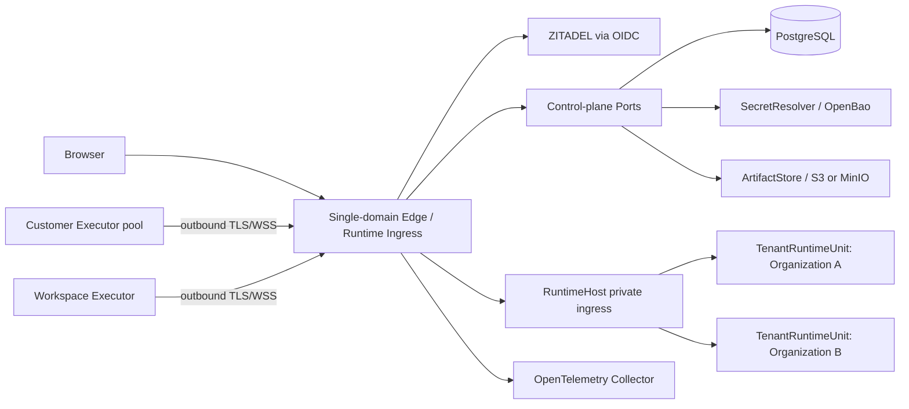

# Hosted/Hybrid Enterprise Architecture Contract

Status: normative

This contract supersedes first-release assumptions in `tenant-runtime-unit-saas.md` where that document says one user equals one tenant or omits enterprise RBAC. Existing implementation names remain valid until a separately reviewed rename.

## 1. Topology



The public product has one Origin. Tenant routing is server-derived and never encoded in a required subdomain, tenant URL, or browser-controlled header. Identity-provider operator administration may use a separate operator-only endpoint.

## 2. Authority matrix

| Fact | Sole authority | Runtime projection |
|---|---|---|
| Human authentication, MFA, federated identity | ZITADEL | OIDC identity claims validated by Gateway |
| Organization, membership, role, contract state | PostgreSQL control plane | short-lived authorization decision |
| Workspace grant and Tool Policy | PostgreSQL control plane | versioned Unit policy snapshot |
| Browser session and revocation | PostgreSQL session repository | HttpOnly opaque cookie |
| Runtime placement and lifecycle generation | control-plane placement repository | Host materialization record |
| Session/Event Log/Queue/PendingCall | TenantRuntimeUnit stores | Dashboard projection |
| Executor machine identity and credential status | control-plane Executor repository | Unit-local authenticated connection |
| Secret value | SecretResolver | ephemeral server-side value only |
| Artifact object bytes | S3/MinIO | tenant-scoped metadata and signed URL |
| Usage and audit | append-only PostgreSQL ledgers | query/read models |

No lower layer may silently create a missing higher-layer resource. In enterprise mode, first login cannot auto-create an Organization.

## 3. Identity and authorization

- A principal is `(issuer, subject)`; email is profile data, not identity.
- Browser cookies are opaque, HttpOnly, `SameSite=Lax`, Secure in production, idle-expiring, absolute-expiring, remotely revocable, and rotated when privilege changes.
- Authentication failure is `401`; an authenticated principal lacking permission is `403`. Document navigation may redirect to login only for authentication failure.
- Organization roles are fixed Owner/Admin/Member/Viewer for the first enterprise release. Workspace grants can narrow but never broaden Organization authority.
- Runtime HTTP reads require `runtime:read`; mutation and Dashboard Socket.IO require `runtime:write`; workspace administration requires `workspace:manage`.
- Membership suspension, Organization suspension, contract expiry, token revocation, and Executor revocation take effect on the next authorization check and terminate relevant live channels.
- The last Owner cannot be removed or demoted without an atomic Owner transfer.

## 4. Routing and service trust

1. Edge authenticates the browser or machine principal.
2. Edge resolves Organization, Workspace, permission, contract state, and placement server-side.
3. Edge deletes external cookie/authorization/routing headers and writes trusted internal routing metadata.
4. RuntimeHost accepts traffic only from private ingress authenticated with a rotatable service credential; production should use mTLS in addition.
5. RuntimeHost resolves the trusted route to exactly one ready Unit generation.
6. A WebSocket/Engine.IO connection is pinned to that Unit for its lifetime.

Unknown, suspended, stale-generation, duplicated, or unplaced routes fail closed. Public clients cannot invoke the private lifecycle API.

## 5. TenantRuntimeUnit contract

One Organization maps to one logical TenantRuntimeUnit in the initial topology. A Unit owns separate instances and roots for:

- Socket.IO server/namespaces and recovery buffers;
- Session/Event Log, Queue, operation dedupe, Approval and Compact state;
- Executor registry, pending dispatches and execution receipts;
- Artifact registry, push subscriptions, caches, timers and background work;
- Workspace metadata and versioned policy projection.

Cross-Organization identifier collision is expected and safe. Unit identity must be present in every persistent key, object prefix, metric context, and control operation. Unit-local code never receives an end-user credential or identity-provider token.

Lifecycle is generation-fenced:

```text
provisioning -> ready -> draining -> suspended -> closed
                     \-> failed
```

Provision, suspend, resume, drain, move, and delete require an idempotent `operationId` and monotonically increasing generation. Only one Host lease may write a Unit generation. Drain rejects new work, checkpoints recoverable Agent work, waits within a bounded deadline, and exposes explicit incomplete work.

## 6. Customer Executor contract

Executor is a machine principal distinct from humans and service accounts.

- Enrollment uses a one-time hashed token with Organization/optional Workspace realm, expiry, use count, intended pool, and approving actor.
- Successful enrollment exchanges the token for a long-lived device identity plus short-lived runtime credentials. The raw enrollment token is never stored.
- Connections are customer-initiated outbound TLS/WSS. No platform-initiated inbound access to customer networks is required.
- Dispatch identity is `(organizationId, workspaceId, sessionId, callId, operationId)`; receipts and retries are scoped to that identity.
- ACK, reconnect, duplicate suppression, cancellation, late-result rejection and backpressure are mandatory.
- Revocation and drain terminate assignment immediately; in-flight work follows explicit cancellation/recovery policy.
- Proxy and customer CA settings are Executor-local. Diagnostics redact credentials and customer content.

Organization pools may serve authorized Workspaces; Workspace-dedicated pools cannot escape their Workspace.

## 7. Data contract

- PostgreSQL stores control metadata, authorization, lifecycle, append-only usage/audit, browser sessions, outbox and object metadata.
- Tenant runtime data stays under an Organization-scoped root or storage namespace. Session semantics remain deployment-mode neutral.
- Object keys begin with an opaque Organization identifier and resource class; signed URLs are short-lived and permission checked before issuance.
- Secrets are stored as `credentialRef`, never plaintext database columns, logs, audit payloads or browser responses.
- Audit records store actor, action, target identifiers, decision/result, time, request/trace ID and safe change metadata—not prompts, secrets, file bodies or Tool output.
- Retention and deletion are asynchronous, idempotent, observable and produce deletion evidence. Backups have a documented expiry and are not silently rewritten.

## 8. Network contract

| Path | Direction | Exposure | Authentication |
|---|---|---|---|
| Browser → Edge | inbound | public product Origin | browser session/OIDC |
| Executor → Edge | outbound from customer | public machine endpoint | device credential + TLS |
| Edge → RuntimeHost | private | internal only | service credential + production mTLS |
| Control plane → PostgreSQL/OpenBao/MinIO | private | internal only | workload-specific credential |
| Services → OTel Collector | private outbound | internal only | network/workload policy |
| Operator → ZITADEL admin | operator path | not product routing | ZITADEL operator auth |

Production TLS terminates at managed ingress. Internal HTTP is permitted only on isolated private networks with authenticated service boundaries. Neither RuntimeHost nor PostgreSQL is publicly exposed.

## 9. Failure and consistency contract

- Authorization defaults deny when identity, policy, contract, placement, or repository dependencies are unavailable.
- Agent Event Log and Queue durability remain first-persist-then-publish/delete.
- Control-plane mutations are transactional; external effects use an Outbox and idempotent consumers.
- Cached authorization carries a short bounded lifetime and a version; revocation signals close live channels.
- Runtime restart recovery is exactly-once at the semantic operation level through operation IDs and Executor receipts.
- A degraded product shows an actionable error and trace ID; it never presents an infinite loading state for 401/403/5xx.

## 10. Composition roots and Ports

Vendor dependencies terminate at explicit Ports:

- `IdentityProvider` / `FederationAdmin`
- `ControlPlaneRepository`
- `SecretResolver`
- `ArtifactObjectStore`
- `TelemetrySink`
- `SupportTicketAdapter`
- optional `PolicyDecisionPoint`

Standalone composes local adapters and one `local` Unit. Hosted composes PostgreSQL/ZITADEL/OpenBao/S3/OTel adapters. Kernel, Session, Queue, Compact, Tool and Executor protocol code cannot read deployment environment variables or import those vendor SDKs directly.

## 11. Acceptance invariants

- Two Organizations can reuse every client-visible identifier without data, socket, artifact, receipt, notification or metric leakage.
- Viewer cannot establish a mutating Dashboard socket.
- Revoked human and Executor credentials cannot reconnect or reuse existing channels.
- A stale lifecycle generation cannot publish or write a Unit.
- Direct RuntimeHost access without service trust fails closed.
- Standalone retains Workspace/File/Git/Executor and all Agent semantics; Hosted removes Benchmark/Evaluation at UI and server capability boundaries only.
- Backup/restore, migration, upgrade and deletion are proven in disposable environments before release.
