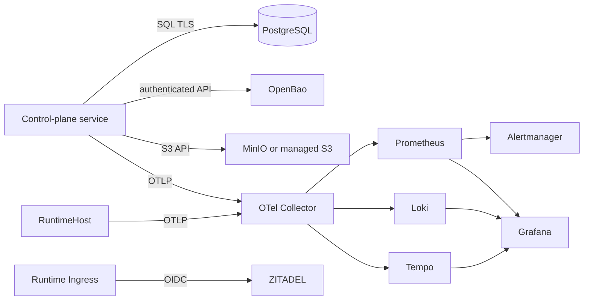

# Hosted/Hybrid OSS Boundary Review

Status: accepted planning decision

## Rules

1. OSS components are infrastructure systems of record behind narrow Ports; they do not define Agent domain objects.
2. Images are pinned by version and production releases additionally record digest and SBOM.
3. Network, workload credential, backup, restore, upgrade and data-export ownership are explicit for every component.
4. Copyleft and trademark obligations require legal review before external distribution or offering modified software as a managed network service.
5. No component is added merely to match a reference architecture; the first deployment stays operable by a small team.

## Decisions

| Component | Decision and role | Owned data | Agent RunLab boundary | Principal risk / control |
|---|---|---|---|---|
| PostgreSQL | **Adopt now.** Authoritative control-plane database, browser sessions, append-only usage/audit and transactional Outbox | Organization, membership, contract, Workspace policy, Executor identity, lifecycle, ledgers | `ControlPlaneRepository` plus transaction/clock interfaces | Shared blast radius and migration risk; separate application/ZITADEL databases and roles, TLS, PITR, restore drills, connection limits |
| ZITADEL | **Adopt now.** Human login, MFA, OIDC and enterprise federation; operator UI remains separate | Human identities, credentials, federation/MFA configuration | `IdentityProvider`, later `FederationAdmin`; RuntimeHost never imports it | AGPL/trademark and upgrade complexity; pin release, keep product authorization in PostgreSQL, never use email as identity |
| OpenBao | **Adopt before customer credentials.** Secret resolution, dynamic/rotated integration credentials where supported | Secret values and lease metadata | `SecretResolver` using opaque `credentialRef` | Operational/unseal/availability burden; HA, audit device, recovery keys, deny-by-default cache, no browser access |
| S3-compatible object storage | **Adopt before durable Artifact/export launch.** Prefer a portable S3 Port; MinIO is one self-hosted adapter, not a domain dependency | Artifact/export/support-bundle bytes | `ArtifactObjectStore` | MinIO licensing/distribution and product-direction changes; legal review, pin tested build, preserve compatibility with managed S3 alternatives |
| OpenTelemetry Collector | **Adopt now.** Vendor-neutral receive/process/export boundary | Short-lived telemetry pipeline state | OTLP exporters only; Agent core emits semantic telemetry | Cardinality/content leakage; Organization IDs hashed/opaque, no prompt/file/tool body, bounded queues and sampling |
| Prometheus + Alertmanager | **Adopt now.** Metrics/SLO and alert routing | Time-series metrics and alert state | OTel/metrics adapter | High cardinality and retention cost; no Session/Workspace IDs as unbounded labels |
| Grafana | **Adopt now for operators.** Dashboards and operational exploration | Dashboard/config metadata | Operator-only integration | AGPL and broad datasource privilege; SSO, least-privilege datasources, no customer admin exposure initially |
| Loki + Tempo | **Adopt with telemetry launch.** Logs and traces | Redacted logs and traces | OTel Collector exporters | Cost and sensitive payloads; retention caps, structured allowlist, trace sampling, tenant-safe labels |
| GlitchTip | **Pilot+.** Error aggregation only when OTel/operator surfaces do not meet triage needs | Stack traces, release and error metadata | `ErrorReporter` adapter | AGPL and duplicate operational stack; redact request data and deploy only after a measured gap |
| Gatus | **Adopt near Pilot.** Public/customer status checks and status page | Probe status/history | Generated endpoint/check configuration | Status page can leak topology; probe only public or synthetic endpoints and use customer-safe names |
| Zammad | **Adopt near Pilot.** External support system of record | Tickets and support correspondence | `SupportTicketAdapter`; RunLab stores Ticket ID/link only | AGPL, personal/customer content and attachment leakage; explicit consent and redacted bundles, scoped API account |
| Trivy | **Adopt now in CI.** Image/filesystem/config vulnerability and secret scan | Ephemeral scan cache/reports | Release quality gate | Scanner false positives and stale database; pin tool, refresh DB, severity policy plus reviewed exceptions |
| Syft | **Adopt now in release.** SPDX/CycloneDX SBOM generation | Release SBOM | Release pipeline | Incomplete package discovery; archive SBOM with exact digest and attest it |
| Grype | **Adopt now in CI.** Independent SBOM/image vulnerability gate | Ephemeral vulnerability reports | Release quality gate | Database lag/noise; pin version/database evidence and reconcile with Trivy rather than silently ignoring differences |
| OPA | **Do not adopt yet.** Candidate external policy decision point only after fixed Workspace Tool Policy is insufficient | Policy bundles/decision logs if enabled | optional `PolicyDecisionPoint` | Adds another authorization language and failure mode; fixed typed policy remains authoritative initially |
| OpenFGA | **Do not adopt yet.** Candidate relationship authorization after real inheritance requirements | Relationship tuples if enabled | future authorization adapter | Premature dual authority; fixed Organization roles and Workspace grants stay in PostgreSQL first |
| Kafka/NATS | **Do not adopt initially.** PostgreSQL Outbox and workers are sufficient | N/A | future event transport adapter | Extra distributed system without current throughput need |

## Data and network placement

- Datastores and operator UIs are private by default.
- Only product ingress, machine Executor ingress, customer-safe status, and intentionally published identity login endpoints are externally reachable.
- ZITADEL and Agent RunLab use separate PostgreSQL databases/roles even when sharing a cluster.
- OpenBao and object-store root credentials are bootstrap-only; workloads receive narrower credentials.

## Version and license baseline

The repository currently pins PostgreSQL `17.10-alpine`, ZITADEL/ZITADEL Login `v4.16.0`, and Caddy `2.10.2-alpine` for local acceptance. Those are not automatic production approvals. Before each release, record image digest, upstream release notes, migration requirements, license notice, CVE result and rollback compatibility.

Relevant upstream project/license references:

- PostgreSQL: <https://www.postgresql.org/about/licence/>
- ZITADEL: <https://github.com/zitadel/zitadel>
- OpenBao: <https://github.com/openbao/openbao>
- OpenTelemetry Collector: <https://github.com/open-telemetry/opentelemetry-collector>
- Prometheus/Alertmanager: <https://github.com/prometheus/prometheus>
- Grafana/Loki/Tempo: <https://github.com/grafana/grafana>
- MinIO: <https://github.com/minio/minio>
- GlitchTip: <https://gitlab.com/glitchtip/glitchtip-backend>
- Gatus: <https://github.com/TwiN/gatus>
- Zammad: <https://github.com/zammad/zammad>
- Trivy: <https://github.com/aquasecurity/trivy>
- Syft: <https://github.com/anchore/syft>
- Grype: <https://github.com/anchore/grype>

## Exit criteria for an adapter

An integration is not complete until it has contract tests, authentication and least-privilege configuration, health/readiness semantics, timeout/retry/circuit behavior, redaction, backup/restore or reproducible rebuild procedure, upgrade/rollback evidence, and a failure mode visible in product/operator diagnostics.
