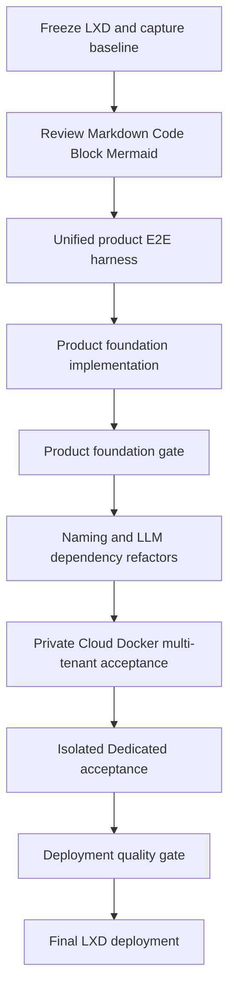

# Product Hardening Program Architecture

**Status:** historical closed execution program; current release evidence is revision-bound under `docs/evidence/README.md`.

**Status:** accepted execution order for the current program
**Baseline:** [`../testing/current-program-baseline.md`](../testing/current-program-baseline.md)
**Acceptance contract:** [`../testing/product-e2e-harness.md`](../testing/product-e2e-harness.md)

## 1. Ordering rule

The program proceeds through explicit gates. Product reliability and recoverability are completed before broad naming or LLM dependency refactors. Private Cloud Docker validation precedes isolated Dedicated validation. The production Dedicated target is the final release action only.

## 2. Product foundation branches

After the harness is available, implementation branches may proceed with explicit dependencies:

1. **Identity and account**
   - server-revocable browser Session design and implementation;
   - product versus provider logout semantics;
   - Account Center and Settings information architecture;
   - PWA/session/cache integration.

2. **Workspace data plane**
   - Workspace lifecycle first;
   - then File, Git, and Shell workflows;
   - then full two-user Unit isolation acceptance.

3. **Streaming and browser experience**
   - Markdown/Mermaid browser proof;
   - scroll anchoring during live token/tool/sub-agent/image updates;
   - PWA and multi-device notification lifecycle.

4. **Durability and operations**
   - data deletion/retention/export/migration semantics;
   - disposable backup/restore drills;
   - observability and user-visible recovery states;
   - per-Unit resource governance;
   - stronger isolation roadmap.

The product foundation gate requires all branches and task-chain evidence. A design document alone cannot satisfy it.

## 3. Refactor phase

Only after the product foundation gate:

- legacy multi-tenant component names migrate to RuntimeIngressGateway/RuntimeHost/RuntimeUnitIngress terminology;
- LLM dependencies migrate to explicit Port/Adapter/Factory/Composition Root boundaries with process, Unit, and Session scopes;
- both branches complete focused tests before an integration gate.

This order avoids combining unresolved product failures with repository-wide symbol and composition changes.

## 4. Deployment gates

1. Build and validate the Private Cloud Docker stack using isolated temporary users and resources.
2. Run the same critical journeys against an isolated Dedicated process on an unused port and temporary roots.
3. Run dual-mode LLM and browser acceptance.
4. Run full tests, typecheck, production/PWA build, Compose validation, release assets, old-name audit, and risk report.
5. Only then back up and deploy to LXD `13000`.

Any failure returns to the owning implementation node; it does not permit a partial LXD deployment.
