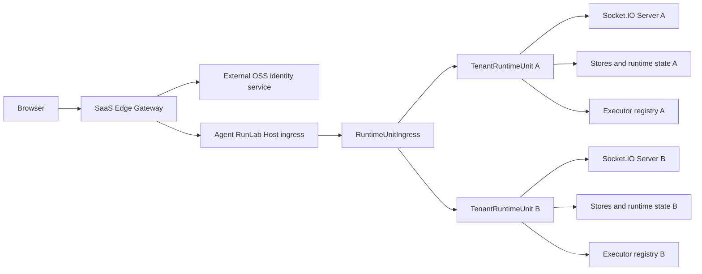
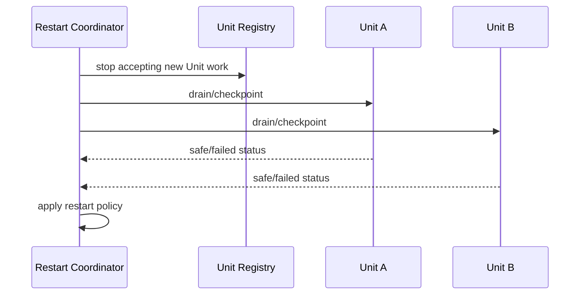

# TenantRuntimeUnit and SaaS Architecture

**Status:** accepted architecture; Phases 0–6 implemented for the local single-node SaaS composition; Phase 7 partial
**Normative mode contract:** [`deployment-mode-contract.md`](deployment-mode-contract.md)
**Decision:** the canonical name is `TenantRuntimeUnit`
**Scope:** Host-internal tenant isolation, dual Standalone/SaaS deployment, and the external SaaS control plane

## 1. Goal

Agent RunLab will support two deployment modes from one core codebase:

1. **Standalone:** the current single-installation product, with Agent, Benchmark, Evaluation, and all existing capabilities.
2. **SaaS:** one shared Host process serves many isolated tenants, while the product exposes Agent functionality and disables Benchmark/Evaluation.

The Host must remain independent of end-user identity systems. It must not implement registration, login, passwords, OIDC/JWT user verification, organization membership, or RBAC. Those concerns belong to an external SaaS Gateway/Control Plane. The Host may still verify deployment-boundary credentials: the existing Standalone shared token and a SaaS Gateway/control-plane service credential. This is service authentication, not user authentication.

The Host's multi-tenant abstraction is `TenantRuntimeUnit`: one complete, isolated Agent runtime owned by one tenant.

## 2. Non-negotiable boundaries

### 2.1 Host knows runtime tenancy, not user identity

The Host may know:

- `tenantRuntimeUnitId`
- an opaque `routingKey`
- Unit lifecycle and capabilities
- Unit-scoped sessions, artifacts, workspaces, executors, queues, caches, and sockets

The Host must not know:

- user email, password, profile, or login session
- Google/GitHub identity
- ZITADEL, OIDC provider, or identity-provider subject
- user-to-tenant membership or roles
- billing identity

The external control plane decides which authenticated user maps to which Unit. The Host receives only a trusted routing decision.

### 2.2 Isolation is structural

Isolation must not rely on callers remembering to add `tenantId` to every Room or Store call. Each Unit owns separate instances of tenant-sensitive services and receives a private storage root.

### 2.3 Socket.IO Rooms are not the tenant boundary

Each Unit has its own Socket.IO server and therefore its own namespaces, adapters, connection recovery state, and Room namespace. Rooms remain useful inside a Unit for `session:<id>` and workspace routing, but do not implement cross-tenant isolation.

### 2.4 One codebase, no SaaS fork

Standalone and SaaS use the same Kernel, Host loop, Dashboard, protocol, Session JSONL, Artifact Registry, and Executor implementation. Deployment mode and capabilities change composition, not domain behavior.

### 2.5 Feature disabling is authoritative

In SaaS mode, Benchmark/Evaluation are absent from Dashboard navigation and cannot be invoked through Host HTTP or socket endpoints. UI hiding alone is insufficient.

## 3. Target topology



The identity service is replaceable. A self-hosted ZITADEL deployment is one possible SaaS choice, but no ZITADEL dependency belongs in `packages/host`.

## 4. Core concepts and naming

### 4.1 `TenantRuntimeUnit`

A `TenantRuntimeUnit` is the complete in-process runtime boundary for one tenant.

```typescript
export interface TenantRuntimeUnit {
  readonly id: TenantRuntimeUnitId
  readonly state: TenantRuntimeUnitState
  readonly capabilities: RuntimeCapabilities
  readonly io: SocketIOServer
  readonly store: SessionStore
  readonly sessionArtifacts: SessionArtifactRegistry
  readonly executors: ExecutorRegistry
  readonly loop: LoopHandle

  start(): Promise<void>
  drain(input: DrainInput): Promise<DrainResult>
  close(): Promise<void>
}
```

This interface is illustrative. Implementation should expose the smallest surface needed by routing and lifecycle code; mutable internals should not become public simply to match this sketch.

A Unit owns separate instances of:

- Socket.IO server, `/dashboard` and `/executor` namespaces, adapter, Rooms, and recovery buffers
- SessionStore and active Agent state
- Host loop and token-delta batching
- SessionArtifactRegistry
- workspace alias and executor registries
- message queue and operation deduplication state
- push subscriptions and notification transition state, if SaaS retains those features
- Unit-scoped caches, timers, hooks, and background work
- Unit-scoped configuration projection

A Unit must not access another Unit's instances or root directory.

### 4.2 `TenantRuntimeUnitRegistry`

Owns loaded Units and serializes creation:

```typescript
interface TenantRuntimeUnitRegistry {
  get(id: TenantRuntimeUnitId): TenantRuntimeUnit | undefined
  getOrLoad(route: TenantRuntimeUnitRoute): Promise<TenantRuntimeUnit>
  provision(spec: TenantRuntimeUnitSpec): Promise<TenantRuntimeUnit>
  drain(id: TenantRuntimeUnitId): Promise<DrainResult>
  close(id: TenantRuntimeUnitId): Promise<void>
  list(): readonly TenantRuntimeUnitSummary[]
}
```

It requires separate `loaded` and `loading` maps so concurrent first requests cannot create duplicate Units.

For the first single-Host SaaS release, the external Control Plane is authoritative for whether a tenant exists and its desired lifecycle state; the Host catalog is a durable local materialization used for restart and reconciliation. The catalog must contain a schema version, Unit ID, expected routing-key digest/version, lifecycle generation, desired state, data-root identity, capabilities, and last successfully applied control-plane operation ID. Provision/suspend/delete are idempotent generation-checked operations written atomically before a Unit is published. On restart the Host reports its materialized generations and reconciles them with the Control Plane before accepting tenant traffic.

The local catalog is explicitly not a future multi-node placement authority. A later scheduler must own placement through leases/fencing generations; one Unit generation may be writable on only one Host. No second Host may infer ownership merely from copied catalog files.

### 4.3 `TenantRuntimeUnitFactory`

Builds one Unit from explicit dependencies and a private root:

```typescript
createTenantRuntimeUnit({
  id,
  dataRoot,
  capabilities,
  runtimeConfig,
  socketTransport,
})
```

The factory must reject invalid IDs and any root escaping the configured tenant-data directory.

### 4.4 `RuntimeUnitIngress`

Routes an already trusted request or connection to a Unit. It does not authenticate users, resolve memberships, or provision accounts.

Its semantic input is:

```typescript
type TenantRuntimeUnitRoute = {
  readonly unitId: TenantRuntimeUnitId
  readonly routingKey: string
}
```

The external Gateway owns user-to-route mapping. The Host owns route-to-Unit dispatch.

`routingKey` is the only ingress lookup value; `unitId` is the resolved internal identity and is never accepted independently from a browser request. The Host catalog stores a one-way digest plus version of the routing key and resolves it to exactly one Unit. Key rotation creates a new version, permits a bounded drain window for the prior version, and then revokes it. Unknown, revoked, duplicated, or mismatched routes fail closed. The key is an opaque routing secret but is not sufficient protection without private ingress and service authentication.

### 4.5 Control-plane adapter

The Host exposes a private provisioning/lifecycle API through a narrow adapter. It is distinct from end-user Agent APIs:

```text
provision Unit
inspect Unit readiness
suspend/resume Unit
drain/delete Unit
query aggregate health
```

Service-to-service trust is deployment infrastructure, not user authentication. The Host should normally be unreachable from the public Internet; private networking and preferably mTLS protect this API. The Host verifies the Gateway/control-plane service identity but never processes end-user identity claims. It must never trust a public browser-supplied `X-Tenant-ID` header.

## 5. Standalone composition

Standalone creates exactly one Unit:

```text
Host process
└── TenantRuntimeUnit(local)
```

Properties:

- no SaaS Gateway or identity provider required
- existing shared-token behavior remains available
- existing URL and Dashboard bootstrap remain compatible
- all current features remain enabled
- existing Session data remains readable
- all HTTP and Socket.IO ingress routes implicitly to `local`

Standalone is not a separate implementation. It is a single-Unit composition with a fixed route.

```typescript
const deployment = {
  mode: 'standalone',
  defaultUnitId: 'local',
  capabilities: FULL_CAPABILITIES,
}
```

## 6. SaaS composition

SaaS creates Units as directed by the external control plane:

```text
SaaS Gateway
└── shared Host process
    ├── TenantRuntimeUnit(01...A)
    ├── TenantRuntimeUnit(01...B)
    └── TenantRuntimeUnit(01...C)
```

The Gateway is responsible for:

- registration and login integration
- authenticated browser sessions
- mapping users to Unit IDs
- keeping all tenants on one product Origin
- resolving the authenticated identity to an opaque internal Unit route
- provisioning, suspending, and deleting Units
- proxying HTTP, polling, WebSocket upgrade, and static Dashboard traffic
- billing/account state, if later added

The Host is responsible for:

- isolating runtime state by Unit
- running Agent sessions
- storing Unit-scoped data
- routing Unit-scoped executor connections
- lifecycle, restart, health, and resource governance

First SaaS release assumptions:

- one user maps to one tenant and one `TenantRuntimeUnit`
- no teams or RBAC
- no cross-tenant sharing
- Agent functionality is enabled
- Benchmark and Evaluation are disabled
- all tenants run in one Host process, with process-level failure shared across tenants

## 7. Product Origin and trusted routing

All users enter the same product Origin:

```text
https://runlab.example.com
```

The URL does not contain a tenant slug, hostname, routing key, or Unit ID. The Gateway stores and resolves:

```text
authenticated issuer + subject -> opaque Unit ID
```

The browser does not choose the Unit ID. For every HTTP request, Engine.IO poll, and WebSocket upgrade, the Gateway verifies its signed login session, resolves the identity assignment, overwrites internal routing headers, and proxies to private Host ingress.

Recommended trust model:

1. Host is reachable only from Gateway and trusted executors/control-plane services.
2. Gateway binds one authenticated browser session to one immutable Unit route.
3. The internal route is protected by private networking and mTLS or an equivalent service credential.
4. Host resolves that route through `RuntimeUnitIngress`.
5. A connection cannot change Units after Socket.IO/Engine.IO handshake creation.

An opaque routing key alone is not sufficient authorization if Host is publicly reachable.

## 8. Socket.IO and Engine.IO design

### 8.1 Required outcome

Each Unit must own an independent Socket.IO server:

```text
TenantRuntimeUnit A / Socket.IO A
├── /dashboard
└── /executor

TenantRuntimeUnit B / Socket.IO B
├── /dashboard
└── /executor
```

Consequences:

- identical namespace names are safe
- identical `sessionId`, `workspaceId`, and Room names are safe across Units
- connection recovery and ACK state are Unit-local
- closing Unit A does not close Unit B

### 8.2 Engine.IO routing constraint

Socket.IO includes multiple HTTP requests and an upgrade sequence, not just one WebSocket:

```text
GET polling handshake
POST polling packets
GET polling responses
WebSocket upgrade
reconnect/recovery attempts
```

Every request belonging to one Engine.IO session must reach the same Unit. This must be proven before the Host is refactored around it.

### 8.3 Mandatory prototype gate

Before production implementation, build a two-Unit transport prototype that validates both:

- multiple Socket.IO servers attached through a shared Host ingress
- independent Unit closure and recovery

Required tests:

- polling-only connection to A and B
- WebSocket-only connection to A and B
- polling-to-WebSocket upgrade
- ACK and `emitWithAck`
- connection-state recovery and forced reconnect
- identical namespaces, Room names, session IDs, and workspace IDs
- concurrent streaming in A and B
- closing/draining A while B remains active
- malformed/unknown route rejection before Engine.IO accepts a session
- route mismatch on later polling/upgrade requests
- graceful process restart across both Units

### 8.4 Transport decision

The Phase 0 source audit and executable feasibility test reject direct attachment of multiple independently managed Socket.IO servers to one Node HTTP server.

In the locked Socket.IO 4.8.3 / Engine.IO 6.6.9 implementation:

- Engine.IO attachment snapshots and removes all HTTP `request` listeners, then installs a wrapper that replays earlier listeners.
- each attachment appends an `upgrade` listener; with default `destroyUpgrade`, one instance may schedule destruction of another path's upgrade.
- Socket.IO exposes no detach operation and Engine.IO close does not restore captured listeners.
- `io.close()` closes the supplied Node HTTP server, so one Unit cannot close independently.

The regression proof is `packages/host/src/socketio-shared-http-feasibility.test.ts`. It demonstrates that distinct paths can incidentally carry polling/WebSocket/ACK while both instances remain attached, but independent close shuts the shared listener and Engine.IO close leaves listeners installed. Incidental coexistence is not an acceptable lifecycle contract.

**Chosen production transport:** every Unit owns one internal Node HTTP server with its Socket.IO server attached in the standard one-to-one form. It listens on a Host-private Unix-domain socket where supported, with loopback ephemeral TCP as the portability fallback. `RuntimeUnitIngress` is the sole public ingress and reverse-proxies HTTP polling and WebSocket upgrade to the selected internal listener.

This adds one internal listener per loaded Unit but gives standard Socket.IO lifecycle, independent close, and no dependency on undocumented listener chaining. Internal listeners are never public tenant ports.

Do not silently fall back to one shared Socket.IO server with tenant-prefixed Rooms; that is a different architecture and requires an explicit design decision.

### 8.5 Connection-route binding and sticky routing

The Host ingress owns an ephemeral `engineSid -> { unitId, routingKeyVersion }` binding created only after the target Unit accepts the Engine.IO handshake. Later polling POST/GET and upgrade requests resolve through that binding and reject any conflicting route. Bindings expire when Engine.IO closes or its recovery horizon expires; they are never reconstructed from browser input. Unit suspend/delete invalidates new handshakes and drains or terminates existing bindings according to lifecycle policy. After a Host process restart, clients perform a new trusted route handshake; the Host does not pretend that in-memory Engine.IO bindings survived.

The Gateway and Host route must remain stable for the full Engine.IO connection. Future horizontal scaling requires routing a Unit to one Host node or a compatible distributed Socket.IO adapter; it is explicitly out of scope for the first release.

## 9. Storage isolation

Target layout:

```text
data/
├── host/
│   └── runtime-unit-catalog.json
└── tenant-runtime-units/
    ├── 01...A/
    │   ├── sessions/
    │   ├── session-artifacts/
    │   ├── workspace-aliases.json
    │   ├── push-subscriptions.jsonl
    │   └── runtime/
    └── 01...B/
        └── ...
```

Rules:

- Unit IDs are generated and validated internal identifiers, never emails or hostnames.
- Every Unit receives one canonical root path from the Factory.
- Stores receive paths beneath that root and do not accept caller-selected storage roots.
- Artifact reads require a session in the same Unit, preserving the existing session-bound rule.
- Workspace and Executor lookup occurs only in the Unit's registries.
- Global process caches may contain only immutable shared assets or entries explicitly keyed by Unit ID.
- Backups, retention, export, and deletion operate on a Unit root, with deletion requiring a drained Unit.

### 9.1 Existing data migration

Migration must be non-destructive and restart-safe.

Preferred Standalone compatibility sequence:

1. Introduce `TenantRuntimeUnit(local)` while pointing it at the existing paths.
2. Complete behavioral extraction without moving data.
3. Add an explicit, backed-up migration to the new `tenant-runtime-units/local` layout.
4. Record a migration marker and support restart after each file move.
5. Never perform a large implicit move merely because a new binary starts.

This avoids coupling architecture extraction to risky filesystem migration.

Before migration, produce a manifest of every legacy source path and content hash. Create and fsync the destination catalog entry in a non-active `migrating` generation, copy and verify files, atomically activate the new generation, then retain the legacy layout until an explicit cleanup release. A restart resumes from the manifest. Conflicting source/destination content stops migration for operator review; it is never overwritten automatically. Rollback selects the last fully verified generation. Release notes must state the oldest binary that can still read the post-migration layout.

## 10. Executor isolation

Executor registration and dispatch belong to a Unit.

```text
TenantRuntimeUnit A
├── Workspace A
├── Session A
└── Executor registry A
```

Invariants:

- an Executor connection is routed to exactly one Unit at handshake time
- an Executor cannot change Units while connected
- Session workspace lookup uses only that Unit's SessionStore
- tool calls cannot target a global executor map
- identical workspace IDs in two Units do not collide
- cancellation and late ACK handling remain Unit-local

How the SaaS control plane provisions or authenticates Executor connectivity is outside Host user-auth logic. Host ingress still requires a trusted route to the correct Unit.

## 11. LLM, secrets, and runtime configuration ownership

The Control Plane owns each Unit's desired product configuration and secret references. The Host owns only the resolved runtime projection required to run Agent sessions.

Rules:

- API keys are supplied through a secret-provider adapter or process/deployment secret mechanism; they are not written to the Unit catalog, Session JSONL, settings snapshots, logs, or metrics.
- Unit configuration identifies allowed providers/models, defaults, budgets/quotas, tool policy, and secret reference IDs.
- The Factory receives an immutable configuration generation when constructing a Unit.
- Configuration changes are generation-checked and applied through an explicit reload/drain policy; sessions cannot silently switch policy mid-turn.
- Standalone continues to resolve local configuration files through its existing adapter.
- SaaS tenant overrides come from the external Control Plane, not identity claims and not public Dashboard payloads.
- Shared immutable model metadata may remain Host-global; mutable selections, quotas, credentials, and sanitized settings projections are Unit-scoped.

## 12. Capabilities and product modes

Define an explicit capability projection:

```typescript
type RuntimeCapabilities = {
  agent: boolean
  benchmarks: boolean
  evaluations: boolean
}
```

Do not spread `mode === 'saas'` checks throughout the codebase.

Default compositions:

| Capability | Standalone | SaaS |
|---|---:|---:|
| Agent | enabled | enabled |
| Benchmark | enabled | disabled |
| Evaluation | enabled | disabled |

Other pages are not disabled merely because the deployment is SaaS. Any future restriction must be an explicit capability decision.

Dashboard behavior:

- obtains authoritative capabilities during bootstrap
- omits disabled navigation and routes
- redirects stale deep links to an available page
- does not load disabled feature bundles when practical
- preserves Agent mobile/PWA behavior

Host behavior:

- does not initialize disabled Benchmark/Evaluation services
- does not attach their private/public routes
- returns a stable `FEATURE_DISABLED` response for compatibility endpoints retained during migration
- rejects disabled Socket.IO actions

## 13. Lifecycle and resource governance

Unit states:

```typescript
type TenantRuntimeUnitState =
  | 'provisioning'
  | 'loading'
  | 'ready'
  | 'draining'
  | 'suspended'
  | 'failed'
  | 'closed'
```

Initial implementation should favor correctness over aggressive unloading:

- provisioned Units remain loaded
- duplicate loading is serialized
- failed creation is retryable but not partially published
- `close()` is idempotent
- draining rejects new work but lets safe in-flight work checkpoint

After correctness is proven, add bounded resource policies:

- maximum loaded Units
- idle unloading
- per-Unit connection/session limits
- aggregate Host backpressure
- LRU only for Units with no active sockets, executors, or unsafe sessions

A single Host process is not a hard security or fault-isolation boundary. A crash, memory leak, event-loop stall, or process compromise can affect all Units. This design provides strong logical isolation, not container/VM isolation.

## 14. Graceful restart

Restart becomes a Host-level aggregation over Unit-level drain:



Requirements:

- status reports per Unit and per active Session
- one Unit's failure is visible and cannot be mistaken for global success
- timeout is absolute and configurable
- no new Unit loads after global drain starts
- replacement process publishes readiness only after catalog and mandatory Unit recovery checks
- Standalone retains current one-Unit behavior

## 15. Observability

Every Unit-originated log record should receive context at the Unit boundary:

```json
{
  "tenantRuntimeUnitId": "01...A",
  "sessionId": "session-123"
}
```

Host must not log user email because it does not receive it.

Minimum metrics:

```text
agent_runlab_tenant_runtime_units{state}
agent_runlab_tenant_runtime_unit_connections
agent_runlab_tenant_runtime_unit_sessions
agent_runlab_tenant_runtime_unit_load_seconds
agent_runlab_tenant_runtime_unit_failures_total
agent_runlab_tenant_runtime_unit_memory_estimate_bytes
```

Avoid unbounded high-cardinality public metric labels. Per-Unit detail can live in an authenticated operational endpoint or logs rather than Prometheus labels at large scale.

## 16. External SaaS components

A complete SaaS deployment adds components outside the Host repository boundary or in separate packages:

### 16.1 SaaS Gateway/Control Plane

Responsibilities:

- OSS identity-provider integration
- browser login/session handling
- user-to-Unit mapping
- single-Origin authenticated Unit assignment
- trusted HTTP and Socket.IO proxying
- Unit provisioning/lifecycle calls
- account suspension/deletion workflow

Suggested package boundary if maintained in this repository:

```text
packages/runtime-ingress-gateway/
```

It must depend on Host control-plane contracts, while `packages/host` must not depend on it.

### 16.2 Identity provider

A self-hosted OSS identity provider such as ZITADEL can provide registration, password/passkey, social/OIDC login, and account recovery. It remains replaceable.

### 16.3 Deployment

Docker may package the shared SaaS services:

```text
Gateway container
Host container
Identity-service container
Identity database
Reverse proxy
```

Docker is not the tenant boundary; `TenantRuntimeUnit` is the Host's logical tenant boundary. Standalone remains installable without Docker.

## 17. Security and isolation invariants

The implementation is unacceptable unless all of these hold:

1. A browser cannot select or override its Unit route.
2. Host public exposure cannot bypass the Gateway trust boundary in SaaS mode.
3. Same IDs in two Units never collide in Store, Room, cache, queue, Artifact, or Executor lookup.
4. No Unit receives another Unit's token deltas, state broadcasts, push notifications, or ACKs.
5. Unit roots cannot escape the configured data root.
6. Unit deletion cannot run while the Unit is active or draining unsuccessfully.
7. Benchmark/Evaluation cannot be invoked in SaaS mode through hidden URLs or raw protocol calls.
8. Standalone remains usable without identity or SaaS services.
9. Host contains no user-auth provider SDK or user account model.
10. Control-plane and route trust failures fail closed.

## 18. Implementation record and remaining gates

Phases 0–6 below describe the delivered local single-node composition. Checked items and implementation tests are current-state evidence; unchecked items and Phase 7 remain release work. This section does not override the normative deployment-mode contract.

### Phase 0 — transport and composition spike

Before broad refactoring:

- [x] audit Socket.IO 4.8.3 and Engine.IO 6.6.9 attach/close behavior
- [x] prove that shared attachment has no independent detach/close contract
- [x] select internal Unix-socket/loopback HTTP servers per Unit
- [x] inventory mutable singleton/global state currently created in `startHostServer`
- [x] classify each dependency as Host-global, immutable shared, or Unit-owned
- [x] prove Router proxy behavior for polling, upgrade, reconnect, recovery, ACK, and independent close

**Gate:** the direct shared-attachment question is closed. Production extraction proceeds only after the selected internal-listener proxy passes its remaining transport tests.

### Phase 1 — extract one local Unit — implemented

- introduce `TenantRuntimeUnit`, Factory, and lifecycle types
- move current tenant-sensitive construction out of `startHostServer`
- compose one `local` Unit with existing paths
- preserve current `HostServer.io`, `loop`, and `store` compatibility temporarily where needed
- add ownership/leak tests for timers, sockets, and close behavior

**Gate:** full Host, Dashboard, Kernel, Executor tests and real Standalone browser matrix pass with no data migration.

### Phase 2 — Registry and two-Unit logical isolation — implemented

- add Registry with duplicate-load suppression
- create two Units with independent roots
- move SessionStore, artifacts, executors, queues, aliases, push state, operation dedupe, and token batching into Unit ownership
- audit module-level mutable state

**Gate:** adversarial tests reuse identical session/workspace/artifact/call/operation IDs across both Units without leakage.

### Phase 3 — `RuntimeUnitIngress` and socket transport — implemented

- route HTTP Engine.IO requests and upgrades to independent Unit Socket.IO servers
- bind connection route once at handshake
- reject unknown, suspended, failed, and mismatched routes
- implement Unit-local `/dashboard` and `/executor`

**Gate:** desktop and mobile headless browsers connect concurrently to two Units; reconnect and streaming remain isolated; closing one Unit does not interrupt the other.

### Phase 4 — HTTP and storage routing — implemented for current Unit-scoped routes

- classify all current Host HTTP routes as Host-global, Unit-scoped, or Standalone-only
- route Session, Artifact, Workspace, settings projection, push, and relevant file routes to Unit services
- keep health/readiness and private lifecycle operations Host-global
- add traversal, guessed-ID, stale-route, and deletion tests

**Gate:** complete cross-Unit HTTP isolation suite and restart-safe persistence tests pass.

### Phase 5 — deployment capabilities — implemented

- add Standalone/SaaS composition configuration
- expose authoritative capabilities to Dashboard
- disable Benchmark/Evaluation service initialization and endpoints in SaaS
- hide disabled Dashboard navigation/routes and lazy bundles

**Gate:** screenshot/headless matrix for both modes; raw HTTP/socket attempts confirm disabled features fail closed; Standalone retains all existing features.

### Phase 6 — external SaaS Gateway — implemented for local single-node deployment

- add or deploy the separate Gateway/Control Plane
- integrate an OSS identity provider outside Host
- implement user-to-Unit mapping and first-login provisioning
- resolve each authenticated identity to its private Unit while retaining one product Origin
- proxy static assets, HTTP, polling, and WebSocket upgrades with stable route binding

**Gate:** end-to-end registration/login creates one Unit, remains on the shared product Origin, runs an Agent session, reconnects, and cannot access a second test user's Unit.

### Phase 7 — production operations — partial

- aggregate restart/readiness
- suspend/resume/delete/export/backup workflows
- quotas and backpressure
- bounded Unit loading/unloading
- audit-safe operational views
- failure injection, rollback, and recovery drills

**Gate:** SLO, retention, backup/restore, load, and fault-injection acceptance criteria are documented and passing.

## 19. Required test matrix

### Unit tests

- ID/path validation
- Registry concurrent loading and failure cleanup
- lifecycle transition legality and idempotent close
- capability enforcement
- route resolution and fail-closed behavior

### Integration tests

- duplicate IDs across two Units
- HTTP, Socket.IO, Executor, Artifact, Queue, operation ACK, and push isolation
- connection recovery scoped to one Unit
- Unit drain/close while another streams
- process graceful restart with mixed Unit states
- Standalone legacy-path compatibility and migration

### Real browser tests

At minimum:

- desktop Chromium, two isolated login contexts on the same product Origin
- mobile browser viewport and standalone PWA viewport
- streaming, upward scroll, Session switching, Queue, Artifact preview
- forced disconnect/reconnect and Gateway restart
- SaaS navigation contains Agent but not Benchmark/Evaluation
- direct deep links to disabled pages recover cleanly

Visual checks must use screenshots, not overflow assertions alone.

### Security tests

- spoofed Unit headers/queries/auth payloads
- route swapping during polling and upgrade
- guessed session/artifact/workspace IDs
- traversal and symlink escape attempts
- suspended/deleted Unit stale connection
- direct Host access in SaaS deployment
- control-plane replay and unauthorized lifecycle calls

## 20. Review: issues found in the initial concept

The concept is sound, but the following corrections are required:

### 20.1 Independent Socket.IO servers are not automatically routable

Creating several `new Server(http)` instances is not enough. Engine.IO request/upgrade ownership and stable routing require explicit routing. Phase 0 closed this uncertainty by selecting independent loopback HTTP/Socket.IO servers per Unit behind `RuntimeUnitIngress`; regression tests must preserve that result.

### 20.2 Logical isolation is not process isolation

Separate Unit objects prevent ordinary cross-tenant data access, but all Units share one event loop and address space. No documentation or marketing should call this VM/container-grade isolation.

### 20.3 Host cannot be both authentication-free and blindly trust public headers

Keeping user authentication outside Host is correct. Trust still needs a private ingress boundary between Gateway and Host. That trust should be network/service-level and route-level, not a user-account subsystem inside Host.

### 20.4 Not every current Host singleton is safe to share

`startHostServer` constructs many mutable maps, timers, stores, push state, executor state, token batching, and restart hooks. Unit composition therefore owns a complete Host runtime rather than wrapping only SessionStore. New mutable state must be classified as Host-global, immutable shared, or Unit-owned.

### 20.5 Data movement must not be coupled to extraction

Moving current Standalone data during the first refactor would make rollback risky. First extract a local Unit over existing paths; migrate later with backup and resumability.

### 20.6 Feature scope must be exact

The stated SaaS requirement disables Benchmark/Evaluation, not every operational or Agent-supporting screen. Additional restrictions require explicit capabilities rather than assumptions.

### 20.7 Horizontal scaling is deferred, not solved

One Unit currently lives on one Host process. Multi-node placement, migration, and distributed Socket.IO adapters are later control-plane problems. The catalog and APIs should not make them impossible, but Phase 1 must not implement them.

### 20.8 LLM configuration and catalog authority need explicit owners

Tenant isolation also applies to mutable provider policy, secrets, quotas, and settings projections. Section 11 assigns desired configuration to the Control Plane and runtime projection to the Unit, while forbidding secret persistence in ordinary Unit data. Likewise, the Control Plane is authoritative for tenant desired state; the Host catalog is only a generation-checked local materialization. This prevents two independent sources of truth.

### 20.9 Route binding needs an explicit connection record

A route cannot be re-evaluated from arbitrary browser parameters on every polling request. Section 8.5 therefore defines an ephemeral Engine.IO SID binding to one Unit and routing-key version, with fail-closed mismatch and restart behavior.

## 21. Result after full implementation

### Standalone user experience

A user installs and runs Agent RunLab exactly as a complete local product:

- one local URL
- no registration or identity service requirement
- Agent, Benchmark, and Evaluation available
- existing sessions and artifacts preserved
- operationally one `TenantRuntimeUnit(local)` exists internally, but the user does not see tenant concepts

### SaaS user experience

A user:

1. registers or logs in through the external OSS identity service
2. receives a stable personal Agent RunLab URL
3. opens a Dashboard containing Agent functionality without Benchmark/Evaluation
4. creates workspaces and sessions, streams replies, uses tools, queues messages, and views artifacts
5. reconnects to the same isolated runtime and data

Another user uses the same product URL and Host process but is routed to a different Unit. Identical internal IDs cannot create leakage. Neither user sees `TenantRuntimeUnit`, routing keys, or Host topology.

### Operator experience

An operator runs:

- one identity service and Gateway/Control Plane
- one or more shared Agent RunLab Host processes
- a Unit catalog and Unit-scoped data roots

The operator can provision, inspect, drain, suspend, back up, restore, and delete a Unit without placing authentication logic inside Host. A later scheduler can assign Units to different Host nodes without changing Kernel or Dashboard domain behavior.

## 22. Final decision summary

- Canonical isolation concept: **`TenantRuntimeUnit`**.
- Host role: Unit container, router, lifecycle coordinator, and resource governor.
- Router name: **`RuntimeUnitIngress`**.
- Authentication/user management: external SaaS Gateway and replaceable OSS identity provider.
- Socket.IO: independent server per Unit; Rooms are Unit-internal only.
- Deployment: Standalone is one local Unit with all features; SaaS is many Units with Agent enabled and Benchmark/Evaluation disabled.
- Docker: optional packaging for shared SaaS services, not one container per tenant.
- Completed implementation gate: independent loopback Socket.IO routing is covered by proxy and multi-tenant service tests.
- Next production gate: complete Gateway request-path tests, server-revocable sessions, backup/restore drills, quotas, and fault/load acceptance.
