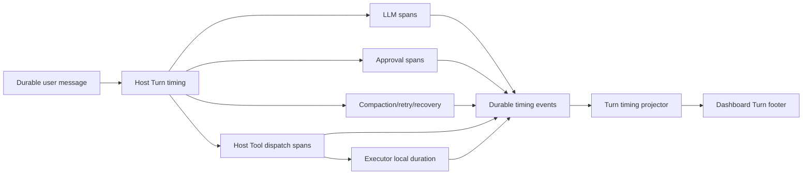

# Turn timing and latency observability — source of truth

## 1. Purpose

Agent RunLab must answer two distinct questions without forcing an operator to inspect logs:

1. **How long did this user Turn take?**
2. **Where was that time spent?**

The chat surface shows one quiet Turn footer by default and a structured breakdown on demand. Timing is durable, survives refresh and Host restart, and is never inferred only from a browser timer.

## 2. Turn definition

A **Turn** starts when a durable `user_message` becomes the active input of the Agent loop. It ends when processing reaches a terminal resting state for that input: completed, failed, cancelled, or interrupted.

- A queued follow-up is a separate Turn. Its queue wait begins when enqueued; execution begins when its `user_message` is durably committed.
- A steer message belongs to the active Turn as an input segment. It does not reset the Turn clock.
- `awaiting_approval` pauses active work but does not end the Turn.
- Tool calls, retries, compaction, recovery, and sub-agents caused by the input belong to the same Turn.
- Old sessions without Turn timing events remain valid and simply omit the footer.

A stable `turnId` is generated by the Host. It is not a message array index and does not change after compaction.

## 3. Clock rules

Each component measures its own duration with a monotonic clock (`performance.now()` or `process.hrtime.bigint()`). Wall-clock timestamps are retained only for ordering, rendering, and recovery.

- Never subtract a Host timestamp from an Executor timestamp.
- Executor returns local `durationMs`; Host records receipt time independently.
- Persisted durations are non-negative finite integers.
- A wall-clock jump cannot make a completed duration negative or inflate it.
- A running duration after recovery may use persisted wall boundaries and is explicitly marked estimated until the next monotonic segment completes.

## 4. Durable contract

```typescript
type TurnTimingSpan = {
  spanId: string
  turnId: string
  parentSpanId?: string
  kind: 'turn' | 'queue' | 'llm' | 'tool' | 'approval' | 'compaction' | 'retry' | 'recovery'
  component: 'host' | 'executor'
  status: 'running' | 'succeeded' | 'failed' | 'cancelled' | 'interrupted'
  startedAt: string
  completedAt?: string
  durationMs?: number
  attributes?: {
    callId?: string
    requestId?: string
    attempt?: number
    waitReason?: string
    executorDurationMs?: number
    batchId?: string
  }
}
```

Durable events are append-only:

- `turn_started`
- `timing_span_completed`
- `turn_completed`

Running spans are projections of durable start boundaries plus live state; completed durations are authoritative. Events contain no prompts, commands, paths, tool arguments, provider payloads, or error text. Safe IDs and bounded enum-like reason codes only.

## 5. Collection API

Use explicit instrumentation rather than TypeScript method decorators:

```typescript
await timing.withSpan({ kind: 'llm', turnId }, () => requestModel())
```

Long-lived waits use `startSpan()` / `finish()` because approval and queue boundaries cross callbacks and restarts. The helper guarantees exactly one completion and records failure/cancellation in `finally` semantics.

A decorator may be a convenience for leaf functions, but it must not hide durable commit boundaries or synthesize Turn ownership.

## 6. Projection

```typescript
type TurnTimingSummary = {
  turnId: string
  status: 'running' | 'completed' | 'failed' | 'cancelled' | 'interrupted'
  wallDurationMs: number
  estimated: boolean
  queueDurationMs: number
  activeDurationMs: number
  approvalWaitMs: number
  llm: { wallDurationMs: number; requestCount: number; firstTokenMs?: number }
  tools: {
    wallDurationMs: number
    aggregateDurationMs: number
    callCount: number
    peakConcurrency: number
    criticalPathMs?: number
  }
  compactionDurationMs: number
  retryDurationMs: number
  recoveryDurationMs: number
}
```

Rules:

- `wallDurationMs` is Turn end minus Turn start on the Host monotonic timeline.
- `aggregateDurationMs` sums local Tool durations and may exceed wall time.
- Tool wall time is the union of Host-observed Tool intervals.
- Peak concurrency is computed by an interval sweep.
- Critical path is shown only when parent/batch dependency data proves it; otherwise it is omitted.
- Active time is the union of LLM, Tool, compaction, retry, and recovery intervals, excluding approval wait and queue wait.
- Overlapping categories are unioned, not blindly summed.

## 7. Dashboard presentation

### Collapsed footer

Placed under the final Assistant response, outside copied Markdown:

```text
✓ Completed · 1m 42s        12 Tools · 3 model calls
```

Running:

```text
◌ Running · 38s             Current: verify mobile layout · 12s
```

Failed/interrupted:

```text
! Failed · 47s              Stopped during Tool execution
⊘ Interrupted · 2m 18s      Active work 1m 51s
```

The footer uses subdued typography, a 44px touch target, and no always-running animation after completion.

### Expanded breakdown

Desktop and iPad show a compact segmented timeline and rows for Queue, Active work, Approval wait, LLM, Tools, Compaction, Retry, and Recovery. Mobile uses the same data as a single-column sheet contained within the viewport. Commands, paths, arguments, prompts, and provider internals are never displayed.

The transcript renders one footer per Turn. It does not repeat the total beneath every Tool group. Running updates are isolated to the active footer at no more than 1Hz; completed footers are static and virtualizable.

## 8. Data flow



## 9. Failure and recovery semantics

- Cancel, error, interruption, provider failure, Tool timeout, and graceful restart close or recover the active Turn without dropping elapsed data.
- Duplicate dispatch/ACK does not duplicate spans; correlation uses `turnId + callId + attempt`.
- Approval mode changes do not rewrite elapsed history.
- Compaction must preserve timing events or their completed summary.
- A Host crash with an open Turn emits a recovery segment after restart and eventually closes the Turn or reports it interrupted.
- Missing Executor duration degrades to Host-observed Tool wall time and is marked partial; it never invents a local runtime.

## 10. Performance and privacy

- Timing events are bounded metadata, not arbitrary attributes.
- Completed summaries are memoized by `turnId` and cursor.
- No per-token durable event is introduced. TTFT is one bounded field on the LLM span.
- The Dashboard does not scan the entire transcript every second.
- Timing export can map to OpenTelemetry, but OTLP is not required for product rendering.

## 11. Acceptance criteria

1. A real Turn with model and Tool work shows a stable completed footer after refresh.
2. Queue and approval waits are separated from active work.
3. Parallel Tools show wall time, aggregate work, and peak concurrency without false arithmetic.
4. Executor local duration is transported as a duration, never derived from cross-machine timestamps.
5. Failure, cancellation, interruption, timeout, retry, compaction, and graceful Host restart retain timing.
6. Old sessions render without errors and without fabricated timing.
7. Desktop, iPad portrait, 430×932, and 390×844 Chromium screenshots have no overflow or inaccessible expansion.
8. Running updates do not regress transcript scrolling or trigger broad rerenders.
9. Unit/property/integration tests cover clock jumps, duplicate events, overlap union, queue boundaries, and recovery.
10. Production deployment is accepted only after a real Host/Executor Session proves completed timing, refresh persistence, and graceful restart continuity.
