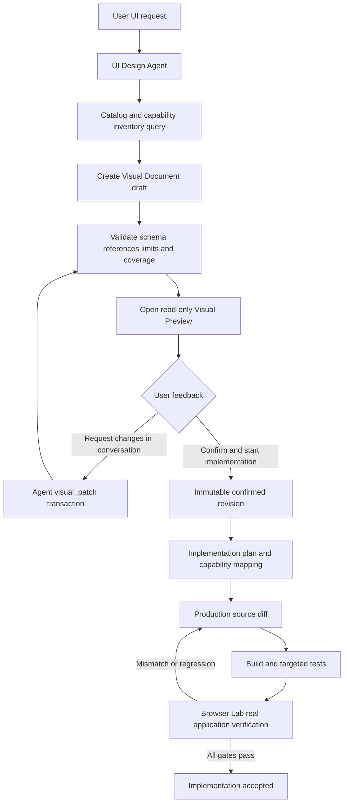
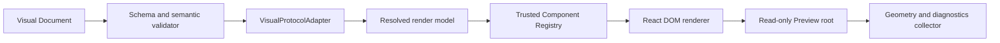

# Visual Approval Loop and Read-only Visual Preview

**Status:** normative target architecture and release contract
**Scope:** pre-implementation UI visualization, conversational design iteration, design confirmation, implementation handoff, and runtime verification
**Audience:** product engineers, Agent/runtime engineers, Dashboard engineers, security reviewers, test engineers, and maintainers
**Implementation status:** not implemented; this document does not claim that any described feature is shipped
**Deployment scope:** implementation and production deployment are outside this document's execution record; no production claim is valid until every required gate in this document has real evidence

## 1. Executive summary

Agent RunLab shall provide a **Visual Approval Loop** for substantial UI work:

1. a user describes a UI or UI change in natural language;
2. the Agent generates a lightweight, declarative **Visual Document** rather than immediately editing production React, CSS, or other application code;
3. the Dashboard opens a read-only **Visual Preview** Editor Tab and renders that document immediately;
4. the user reviews the result and gives feedback only through the Session conversation;
5. the Agent applies validated, revision-checked structural patches to the Visual Document;
6. when the user chooses **Confirm and start implementation**, the selected immutable revision becomes the visual implementation baseline;
7. the Coding Agent plans and modifies the real application without removing existing capabilities;
8. the real application is opened in **Browser Lab** and verified against the confirmed design and functional acceptance matrix.

Visual Preview is not a miniature Figma. It has no user-operated drag-and-drop, resize handles, property editor, layer editor, freehand canvas, or direct style editing. The user observes; the Agent edits through typed tools.

Visual Preview and Browser Lab are complementary:

| Surface | Input | Purpose | Timing |
|---|---|---|---|
| Visual Preview | declarative Visual IR | quickly agree on intended appearance | before production code changes |
| Browser Lab | real running application | prove visual, behavioral, accessibility, and runtime correctness | after production code changes |

The production design reuses standards and libraries only behind owned adapters:

- A2UI concepts and compatible structures form the protocol foundation;
- `json-render` is evaluated as a Web rendering implementation, not adopted as the permanent public storage contract;
- W3C Design Tokens Community Group format is used for design tokens;
- Zod validates all stored and tool-facing schemas;
- the RunLab Component Registry maps Visual components to trusted Preview Adapters and production components.

## 2. Problem statement

Today, discussing a visual redesign commonly requires one of two expensive loops:

```text
natural-language request
→ modify real source
→ build
→ run
→ capture screenshot
→ receive feedback
→ repeat
```

or:

```text
natural-language request
→ manually construct SVG or PNG
→ open image
→ receive feedback
→ regenerate image
```

The first loop contaminates production code with exploratory changes and makes every visual idea pay build and regression costs. The second is static, slow to revise, disconnected from the component system, and easy to make functionally incomplete.

The target loop must provide immediate visual feedback without making a design tool, without running arbitrary generated code, and without treating a plausible screenshot as proof that the real product works.

## 3. Product principles and invariants

### 3.1 Read-only for the user

The Visual Preview permits only view operations:

- open and close;
- zoom and fit;
- pan when the canvas exceeds the viewport;
- fullscreen;
- switch declared viewport;
- switch declared theme;
- switch declared scenario;
- switch revision;
- compare current and previous revisions;
- confirm the selected revision;
- optionally attach a read-only node reference to the Composer.

It does not permit manual design mutation. All design mutation is performed by the Agent through `visual_patch`.

### 3.2 Visual representation is not implementation representation

The Visual Document describes intended visual structure and component semantics. It is not:

- React, Vue, Flutter, SwiftUI, HTML, or CSS source;
- an executable script;
- a complete business state machine;
- a replacement for production component tests;
- proof that Workspace, Terminal, Session, or Tool behavior works.

### 3.3 Functional completeness before visual simplification

A redesign of an existing product must preserve the accepted capability inventory unless the user explicitly removes a capability.

Every Visual Document for an existing surface contains a **Functional Coverage Manifest**. Confirmation is blocked when any required capability is:

- absent;
- represented only by ambiguous prose;
- mapped to a noninteractive decoration when the real feature is interactive;
- hidden behind a new multi-step path without explicit user acceptance;
- incompatible with a required viewport or scenario.

For the Agent Workbench, the default inventory includes, where enabled by the Runtime Profile:

- Workspace and Session one-action navigation;
- Workspace Executor state;
- Session tabs and file/editor tabs;
- File Explorer and file viewing;
- Git/Source Control;
- interactive Terminal and background shells;
- conversation transcript;
- horizontal Tool Call Dot Line and detailed Tool inspection;
- Approval and Interrupted states;
- Task Graph and task status;
- model, approval mode, queue/steer, attachments, context usage, and human-attention Composer semantics;
- Inspector Trace, LLM, Tool, Runtime Status, Memory, and related existing views;
- Operations, Artifacts, Pipeline, Docs, Memo, and Evaluation navigation where capabilities permit.

Visual simplicity must come from hierarchy and progressive disclosure, not from deleting capabilities.

### 3.4 Stable identity and transactional mutation

Every mutable Visual node has a stable identifier. Patches target identifiers, never array positions or screen coordinates. A patch is atomic, revision checked, validated before commit, and either fully succeeds or leaves no mutation.

### 3.5 Confirmation is explicit and immutable

**Confirm and start implementation** means:

> This exact Visual Document revision is accepted as the visual target for implementation.

Confirmation does not authorize arbitrary source changes, bypass source diff review, deploy software, or prove runtime correctness. Confirmed revisions are immutable. Further visual changes fork a new draft.

### 3.6 Verify, not trust

No implementation may be called production-ready based only on:

- successful schema parsing;
- a component test;
- a generated PNG;
- a renderer snapshot;
- an Agent statement;
- a visual similarity score without interaction tests.

Release requires real Chromium rendering, real persistence and conflict tests, malicious-input tests, and Browser Lab verification of the implemented application.

## 4. Terminology

### 4.1 Visual IR

**Visual IR** means Visual Intermediate Representation. It is declarative JSON between natural language and production source code. It expresses intended layout, appearance, components, viewports, and scenarios at lower cost than implementing the application.

### 4.2 Visual Document

A **Visual Document** is the complete versioned design resource. It contains metadata, canvases, nodes, scenarios, token and component references, the Functional Coverage Manifest, and confirmation records.

### 4.3 Canvas

A **Canvas** is one visual surface with a root node and a reference viewport. A document may contain several canvases, for example a Workbench and a connection-details dialog.

### 4.4 Node

A **Node** is one stable Visual IR element, such as a Stack, Text, Workspace Explorer, Composer, or Button. A node ID remains stable through ordinary property and ordering changes.

### 4.5 Component Catalog

A **Component Catalog** is the schema exposed to the Agent. It describes allowed components, properties, slots, variants, events, examples, and constraints. It is the language the Agent may use.

### 4.6 Component Registry

A **Component Registry** is the trusted client mapping from catalog component IDs to renderer implementations and production bindings. The Catalog describes what is legal; the Registry provides how a legal component renders.

### 4.7 Preview Adapter

A **Preview Adapter** is a deterministic, side-effect-free representation of a complex production component. It reuses production tokens and primitives but consumes scenario data instead of real Socket, Executor, filesystem, or Terminal resources.

### 4.8 Scenario

A **Scenario** describes a named visual state such as `idle`, `running`, `approval-required`, `interrupted`, `executor-offline`, or `reconnecting`. It is a validated patch set over a base canvas, not a duplicate full page.

### 4.9 Revision

A **Revision** is an immutable successful Visual Document state. Draft mutation creates a new monotonically increasing revision.

### 4.10 Visual Patch

A **Visual Patch** is an Agent-generated transaction containing one or more stable-ID operations. It updates a Visual Document without regenerating the whole document.

### 4.11 Design confirmation

**Design confirmation** freezes one revision as the implementation baseline. UI copy uses **Confirm and start implementation**, not the administrative term “approval.”

### 4.12 Browser Lab

**Browser Lab** is the real-browser Editor Tab used after implementation. It operates the actual application, captures console/network/DOM evidence, runs interaction flows, and compares runtime output with the confirmed design.

## 5. End-to-end lifecycle



A Visual Preview can be discarded without touching production source. A confirmed design can exist without implementation. An implementation cannot claim conformance until Browser Lab gates pass.

## 6. Third-party strategy

### 6.1 A2UI

A2UI is the preferred protocol foundation because it provides declarative, non-executable UI messages, flat component identity, client-owned catalogs, streaming, actions, data binding, versioning, and multiple renderers.

RunLab shall not expose an unversioned fork of A2UI. It shall:

- pin an evaluated A2UI specification version;
- persist the pinned version in each Visual Document;
- isolate A2UI conversion behind `VisualProtocolAdapter`;
- keep RunLab revision, confirmation, coverage, scenario, and evidence fields in an owned envelope or namespaced extension;
- provide explicit migrations between supported versions;
- reject unknown incompatible major versions;
- preserve a canonical RunLab model so renderer replacement does not rewrite stored history.

A2UI is a protocol dependency, not a source of the final RunLab visual style.

### 6.2 json-render

`json-render` is the preferred candidate for the initial React renderer because it provides a flat spec, typed Catalog and Registry, progressive compilation, React rendering, code-generation utilities, and Devtools foundations.

It is not automatically accepted by this document. Adoption requires a bounded technical spike proving:

- compatibility with the pinned A2UI adapter;
- deterministic rendering for the same document, catalog, tokens, font set, and viewport;
- no arbitrary component or action execution;
- clean tree-shaking and acceptable Dashboard bundle impact;
- no requirement to expose editable Devtools to end users;
- support for error boundaries and partial-render diagnostics;
- acceptable maintenance, license, provenance, and vulnerability posture.

If it fails the spike, a small owned React renderer shall consume the same canonical model. The stored contract must not change.

### 6.3 W3C DTCG Design Tokens

Tokens use the W3C Design Tokens Community Group format. RunLab does not invent another token serialization. Token adapters may emit CSS custom properties, Tailwind values, Flutter themes, or other target-specific forms.

Visual nodes prefer semantic references such as `color.action.primary` over palette references or literal colors. Literal values are allowed only where the Catalog policy explicitly permits them and are reported by design lint.

### 6.4 Zod

Zod is already a shared project dependency and is the runtime validation implementation for:

- Visual Documents;
- Catalog definitions;
- component properties;
- scenarios;
- patch operations;
- tool inputs and outputs;
- persisted registries and migrations.

TypeScript types shall be derived from schemas or checked for schema parity; hand-maintained divergent types are prohibited.

### 6.5 Flutter

Flutter is not the canonical Visual IR. Flutter Widget trees are Dart runtime object graphs and may include closures, controllers, context, framework-specific constraints, and nonserializable values.

Flutter may be added as:

- an A2UI/Visual IR renderer;
- a production code-generation target;
- a runtime verification target.

The canonical relation is:

```text
Visual Document → Flutter adapter → Flutter widgets or generated Flutter source
```

not:

```text
Flutter Widget tree = Visual Document
```

## 7. Canonical data model

### 7.1 Document envelope

The normative conceptual schema is:

```typescript
type VisualRevisionPayload = {
  schemaVersion: '1'
  protocol: {
    name: 'a2ui'
    version: string
  }
  documentId: string
  sessionId: string
  title: string
  revision: number
  parentRevision?: number
  catalog: {
    id: string
    version: string
    contentHash: string
  }
  tokenSet: {
    id: string
    version: string
    contentHash: string
  }
  canvases: Record<string, VisualCanvas>
  nodes: Record<string, VisualNode>
  scenarios: Record<string, VisualScenario>
  coverageMappings: FunctionalCoverageMapping[]
  provenance: VisualProvenance
  createdAt: string
}

type VisualDocumentHead = {
  schemaVersion: '1'
  documentId: string
  draftRevision: number
  lifecycle: 'active' | 'superseded' | 'archived'
  latestConfirmationId?: string
  updatedAt: string
}
```

Revision payloads are immutable. Mutable head/lifecycle metadata, confirmations, and archive/supersede records are separate append-only or atomically replaced records that reference a revision; they are never embedded into the payload they attest to.

`revisionContentHash` is the SHA-256 of a versioned canonical serialization of `VisualRevisionPayload`. It excludes all confirmation records, mutable head metadata, evidence locations, and timestamps outside the revision payload. The canonicalization algorithm and version are persisted. Coverage and required-inventory hashes use the same versioned canonicalization rules over their explicitly named payloads, avoiding hash self-reference.

Identifiers are opaque and never contain local paths, user identities, hostnames, or secrets. Runtime Unit authorization is derived at access time from the authoritative Session owner; Runtime Unit identity is not trusted from Agent-provided document content.

### 7.2 Canvas

```typescript
type VisualCanvas = {
  id: string
  name: string
  rootNodeId: string
  referenceViewport: {
    width: number
    height: number
    deviceScaleFactor: number
  }
  supportedViewportIds: string[]
  supportedScenarioIds: string[]
}
```

### 7.3 Nodes

The MVP production schema supports:

- `frame`;
- `stack`;
- `grid`;
- `text`;
- `image`;
- `icon`;
- `shape` for bounded rectangles, lines, and circles;
- `component` for Catalog components;
- `slot` for explicit component composition.

It does not support arbitrary HTML, CSS text, SVG markup, JavaScript, executable expressions, custom shaders, arbitrary vector paths, or remote iframe content.

Nodes are stored in a flat map:

```typescript
type VisualNodeBase = {
  id: string
  kind: string
  name?: string
  layout?: LayoutStyle
  appearance?: AppearanceStyle
  accessibility?: VisualAccessibility
}

type ContainerNode = VisualNodeBase & {
  kind: 'frame' | 'stack' | 'grid'
  children: string[]
}
```

The flat map enables stable patches, conflict detection, cycle checks, and bounded subgraph loading.

### 7.4 Dimensions and layout

```typescript
type Dimension =
  | { kind: 'fixed'; value: number }
  | { kind: 'fill' }
  | { kind: 'hug'; min?: number; max?: number }
  | { kind: 'percent'; value: number }

type LayoutStyle = {
  width?: Dimension
  height?: Dimension
  minWidth?: number
  maxWidth?: number
  minHeight?: number
  maxHeight?: number
  padding?: EdgeInsets
  gap?: number
  alignSelf?: 'auto' | 'start' | 'center' | 'end' | 'stretch'
  overflow?: 'visible' | 'hidden' | 'auto' | 'scroll'
  position?: 'flow' | 'absolute'
  inset?: Partial<EdgeInsets>
}
```

Absolute positioning is allowed only for bounded overlays and decoration. Design lint rejects page layouts dominated by absolute positioning.

### 7.5 Appearance and typography

Appearance properties include semantic token-backed fill, stroke, radius, opacity, and shadow. Typography includes token reference and bounded overrides for family, size, weight, line height, letter spacing, alignment, maximum lines, and overflow behavior.

Fonts are referenced from the trusted font registry. A document cannot load a remote font.

### 7.6 Component nodes

```typescript
type ComponentNode = VisualNodeBase & {
  kind: 'component'
  componentRef: string
  componentVersion: string
  variant?: Record<string, string | boolean>
  props?: Record<string, JsonValue>
  slots?: Record<string, string[]>
}
```

A component reference must resolve in the pinned Catalog. Unknown components, properties, variants, slots, and actions fail validation.

### 7.7 Scenarios

```typescript
type ScenarioPatchOperation =
  | { op: 'set'; nodeId: string; path: string; value: JsonValue }
  | { op: 'set-visibility'; nodeId: string; visible: boolean }
  | { op: 'set-children'; nodeId: string; children: string[] }

type VisualScenario = {
  id: string
  name: string
  baseCanvasId: string
  runtimeState?: 'idle' | 'thinking' | 'executing_tools' | 'awaiting_approval' | 'error' | 'done'
  tags: string[]
  operations: ScenarioPatchOperation[]
}
```

Scenario operations are deliberately narrower than document patches. They cannot create scenarios, change coverage, mutate identity or lifecycle, or touch a node outside the `baseCanvasId` reachable subgraph. Scenario expansion is nonrecursive and has separate operation and evaluation budgets. Structural differences requiring new nodes belong to the immutable base revision; scenarios may only select validated existing children.

Required Workbench scenarios include at least:

- `idle`;
- `thinking`;
- `executing_tools`;
- `awaiting_approval`;
- interrupted and resumable;
- `error`;
- Workspace Executor reconnecting;
- Workspace Executor offline;
- queued messages present;
- context pressure;
- long Tool intention and output;
- large Task Graph;
- empty and loading states.

Required viewport coverage includes desktop, iPad portrait, iPad landscape, and narrow mobile. A design may intentionally specialize a scenario by viewport, but the specialization must be explicit.

### 7.8 Functional Coverage Manifest

```typescript
type FunctionalCoverageRequirement = {
  capabilityId: string
  requirement: 'required' | 'optional' | 'not-applicable'
  requiredInteractionClass?: 'navigation' | 'read' | 'write' | 'interactive-runtime'
}

type FunctionalCoverageMapping = {
  capabilityId: string
  representation:
    | { kind: 'node'; nodeId: string }
    | { kind: 'navigation'; nodeId: string; destination: string }
    | { kind: 'scenario'; scenarioId: string; nodeId: string }
    | { kind: 'omitted'; reason: string; removalDecisionId: string }
  notes?: string
}
```

The Host derives and snapshots `FunctionalCoverageRequirement[]` from the authoritative Runtime Profile, product capability registry, target surface, and explicit user requirements. The Agent cannot add, remove, or downgrade requirements; it may only propose mappings. An omission references a separate authenticated human removal decision instead of an Agent-writable Boolean. Confirmation atomically checks the requirement snapshot hash and every mapping, including required interaction class.

### 7.9 Confirmation

```typescript
type DesignConfirmation = {
  confirmationId: string
  documentId: string
  revision: number
  revisionContentHash: string
  requirementSnapshotHash: string
  coverageMappingHash: string
  confirmedCanvasIds: string[]
  confirmedScenarioIds: string[]
  confirmedViewportIds: string[]
  actorId: string
  actorRole: string
  source: 'dashboard-explicit-action'
  challengeId: string
  auditEventId: string
  confirmedAt: string
  note?: string
}
```

Confirmation is a separate append-only control-plane record. `actorId` is an opaque authenticated principal identifier, not user-provided Visual content. The Agent never holds confirmation authority. Natural-language phrases such as “this looks good” may cause the Dashboard to present a pending confirmation challenge, but only an explicit authenticated user action can consume the one-time, short-lived challenge and create the record.

## 8. Patch protocol

### 8.1 Operations

Supported operations are:

```typescript
type VisualPatchOperation =
  | { op: 'set'; nodeId: string; path: string; value: JsonValue }
  | { op: 'insert-node'; parentId: string; node: VisualNode; beforeId?: string }
  | { op: 'remove-node'; nodeId: string }
  | { op: 'move-node'; nodeId: string; parentId: string; beforeId?: string }
  | { op: 'replace-node'; nodeId: string; node: VisualNode }
  | { op: 'set-coverage-mapping'; capabilityId: string; representation: CoverageRepresentation }
  | { op: 'set-scenario'; scenarioId: string; operations: ScenarioPatchOperation[] }
```

Patch paths are allowlisted per node schema. Prototype keys, arbitrary object traversal, and mutation of identity fields are rejected. Operations are evaluated in request order against the transaction-local candidate graph. `remove-node` rejects any node still referenced by a canvas, parent, slot, scenario, or coverage mapping and never performs implicit cascade. `move-node.beforeId` must be a child of the destination parent. `replace-node` must preserve the target node ID. Callers express subtree deletion or replacement with explicit ordered operations, and final graph validation remains atomic.

### 8.2 Transaction contract

Every mutation request contains:

- `documentId`;
- `expectedRevision`;
- idempotency key;
- `_intent`;
- bounded operations;
- optional user feedback reference.

Application order is:

1. authenticate Session ownership;
2. load exact expected revision;
3. reject revision conflict before mutation;
4. validate each operation and path;
5. apply in memory;
6. validate schema, references, cycles, quotas, scenarios, tokens, components, and coverage;
7. canonicalize and hash;
8. durably write the new immutable revision;
9. atomically move the draft head;
10. publish one revision-created event.

The idempotency key is scoped to authenticated actor, operation kind, and Runtime Unit. The service stores the canonical request hash. A retry with the same key and hash returns the original result and cannot create another revision. Reusing the key with different content returns `IDEMPOTENCY_KEY_REUSED`.

### 8.3 Conflict behavior

Revision conflicts return a typed result containing the current revision and no document body unless explicitly requested. The Agent must read the new revision and rebase intentionally. Silent last-write-wins is prohibited.

## 9. Component Catalog and Registry

### 9.1 Catalog definition

Each Catalog component defines:

- stable ID and semantic version;
- description intended for Agent generation;
- Zod property schema;
- variants and allowed combinations;
- named slots and cardinality;
- allowed visual overrides;
- supported scenarios and viewports;
- accessibility obligations;
- examples and anti-examples;
- production capability mapping.

### 9.2 Registry binding

```typescript
type RegistryBinding = {
  componentRef: string
  componentVersion: string
  previewAdapter: string
  productionBindings: {
    react?: { symbol: string; module: string }
    vue?: { symbol: string; module: string }
    flutter?: { widget: string; library: string }
    swiftUI?: { view: string; module: string }
  }
  tokenDependencies: string[]
}
```

Module paths are internal registry data and are never embedded in public Visual Documents or exposed in user-visible errors.

### 9.3 Complex Preview Adapters

The initial RunLab registry requires Preview Adapters for at least:

- App Shell navigation;
- Workspace/Session Explorer;
- File Explorer and Source Control;
- Session/File tab strip;
- transcript messages;
- horizontal Tool Call Dot Line;
- Tool detail;
- Approval and Interrupted surfaces;
- Composer;
- Task Graph;
- Inspector;
- Terminal;
- connection and runtime status;
- Operations/Artifacts/Pipeline/Evaluation navigation placeholders.

Adapters must be deterministic and side-effect free. They must not:

- connect Socket.IO;
- start an Executor or shell;
- read Workspace files;
- issue arbitrary fetches;
- mutate production state;
- register global hotkeys outside the Preview root.

A Terminal Preview Adapter represents appearance and declared state only. Browser Lab verifies the real Terminal.

### 9.4 Registry evolution

Catalog and Registry versions are immutable after publication. Breaking property changes require a new major component version and a document migration. A renderer must fail with a visible diagnostic for missing bindings; it must not silently replace an unknown production component with a generic box.

## 10. Visual Preview Dashboard UX

### 10.1 Placement

Visual Preview is an Editor Tab beside Session and File tabs. It does not replace the right-side Inspector or Terminal and does not occupy a small popover.

```text
Session tab | File tab | Preview: Workbench
```

### 10.2 Controls

The toolbar contains only viewing and lifecycle controls:

- viewport selector;
- scenario selector;
- theme selector;
- Fit/100% zoom;
- fullscreen;
- revision selector;
- compare with previous;
- refresh after an Agent patch;
- Confirm and start implementation;
- close.

Controls that are not applicable are absent or disabled with an explanation. No property controls are shown.

### 10.3 Optional read-only node reference

A user may click a visible node to attach a reference such as `@composer` to the Session Composer. This action:

- does not mutate the design;
- does not show handles or a property panel;
- records document ID, revision, node ID, canvas, scenario, viewport, and a bounded local snapshot;
- is removable before sending;
- becomes invalid if the referenced revision is no longer selected, with an explicit stale marker.

This capability may be omitted from the first release if natural-language feedback is sufficient; no other design-editor capability is implied.

### 10.4 Failure states

Visual Preview has explicit states for:

- loading revision;
- unsupported schema version;
- missing Catalog/Registry version;
- validation failure;
- renderer failure isolated to one subtree;
- asset unavailable;
- stale revision after a concurrent Agent patch;
- document archived;
- confirmation blocked by incomplete coverage.

### 10.5 Shared read-only image surface

Visual Preview renders a Visual Document and is not itself an image viewer. However, every product surface that opens a raster image—including Message content, Session Artifacts, and Workspace File View—must reuse one shared read-only image canvas so that viewing behavior cannot drift between entry points.

The shared canvas provides Fit, incremental zoom, 100% actual size, reset, and two-axis pan after the rendered image exceeds the viewport. Zoom must change the scrollable layout geometry; a transform that visually enlarges an image without enlarging its scroll area is not compliant. Opening a preview starts in Fit mode and changing the image resets it to Fit. The surface provides no editing, crop, rotate, annotation, layer, or property controls.

Responsive behavior is defined by device class rather than by shrinking one desktop dialog:

- narrow mobile and narrow landscape use a safe-area-aware full-screen surface;
- iPad portrait and landscape use an immersive bounded surface with reachable controls and visible surrounding context;
- wide desktop uses a bounded large dialog rather than an unbounded browser-sized image;
- all modes reserve a stable header and control row, expose a touch target of at least 44 CSS pixels for close, and keep controls outside the panning region;
- orientation and visual-viewport changes recompute Fit without requiring the preview to close;
- long titles truncate visually but retain their accessible/full title value.

Workspace File View retains file actions in its existing header and embeds only the shared canvas. Message and Artifact images reuse both the shared canvas and the shared dialog shell. Release verification covers all three entry points with real decodable images at narrow mobile, iPad portrait, iPad landscape, and desktop viewports; component-class assertions alone are insufficient.

Raw JSON and stack traces are never the default user experience. A diagnostic ID links to bounded technical details.

## 11. Agent tools

Tools are Host/Runtime Unit tools, not Workspace Executor tools. Visual design operations do not need filesystem execution. Adding or updating these tools requires Host and Dashboard deployment, not redeployment of every Workspace Executor.

### 11.1 `visual_preview`

Purpose: create, read, list revisions, open, or close a read-only preview.

```typescript
type VisualPreviewInput = {
  _intent: string
  operation: 'create' | 'read' | 'list_revisions' | 'open' | 'close'
  documentId?: string
  revision?: number
  document?: VisualDocumentCreateInput
}
```

`_intent` is required and uses a normal schema property name. It is displayed in Tool details but never becomes document content.

Create returns document ID, revision, validation summary, coverage summary, and a typed `VisualDocumentReference`. It never returns or reuses the image-only `artifact://` URI scheme. Read responses support bounded subgraph selection to avoid returning large documents unnecessarily.

### 11.2 `visual_patch`

```typescript
type VisualPatchInput = {
  _intent: string
  documentId: string
  expectedRevision: number
  idempotencyKey: string
  operations: VisualPatchOperation[]
}
```

It returns previous and new revision, affected node IDs, validation warnings, coverage delta, and open-preview refresh status.

### 11.3 `visual_confirmation_request`

The Agent may request that the Dashboard present confirmation, but it cannot confirm a design:

```typescript
type VisualConfirmationRequestInput = {
  _intent: string
  documentId: string
  revision: number
  expectedRevisionContentHash: string
  canvasIds: string[]
  scenarioIds: string[]
  viewportIds: string[]
}
```

A successful call creates only a short-lived `pending_confirmation` challenge visible to the authenticated user. The explicit Dashboard action calls a separate CSRF-protected Host control-plane endpoint with the challenge ID, expected revision content hash, requirement snapshot hash, and selected matrix. The Host reauthorizes the principal and consumes the challenge exactly once. Agent tools cannot call this endpoint.

Confirmation fails if:

- the hash or revision is stale;
- the challenge is expired, replayed, or belongs to another principal;
- the principal lacks `visual:confirm` permission;
- validation has errors;
- required coverage is incomplete;
- required scenarios or viewports have not rendered successfully;
- the document is already superseded or archived.

Read/open, patch, confirmation request, confirmation, fork/copy, archive/delete, and export are separate server-authorized capabilities. UI visibility is not an authorization boundary.

### 11.4 Tool output and failure codes

Failures use typed codes rather than only prose:

- `VISUAL_SCHEMA_INVALID`;
- `VISUAL_REFERENCE_MISSING`;
- `VISUAL_CYCLE`;
- `VISUAL_LIMIT_EXCEEDED`;
- `VISUAL_COMPONENT_UNKNOWN`;
- `VISUAL_TOKEN_UNKNOWN`;
- `VISUAL_REVISION_CONFLICT`;
- `VISUAL_COVERAGE_INCOMPLETE`;
- `VISUAL_CONFIRMATION_STALE`;
- `VISUAL_RENDER_FAILED`;
- `VISUAL_ACCESS_DENIED`;
- `VISUAL_STORAGE_FAILED`.

Each failure declares retryability and remediation. Validation errors include bounded JSON-pointer-like locations but never secrets, local paths, or full private document content.

## 12. Persistence and artifact model

### 12.1 Dedicated Visual Document Registry

The current Session Artifact Registry is an image-only byte-copy boundary. It must remain image-only. Visual Documents require a dedicated registry and security policy rather than weakening image validation.

The Visual Document Registry owns:

- immutable revision payloads;
- mutable draft-head metadata updated atomically;
- append-only confirmation and removal-decision records;
- Catalog and token version references;
- renderer evidence metadata;
- quota reservations and usage records;
- retention and deletion integration.

The Registry payload, index/head, confirmation, quota ledger, transaction journal, and evidence manifest each carry an independent schema version.

### 12.2 Ownership

Every document is bound to one Session. Access derives the current Runtime Unit from the authoritative Session owner and enforces operation-specific permissions. Cross-Session references are rejected unless an explicit authorized copy/fork operation creates a new owned document.

Visual Documents follow Session export, retention, deletion, quota, backup, and restore contracts. Deleting a Session starts an idempotent deletion saga covering revisions, head, confirmation/removal records, assets, private evidence, quota usage, and remote objects. A failed deletion is `suspended`, never partially active, and is resumable from its durable transaction record.

### 12.3 Durability and transaction recovery

Create, patch, confirmation, evidence publication, compaction, and deletion use a durable transaction state machine:

```text
prepared → committed → finalized
              ↘ recovery-required
```

Before side effects, the Host writes a transaction record and atomically reserves worst-case quota. Local file commits require write-new, `fsync(file)`, atomic rename, and `fsync(parent directory)` where the platform supports those semantics. Head, confirmation, quota ledger, and evidence manifest updates participate in the same journaled transaction or a resumable outbox/saga with an explicit commit point. Recovery deterministically finalizes committed transactions, rolls back uncommitted reservations, discovers orphan revisions, reconciles missing evidence, and resumes deletion. It never guesses from timestamps.

Crash tests inject failure before and after every persistence step and must prove that readers observe an old complete state or a new complete state, never a mixed state. Canonical hashes are verified on read. Corrupt revisions are quarantined and reported; the last verified revision remains readable.

### 12.4 Quotas and resource governance

Limits are normative release defaults with stricter hard server maxima. The production configuration declares both values before release. Initial per-revision defaults are:

- maximum 5 MiB canonical JSON;
- maximum 5,000 nodes;
- maximum depth 64;
- maximum 20 canvases;
- maximum 50 scenarios;
- maximum 200 operations per transaction;
- maximum 256 KiB per individual text value;
- maximum 100 retained draft revisions before policy-driven compaction.

A Unit-scoped `VisualQuotaLedger` additionally limits total documents, revisions, JSON bytes, image assets, evidence bytes, concurrent validation/render/diff jobs, queued jobs, and requests per time window. Soft thresholds warn; hard limits fail before side effects while reads, export, deletion, and cleanup remain available. Validation, canonicalization, hashing, diffing, streaming input, decompression, rendering, and evidence capture have wall-clock, CPU, heap, input/output byte, and cancellation budgets. A request atomically reserves its worst-case budget before work and releases or commits it exactly once.

Tests cover concurrent quota oversubscription, patch floods, slow clients, compressed payload expansion, large Unicode, cancellation, and fairness across Units. Rejection must leave no revision, evidence, temporary object, or leaked reservation.

## 13. Renderer architecture



### 13.1 DOM first

The Web renderer uses React DOM, not Canvas, for content because DOM provides browser text layout, scrolling, accessibility semantics, selection, geometry measurement, and closer correspondence with the real React application.

SVG or Canvas may be used only for noninteractive overlays such as a compare mask. Since end users do not edit, resize handles and design canvases are absent.

### 13.2 Determinism

Given the same:

- canonical document;
- Catalog and Registry versions;
- token set;
- font set;
- viewport and device scale factor;
- theme;
- scenario;
- renderer version;

the renderer must produce equivalent semantic DOM and geometry within declared tolerances. Time, random IDs, locale, animation, network data, and unstable system fonts must not affect release snapshots.

### 13.3 Incremental updates

A patch invalidates only affected nodes and dependent ancestors. React keys use stable node IDs. The renderer must not remount the whole Preview on a one-property change.

Performance objectives on the reference production hardware class are:

- ordinary patch visible within 100 ms after the revision payload reaches the Dashboard;
- medium subtree replacement within 250 ms;
- a 1,000-node initial render interactive within 1 second;
- viewport or scenario switch within 250 ms;
- no long task over 100 ms during ordinary patching.

Objectives become release gates after a baseline is measured and documented.

### 13.4 Assets

Image nodes may reference only:

- session-bound image artifacts;
- trusted Registry assets;
- user-uploaded assets already copied through an approved artifact boundary.

Remote image URLs, data URLs above a small configured limit, SVG documents, and arbitrary HTML are rejected. Missing images render a labeled stable placeholder.

## 14. Security and trust boundaries

### 14.1 Visual IR is untrusted input

Agent-generated documents, patches, labels, and assets are untrusted even when generated by the local model. All web, tool, and stored content is treated as data, never as instructions for the Host.

### 14.2 Prohibited active content

The protocol prohibits:

- JavaScript source or expressions;
- event-handler strings;
- arbitrary HTML/CSS/SVG injection;
- URL schemes other than approved artifact references;
- remote iframe or webview nodes;
- component names not in the pinned Catalog;
- computed functions not registered by the trusted client;
- prototype keys such as `__proto__`, `prototype`, and `constructor` in patch paths or property maps.

### 14.3 Renderer containment

The Preview root has:

- an Error Boundary;
- scoped styles;
- no access to production Session mutation callbacks;
- no ambient Socket or Executor context;
- no direct network client;
- no unsafe HTML rendering;
- bounded event handling for view-only controls;
- reduced-motion enforcement in automated evidence mode.

The default production boundary is a sandboxed, credentialless iframe on a distinct Preview origin. It omits `allow-same-origin`, forms, popups, downloads, top navigation, and storage permissions; CSP defaults to `default-src 'none'; connect-src 'none'` and allows only packaged styles, fonts, and artifact bytes through explicit nonce/hash and proxy rules. The parent communicates through a versioned `postMessage` protocol that validates exact origin, schema, document/revision hash, message size, and rate. If a same-process renderer is proposed instead, it requires a separate security decision proving equivalent enforcement through build-time import allowlists, capability injection, and hostile-Adapter tests; convenience is not sufficient.

### 14.4 Authorization

Read, patch, confirm, fork, and archive operations authorize against Session and Runtime Unit ownership. Knowing a document ID is insufficient. IDs are nonenumerable, but authorization does not rely on secrecy.

### 14.5 Privacy

Visual Document text may contain user-provided product copy and therefore can be sensitive. It is not included in metrics, logs, or error reporting by default. Telemetry records only bounded labels such as schema version, node count, duration, error code, and renderer version.

Evidence has two classes. `synthetic-release` evidence is the only class permitted in release packages and public documentation. `private-diagnostic` evidence requires explicit authorization, Unit isolation, encryption at rest, least-privilege access, access audit, and a short configured TTL; it is never promoted automatically. Before persistence, screenshot, DOM, accessibility, URL, header, cookie, storage, console, and network fields pass typed redaction and body allowlists. Session/Unit deletion propagates to both classes and all remote copies. Canary-secret and cross-Unit tests prove redaction and isolation.

Public evidence and documentation must use synthetic content and must not include personal information, credentials, local paths, hostnames, container names, internal addresses, or real Session identifiers.

### 14.6 Supply chain

Before adding A2UI or `json-render` packages:

- pin exact reviewed versions through the lockfile;
- record licenses and notices;
- generate/update the SBOM;
- run vulnerability and provenance checks;
- review install scripts and transitive dependencies;
- test upgrade and rollback;
- keep the adapter boundary so the dependency can be replaced.

## 15. Design confirmation and implementation handoff

### 15.1 Confirmation readiness

The Dashboard enables **Confirm and start implementation** only when:

- schema and semantic validation pass;
- all referenced components, tokens, assets, and scenarios resolve;
- all required capabilities have valid coverage;
- required viewports and scenarios have rendered without error;
- no critical accessibility or overflow lint remains;
- the selected revision and displayed hash are current.

### 15.2 Implementation manifest

Confirmation creates an immutable implementation input:

```typescript
type ConfirmedDesignManifest = {
  confirmationId: string
  documentId: string
  revision: number
  revisionContentHash: string
  requirementSnapshotHash: string
  coverageMappingHash: string
  catalog: VersionedHash
  tokenSet: VersionedHash
  canvases: string[]
  scenarios: string[]
  viewports: string[]
  rendererBaselineIds: string[]
}
```

### 15.3 Implementation plan

Before editing source, the Coding Agent creates an implementation plan mapping:

- each major Visual node to an existing or new production component;
- every required capability to its preserved interaction path;
- scenarios to real application state sources;
- tokens to production token bindings;
- files to create or modify;
- unsupported or ambiguous mappings.

Any required capability without a production mapping blocks implementation. The Agent may not silently replace a real Terminal, File Explorer, Task Graph, or Inspector with a decorative mock.

### 15.4 Source changes

Confirmation does not directly run a deterministic Visual-IR-to-JSX transpiler for the full product. Primitive layout and registered components may use deterministic generators, but business behavior is implemented against the existing architecture by the Coding Agent.

Source mutation follows normal safeguards:

- inspect before edit;
- preserve unrelated changes;
- show focused diff;
- typecheck and test;
- do not deploy without the separate deployment policy;
- keep implementation changes traceable to the confirmed manifest.

## 16. Visual and functional conformance

### 16.1 Shared semantics

Visual Preview and production implementation maximize consistency by sharing:

- DTCG token source;
- icon registry;
- font assets;
- component variant definitions;
- stable semantic node-to-component bindings;
- viewport and scenario definitions.

Complex Preview Adapters may not claim pixel identity with production components. Their conformance class is recorded as:

- `exact`: same production primitive or component is safely reusable;
- `adapter`: deterministic visual adapter with shared tokens;
- `placeholder`: appearance-only representation that requires stronger runtime verification.

### 16.2 Runtime node mapping

During verification builds, important production DOM elements expose a nonsecret visual binding identifier, for example a `data-visual-node-id` attribute or an equivalent test manifest. Production release policy decides whether to strip these attributes.

### 16.3 Conformance layers

1. **Token conformance:** semantic colors, typography, spacing, radius, and component variants match.
2. **Structural conformance:** required regions and capabilities exist with accepted navigation depth.
3. **Geometry conformance:** key element bounds, padding, gap, alignment, clipping, and overflow are compared.
4. **Perceptual conformance:** screenshots are compared with documented masks and thresholds.
5. **Behavioral conformance:** real interactions and state transitions succeed.
6. **Accessibility conformance:** roles, names, focus, keyboard interaction, contrast, and reduced motion pass.

Pixel identity alone is neither required across frameworks nor sufficient for acceptance.

## 17. Browser Lab handoff

Browser Lab is a separate production feature and verification surface. Visual Preview integration requires a stable handoff contract even if Browser Lab is implemented independently.

The handoff identifies:

- confirmed manifest;
- target Workspace and application URL without persisting private URLs in public evidence;
- viewport/scenario matrix;
- required user flows;
- node mapping manifest;
- visual baselines;
- expected functional coverage;
- trace and evidence destination.

Agent-opened browser sessions default to isolated ephemeral storage. A user-authenticated browser is inaccessible until the user explicitly shares it; sharing is visible and revocable.

## 18. Testing strategy

Implementation is not commercial-grade until all layers below pass. Test counts are not hard-coded in the long-term contract; required behaviors are.

### 18.1 Schema and validator tests

Test:

- every node and dimension variant;
- unknown fields and incompatible versions;
- missing root and child references;
- duplicate IDs;
- self and multi-node cycles;
- invalid tokens, components, variants, props, slots, and assets;
- invalid scenario patches;
- depth, size, text, canvas, scenario, and operation limits;
- forbidden active content and prototype-pollution paths;
- canonical serialization and stable hashing;
- TypeScript/schema parity.

Use property-based generation for valid and invalid graphs. Random documents must never crash the validator or renderer process.

### 18.2 Patch transaction tests

Test:

- each operation happy path;
- multi-operation atomicity;
- expected-revision conflicts;
- idempotent retries;
- insert/move/remove reference integrity;
- delete of referenced nodes;
- concurrent patch serialization;
- failed validation leaves head and revision count unchanged;
- scenario and coverage updates;
- crash between payload write and head update;
- restart recovery and corrupt-head fallback.

### 18.3 Catalog and Registry contract tests

For every registered component:

- Catalog schema accepts valid examples and rejects invalid ones;
- Preview Adapter exists for each supported renderer;
- required slots and accessibility semantics are enforced;
- Registry version matches Catalog version;
- production binding exists for each required implementation target;
- missing binding fails visibly;
- examples render without console or page error.

### 18.4 Renderer component tests

Test:

- exact structure and accessible roles for primitives;
- token resolution and theme switching;
- fixed/fill/hug/percent sizing;
- Stack/Grid alignment and overflow;
- stable keys and bounded rerenders;
- scenario and viewport switching;
- partial subtree error boundary;
- missing asset placeholder;
- reduced motion;
- read-only behavior: no mutation controls or editable content appear.

Snapshot tests support diagnosis but are not release proof.

### 18.5 Storage and API integration tests

Use real temporary storage and an actual Host HTTP/socket boundary. Verify:

- authorization and cross-Session denial;
- immutable reads by revision;
- draft-head consistency;
- atomic confirm;
- export, retention, deletion, backup, and restore;
- quota enforcement;
- ETag/hash behavior;
- migration from every supported schema version;
- malformed/truncated registry recovery;
- no local path or secret in responses and logs.

### 18.6 Real Chromium Visual Preview acceptance

Run a real built Dashboard and Host through the normative Product E2E Harness, or produce a `report.json` with exactly equivalent evidence fields and failure policy. Do not use JSDOM as final proof. Each scenario uses temporary identities, isolated browser contexts and data roots, a unique evidence directory, and registered cleanup. The report records the visible user action, HTTP/Socket effect, backend or filesystem side effect, persistence/reload proof, explicit failure/retry path, final state, and cleanup outcome. Unexpected HTTP `4xx/5xx`, console/page error, missing persistence, unverified final state, or failed cleanup fails the scenario.

For each required viewport, theme, and scenario:

- create a document through the real Agent tool or authoritative test client;
- open the Preview Editor Tab through visible UI;
- wait for the exact revision and renderer version;
- verify dimensions and selected scenario;
- assert no unexpected horizontal overflow or clipped controls;
- exercise zoom, fit, fullscreen, revision, compare, and close;
- verify Session navigation, File Explorer, Terminal entry, and Connection Status outside the Preview remain responsive while a large preview streams or patches;
- collect console errors, page errors, failed requests, screenshots, geometry, and accessibility results;
- verify confirmation is blocked for incomplete coverage and succeeds only for a valid current revision;
- reload the browser and prove the same revision is restored.

Required iPad evidence includes portrait and landscape rotation, touch interaction, scrollability, and no dependence on hover.

### 18.7 Functional coverage regression

Use a synthetic full Workbench inventory. Deliberately remove each required capability and prove confirmation fails with the matching capability ID. Deliberately map a capability to a decorative placeholder and prove policy rejects it when an interactive production binding is required.

This gate exists specifically to prevent visually clean but functionally incomplete designs.

### 18.8 Security tests

Test hostile documents and patches containing:

- script tags and handler strings;
- CSS and URL injection attempts;
- `javascript:` and unauthorized network URLs;
- SVG active content;
- oversized or recursive graphs;
- deeply nested text and Unicode edge cases;
- prototype-pollution keys;
- forged Session/document ownership;
- stale confirmation hashes;
- Catalog downgrade and unknown version attacks;
- asset references from another Session;
- renderer exceptions and resource exhaustion.

Verify no Dashboard credentials, cookies, local storage, Host filesystem paths, or Session data cross the Preview boundary.

### 18.9 Performance and soak tests

Measure:

- initial render at 100, 1,000, and maximum supported nodes;
- patch latency for property, subtree, and scenario changes;
- memory after 1,000 patch/revision switches;
- repeated open/close leak behavior;
- CPU during streamed generation;
- Session shell responsiveness under simultaneous Tool streaming and Preview updates;
- storage growth and revision retention;
- 8-hour idle/open Preview stability.

Performance evidence includes p50, p95, and p99 distributions with declared sample count, concurrency, cold/warm-cache state, exact browser, OS, and reference hardware profile. Budgets cover end-to-end create, patch, confirmation, and first-interactive latency from accepted request—not only Dashboard render time—and are frozen before the first production release.

### 18.10 Implementation conformance acceptance

After real source implementation, Browser Lab runs the confirmed matrix. Required Workbench flows include:

- one-action Workspace and Session switching while another Session is running;
- File Explorer navigation and file open;
- Git/Source Control open and changed-file representation;
- Terminal open, input, output, resize, and reconnect;
- Tool Dot hover, click, locked detail scroll, and no geometric jitter;
- Approval allow/deny;
- Interrupted state and recovery action;
- Task Graph Graph/List switching, complex topology, and iPad portrait layout;
- Queue/Steer and cancel;
- model and approval configuration;
- context and attention indicators;
- Connection Status interaction during token/tool floods;
- Operations, Artifacts, Pipeline, Docs, Memo, and Evaluation navigation according to capabilities.

A screenshot of the Visual Preview cannot satisfy these tests.

## 19. Release gates and evidence

### 19.1 Mandatory gates

A release is blocked unless all are true:

- schema, property, migration, and patch suites pass;
- all Catalog/Registry bindings pass contract tests;
- real persistence crash/restart tests pass;
- real Chromium Preview matrix passes;
- security corpus and authorization tests pass;
- performance budgets pass on declared hardware;
- functional coverage negative tests pass;
- implementation Browser Lab matrix passes for any production UI claim;
- typecheck, lint, focused tests, full relevant package tests, and release build pass;
- dependency license, SBOM, vulnerability, and provenance review is complete;
- documentation matches the implemented schema and tool descriptors.

### 19.2 Evidence package

Each release candidate stores a privacy-safe, versioned, hash-addressed evidence manifest containing:

- source commit, dirty-state flag, release identifier, build digest, and dependency-lock digest;
- schema, Catalog, token, adapter, and renderer versions;
- exact browser, OS, hardware profile, test seed, start/end time, runner identity class, and automatic/manual marker;
- test command and exit status manifest;
- per-evidence-file SHA-256 and cleanup outcome;
- viewport/scenario result matrix;
- synthetic screenshots;
- geometry and overflow reports;
- accessibility report;
- console/page/network error report;
- patch conflict and crash-recovery report;
- security corpus summary;
- performance percentiles;
- Browser Lab trace references;
- known limitations, if any.

Evidence uses synthetic names and content. It contains no private URLs, paths, hostnames, addresses, container names, credentials, or real Session data.

### 19.3 Claim language

Before implementation, documentation says **designed** or **planned**.
After component tests only, it says **component-tested**.
After real Chromium Preview acceptance, it may say **Visual Preview verified**.
Only after implementation conformance and Browser Lab gates may it say **production UI verified**.

## 20. Observability and operations

Metrics are bounded and do not contain document text or node IDs:

- create/patch/confirm request counts by result code;
- validation duration and error category;
- revision size and node-count buckets;
- renderer duration and failure category;
- confirmation blocked reason category;
- storage corruption/recovery count;
- Preview open duration bucket;
- Browser Lab conformance result category.

Structured logs use diagnostic IDs and redacted metadata. Alerts cover sustained storage failures, hash corruption, migration failures, elevated renderer crashes, and authorization denials.

Visual Preview failure must not crash or block the Session, Explorer, Composer, Terminal, or Runtime Unit. The user can close a broken Preview and continue the Session.

## 21. Accessibility and responsive behavior

Visual Preview itself must meet WCAG 2.2 AA for applicable criteria, be keyboard navigable, and be screen-reader understandable. View controls have names and state. The rendered document exposes semantics declared by the Catalog and Visual IR.

Automated accessibility checks are necessary but insufficient. Release evidence includes critical-flow checks with supported screen-reader/browser pairs, keyboard-only operation, focus restoration, 200% and 400% zoom/reflow, forced colors/high contrast, reduced motion, RTL, long localized text, and touch targets. Any applicable A/AA failure, keyboard trap, unnamed control, or lost focus blocks confirmation and release unless a time-bounded, owner-assigned exception is explicitly recorded.

A visual document cannot be confirmed when critical interactive nodes lack required accessible names or when the Preview reports critical contrast, focus-order, clipping, or touch-target failures.

Responsive design is scenario data plus constraints, not a scaled desktop screenshot. Narrow layouts may reflow or move auxiliary panes to explicit destinations, but may not silently remove required capabilities.

## 22. Rollout and compatibility

Implementation may be developed in internal phases, but no partial phase is advertised as production-complete:

1. dependency spike and canonical schema;
2. registry, persistence, tools, and renderer;
3. read-only Dashboard Preview and confirmation;
4. full security, durability, performance, and Chromium acceptance;
5. implementation handoff and Browser Lab conformance.

Feature exposure is capability gated. Unsupported clients ignore only explicitly optional envelope fields; they do not attempt to render unknown document versions. Host and Dashboard must be protocol compatible during rolling restart. Workspace Executors need no redeployment solely for Visual Preview tools.

Payload, index/head, confirmation, quota, transaction, and evidence migrations are backup-first, restart-safe, idempotent, and Unit-scoped: quiesce affected writes, create and verify a complete manifest/hash/count/permission backup, migrate into a new location, validate every reference, then atomically switch. Unknown or newer schemas make the affected capability unready and read-only where safe; no older binary may rewrite them. Catalog or token versions missing after restore produce an explicit degraded read state, never silent substitution.

Every release publishes an N/N-1 read/write compatibility matrix for Host, Dashboard, Visual schemas, Catalog, tokens, and renderer. Migrations use expand/contract and prohibit irreversible contraction during the rollback window. Rollback tests first create, patch, and confirm data on N, then run N-1 to prove the Session remains usable, unknown data is not corrupted, and forward recovery succeeds. Canary scope, stop thresholds, rollback authority, maximum rollback time, and post-rollback health/data verification are recorded before release.

## 23. Explicit non-goals

This system is not:

- a Figma, Penpot, or design-tool replacement;
- a user-editable canvas;
- a general arbitrary-code sandbox;
- a promise of automatic cross-framework pixel identity;
- a substitute for Browser Lab;
- a substitute for component, integration, E2E, or accessibility tests;
- a mechanism to deploy confirmed designs automatically;
- a reason to remove existing product capabilities for visual simplicity.

## 24. Implementation deliverables

The implementation is complete only when the repository contains and verifies:

- canonical shared Zod schemas and migrations;
- `VisualProtocolAdapter` with pinned protocol compatibility tests;
- Component Catalog and trusted Registry;
- required RunLab Preview Adapters;
- dedicated Visual Document Registry with atomic immutable revisions;
- `visual_preview`, `visual_patch`, and `visual_confirmation_request` tools with required `_intent`, plus the independent authenticated confirmation control plane;
- Visual Preview Editor Tab and view-only toolbar;
- confirmation and implementation manifest flow;
- Functional Coverage Manifest and blocking validator;
- privacy-safe evidence generation;
- complete test layers and real Chromium matrix described above;
- Browser Lab handoff contract and at least one real end-to-end implementation conformance proof;
- public documentation and dependency notices.

Anything less is an internal prototype and must be labeled as such.

## 25. References

The design is informed by, but does not delegate RunLab product correctness to:

- A2UI protocol and renderer ecosystem: <https://a2ui.org/>
- Google A2UI overview: <https://developers.googleblog.com/a2ui-v0-9-generative-ui/>
- Vercel `json-render`: <https://json-render.dev/>
- W3C Design Tokens Community Group: <https://www.w3.org/community/design-tokens/>
- Flutter architecture: <https://docs.flutter.dev/resources/architectural-overview>
- VS Code integrated browser: <https://code.visualstudio.com/docs/debugtest/integrated-browser>
- Playwright Trace Viewer: <https://playwright.dev/docs/trace-viewer>
- Storybook interaction testing: <https://storybook.js.org/docs/writing-tests/interaction-testing>

External documents are references, not executable instructions or normative overrides. Pinned dependency versions and implemented behavior must be verified against their actual source and release artifacts during implementation.
