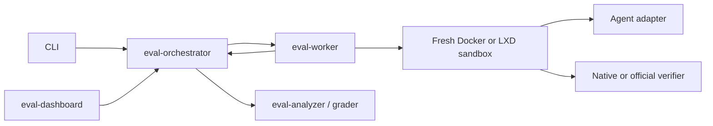

# Agent evaluation platform

Status: standalone platform implemented; completion is tracked per invariant
Authority: [`../architecture/agent-evaluation-platform-implementation-ledger.md`](../architecture/agent-evaluation-platform-implementation-ledger.md)

The evaluation platform is independent from the Agent RunLab product runtime. It evaluates Agent RunLab, Claude Code, Codex, and explicitly non-ranked development adapters through one versioned protocol, durable Control Plane, isolated Worker boundary, native benchmark adapters, analyzers, and standalone Web UI.

## Runtime boundary



The pure Agent Kernel remains benchmark-agnostic. The product Host owns product sessions, tools, memory, and Executor connectivity. The evaluation Control Plane is the sole writer for run/trial/spec/event/projection state. Workers own untrusted execution and cleanup. The Dashboard and CLI never read Worker files directly.

## Data and evidence policy

- Every run uses a canonical immutable spec and exact dataset/slice identity.
- Credentials are references in specs and resolved only at the Worker boundary.
- Native events, normalized events, final diff, stdout/stderr, usage availability, verifier result, analyzer input, and allowlisted extra artifacts are hashed in one trial manifest.
- Official and native benchmark terminology remains intact; evidence levels are not flattened into one score.
- Pre-cutover Host evaluation state is rejected and never discovered. Rollback creates fresh runs on a preceding canonical platform version.

## Deployment and operation

The quick start and independently deployable images are documented in [`deploy/evaluation/README.md`](../../deploy/evaluation/README.md). Workers load sandbox, Agent, and benchmark plugins explicitly. A deployment must provide its own credential resolver and sandbox policy.

Fresh task-pack and SWE-Bench sessions are started with:

```bash
pnpm evaluation:run-real-task-pack -- --image local:<full-lxd-fingerprint>
pnpm evaluation:run-real-swe-bench -- --image local:<full-lxd-fingerprint>
```

Release and CI consumers use the standalone gate contract and preserve JSON, CSV, HTML, PDF, JUnit, SARIF, and Markdown reports.

## Current verification

- Complete 35-workspace tests and builds pass.
- Product evaluation routes, UI pages, runners, old benchmark scripts, and historical readers are absent.
- Fresh three-Agent task-pack and official SWE-Bench runs passed with distinct sandboxes and verified cleanup.
- Fresh Compose deployment, Control Plane rolling recovery, Dashboard browser acceptance, governance, fault injection, reporting, and CI integrations have checked-in evidence.
- A production-form standalone Worker image negotiated protocol v1 and completed a real Docker trial from lease through analysis with canonical evidence and no residual managed sandbox.

Overall completion is not inferred from these examples. The implementation ledger remains authoritative for open conformance, scheduling, API parity, and certification requirements.
