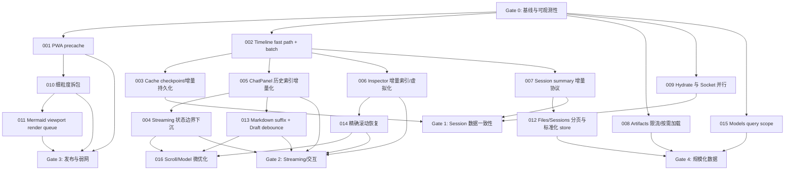

# Dashboard 前端性能与渲染问题闭环报告

> 审计范围：`packages/dashboard`。
> 审计方式：源码扫描、生产构建、现有组件与性能测试。
> 已执行：`pnpm --dir packages/dashboard build`；ChatPanel、VirtualTranscript、Transcript performance 测试共 89/89 通过。
> 限制：尚未执行真实移动设备、CPU 限速、弱网和浏览器 React Profiler 采样。文中的性能影响是基于代码路径与构建产物确认的问题，修复前后数值必须按每项“验证方式”补测。

## 结论与优先顺序

| ID | 优先级 | 问题 | 主要场景 |
|---|---|---|---|
| FE-PERF-001 | P0 | PWA 预缓存全部异步资源，当前达到 15.8 MiB | PWA 首装、更新、弱网 |
| FE-PERF-002 | P1 | Timeline 单事件追加重复复制和排序完整历史 | 长会话、工具密集任务 |
| FE-PERF-003 | P1 | Session cache 高频序列化并重写完整快照 | Streaming、长会话、移动端 |
| FE-PERF-004 | P1 | Streaming 更新穿过大型 App 与静态子树 | 长回复、边输入边生成 |
| FE-PERF-005 | P1 | ChatPanel 每帧重复扫描完整历史 | 长对话、工具调用密集 |
| FE-PERF-006 | P1 | Inspector 提前计算所有视图且列表未虚拟化 | 调试长任务 |
| FE-PERF-007 | P1 | Control plane 放大全局实时事件更新 | 多 Session 并发 |
| FE-PERF-008 | P1 | Artifacts 无界并发读取且长列表未虚拟化 | 大型 Eval、Artifact 仓库 |
| FE-PERF-009 | P2 | Cache hydration 最多阻塞 Socket 建连 250ms | 冷启动、切换 Session |
| FE-PERF-010 | P2 | 主包和功能包拆分粒度不足 | 冷启动、Files、Settings |
| FE-PERF-011 | P2 | Mermaid 离屏图表也会立即渲染 | 含多个图表的长会话 |
| FE-PERF-012 | P2 | 大目录和多 Session 搜索缺少分页与增量索引 | 大 Workspace、多 Session |
| FE-PERF-013 | P2 | Streaming Markdown 重扫全文，草稿每键同步写存储 | 长回复、边生成边输入 |
| FE-PERF-014 | P2 | Session 切换只恢复 pinned 状态，不恢复阅读位置 | 长对话交叉阅读 |
| FE-PERF-015 | P2 | Models Query 未按 Host/身份隔离且错误被缓存为空结果 | Host/账号切换、瞬时错误 |
| FE-PERF-016 | P3 | 滚动与模型查找存在低优先级同步开销 | 高频滚动、频繁 Composer render |

---

## FE-PERF-001：PWA 首装和更新预缓存 15.8 MiB 非必要资源

### 问题描述

`packages/dashboard/vite.config.ts` 使用 `globPatterns: ['**/*.{js,css,html,svg,png,woff2,webmanifest}']`，会把生产目录下几乎所有 JS/CSS 纳入 Workbox precache。动态 import 虽然避免这些模块在首屏执行，却无法阻止 Service Worker 在安装或更新时下载它们。

本次生产构建确认：

- precache：**414 entries / 15,792.12 KiB**；
- 包含全部或大量 Shiki language/theme chunk；
- 包含 Mermaid core、图类型和布局引擎；
- 包含 Monaco/Files、Settings 及其他非首屏页面；
- 用户未使用上述功能时仍会产生下载和 Cache Storage 写入。

这会直接影响 PWA 首装、版本更新、移动网络流量、低存储设备以及新 Service Worker 激活速度。

### 复现方式

1. 在仓库根目录执行：

   ```bash
   pnpm --dir packages/dashboard build
   ```

2. 查看构建末尾 `PWA injectManifest` 输出。
3. 当前结果应显示约 `precache 414 entries (15792.12 KiB)`。
4. 打开 `packages/dashboard/dist/sw.js`，搜索 `mermaid.core`、Shiki 语言 chunk 或 `SessionFilesPanel`，可以确认它们进入 precache manifest。
5. 浏览器中清空站点数据，使用 DevTools Network 的 Fast 3G，重新打开并安装 PWA；在 Application → Cache Storage 中观察安装阶段写入的资源数量和体积。

### 修复方案

1. 将 precache 白名单缩小为应用 shell：`index.html`、入口 JS/CSS、manifest、图标和真正首屏必需资源。
2. 从 precache 排除：
   - Shiki languages/themes；
   - Mermaid core/diagram/layout；
   - Monaco、XTerm；
   - Benchmark、Artifacts、Settings 等异步页面 chunk。
3. 对异步 chunk 配置 runtime cache：
   - immutable hash asset 使用 `CacheFirst`；
   - 设置最大条目数和过期时间；
   - 不预先下载，仅在用户首次使用后缓存。
4. 添加构建脚本解析 Workbox manifest，并在 CI 中限制 precache 文件数和总字节。

### 回归风险与预防

- **离线启动失败**：如果误排除入口 chunk、CSS、图标或字体，已安装 PWA 在离线状态可能白屏。预防方式是维护明确的 shell allowlist，并在 CI 中执行首次在线安装后离线重启测试。
- **按需资源无法命中缓存**：runtime route 配置错误可能导致 Mermaid、Monaco 等每次重新下载。应按带 hash 的静态资源 URL 匹配，并测试首次使用与二次离线使用。
- **旧 Service Worker 缓存污染**：缓存策略变更后旧 cache 可能长期占空间。升级时使用版本化 cache name 和受控 cleanup，不使用会中断当前页面的强制 `skipWaiting`。
- **回滚信号**：离线 shell 启动失败率、动态 chunk 加载错误率或 SW install failure 明显上升时，立即恢复上一版 manifest 策略。

### 验证方式

1. 重新执行生产构建，记录修复前后的 entries 和 KiB。
2. 验收标准：
   - precache 不再包含 Mermaid、Shiki language/theme、Monaco、XTerm 和非核心页面；
   - precache 总体积降至团队设定预算，建议首期目标不超过 2–3 MiB；
   - PWA 离线刷新仍能显示 shell 和明确的离线状态。
3. 使用 DevTools Offline 验证 shell 可启动；恢复网络后首次打开 Mermaid/Files，验证资源可按需加载并进入 runtime cache。
4. 增加 CI 测试，资源数或总大小超预算时失败。

---

## FE-PERF-002：Timeline 顺序追加仍重复复制和排序完整历史

### 问题描述

`session-projection.ts` 在每个 `appended` event 中调用 `mergeBySeq(current.timeline, [entry])`。`mergeBySeq` 每次都会：

1. 遍历旧 Timeline 并构建完整 `Map`；
2. 合并新增事件；
3. 将 Map 转回数组；
4. 对完整数组排序。

`session.ts` 虽然把高频 projection event 缓冲到 animation frame，但 flush 时仍然逐条 `dispatchProjection`，所以一帧内的多个顺序事件依旧重复执行完整合并。

对于正常严格递增的 seq，这些工作没有必要。累计成本近似：

$$
\sum_{i=1}^{n} O(i \log i) = O(n^2 \log n)
$$

长会话、工具密集任务和断线补事件时会放大 CPU、GC 和 React 更新成本。

### 复现方式

1. 创建包含 10,000 条 Timeline 的测试状态。
2. 以单条 `appended` action 顺序追加 1,000 条事件，并使用 `performance.now()` 记录：
   - 每次 reducer 耗时；
   - 总耗时；
   - P95 单次耗时。
3. 对比一次性 `mergeBySeq(previous, 1000 entries)` 或直接顺序 concat。
4. 浏览器场景：运行会产生大量工具调用的任务，打开 Performance 面板录制，搜索 `mergeBySeq` 所在调用栈并观察长任务和 Array/Map 分配。
5. 当前 `transcript-performance.test.ts` 只验证 transcript projection，不会覆盖该 reducer 热点，因此现有测试通过不代表此问题不存在。

### 修复方案

1. 在 `mergeBySeq` 增加顺序追加快速路径：当 `add[0].seq > prev[last].seq` 且 add 内部严格递增时直接 concat。
2. 为同 seq 补充信息、乱序和冲突保留现有 Map+sort 慢路径。
3. 为 projection reducer 增加 batch action，一帧只 dispatch 一次并一次性归并队列。
4. 保持事件顺序、重复 seq 合并和 first-durable-entry 语义不变。

### 回归风险与预防

- **乱序或重复事件处理错误**：过度使用 concat 可能让 reconnect history、重复 seq 或补充 artifact 字段丢失。Fast path 必须验证严格递增；其余情况无条件回到现有 authoritative merge。
- **批处理改变状态机顺序**：一帧内合并 action 不能改变 event/state/ready/history 的先后语义。Batch reducer 必须按原队列顺序逐事件执行 state transition，只优化 timeline 容器合并。
- **引用稳定性假设被破坏**：消费者可能依赖 timeline 新引用触发更新。每个实际追加 batch 仍应产生新数组，空 batch 才复用旧引用。
- **回滚信号**：projection property tests、历史重放 hash、cursor 或 timeline 长度出现差异时禁用 fast path feature flag。

### 验证方式

1. 单元测试覆盖：
   - 单条严格递增追加；
   - 批量严格递增追加；
   - 乱序历史；
   - 重复 seq 信息补全；
   - 冲突事件不覆盖既有 durable event。
2. 增加 10k + 1k 性能测试，并分别记录 fast path 与 slow path。
3. 验收标准：顺序追加路径不创建完整 Map、不执行全量 sort；10k 历史上的一帧批量追加不产生超过 16ms 的主线程任务，目标 P95 为 8–12ms 内。
4. 运行完整 session projection/property tests，确认事件顺序和状态重放一致。

---

## FE-PERF-003：Session cache 在高频 Projection 更新时序列化并重写完整快照

### 问题描述

`session.ts` 的 cache effect 依赖整个 `projection`。只要 Streaming、状态或 Timeline 更新，就调用 `cache.set` 并传入完整 state 和 timeline。

后续路径还包含：

- `session-view-cache.ts` 对引用变化的完整对象执行 `JSON.stringify` 估算大小；
- Durable cache 将完整 entry 写入 IndexedDB；
- 写入后执行容量维护，可能读取并排序 namespace 下的缓存记录。

虽然后台任务会取消同 Session 的旧 pending write，但主线程上的 cache.set、大小估算和最终 structured clone 仍然与完整 Session 大小相关。长会话持续更新时会产生高 CPU、GC、IndexedDB I/O 和移动端耗电。

### 复现方式

1. 准备 10,000 条 Timeline 的 Session，并开启 durable cache。
2. 连续追加 500–1,000 条事件或生成长 Streaming 回复。
3. DevTools Performance 中录制 Main、IndexedDB 和 GC；观察 `JSON.stringify`、structured clone、IDB transaction 和后台 task。
4. 在 Application → IndexedDB 中确认同一个 Session entry 被重复整条写入。
5. 对比关闭 durable cache 后的主线程时间和 GC 次数。

### 修复方案

1. 将持久化从“每次 Projection 更新”改为 checkpoint：
   - 1–5 秒节流；
   - turn 完成；
   - Session 切换；
   - `visibilitychange` 到 hidden；
   - 页面卸载前 best effort flush。
2. 将 Timeline 与 Session metadata 分离，按事件或分页增量持久化。
3. 增量维护 estimated bytes，不对完整 Timeline 高频 stringify。
4. 使用累计 namespace bytes 和 LRU metadata，避免每次写入后全表扫描。
5. 保留 generation、cursor 防倒退、删除和禁用缓存时取消 pending write 的现有保护。

### 回归风险与预防

- **缓存新鲜度下降**：节流可能让崩溃或系统杀进程后丢失最近几秒视图。必须在 turn terminal、Session 切换、pagehide/hidden 时同步或 best-effort flush。
- **增量记录不完整**：metadata 与 timeline 分表后可能出现 cursor 已更新但事件未提交。使用同一 IndexedDB transaction 或两阶段 commit marker，hydrate 时只读取完整 checkpoint。
- **存储迁移失败**：schema 升级可能让旧缓存不可读。增加 schema version、迁移测试和失败时安全清空缓存；缓存失败不得阻塞 live Session。
- **回滚信号**：hydrate failure、cursor rollback、缓存恢复缺事件或 IndexedDB quota error 上升时退回整快照 checkpoint。

### 验证方式

1. 增加 fake-indexeddb 测试，统计 500 次 projection 更新对应的实际 durable writes；应由数百次降为受节流控制的少量 checkpoint。
2. 验证 Session 切换、页面隐藏、turn 完成会强制写入最新 cursor。
3. 验证旧 generation 和低 cursor 写入不会覆盖新缓存。
4. 使用 10k Timeline Profile 对比修复前后 stringify 时间、GC、IDB transaction 数和总写入字节。
5. 验收标准：Streaming 期间不再每帧完整序列化和落盘；刷新后仍能恢复最近一次明确 checkpoint。

---

## FE-PERF-004：Streaming 文本更新导致大型 App 和静态区域重复 Render

### 问题描述

`useSession` 在 `App` 顶层提供 `streamingText`。文本 reveal 提交时，约 2,900 行的 `App` 函数组件会重新执行，位于同一 owner 下的 Toolbar、Composer、Inspector、dialogs 和其他派生逻辑也会参与 reconciliation。

Explorer 已有 memo/runtime store 隔离，但 Composer、Inspector 和部分静态区域没有形成同等强度的更新边界。纯文本尾部变化不应该让无关区域持续 render。

### 复现方式

1. 使用 React DevTools Profiler，开启“记录组件 render 原因”。
2. 打开一个 Session，同时显示 Composer 和 Inspector。
3. 触发持续 30–60 秒的纯文本 Streaming，不操作其他 UI。
4. 查看每次 commit 中 `App`、Toolbar、Composer、Inspector 和 dialogs 的 render 次数与耗时。
5. 在 Streaming 期间快速输入 Composer，使用 Performance 面板观察 input event 延迟和长任务。

### 修复方案

1. 将 Streaming live tail 下沉到独立状态消费边界，使顶层 App 只消费稳定 Session 元数据。
2. 将 workspace 拆为 Transcript、Composer、Inspector 三个明确的订阅边界。
3. 对 Composer、Inspector 和静态工具栏增加可靠的 memo；先稳定 props/callback，再添加 memo，避免无效优化。
4. 模块级复用空数组/空对象，memoize pending call IDs、status map 和其他语义不变数据。
5. 不改变现有 rAF reveal 和用户滚动行为。

### 回归风险与预防

- **状态不同步**：拆分订阅边界后 Composer、Toolbar 或 Inspector 可能读取不同 render 时刻的数据。定义单一 Session store snapshot，并使用 `useSyncExternalStore` 或等价一致性机制。
- **闭包使用旧 Session**：稳定 callback 可能捕获旧 sessionId/socket。事件 handler 使用明确依赖或最新 ref，并增加切换中发送/取消测试。
- **Memo 隐藏必要更新**：自定义 comparator 漏字段会产生陈旧 UI。优先缩小 props，再使用浅比较；禁止用不完整 comparator 跳过业务状态。
- **回滚信号**：Streaming 状态、审批按钮、模型选择或 Composer 可用状态出现跨区域不一致时关闭新边界。

### 验证方式

1. 用同一个固定 Streaming fixture 分别录制修复前后 React Profiler。
2. 验收标准：纯文本 frame 中 Toolbar、Composer、Inspector 等静态区域不再发生无关 render，或 commit 时间显著低于既定预算。
3. Streaming 期间持续输入，验证输入无丢字、光标跳动，INP P75 目标小于 200ms。
4. 运行 ChatPanel、Composer、Inspector 和 Session 切换测试，确认行为不变。

---

## FE-PERF-005：ChatPanel 每个 Streaming Frame 重建完整消息和工具索引

### 问题描述

`ChatPanel.tsx` 在 render 中对完整 transcript 执行多轮 filter/map/遍历，构建：

- tool name/result map；
- all messages；
- tool activity groups；
- approval map；
- message index mapping；
- hidden header 等派生信息。

Streaming 时通常只变化最后一个 assistant tail，但 `chatItems` identity 和多个 Set/Map/callback 也会变化，导致完整历史派生和可见虚拟行重复 reconciliation。Virtuoso 只限制 DOM 数量，不会自动消除父组件的全量计算。

### 复现方式

1. 准备包含 5,000 条消息、500 组 tool call/result 的 Session fixture。
2. 保持历史不变，只每 66ms 更新最后一条 Streaming 文本。
3. 使用 React Profiler 和浏览器 Performance 记录 ChatPanel render duration。
4. 在可见区放置多个 Markdown、代码块和 tool cards，观察每个 frame 的可见行 render。
5. 对比短 Session 与长 Session；若每帧耗时随历史长度明显增长，即复现成功。

### 修复方案

1. 将稳定 base transcript 的索引构建移到增量 memo/store，只在 base timeline 变化时更新。
2. Live tail 使用独立 row/model，仅替换最后一项。
3. 为 tool/result/approval 建立按 callId 的增量索引，而非每帧全量扫描。
4. 稳定 renderer dependency、active call Set 和空值引用。
5. 为历史 row 增加按 item key/version 比较的 memo，确保尾部更新不重绘未变化行。

### 回归风险与预防

- **工具调用配对错误**：增量 callId index 可能在重复、补历史、clear 或 compaction 后保留陈旧结果。对 reset/history replacement 提供全量 rebuild 路径，并用 cursor/version 标识索引。
- **消息顺序或分组变化**：live-tail 与 base 分离可能错误合并工具组、隐藏 header 或打乱 optimistic message。保留稳定 transcript key，并对相同 fixture 做结构快照对比。
- **虚拟行不更新**：row memo 版本号遗漏 approval/status/theme 等字段会冻结 UI。建立显式 row view model/version，避免只比较 item 引用。
- **回滚信号**：tool result 配错、approval 不刷新、消息重复/消失或 jump index 偏移时退回全量派生。

### 验证方式

1. 添加 5k 消息 + 500 tools + 300 个 tail updates 的组件性能 fixture。
2. Profiler 验证每次 tail 更新仅 live row 重绘，未变化的历史 row 不重绘。
3. 验收标准：每帧 ChatPanel 派生成本不再与完整历史长度线性增长；Streaming commit 保持在帧预算内。
4. 运行 76 个 ChatPanel 测试、11 个 VirtualTranscript 测试以及滚动 pinned/highlight 回归测试。

---

## FE-PERF-006：Inspector 未按当前视图延迟计算，长列表未虚拟化

### 问题描述

Inspector 会同时构建 artifacts、state flow、LLM calls、tool calls 和 replay snapshots，即使用户只查看其中一个 tab。Trace、Flow、LLM、Tool 列表主要使用普通 `.map()` 放入 ScrollArea；ScrollArea 提供滚动但不限制 DOM 数量。

数千 Timeline event 的 Session 每追加一个事件，都可能触发多套全历史派生；打开列表后还会创建大量 DOM。`scrollIntoView` 也可能在选择变化时触发布局计算。

### 复现方式

1. 打开包含 5,000–10,000 events 的 Session。
2. 保持 Inspector 展开，分别选择 Trace、Flow、LLM、Tool tab。
3. 在 React Profiler 中记录仅追加一个 event 时所有派生函数的耗时。
4. 在 Elements 面板统计各列表 DOM 行数量；如果接近完整数据量而不是可见窗口，即确认未虚拟化。
5. 快速切换选中项，观察 `scrollIntoView` 对 Layout 的影响。

### 修复方案

1. 只构建当前 tab 所需数据；replay snapshot 在用户打开详情时再生成。
2. 对 append-only timeline 建立增量 indexes，按新增 event 更新。
3. Trace、Flow、LLM 和 Tool 统一使用虚拟列表。
4. 使用虚拟列表 `scrollToIndex` 替代 DOM `scrollIntoView`。
5. Inspector 关闭时不运行重派生，保留必要的轻量元数据即可。

### 回归风险与预防

- **切换 Tab 首次卡顿**：延迟计算可能把成本集中到点击时。使用可取消的低优先级预计算或 idle warm-up，但不在每个 event 上全算。
- **虚拟化破坏定位**：DOM 行不再全部存在后，现有 querySelector/scrollIntoView 测试和跳转逻辑可能失效。所有定位改用稳定 key → index 和 virtualizer API。
- **Replay 数据过期**：按需 snapshot 必须绑定 timeline cursor，新增事件后正确失效。
- **回滚信号**：Tab 内容缺失、jump-to-message 错位、replay cursor 不一致或键盘导航失败时禁用对应虚拟列表。

### 验证方式

1. 组件测试验证未选中 tab 的 builder 不被调用，可通过 spy/counter 断言。
2. 10k events 下检查 DOM 行数保持在 viewport + overscan 范围。
3. Profile 单事件追加，确认只更新当前 tab 的增量索引。
4. 验证 tab 切换、jump-to-message、replay 和选中滚动行为不变。
5. 验收标准：Inspector 打开时单事件追加不产生超过 16ms 的长任务。

---

## FE-PERF-007：Control plane 对全局实时事件逐条扫描 Session 列表

### 问题描述

应用常态存在活跃 Session socket 和独立 control socket。Control socket 监听全局 `event:appended`、`state:changed`、message queue 和 control update，并对每个事件执行 sessions array 的 map/filter/update。活跃 Session 又会消费自身的类似事件。

多 Session 并发时，前端会重复承担网络解析、事件分发和数组扫描；Session 数量越多，逐事件更新成本越高。

### 复现方式

1. 构造 5,000 个 Session summary。
2. 同时启动 10–50 个后台 Session，持续产生 state/event 更新。
3. 在 Performance 和 React Profiler 中观察 control socket handler、`setSessions` 和 Explorer store 更新。
4. 使用 Socket.IO debug 或 Network WS frames 统计活跃 Session 事件是否同时出现在 session 与 control 连接。
5. 记录每秒事件数、每秒 sessions array 扫描次数和 React commits。

### 修复方案

1. 服务端增加轻量 `session-summary-updated` 事件，只发送发生变化的摘要字段。
2. 客户端将 Session summaries 标准化为 `Map<sessionId, summary>`，列表顺序单独维护。
3. 一帧内批量合并多个 control updates，再提交一次 store 更新。
4. 隐藏页面或不可见 workspace 对非关键摘要降频。
5. 评估复用同一 Socket.IO Manager/transport，但不要为了减少连接破坏现有权限和订阅隔离。

### 回归风险与预防

- **摘要事件丢失导致列表陈旧**：新协议必须有初始全量 snapshot、单调 revision 和 reconnect 后 resync；不能只依赖 best-effort delta。
- **排序变化未触发重排**：规范化 Map 更新 label/status/lastEventAt 时必须同步维护排序索引。
- **共享 transport 引入权限串扰**：只有认证和 namespace 语义确认等价后才能复用 Manager；协议优化不应强制绑定连接复用。
- **回滚信号**：Session 状态与打开后真实状态不一致、删除后残留或 reconnect 后 revision 缺口时回退到全量 list refresh。

### 验证方式

1. 增加 5k sessions + 每帧 100 summary updates 的 reducer/store benchmark。
2. 验证一次更新只修改目标 Session 引用，其他行引用稳定。
3. 统计修复前后 WS payload 字节、handler 次数、array scans 和 React commits。
4. 运行 Session 创建、删除、重命名、状态更新、后台通知和 Explorer 排序测试。
5. 验收标准：成本主要与变更 Session 数量相关，而不是与总 Session 数量相乘。

---

## FE-PERF-008：Artifacts 页面存在无界并发读取和无界 DOM

### 问题描述

多个 Artifact view 会先获取完整 manifest，再通过嵌套 `Promise.all` 对匹配文件发起读取。Trial、Inventory、Memory、Profile、Ops 等列表缺少统一分页、并发池、取消和虚拟化。部分移动端隐藏面板仍保持挂载，可能继续加载用户看不到的数据。

当 Artifact 数量达到数千或数万时，会形成请求洪峰、JSON 解析压力、大量状态更新和 DOM 创建，并占用与 Session 控制请求共享的浏览器连接资源。

### 复现方式

1. 准备包含 10,000 entries、1,000 trials 的 Artifact manifest。
2. 打开 Artifacts/Eval 页面，清空 Network log。
3. 记录首屏请求数、最大并发、总传输、JSON parse 时间和 DOM node 数。
4. 在移动视口只显示一个 panel，检查隐藏 panel 是否仍发起请求。
5. 模拟一个慢请求或失败请求，观察整组 `Promise.all` 是否等待或失败。

### 修复方案

1. Host API 支持分页、kind filter、run filter 和聚合摘要，避免客户端下载全量再筛选。
2. 客户端使用 4–8 并发池和 AbortController；切换页面或筛选时取消旧请求。
3. 使用 `Promise.allSettled` 或逐项 query，单项失败不阻断整页。
4. Panel 可见或被选中后再加载；移动端不挂载隐藏重面板。
5. Inventory、Trial、Memory 等长列表分页或虚拟化。

### 回归风险与预防

- **分页后漏项或重复项**：服务端排序必须稳定，cursor 应绑定 sort key；测试并发新增/删除 artifact 时的翻页一致性。
- **取消请求误报错误**：AbortError 不应显示为业务失败，也不能覆盖新筛选结果。每个请求绑定 generation/query key。
- **并发限制降低小数据响应速度**：小清单可直接批量加载，阈值以上才进入队列；并发值通过实际网络测量确定。
- **回滚信号**：列表计数不一致、重复 trial、筛选串数据或取消后闪烁错误时关闭分页/队列开关。

### 验证方式

1. 10k/1k fixture 下首屏请求数必须受分页和并发上限控制。
2. Network 中同时进行的文件请求不超过配置值。
3. 切换 tab 后旧请求被 abort，不再提交过期状态。
4. 单文件失败只显示单项错误，其他条目仍可用。
5. DOM 行数保持在页面大小或虚拟窗口范围；滚动和筛选无明显长任务。

---

## FE-PERF-009：IndexedDB Hydration 会在 Cache miss 时延迟 Socket 建连

### 问题描述

切换 Session 后，如果内存 cache miss，`session.ts` 会先等待 `cache.hydrate(sessionId)`，最多 250ms，随后才创建 Socket。IndexedDB 慢、数据库被其他 tab 阻塞或浏览器恢复时，实时连接被人为推迟。超时只结束等待，原 hydration 没有取消，仍可能继续占用 I/O 并触发后续工作。

### 复现方式

1. 清空内存 cache，保留或构造慢 IndexedDB。
2. 在 `cache.hydrate` 人为增加 300–500ms 延迟。
3. 点击切换 Session，记录 selection、socket constructor、connect、ready 时间。
4. 当前 socket 创建应比 selection 晚约 250ms。
5. 观察超时后 hydration 是否继续完成。

### 修复方案

1. Socket 建连与 durable hydrate 并行启动。
2. Cache 先到时可立即展示；Server 先到时忽略迟到且 cursor 不更新的缓存。
3. 使用 generation/cursor 仲裁，禁止旧缓存覆盖 live state。
4. Hydrate 接受 AbortSignal 或 generation token，超时/切换后停止后续 persist。

### 回归风险与预防

- **缓存与 Live 数据竞态闪回**：迟到缓存绝不能覆盖更高 live cursor。应用 cache 前比较 generation、sessionId 和 cursor。
- **双初始化造成重复 Timeline**：cache 和 history 同时返回时必须继续按 seq 去重，并只允许一个 hydrated session identity。
- **过早连接增加无缓存首屏负载**：并行策略会让 cache hit 也启动网络，这是预期实时行为，但应避免重复 socket constructor。
- **回滚信号**：切换时内容闪回、重复消息、旧 Session 事件污染或 socket 数量增长时恢复串行策略并保留埋点。

### 验证方式

1. 埋点 `selection → cached paint → socket created → ready → history complete`。
2. 慢 IndexedDB 下 socket created 不再等待 250ms。
3. 测试 cache-first、server-first、切换中迟到 cache、低 cursor cache 四种竞态。
4. 验证无内容闪回、无 cursor 倒退、无旧 Session 覆盖。

---

## FE-PERF-010：首屏、Files 和 Settings 的代码拆分粒度不足

### 问题描述

生产构建显示：

- 主 JS 约 **2,016.44 KiB minified / 605.77 KiB gzip**；
- 主 CSS 约 **150.30 KiB / 30.10 KiB gzip**；
- `SessionFilesPanel` 约 **396.62 KiB / 103.30 KiB gzip**；
- Settings chunk 约 **104.85 KiB / 25.80 KiB gzip**；
- 多个 chunk 超过 500 KiB。

Chat workspace、Inspector、Account/Admin 等仍进入主依赖图。Files chunk 同时绑定 Monaco、XTerm、addons、tree 和 Markdown；仅浏览目录也承担编辑器和终端成本。Settings 整体虽 lazy，但内部所有 section 静态导入。

### 复现方式

1. 执行生产构建并保存 gzip size 输出。
2. 使用 source-map-explorer、rollup visualizer 或 Chrome Coverage 分析首屏已下载但未使用代码。
3. 清空缓存，在 Fast 3G 和 4× CPU slowdown 下测试：
   - 首次打开 Dashboard；
   - 首次打开 Files 但不选文件/终端；
   - 首次打开 Settings 只进入 Connection。
4. 记录下载、parse/compile、首次可交互时间。

### 修复方案

1. 将 Chat workspace、Inspector、Account/Admin 按实际入口拆块。
2. Files 内部进一步拆分 Monaco editor、DiffEditor、Terminal/XTerm、Markdown preview。
3. Settings section 使用 `lazy()`，仅加载当前 section；hover/idle 可低优先级预取。
4. KaTeX 样式和非首屏资源按使用场景加载。
5. 添加 bundle analyzer 与入口/路由 chunk gzip、brotli 预算，再根据数据设置稳定 manual chunks。

### 回归风险与预防

- **Chunk 加载失败产生空白区域**：每个 lazy 边界必须有可访问 fallback、错误边界和重试入口。
- **拆包过细增加请求瀑布**：不能按每个小组件拆 chunk；基于用户动作和共享依赖聚类，并用网络 waterfall 验证。
- **Monaco/XTerm 初始化时序变化**：仅在容器尺寸稳定和组件仍挂载时初始化，unmount 时取消 loader 并释放资源。
- **循环依赖或重复 vendor**：构建中检查 shared chunk 和重复模块，不仅看单 chunk 变小。
- **回滚信号**：ChunkLoadError、首次打开功能白屏、请求数显著增加或总传输反升时合并相关边界。

### 验证方式

1. 对比修复前后构建报告和 Coverage。
2. 验收标准：打开目录不下载 Monaco/XTerm；打开 Connection settings 不下载其他管理 section。
3. 在同一弱网/CPU 配置下比较 LCP、Total Blocking Time、Long Tasks 和首次交互。
4. 执行所有 lazy 页面 smoke test，验证加载失败 fallback 和重试行为。

---

## FE-PERF-011：Mermaid 图表在离屏状态也立即解析和布局

### 问题描述

Mermaid 已动态 import，这是正确基础；但 `MermaidBlock` 挂载后会立即 import、initialize 和 render，没有 viewport 判断，也没有全局并发控制。打开包含多个 Mermaid block 的历史时，离屏图表也会并发执行解析、布局和 SVG 生成。每个组件重复 initialize 还会产生额外工作。

### 复现方式

1. 创建包含 20–50 个 Mermaid blocks 的长会话，确保大部分位于首屏之外。
2. 切换进入该 Session，保持不滚动。
3. 在 Network 中观察 Mermaid chunks；在 Performance 中搜索 render/layout 调用。
4. 统计首屏外图表是否已生成 SVG。
5. 对比只有一个可见 Mermaid block 的场景。

### 修复方案

1. 使用 IntersectionObserver，在距离 viewport 一定范围内才进入渲染队列。
2. Mermaid initialize 使用模块级 singleton promise，仅执行一次/每主题一次。
3. 使用低并发渲染队列，优先可见图表。
4. 按 `code + theme + Mermaid version` 缓存 SVG。
5. 对超大或复杂图提供点击渲染/取消能力。

### 回归风险与预防

- **图表进入视口后不渲染**：IntersectionObserver root 必须指向 Virtuoso scroller，并提供不支持 Observer 时的直接渲染 fallback。
- **主题切换显示旧 SVG**：cache key 必须包含 effective theme 和 Mermaid version；主题变化时重新选择缓存。
- **队列任务作用于已卸载组件**：渲染任务需支持 generation/cancel，提交 SVG 前检查 mounted 和 source key。
- **回滚信号**：可见图长期 placeholder、主题错误、跨 Session 图串位或队列不释放时禁用 deferred render。

### 验证方式

1. 20–50 图 fixture 首次打开时，仅可见和近 viewport 图表渲染。
2. 滚动接近后才加载/渲染后续图；快速切换 Session 时任务可取消。
3. 相同图表和主题命中缓存，不重复 render。
4. 运行 Mermaid security、错误提示、主题切换和 Streaming defer tests。

---

## FE-PERF-012：大目录与多 Session 搜索缺少分页和增量数据结构

### 问题描述

文件目录展开会一次请求完整目录结果；虚拟树只减少 DOM，无法减少 Socket payload、解析、排序和树更新成本。深层目录更新通过递归复制树结构。

Session Explorer 在 sessions 变化时还会构建结构签名、排序、过滤和树模型；搜索每次输入立即递归过滤。数千 Session 或单目录数万文件时，输入和展开操作会与 Streaming 争抢主线程。

### 复现方式

1. 创建包含 20,000 个文件的单目录，展开该目录。
2. 记录 WS payload、解析时间、树状态更新时间和 DOM 数量。
3. 创建 5,000 个 Sessions，并持续更新其中一部分状态。
4. 在 Explorer 搜索框连续快速输入，录制 input event 与 filter/tree build。
5. 比较 100、1,000、5,000 Session 时每次搜索耗时增长。

### 修复方案

1. `list_dirs` 增加 cursor、limit、filter 和服务端排序；默认每页 200–500 项。
2. 提供服务端文件搜索，避免必须加载完整目录。
3. 文件树标准化为 `path → children/page state`，避免递归复制无关分支。
4. Session control store 建立 `sessionId`、`workspaceId` 索引及结构版本。
5. 搜索使用 `useDeferredValue` 或 100–200ms debounce；超大本地筛选考虑 Worker。

### 回归风险与预防

- **分页改变目录排序和选择**：服务端与客户端必须共享稳定排序；加载下一页不能使已选节点跳位或丢失展开状态。
- **搜索结果不完整**：客户端仅有部分页时不能声称本地搜索覆盖全部目录，应明确调用服务端搜索或标注范围。
- **标准化 Store 残留节点**：刷新、删除、重命名和 workspace 切换必须清理不可达 path。
- **Deferred 搜索显示旧结果**：UI 区分输入值与 deferred query，并用 generation 丢弃迟到响应。
- **回滚信号**：文件重复/缺失、选择错位、搜索漏结果或内存持续增长时回退对应分页功能。

### 验证方式

1. 20k 目录的单次响应必须遵守 limit，初次展开不传输全部文件。
2. 加载下一页、排序、搜索、目录刷新和错误重试均有测试。
3. 5k Sessions 快速输入时主线程无明显长任务，INP P75 目标小于 200ms。
4. 状态更新只更新受影响 Session row，结构未变时不重建完整树。

---

## FE-PERF-013：Streaming Markdown 重扫完整文本，Composer 每键同步写 localStorage

### 问题描述

稳定 Markdown block 已 memo，但 Streaming 时仍会对不断增长的完整文本执行 block split、fence 和 cursor 判定。单条回复很长时，每帧成本随文本长度增长。

同时 Composer 草稿 effect 依赖 text，每次按键都会同步 `localStorage.setItem/removeItem`。当主线程同时处理 Streaming、Markdown 和滚动时，同步存储会叠加输入延迟。

### 复现方式

1. 生成单条 100k–500k 字符的 Markdown 回复，包含代码 fence、表格和数学公式。
2. 以当前 reveal 频率更新 tail，Performance 记录 block split 和 Markdown render。
3. Streaming 同时在 Composer 快速输入 200–500 字符。
4. 观察每次 key event 后 localStorage 调用以及 input latency。
5. 对比短回复和长回复的每帧耗时。

### 修复方案

1. 保存上一次稳定 block 边界，仅解析新增 suffix。
2. Fence/cursor 判定限制在尾部窗口，或维护增量 parser state。
3. 保持已完成 block 的 memo，不重新解析稳定历史。
4. Composer 草稿保存使用 200–500ms debounce 或 `requestIdleCallback`。
5. 在 blur、Session 切换、提交和卸载前同步 flush，避免丢草稿。

### 回归风险与预防

- **增量 Markdown 边界解析错误**：代码 fence、HTML、表格和数学块可跨 chunk。解析器必须保留足够状态；无法证明边界稳定时回退到尾部完整 block 重算。
- **草稿 debounce 导致丢失**：提交、blur、Session 切换、visibility hidden 和 unmount 必须 flush；定时器按 Session 隔离。
- **旧定时器覆盖新草稿**：写入时带 sessionId/version，切换后取消旧 timer。
- **回滚信号**：Markdown 闪烁/结构错误、代码块提前闭合或草稿恢复失败时关闭增量 parser/debounce。

### 验证方式

1. 单元测试覆盖跨 chunk code fence、表格、数学块和不完整 Markdown。
2. 100k+ 文本 Streaming 中每次更新只处理 suffix，成本不随全文长度线性增长。
3. Fake timers 验证连续输入只产生有限 storage writes。
4. 验证快速切换 Session、刷新、blur 和提交后草稿不丢失。
5. Streaming 期间输入的 INP 和 key-to-paint 延迟满足预算。

---

## FE-PERF-014：Session 切换不能恢复用户的精确阅读位置

### 问题描述

当前滚动状态只保存 `pinned: boolean`。用户在长对话中向上阅读时，切换到其他 Session 再返回，只能知道“不跟随底部”，无法知道之前阅读的是哪条消息和偏移。

这既是业务逻辑缺陷，也是性能体验问题：用户需要重新滚动和寻找上下文，VirtualTranscript 也无法利用稳定 snapshot 快速恢复目标窗口。

### 复现方式

1. 打开包含数百条消息的 Session A。
2. 滚动到中间某条可辨识消息并停止。
3. 切换到 Session B，再切回 Session A。
4. 检查原消息和相对位置是否恢复。
5. 在 A 持续产生新消息时重复测试。

### 修复方案

1. 按 Session 保存 Virtuoso state snapshot，或保存首个可见 transcript key + 相对 offset。
2. 恢复时优先按稳定 message/transcript key 定位，不依赖绝对 scrollTop。
3. Streaming 新增内容时，未 pinned 的 Session 保持阅读 anchor。
4. Session 删除、cache 淘汰和身份切换时清理滚动状态。

### 回归风险与预防

- **消息高度变化导致恢复偏移**：图片、代码高亮和 Mermaid 异步加载会改变行高。优先保存 item key+offset，并在尺寸稳定后做一次受控校正。
- **恢复逻辑与 auto-follow 冲突**：恢复完成前禁止 pinned effect 抢占滚动；明确 restore → measure → enable follow 的状态机。
- **状态无限增长**：按 LRU 限制 Session scroll snapshots，删除 Session、退出身份和 cache namespace 变化时清理。
- **回滚信号**：切回后跳底、持续抖动、错误 Session 位置串用时关闭 snapshot restore 并保留 pinned fallback。

### 验证方式

1. E2E：Session A 中部 → B → A，原消息仍可见且偏移在容差内。
2. 覆盖 pinned bottom、un-pinned middle、历史 prepend、Streaming append 和消息高度变化。
3. 验证删除 Session 后状态被清理，不污染复用 ID 或其他身份。
4. 移动端和桌面端分别验证。

---

## FE-PERF-015：Models Query 未按 Host/身份隔离，HTTP 错误被当作空成功结果

### 问题描述

`use-models.ts` 使用固定 query key `['models']`，没有 Host、租户或用户维度。非 2xx 响应直接返回 null，而不是进入 React Query error 状态；配合 60 秒 staleTime 和 `retry: false`，瞬时 401/500 会被缓存为空成功结果。

切换 Host 或账号时，同一 QueryClient 可能短时间复用上一个环境的数据，或显示一分钟空模型列表且不会自动恢复。

### 复现方式

1. Host A 返回模型 A，加载 Dashboard。
2. 不重载页面切换到 Host B 或新的身份 namespace。
3. 在 60 秒内检查 models query 是否复用旧结果。
4. 模拟 `/models` 首次返回 500、第二次成功；观察是否自动进入 error/retry，还是缓存 null。
5. 检查 UI 是否能区分加载、空列表和请求失败。

### 修复方案

1. Query key 改为 `['models', normalizedHost, identityNamespace]`。
2. 非 2xx 抛出包含 status 的 Error；仅对明确不可重试状态关闭 retry。
3. 登录、登出、Host 切换时 remove/invalidate 对应 scope。
4. UI 区分 loading、error、empty 和 stale data。
5. 手动 reload 使用相同 scoped key。

### 回归风险与预防

- **Query key 包含不稳定对象导致重复请求**：只使用规范化字符串 host 和稳定 identity namespace。
- **Retry 放大认证或服务故障**：401/403 不重试；5xx/网络错误使用有上限退避，页面卸载时取消。
- **清理 Query 造成其他身份页面闪烁**：按精确 scope remove，不使用无条件 `queryClient.clear()`。
- **回滚信号**：请求风暴、模型列表跨账号泄漏、Host 切换后旧模型出现或错误状态无法恢复时回退 query policy。

### 验证方式

1. React Query 测试覆盖 Host A → B、用户 A → B，不得复用错误 scope 数据。
2. 500 → 200 场景按 retry policy 恢复；401 显示明确认证错误。
3. 验证 manual reload 只刷新当前 scope。
4. 验证真正空模型列表与请求失败展示不同。

---

## FE-PERF-016：滚动处理和 Composer 模型查询存在低优先级同步开销

### 问题描述

`VirtualTranscript` 的 scroll handler 每次读取 `scrollTop`、`scrollHeight` 和 `clientHeight`。当前没有明显读写交错，因此不是最高风险，但在 Streaming 自动跟随和用户滚动同时发生时仍会增加高频主线程工作。

Composer 同一 render 中多次通过线性 `find` 查询 model。模型数量通常较小，但父级频繁 render 时属于可以消除的重复计算。

### 复现方式

1. 长对话 Streaming 时持续滚动，Performance 中观察 scroll event、Layout 和 handler 时间。
2. 开启事件频率统计，确认每个 scroll event 都执行距离计算。
3. 构造较大的 models 列表并使用 React Profiler 记录 Composer render。
4. 检查同一 render 内 model lookup 调用次数。

### 修复方案

1. 优先使用 Virtuoso 的 at-bottom/range API；必须保留自定义用户意图时，用 rAF 合并距离计算。
2. 避免 handler 中出现布局写入后立即读取。
3. Memoize active model，或建立稳定 `modelKey → ModelInfo` Map。

### 回归风险与预防

- **rAF 合并漏掉最终滚动状态**：scroll end 前必须执行最后一次计算；pointer/touch/wheel 三种输入路径都要覆盖。
- **过度依赖 Virtuoso atBottom 丢失用户意图锁**：保留现有“用户主动向上滚动后不被 stale true 覆盖”的语义。
- **Model Map key 规范化不一致**：继续复用现有 `modelKey/resolveModelKey`，避免 provider-qualified model 选择变化。
- **回滚信号**：自动跟随重新抢滚、到达底部不恢复或模型选择错误时恢复原 handler/lookup。

### 验证方式

1. Performance 验证 scroll handler 每帧最多执行一次距离计算，且无 forced reflow。
2. 自动跟随、向上滚动取消 pinned、重新到达底部恢复 pinned 的 11 个 VirtualTranscript 测试继续通过。
3. Composer 测试验证模型选择、fallback 和 provider 信息不变。

---

## 修复拓扑顺序

以下顺序是依赖拓扑，不是简单的优先级列表。箭头 `A → B` 表示 **B 必须在 A 的基础能力合入并通过门禁后才能开始或合入**。没有依赖边的节点可以并行，但必须使用独立 feature flag 和基准，避免多个优化同时改变相同热路径后无法归因。



### Gate 0：先建立基线，禁止直接开始大改

在任何修复前固定以下 fixture 和指标，否则无法判断优化收益，也无法定位 regression：

1. 10k Timeline + 1k 顺序追加 + 乱序/重复 seq fixture。
2. 5k messages + 500 tool calls + 300 Streaming tail updates。
3. 5k Sessions + 每帧 100 summary updates。
4. 10k Artifacts / 1k Trials；20k 单目录文件。
5. PWA precache entries/bytes、入口和路由 chunk gzip/brotli。
6. Session 切换四段时间、React commit、INP、Long Task、IDB write count。

基线测试必须在后续每个 PR 中复用；改变 fixture 等同于改变验收标准，需要单独评审。

### 拓扑层 1：低耦合或基础数据路径，可并行

- **FE-PERF-001**：先缩小 precache，再做 FE-PERF-010 拆包。否则拆出的更多 chunk 仍会全部被 SW 预下载，构建结果看似拆包成功但首装流量不会改善。
- **FE-PERF-002**：优先建立 Timeline fast path/batch，它是 003、005、006、007 的共同基础，避免这些模块分别实现不一致的增量逻辑。
- **FE-PERF-008**：Artifacts 分支与 Session 热路径低耦合，可独立并行。
- **FE-PERF-009**：先只调整 hydrate/connect 调度并保留 cache schema，避免与 003 同时修改时无法区分竞态来自连接还是持久层。
- **FE-PERF-015**：Query scope 独立，可并行，但必须在任何 host/identity cache 统一工作前完成。

**层 1 合入规则**：每项独立 PR、独立 feature flag；禁止把 002 与 003 放在同一个不可拆分 PR 中。

### 拓扑层 2：依赖统一增量语义

在 FE-PERF-002 的 seq、batch、reset/history replacement 语义稳定后，可以并行开展：

- **FE-PERF-003**：Cache checkpoint/增量持久化，复用统一 cursor 和 batch 边界。
- **FE-PERF-005**：ChatPanel 历史索引增量化，复用稳定 transcript base/version。
- **FE-PERF-006**：Inspector 增量索引和虚拟化，复用同一 timeline revision。
- **FE-PERF-007**：Session summary delta protocol，复用单调 revision/resync 设计。

**禁止顺序**：

- 不先做 003 再定义 002 batch，否则 cache schema 会绑定旧的逐事件模型并产生二次迁移。
- 不同时重写 005 和 004；先让 ChatPanel 的数据模型稳定，再移动状态 owner，否则 render 回归无法归因。
- 不先做 012 Session store 标准化再做 007 协议，否则客户端 store 会围绕旧全量 payload 设计并很快返工。

### 拓扑层 3：渲染边界与用户体验

- **FE-PERF-004 必须在 005 后**：先固定 base/live-tail view model，再下沉 Streaming owner，避免拆分后在多个边界重复建立索引。
- **FE-PERF-013 必须在 005 后**：Markdown suffix parser 应消费稳定 live tail，而不是直接绑定当前全量 ChatPanel 数据。
- **FE-PERF-014 必须在 006 后**：Inspector/Transcript 的 virtualizer key/index 约定稳定后再保存滚动 snapshot，避免保存旧 DOM/索引语义。
- **FE-PERF-016 最后执行**：它是微优化，只有在 004/013/014 稳定后测量才有意义；提前做会被大结构变更覆盖。

### 拓扑层 4：资源与规模化数据

- **FE-PERF-010 必须在 001 后**：先修缓存策略，再拆 chunk。
- **FE-PERF-011 必须在 010 后**：Mermaid 独立 chunk 和加载边界稳定后，再建立 viewport queue/cache，避免 loader 重做。
- **FE-PERF-012 的 Session 分支必须在 007 后**：先确定 summary delta/revision，再设计 normalized store；Files 分页部分可提前独立开发，但最终合流时统一分页和取消协议。

### 合流门禁

#### Gate 1：Session 数据一致性

覆盖 002、003、007、009：

- 相同日志重放得到完全一致的 state、timeline、cursor 和 summary。
- Cache-first、server-first、reconnect、乱序、重复 seq、clear/compaction 均通过。
- Feature flag 开/关可读取同一 durable cache；若 schema 不兼容必须提供迁移或安全清空。

#### Gate 2：Streaming 与交互

覆盖 004、005、006、013、014：

- 纯 Streaming 只更新必要子树；approval、tool result、模型和 Composer 状态不陈旧。
- Pinned、向上阅读、切换恢复、jump-to-message、异步行高变化均通过。
- 固定 fixture 下 commit duration 和 INP 不劣于基线，业务快照一致。

#### Gate 3：发布、离线与弱网

覆盖 001、010、011：

- 在线首开、PWA 首装、离线重启、SW 更新、动态 chunk 首次和二次加载全部通过。
- 不存在 ChunkLoadError 增长、空白 fallback 或 cache 无界增长。
- Precache 和路由 chunk 同时满足预算，不能只优化其中一个数字。

#### Gate 4：规模化数据与身份隔离

覆盖 008、012、015：

- 分页无重复/漏项；请求可取消；单项失败不影响整页。
- Host、workspace、identity 和 query scope 无串数据。
- 10k/20k fixture 下请求并发、DOM 数和 INP 满足预算。

### 发布和回滚顺序

1. 所有高风险修复默认 behind feature flag，先内部/测试环境启用。
2. 按拓扑层逐层灰度，不能跨过尚未通过的 Gate。
3. 每层只扩大一个变量：先数据语义，再渲染边界，最后资源加载与微优化。
4. 线上同时保留旧路径至少一个发布周期；按每项“回滚信号”自动或人工降级。
5. Gate 失败时只回滚当前节点及其下游节点，不回滚已独立验证的并行分支。

## 应保留的现有设计

- Token delta 和 projection event 的 animation-frame 合并。
- Transcript 使用 Virtuoso，并尊重用户向上滚动后停止自动跟随。
- Stable Markdown blocks memo 和 live-tail 思路。
- Explorer 虚拟树与 runtime store 隔离。
- Shiki/Mermaid 动态 import 和重页面 lazy load。
- Durable cache 的 namespace、generation、cursor 防倒退和容量限制。
- PWA 更新需要用户确认，避免会话中途强制刷新。

后续优化必须通过每个问题定义的复现和验证闭环确认收益，不能只以增加 `useMemo`、`memo` 或拆文件作为完成标准。