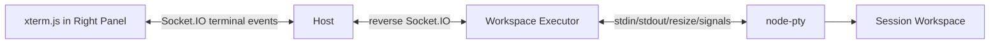
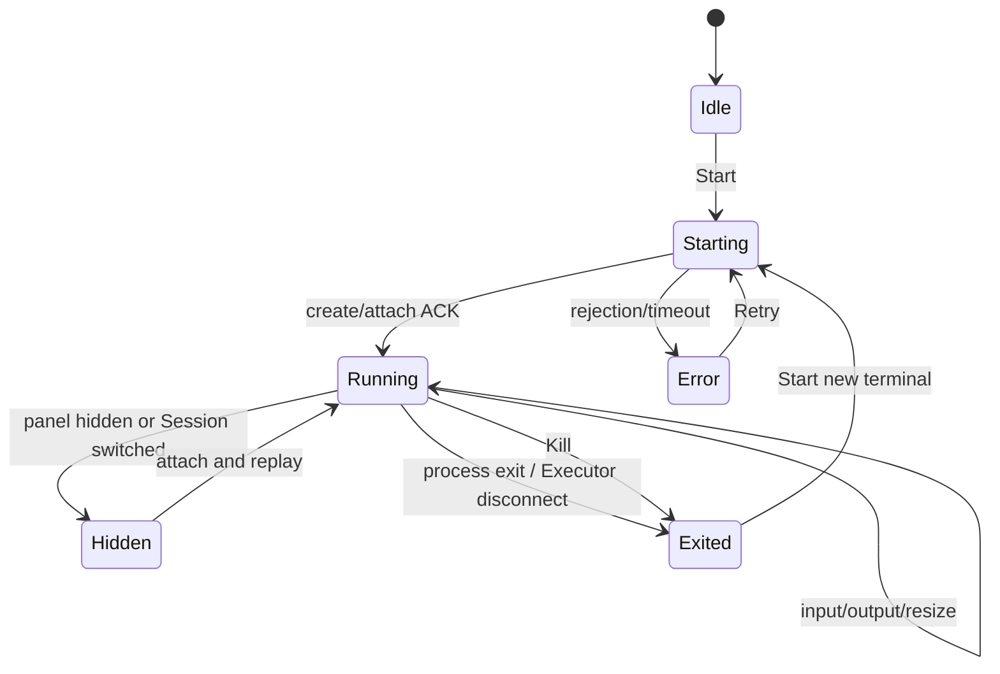

# Session Terminal Sidebar

**Status:** implementation design
**Scope:** Agent RunLab Dashboard, Host, Executor, and wire protocol
**Decision:** one persistent interactive terminal per Session, rendered in the shared right sidebar

## 1. Product goal

Agent RunLab shall provide a VS Code-like interactive shell for the selected Session. The terminal runs on the Session's Workspace Executor, starts in the Session `cwd`, and is displayed in a right-side panel shared with Inspector.

The terminal is a user-operated Workspace resource. It is not an Agent tool, its output is not appended to Session JSONL, and its input/output is never added to model context.

## 2. User experience

The right panel has two primary tabs: **Inspector** and **Terminal**. Desktop uses the existing resizable right panel. iPad uses the existing right-side drawer; phone uses the same drawer at full width.

The Terminal tab contains:

- status and resolved `cwd`;
- an xterm.js viewport;
- Start/Restart, Clear, and Kill controls;
- an iPad touch key row (`Esc`, `Tab`, `Ctrl+C`, and arrows);
- explicit states for Workspace offline, starting, running, reconnecting, exited, and error.

Opening the panel does not automatically start a shell. Hiding the panel or switching tabs does not kill it. Switching Sessions attaches to that Session's terminal; the previous Session terminal continues running. Explicit Kill, Session deletion, Executor disconnect/restart, or process exit ends it.

## 3. Architecture

### Responsibilities

- **Dashboard:** terminal rendering, keyboard/touch input, resizing, status, and user controls.
- **Host:** authenticate Session/workspace ownership, route messages, enforce ACK timeout, and isolate Session rooms.
- **Executor:** own PTY processes, enforce sandbox/capacity limits, buffer bounded output, and terminate resources.
- **Kernel/Session log:** no terminal output or terminal state.

## 4. Resource model

There is at most one live terminal for `(workspaceId, sessionId)` in the first version. `terminalId` identifies its current process generation.

Calling `terminal:create` is idempotent for a live Session terminal:

- if none exists, create one;
- if one exists, return its `terminalId`, resolved `cwd`, and bounded replay output;
- if the previous terminal exited, create a new generation only after an explicit Start/Restart action.

The Executor keeps a bounded ring buffer (target: 1 MiB) per terminal. Reattach returns a tail snapshot. This provides refresh and Session-switch recovery without persisting shell output.

## 5. Protocol

Dashboard to Host to Executor:

- `terminal:create` with `requestId`, `workspaceId`, `sessionId`, optional `cwd`, `cols`, and `rows`; ACK returns terminal identity, resolved cwd, optional replay, and whether it was reused.
- `terminal:input` with full resource identity and bounded data.
- `terminal:resize` with bounded rows and columns.
- `terminal:kill` with full identity; ACK confirms signal submission, while `server:terminal_exit` confirms exit.
- `terminal:close_session` is Host-to-Executor cleanup used on Session deletion.

Executor to Host to Dashboard:

- `executor:terminal_output` becomes `server:terminal_output` only in the authorized Session room.
- `executor:terminal_exit` becomes `server:terminal_exit` at most once per terminal generation.

Output is ephemeral and must not be queued across an Executor disconnect. A disconnected Executor closes every PTY; reconnect never pretends that the old process survived.

## 6. Security and limits

- Host validates dashboard handshake Session, payload Session, Session workspace, and connected Executor.
- Host validates Executor-originated terminal events against the workspace bound to that socket and current Session ownership.
- Executor independently rejects payloads for another workspace.
- `cwd` passes through the existing sandbox canonicalizer.
- A real `node-pty` is preferred; lack of PTY support is surfaced explicitly rather than represented as a fully capable terminal.
- Initial limits: 1 terminal per Session, 32 per Executor, dimensions `1..500`, input at most 64 KiB per event, replay buffer at most 1 MiB.
- Session deletion sends terminal cleanup before removing Session state.
- Terminal APIs do not accept shell command arguments from URL/query parameters.

## 7. Frontend design

`RightPanel` owns the Inspector/Terminal tab strip and collapse action. It renders:

- existing `InspectorPanel` without changing its internal Trace/LLM/Tools/Status tabs;
- `SessionTerminalPanel`, a reusable xterm.js component extracted from the existing Session Files terminal implementation.

The terminal component owns xterm.js and addons (`FitAddon`, `WebLinksAddon`, `SearchAddon`), subscribes before create/attach to avoid losing early output, uses `ResizeObserver`, and filters every event by workspace, Session, and terminal ID.

Desktop panel width retains the existing 22–36% limits. Mobile retains safe-area and dynamic viewport handling. The active primary tab is kept in Dashboard state; the existing Inspector-open preference remains the right-panel-open preference for compatibility.

## 8. Lifecycle

Unmounting the UI only detaches listeners; it does not send Kill. Kill is reserved for explicit user action and Session cleanup.

## 9. Failure behavior

- Workspace offline: disable Start and show reconnect guidance.
- ACK timeout: show timeout; do not assume process creation failed or succeeded. A subsequent idempotent create reconciles state.
- Executor restart: show exited/disconnected; require explicit Start.
- Browser reconnect: issue idempotent create/attach and apply replay before live output.
- Output overflow: retain only the newest bounded tail and indicate replay truncation when applicable.

## 10. Testing

### Executor

- sandboxed create, idempotent reuse, replay, dimensions, input, resize, kill, exit once, Session cleanup, limits, and workspace mismatch.

### Host

- dashboard Session/workspace authorization, Executor-origin validation, ACK timeout, room isolation, and Session deletion cleanup.

### Dashboard

- RightPanel tabs and collapse behavior; start, output, input, resize, clear, kill, Session switch, replay, offline/error states, and iPad touch keys.

### Release verification

- package typechecks and focused tests;
- production build;
- real Host/Executor smoke: `tty`, `pwd`, ANSI output, resize, `Ctrl+C`, hide/show, Session switch, and kill;
- mobile/iPad drawer overflow check;
- static JS assets return JavaScript MIME and stale assets return 404.

## 11. Rollout and rollback

The feature reuses the existing terminal protocol and xterm dependencies, reducing blast radius. Deploy after focused tests and build. Existing Inspector remains the default tab. If terminal UI fails, Inspector and the rest of Dashboard remain available; rollback is an immutable release generation switch. No Session data migration is required.
