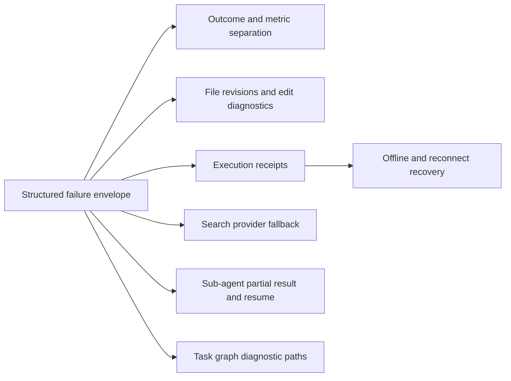

# Tool Call Failure Investigation

## Purpose

This document records an empirical investigation of tool-call failures in locally retained Agent RunLab session logs. Its goals are to:

- identify the dominant failure categories;
- distinguish tool defects from infrastructure, precondition, cancellation, and user-driven outcomes;
- find API shapes that cause avoidable model retries;
- propose a prioritized reliability and observability plan.

The analysis is intentionally privacy-safe. It contains no user prompts, credentials, hostnames, workspace names, local filesystem paths, session identifiers, command bodies, repository names, or raw tool inputs. Examples are normalized and synthetic.

## Scope and methodology

### Dataset

The analyzed dataset contained:

- 84 session logs;
- approximately two weeks of activity;
- 16,377 matched tool results;
- 582 results with `ok: false`;
- 33 sessions containing at least one failed tool result.

The observed protocol-level failure rate was:

$$
\frac{582}{16{,}377} \approx 3.55\%.
$$

### Extraction

For each session log:

1. Parse append-only JSONL entries.
2. Index `call_tool` effects by `callId`.
3. Match each `tool_result` to its originating tool call.
4. Count successful and unsuccessful results by tool.
5. Classify unsuccessful results using normalized error codes and message patterns.
6. Inspect representative samples from high-frequency categories.

Validation results:

- unmatched tool results: 0;
- malformed JSONL entries: 0.

### Interpretation limits

`ok: false` is not synonymous with a product defect. The current protocol combines several outcomes:

- invalid model-generated input;
- unmet execution preconditions;
- ordinary execution failures;
- provider outages;
- user cancellation;
- transport ambiguity;
- process restart recovery.

The aggregate failure rate therefore overstates intrinsic tool unreliability. A central recommendation is to separate these outcomes in the protocol and metrics.

## Aggregate failure categories

| Category | Count | Share of unsuccessful results |
|---|---:|---:|
| Edit context mismatch | 144 | 24.7% |
| Workspace offline | 133 | 22.9% |
| Path not found | 51 | 8.8% |
| Search provider challenge/unavailable | 47 | 8.1% |
| Edit match ambiguous | 43 | 7.4% |
| Edit was a no-op | 36 | 6.2% |
| Invalid input | 24 | 4.1% |
| Permission or sandbox denial | 22 | 3.8% |
| Tool acknowledgement timeout | 18 | 3.1% |
| HTTP error | 15 | 2.6% |
| Sub-agent timeout | 13 | 2.2% |
| Cancelled | 12 | 2.1% |
| Other | 8 | 1.4% |
| Host restart while call was pending | 6 | 1.0% |
| Task graph blocked transition | 3 | 0.5% |
| Unknown tool | 2 | 0.3% |
| Path is a directory | 2 | 0.3% |
| Patch parse error | 1 | 0.2% |
| Task graph cycle | 1 | 0.2% |
| Revision/conflict error | 1 | 0.2% |

Two clusters dominate:

- edit-related failures: 224, or 38.5%;
- offline, acknowledgement, restart, and cancellation outcomes: 169, or 29.0%.

Together they account for roughly two thirds of all unsuccessful results.

## Failure rate by tool

Rates are meaningful only where the sample size is sufficient.

| Tool | Calls | Unsuccessful | Rate |
|---|---:|---:|---:|
| `bash` | 5,616 | 162 | 2.9% |
| `apply_file_patch` | 134 | 107 | 79.9% |
| `replace_many_in_file` | 610 | 65 | 10.7% |
| `websearch` | 95 | 47 | 49.5% |
| `grep` | 3,556 | 45 | 1.3% |
| `replace_in_file` | 1,338 | 36 | 2.7% |
| `agent` | 73 | 20 | 27.4% |
| `edit` | 673 | 19 | 2.8% |
| `webfetch` | 118 | 18 | 15.3% |
| `read_file` | 1,442 | 16 | 1.1% |
| `read_files` | 173 | 15 | 8.7% |
| `ls` | 360 | 9 | 2.5% |
| `write_file` | 395 | 6 | 1.5% |
| `todo_graph` | 235 | 6 | 2.6% |
| `todowrite` | 677 | 4 | 0.6% |
| `bash_output` | 74 | 3 | 4.1% |
| `read` | 412 | 0 | 0% |
| `glob` | 326 | 0 | 0% |
| `memory` | 17 | 0 | 0% |

Tools with only one or two observations are excluded from conclusions.

## Findings by capability

### 1. File editing

File-editing failures are the largest product-controlled category.

#### `apply_file_patch`

`apply_file_patch` had 107 unsuccessful results in 134 calls. The dominant pattern was a patch hunk whose expected context was absent from the current file. A small number involved ambiguous context, a missing file, or malformed patch syntax.

Although the tool presents a patch-oriented interface, its context matching behaves like a strict exact replacement. This is fragile when:

- the file changed after it was read;
- the model saw only a truncated range;
- whitespace or nearby text changed;
- a large multi-file patch was synthesized from stale context.

#### `replace_many_in_file`

The principal failures were:

- one edit did not match current text;
- one edit was a no-op;
- a match was not unique;
- a later edit matched text introduced by an earlier edit.

Atomicity is valuable, but currently a harmless no-op can roll back a large set of valid edits.

#### Recommended changes

1. **File revisions**

   Read tools should return a stable revision, preferably a content hash:

   ```json
   {
     "content": "…",
     "revision": "sha256:…",
     "size": 1234
   }
   ```

   Edit tools should accept `expectedRevision`. A mismatch then clearly means the file changed after the read, rather than that the generated context was intrinsically wrong.

2. **Structured mismatch diagnostics**

   A failed edit should report:

   - path, without exposing it in telemetry where privacy controls require redaction;
   - failed edit or hunk index;
   - whether the expected text was absent or ambiguous;
   - candidate line ranges and similarity scores;
   - current file revision;
   - a suggested recovery action.

3. **Controlled fuzzy matching**

   Patch application may tolerate insignificant whitespace differences. If several candidates are plausible, it must fail with candidates rather than silently selecting one.

4. **Explicit no-op policy**

   `replace_many_in_file` should support a policy such as:

   ```typescript
   mode: 'strict' | 'skip_noop' | 'best_effort'
   ```

   `strict` preserves current atomic behavior. `skip_noop` permits already-applied edits while keeping real mismatches atomic. `best_effort` should be opt-in and return per-edit outcomes.

5. **Preflight conflict detection**

   The tool should detect edit-chain interactions before committing and identify the operations involved.

### 2. Executor availability and transport

Workspace-offline results accounted for 22.9% of all unsuccessful tool results. Almost all occurred on shell calls. Tool acknowledgement timeouts, process restart recovery, disconnections, and cancellation formed another significant group.

These are not intrinsic shell failures. They are scheduling and transport outcomes.

#### Recommended changes

1. **Pre-dispatch capability state**

   The runtime should expose whether the selected workspace is:

   ```typescript
   'online' | 'offline' | 'reconnecting'
   ```

   Executor tools should not be dispatched as ordinary calls when their execution precondition is known to be false.

2. **Outcome taxonomy**

   An offline workspace should produce `blocked`, not `failure`. The host may wait for reconnection or request an explicit user/model choice.

3. **Host and Executor tool distinction**

   Host tools must remain available when a workspace Executor is offline. Tool descriptions and runtime capability data should make the execution location explicit.

4. **Execution receipts**

   Once an Executor accepts a call, it should return a durable receipt:

   ```json
   {
     "executionId": "…",
     "accepted": true,
     "state": "running"
   }
   ```

   A transport timeout can then query the receipt instead of leaving the model uncertain whether the side effect ran.

5. **Separate deadlines**

   The system should distinguish:

   - queue timeout while waiting for an Executor;
   - transport acknowledgement timeout;
   - command execution timeout;
   - idle-output timeout.

   One generic timeout cannot safely describe all four.

### 3. Path resolution

Path-not-found failures were concentrated in search and read tools. Typical causes were stale paths, guessed filenames, a missing intermediate directory, a package-store version mismatch, or a path that belonged to a different workspace.

#### Recommended changes

1. Return basename and nearby-path candidates from the workspace index.
2. Identify probable workspace mismatch without exposing workspace names in telemetry.
3. Allow exploratory tools to opt into `missingPath: 'empty'`, while preserving strict errors by default.
4. Include an explicit `path_is_directory` result with suggested tools when a file reader receives a directory.

### 4. Web search

Nearly half of `websearch` calls failed because the single search provider returned a challenge or landing page. Query reformulation cannot fix this class of failure.

#### Recommended changes

1. Add a provider fallback chain.
2. Record provider attempts and terminal outcome.
3. Classify challenge, rate limit, network failure, invalid query, and no results separately.
4. Mark provider unavailability as retryable infrastructure failure.
5. Prefer official-domain lookup when the query clearly targets product documentation.

### 5. Web fetch

Most `webfetch` failures were ordinary HTTP status errors, especially stale documentation URLs.

#### Recommended changes

Return a structured HTTP envelope containing:

- status;
- final URL;
- redirect chain;
- content type;
- retryability;
- canonical or nearby-document candidates when available.

An HTTP 404 is a valid remote response and should not be indistinguishable from a transport failure.

### 6. Sub-agents

The `agent` tool had a 27.4% unsuccessful rate. The major categories were timeout and invalid input. Observed behavior suggested that requested timeout, role defaults, host caps, and outer tool-call deadlines were not always transparent to the caller.

#### Recommended changes

1. Return requested and effective timeout/turn budgets when the child starts.
2. Ensure the outer tool deadline is not shorter than the child deadline.
3. On timeout, return the child session reference, completed turns, last progress, and partial result.
4. Support resumable child work where safe.
5. Calibrate default budgets by role and expected scope.
6. Validate incompatible role/tool combinations before spawning the child.

### 7. Shell execution

The raw `bash` failure count was high, but the intrinsic failure rate was low. Most unsuccessful results were caused by offline workspaces, acknowledgement timeouts, cancellation, restart recovery, or disconnection rather than command execution.

This reinforces the need to separate execution errors from infrastructure and lifecycle outcomes. It also means shell API redesign should prioritize receipts, deadlines, and reconnection semantics over command syntax changes.

### 8. Task graph

`todo_graph` had a low overall unsuccessful rate, but the failures reveal opportunities for better diagnostics.

Observed categories:

- an edge made an already active node blocked;
- a mutation created a cycle;
- a replacement omitted required graph fields;
- a revision conflict occurred.

#### Recommended changes

1. **Blocked transition diagnostics**

   Return the affected node, newly blocking edges, operation indexes, and safe remediation choices.

2. **Cycle path**

   Return the concrete cycle and the operation that introduced it.

3. **Clear replace semantics**

   Keep `replace` strict as a whole-graph operation. Add narrower operations for replacing only nodes or edges if this use case is frequent.

4. **Conflict response**

   Revision conflicts should include current revision and a compact current snapshot or diff so the caller can rebase.

### 9. Linear todo list

`todowrite` was reliable overall. Its few failures were caused by a serialized string instead of an array or multiple active items. These are schema-generation mistakes.

Recommendations:

- retain strict validation;
- keep the description explicit that the input is an array, not JSON encoded as a string;
- direct plans with parallel active work to `todo_graph` rather than weakening the one-active-item invariant.

## Cross-cutting protocol design

### Structured Tool Failure Envelope

The current `ok: false` plus free-form string prevents reliable metrics and automated recovery. All tools should return a versioned error envelope:

```typescript
type ToolFailure = {
  version: 1
  code: string
  category:
    | 'input'
    | 'precondition'
    | 'conflict'
    | 'execution'
    | 'infrastructure'
    | 'cancelled'
  outcome:
    | 'failure'
    | 'blocked'
    | 'cancelled'
    | 'timeout'
    | 'indeterminate'
  retryable: boolean
  responsibility:
    | 'model'
    | 'user'
    | 'workspace'
    | 'provider'
    | 'host'
  message: string
  details?: Record<string, unknown>
  suggestedAction?: {
    tool?: string
    input?: Record<string, unknown>
  }
}
```

The user-facing message remains useful, but code and structured details become the source of truth.

### Outcome metrics

Metrics should not use one undifferentiated failure counter. At minimum, report:

- success;
- failure;
- blocked;
- cancelled;
- timeout;
- indeterminate.

Recommended dimensions:

- tool name and version;
- execution location: Host or Executor;
- category and code;
- retryable;
- attempt number;
- recovered automatically;
- terminal outcome;
- latency to acceptance and completion.

Never include raw prompts, command bodies, file content, credentials, complete paths, workspace names, session identifiers, or provider authorization data in low-cardinality metrics.

### Automatic recovery policy

| Error class | Recommended behavior |
|---|---|
| Edit context mismatch | Return revision and nearby context; require a targeted reread |
| Ambiguous edit | Return candidate ranges; require more context |
| Edit no-op | Skip only under an explicit policy |
| Path not found | Return safe path candidates |
| Workspace offline | Block and wait/reconnect; do not replay side effects blindly |
| Search provider unavailable | Switch provider automatically |
| Tool acknowledgement timeout | Query execution receipt |
| Sub-agent timeout | Return partial output and resume metadata |
| Task graph cycle | Return the cycle path and introducing operation |
| Task graph blocked transition | Return newly blocking dependencies and remediation choices |

## Prioritized implementation plan

### P0 — protocol and highest-volume failures

1. Introduce the structured Tool Failure Envelope.
2. Separate blocked, cancelled, timeout, indeterminate, and failure outcomes.
3. Add file revisions to read and edit tools.
4. Return actionable edit mismatch and ambiguity diagnostics.
5. Add Executor precondition checks and durable execution receipts.
6. Separate queue, acknowledgement, execution, and idle-output deadlines.

### P1 — provider and recovery improvements

1. Add web-search provider fallback.
2. Add path candidates and workspace-mismatch diagnostics.
3. Return requested and effective sub-agent budgets.
4. Preserve partial child results and support safe resume.
5. Add structured HTTP response details to `webfetch`.
6. Add cycle paths and mutation attribution to `todo_graph`.

### P2 — policy refinement and product UX

1. Add explicit edit no-op policies.
2. Add automatic recovery orchestration based on structured errors.
3. Surface blocked/reconnecting tools in the Dashboard without presenting them as failed execution.
4. Add reliability dashboards by terminal outcome and recovery rate.
5. Use repeated failure classes as evaluation cases for tool-schema and system-prompt regression tests.

## Acceptance criteria

A strengthened tool-call system should meet the following criteria:

1. Every unsuccessful result has a stable code, category, outcome, retryability flag, and responsibility.
2. Workspace-offline calls do not count as intrinsic tool failures.
3. A transport timeout never leaves a side-effecting call with unknown execution status when a receipt exists.
4. Edit failures identify stale revision, absent context, ambiguous context, and no-op separately.
5. Search provider challenge automatically attempts an independent provider.
6. Sub-agent timeout returns partial progress and effective budget information.
7. Task graph cycle and blocked-transition errors identify the responsible operation and dependency path.
8. Reliability metrics contain no sensitive user content or high-cardinality local identifiers.
9. Regression tests cover each dominant failure class and its recovery behavior.

## Conclusion

The observed aggregate unsuccessful rate was moderate, but failures were highly concentrated. The largest controllable issue was strict, context-sensitive file editing. The second was infrastructure and lifecycle state being represented as ordinary tool failure. Search-provider concentration and opaque sub-agent deadlines were additional material weaknesses.

The highest-leverage sequence is:



A structured failure contract is the prerequisite for accurate measurement, safe automatic recovery, and targeted tool API improvement.
