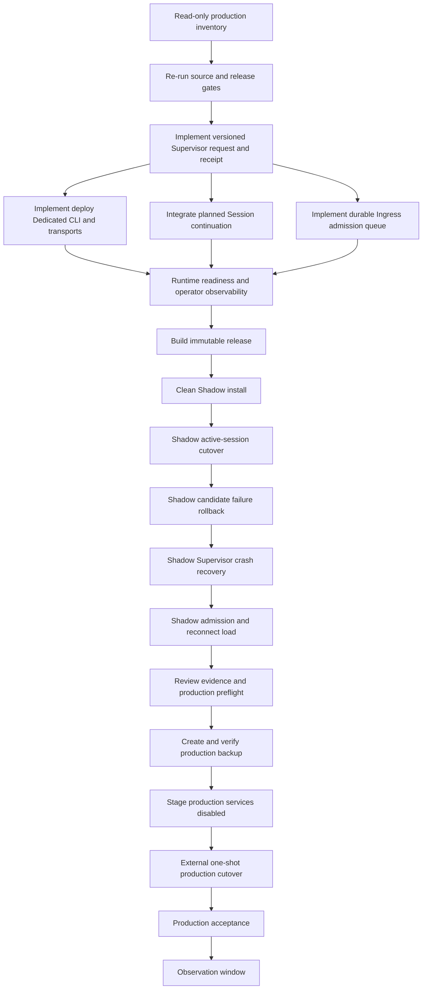

# Dedicated Platform systemd Migration — External Agent Handoff

**Status:** execution handoff; production cutover is blocked until the defects and gates below are closed

**Audience:** an Agent operating from an independent SSH/console control channel

**Normative product contract:** [`../architecture/deployment-mode-contract.md`](../architecture/deployment-mode-contract.md)

**Normative architecture:** [`../architecture/dedicated-platform-runtime-unit.md`](../architecture/dedicated-platform-runtime-unit.md)

**Restart contract:** [`../architecture/graceful-restart-and-deployment.md`](../architecture/graceful-restart-and-deployment.md)

## 1. Mission

Migrate the existing legacy single-process installation to Agent RunLab Dedicated (`platform + single-tenant`) on the real systemd topology:

```text
public :13000
  -> agent-runlab-dedicated-ingress.service
       -> active private slot
          agent-runlab-dedicated-unit@blue.service (:13001)
          or agent-runlab-dedicated-unit@green.service (:13002)

agent-runlab-dedicated-deploy-supervisor.service
  -> immutable releases, deferred blue/green cutover, verification, rollback
```

Preserve the existing Session JSONL, queue state, artifacts, Executor identities, Workspace aliases, provider/model settings, notifications, and other mutable state. The previous service and predecessor data layout must remain recoverable throughout the observation window.

## 2. Non-negotiable control-plane boundary

The Agent that wrote this handoff is itself hosted by the Dedicated Runtime being migrated. It must not perform the cutover.

The executing Agent is external only if its command channel survives all of the following independently:

- `agent-runlab-host.service` stops;
- port 13000 temporarily has no Runtime upstream;
- Dashboard and Executor Socket.IO disconnect;
- the old Session process exits.

Acceptable control channels:

- SSH from another machine/process that does not use Agent RunLab tools;
- VM/LXD console;
- a separately supervised operator shell outside all Agent RunLab service cgroups.

Not acceptable:

- a Shell Tool executed by a Session on the target Host;
- an Executor whose only command channel is the target Host;
- a browser Session on the target Dashboard;
- a fixed `sleep` followed by optimistic success.

The external Agent may use this repository and scripts, but all stop/start/cutover polling must run through the independent channel.

## 3. Current source-of-truth implementation

Edit source files, not generated `release/` copies:

| Concern | Source |
|---|---|
| Architecture contract | `docs/architecture/dedicated-platform-runtime-unit.md` |
| Unit templates | `deploy/dedicated-systemd/*.service` |
| Staged installer | `scripts/deploy/install-dedicated-systemd.mjs` |
| Initial cutover | `scripts/deploy/cutover-dedicated-systemd.mjs` |
| Data move/rollback | `scripts/deploy/dedicated-data-migration.mjs` |
| Settings fingerprint | `scripts/deploy/dedicated-settings-fingerprint.mjs` |
| Manual rollback | `scripts/deploy/rollback-dedicated-systemd.mjs` |
| Supervisor runtime | `packages/host/src/tenant-runtime/dedicated-deploy-supervisor.ts` |
| Supervisor daemon | `packages/host/bin/agent-runlab-dedicated-deploy-supervisor.ts` |
| Packaging tests | `scripts/deploy/dedicated-systemd.test.mjs` |
| Release builder | `scripts/release/build-release-assets.mjs` |

`build-release-assets` copies these into `release/`. Never patch only the generated copy.

## 4. Implementation readiness already completed in the source workspace

The current source workspace has already closed the locally safe defects that do not require touching the running production service:

- cutover and rollback use the production blue/green Runtime Unit instances consistently;
- architecture, systemd templates, cutover scripts, rollback scripts, and packaging tests agree on dynamic slot ports and the shared logical Unit state root;
- release generation and release verification pass, including generated cutover and rollback assets.

Verified commands at handoff preparation time:

```bash
pnpm exec vitest run scripts/deploy/dedicated-systemd.test.mjs \
  packages/host/src/tenant-runtime/dedicated-deploy-supervisor.test.ts \
  packages/host/src/tenant-runtime/dedicated-composition.test.ts \
  packages/host/src/tenant-runtime/dedicated-cutover-reservation.test.ts \
  packages/host/src/tenant-runtime/quiescence.test.ts
node --test scripts/testing/workflows.test.mjs
node --test scripts/release/executor-installer.test.mjs
pnpm run build:release-assets -- --no-native --repo local/agent-runlab
pnpm run verify:release-assets
```

The executing Agent must re-run the applicable gates against its exact source revision and must still complete the external-environment work below. Source-level tests do not replace a clean Shadow systemd installation, backup/restore proof, or production continuity evidence.

The staged installer remains privileged and side-effecting even though it leaves services disabled: it creates service/data/config roots, installs unit files, and may grant Docker-group membership when explicitly selected. Treat staging as a production change and run it only after Shadow acceptance and backup proof.

Active-Session continuation also remains an environment acceptance requirement. If exact planned continuation is not proven in Shadow, production cutover must wait until every Session is resting, queues are empty, and no required child is active.

## 5. Required infrastructure completion before production migration

The external Agent is responsible for completing the graceful-update infrastructure, not merely deploying the currently packaged services. Production cutover is blocked until all items below are implemented and proven.

### 5.1 Standard Dedicated deployment client

Implement a supported operator entry point, preferably:

```bash
pnpm run deploy:dedicated -- <subcommand> [options]
```

or extend `deploy:remote` with an explicit `--topology dedicated-slots` mode. It must not guess topology from a port or service name.

Required commands/operations:

- `stage` — build or accept an already verified release, transfer its exact manifest into the operation-scoped submission dropbox, verify checksums, and atomically submit one Supervisor request; the privileged Supervisor alone re-verifies and publishes the final immutable release;
- `status` — read the authoritative deployment receipt by deployment or operation ID;
- `wait` — externally poll receipt state with a deadline, reconnect tolerance, and exact operation identity;
- `abort` — abort only while no reservation/activation side effect has begun, with a persisted terminal receipt;
- `rollback` — request a Supervisor-owned rollback to a verified predecessor;
- `inspect` — show active slot, route generation, releases, lock owner, Unit PIDs, and redacted blockers.

The client must:

- use stable idempotent `operationId`;
- atomically create requests (`temp + fsync/close + create-once link + directory fsync`), never a partially visible or overwritten JSON file;
- return accepted operation/deployment identity before any self-hosted initiating Tool waits for Runtime replacement;
- never call the old single-service `/runtime/restart` path for slot topology;
- never overwrite live files one by one;
- validate target path, manifest, exact file set, bundle digest, service topology, permissions, and available rollback predecessor;
- avoid embedding target domains, SSH names, credentials, or ports in tracked package scripts.

Add CLI/transport tests for local, SSH, and LXD adapters as applicable. Existing `pnpm run deploy:remote -- --lxd ...` remains the legacy single-service transaction until explicitly routed to the new protocol; the new architecture must not silently continue using it.

### 5.2 Versioned Supervisor request and receipt protocol

Replace ad hoc request-file assumptions with a validated schema and documented compatibility contract. At minimum include:

- schema version;
- operation and deployment IDs;
- source release digest and target release digest;
- target topology/unit and expected active route generation;
- requested action (`deploy`, `abort`, `rollback`);
- origin Session/call identity when initiated by Agent RunLab;
- timestamps, fencing token, predecessor, candidate slot;
- phase, quiescence blockers, continuation outcomes, health evidence, rollback outcome;
- bounded redacted error.

The Supervisor must reject malformed/future-version requests, path traversal, stale route generation, missing predecessor, duplicate conflicting operation IDs, and requests whose immutable release changed after staging.

Receipts are authoritative and monotonic. A restart must resume `waiting_for_boundary`, activation, verification, or rollback idempotently.

### 5.3 Planned continuation across blue/green slots

Integrate the existing graceful restart/transactional deployment contract into slot cutover. Waiting for all Sessions to become `done` is only a temporary fallback, not Definition of Done.

Before the active slot stops:

1. freeze the participant set and baseline cursor;
2. enter the short reservation admission barrier;
3. let active LLM/Tool/compaction/queue work settle to a durable pre-effect checkpoint;
4. persist a versioned restart/cutover marker owned by the deployment attempt;
5. record per Session cursor, checkpoint kind, resume action, parent/child dependency, and continuation idempotency key;
6. ensure the initiating deploy Tool result is durable before allowing its own Host to exit.

After candidate slot starts, before mutable public traffic:

1. claim/fence the exact marker and deployment attempt;
2. load Sessions without crash-recovery mutation;
3. resume `before_llm`, `before_tool_dispatch`, queue, compaction, and waiting approval semantics exactly once;
4. resume required children before parent settlement;
5. persist continuation receipts;
6. expose runtime readiness only after reconciliation.

A planned cutover must not append `[interrupted]`, duplicate a user operation, repeat an unsafe Tool effect, strand a queue item, or require manual Session restart. Crash recovery remains a separate conservative path.

Add process-level and real systemd tests for active LLM, active Tool, Tool-result-before-LLM, queue, approval, compaction, parent/child Agent, origin self-deployment, and crash at every marker/receipt boundary.

### 5.4 Stable Ingress admission queue

Implement a durable admission layer outside the replaceable Runtime Unit so requests accepted during slot handoff are not lost or falsely acknowledged.

Minimum scope:

- user-message submission, including Queue/Steer mode and structured content;
- stable authenticated principal, tenant/unit, Session, and `operationId` binding;
- durable append before accepted acknowledgement;
- ordered per-Session claim/lease with generation fencing;
- active Unit consumption and durable handoff receipt;
- retry/reconnect and duplicate submission returning the original outcome;
- reservation-aware pausing and candidate reconciliation;
- bounded capacity, backpressure, expiry policy, metrics, and operator visibility.

Do not turn Ingress into a second Session state machine. Session JSONL remains the authoritative Agent state after handoff; the admission ledger owns only accepted-but-not-yet-committed external operations and their transfer receipts.

If this queue is not implemented, Ingress must return explicit retryable unavailable responses during handoff and must never claim zero-loss acceptance. However, production completion for this handoff requires the durable admission queue and its E2E proof.

### 5.5 Runtime readiness and route commit

Separate `process_ready` from `runtime_ready`. Ingress may route mutable traffic only when the candidate:

- owns the expected deployment and route generation;
- holds the Unit write lease;
- loaded the exact state root;
- reconciled planned continuations;
- reconciled the admission queue;
- reports expected release digest and Dedicated capability profile;
- is registered as ready in a Supervisor-observed, persisted receipt.

Before starting that candidate, the Control Updater must have atomically
installed and daemon-reloaded its systemd templates and persisted readiness for
the replacement Ingress and Supervisor. A deployment may not defer template
activation until after the candidate process has already started.

Route switch is the final commit after private verification. Failed candidate verification must restore and verify the predecessor before route restoration is declared complete.

### 5.6 Dashboard and operator observability

Expose deployment state without requiring raw JSON inspection:

- active/candidate slot and PIDs;
- operation/deployment ID and release digest;
- phase and elapsed time;
- quiescence and per-Session blockers;
- admission queue depth and oldest age;
- participant cursors/checkpoints and continuation result;
- health probes and route generation;
- rollback predecessor/outcome.

The UI may say “deployment completed” only after route commit, runtime readiness, continuation/admission reconciliation, and public verification.

### 5.7 Definition of Done for graceful updates

The infrastructure is complete only when a Session hosted by the active slot can stage an update, receive a durable accepted result, and later continue automatically on the replacement slot while unrelated clients remain on the stable Ingress. Tests must prove:

- no self-wait/deadlock;
- no unexpected structured interrupted response;
- no lost or duplicated accepted user message;
- no duplicated external Tool side effect;
- monotonic Session cursor;
- Browser and Executor automatic reconnect;
- exact target hash and PID/slot change;
- automatic verified rollback under candidate failure;
- Supervisor crash recovery;
- one standard deployment command/API used by future Agents.

## 5. Required task graph for the executing Agent

Use this topology; do not put production cutover earlier:



Production deployment is blocked if any predecessor is incomplete.

## 6. Phase A — read-only production inventory

Do not stop or enable anything in this phase.

Record command output in a private evidence directory outside Git. Do not paste secrets into issues, docs, Session logs, or commits.

```bash
pwd
git status --short
git rev-parse HEAD
node --version
uname -a

systemctl status agent-runlab-host.service --no-pager
systemctl cat agent-runlab-host.service
systemctl show agent-runlab-host.service \
  -p MainPID -p FragmentPath -p User -p Group -p EnvironmentFiles \
  -p ExecStart -p WorkingDirectory -p KillMode -p Restart -p TimeoutStopUSec

ss -ltnp
curl -fsS http://127.0.0.1:13000/runtime/capabilities
curl -fsS http://127.0.0.1:13000/internal/runtime/quiescence
```

Discover mutable roots from the running service and process environment; do not assume `/home/example`:

```bash
pid=$(systemctl show -p MainPID --value agent-runlab-host.service)
tr '\0' '\n' < "/proc/$pid/environ" | sed -E '/(TOKEN|KEY|SECRET|PASSWORD|CREDENTIAL)=/d'
readlink -f "/proc/$pid/cwd"
```

Privately record:

- legacy service name and MainPID;
- public port and bind address;
- actual HOME, `SESSIONS_DIR`, artifact root, Executor identity path;
- active release/bundle path and SHA-256;
- state-tree owner, mode, filesystem device, size, free space;
- provider config locations without recording credential values;
- current connected Executors and Workspace IDs;
- active deployment/restart attempts;
- structured interrupted-event baseline and target Session cursors.

Filesystem checks:

```bash
legacy_state='<discovered-real-.agent-kernel-path>'
stat -c 'path=%n dev=%d owner=%U:%G mode=%a' "$legacy_state" /var/lib/agent-runlab
du -sh "$legacy_state"
df -h "$legacy_state" /var/lib/agent-runlab
findmnt -T "$legacy_state"
findmnt -T /var/lib/agent-runlab
```

The migration requires source and target state roots on the same filesystem for atomic rename. If device IDs differ, stop: redesign migration and rollback before proceeding.
The Finalizer also runs a reversible directory-rename probe between the exact
source and target parents before it reserves the boundary or stops the legacy
Host. This is required because separate systemd bind mounts can return
`EXDEV` even when both paths report the same device ID.

## 7. Phase B — re-verify the deployment implementation

Do not redo the already-closed placeholder/test corrections unless the source revision changed. Review their diffs and re-run their tests. Any newly discovered source defect should still be fixed before Shadow deployment, but the primary responsibility of the external Agent is now environment-level proof and cutover.

Before Shadow, confirm installer behavior for partial/pre-existing installation, `systemctl daemon-reload`, disabled staging, and release notes. Add or improve tests when actual Shadow behavior exposes a missing invariant.

Minimum focused tests:

```bash
pnpm exec vitest run scripts/deploy/dedicated-systemd.test.mjs
pnpm --filter @agent-kernel/host exec vitest run \
  src/tenant-runtime/dedicated-deploy-supervisor.test.ts \
  src/tenant-runtime/dedicated-composition.test.ts \
  src/tenant-runtime/dedicated-cutover-reservation.test.ts \
  src/tenant-runtime/quiescence.test.ts
node --test scripts/testing/workflows.test.mjs
```

Then run the repository's applicable fast/full gates. Do not waive failures as “unrelated” without a written provenance check.

## 8. Phase C — build one immutable candidate release

From the reviewed source revision:

```bash
pnpm run build:release-assets -- --no-native --repo <public-owner>/<public-repo>
pnpm run verify:release-assets
git diff --check
sha256sum release/agent-runlab-runtime.cjs
sha256sum release/agent-kernel-dashboard-dist.tar.gz release/dashboard-release.json
```

Record:

- source commit;
- release ID;
- bundle SHA-256;
- complete `SHA256SUMS`;
- test commands and results.

The release must contain:

```text
agent-runlab-runtime.cjs
agent-kernel-dashboard-dist.tar.gz
dashboard-release.json
deploy-dashboard.mjs
agent-kernel-executor.cjs
agent-runlab-dedicated-ingress.cjs
agent-runlab-dedicated-deploy-supervisor.cjs
agent-runlab-dedicated-ingress.service
agent-runlab-dedicated-unit@.service
agent-runlab-dedicated-deploy-supervisor.service
agent-runlab-dedicated-control-updater.service
agent-runlab-dedicated-migration-finalizer.service
update-dedicated-control-plane.mjs
install-dedicated-systemd.mjs
runlab-dedicated.mjs
deploy-dedicated.mjs
cutover-dedicated-systemd.mjs
dedicated-data-migration.mjs
dedicated-settings-fingerprint.mjs
rollback-dedicated-systemd.mjs
manifest.json
SHA256SUMS
RELEASE_NOTES.md
```

## 9. Phase D — mandatory Shadow acceptance

Use a disposable Linux VM or system container with its own systemd, ports, release root, and data root. Do not mount production state read-write.

Shadow scenarios:

1. clean staged installation leaves all services disabled/inactive;
2. realistic legacy JSONL/state copy migrates atomically;
3. active slot starts privately and exposes full Dedicated capabilities;
4. Ingress serves public HTTP, polling, Dashboard WebSocket, and Executor WebSocket;
5. Browser creates/opens a Session through Ingress;
6. Executor reconnects through Ingress and File/Git/Shell work;
7. unrelated Session remains usable while a deployment waits for boundary;
8. successful blue-to-green supervisor deployment records a completed receipt;
9. intentionally broken candidate causes automatic predecessor rollback;
10. Supervisor restart resumes a persisted rollback;
11. initial migration failure restores the legacy service and original state path;
12. all temporary processes/resources are removed afterward.

Capture:

- systemd status and MainPIDs;
- route-state generations;
- receipt JSON;
- HTTP/Socket results;
- Executor reconnect identity;
- Session cursor and queue identity before/after;
- structured interrupted count before/after;
- rollback proof;
- browser console/network failures.

No production work starts until the Shadow evidence is reviewed.

## 10. Phase E — backup and production staging

### 10.1 Backup

Create a read-only filesystem snapshot or backup while respecting the running application's consistency contract. Verify restore into a disposable location. A tar file existing is not restore proof.

The backup must cover:

- complete legacy `.agent-kernel` state;
- provider/model configuration required by the service;
- current service unit and environment-file locations;
- current release/bundle;
- ownership/mode metadata;
- deployment/restart state.

Keep the backup and evidence outside Git with restrictive permissions.

### 10.2 Private environment files

Create only on the target, mode `0600` where secrets may appear:

```text
/etc/agent-runlab/dedicated.env
/etc/agent-runlab/ingress.env
/etc/agent-runlab/supervisor.env
/etc/agent-runlab/migration.env
```

Do not commit real domains, ports, tokens, API keys, provider endpoints, filesystem paths, or credentials. The unit templates may contain public defaults; target-specific values stay in environment files.

### 10.3 Stage disabled

After all blockers are fixed and Shadow passes, use the generated release installer from an external privileged shell:

```bash
sudo env \
  AGENT_RUNLAB_INSTALL_ROOT=/opt/agent-runlab \
  AGENT_RUNLAB_DATA_ROOT=/var/lib/agent-runlab \
  AGENT_RUNLAB_SYSTEMD_DIR=/etc/systemd/system \
  AGENT_RUNLAB_RELEASE_ID='<immutable-release-id>' \
  AGENT_RUNLAB_LEGACY_DATA_ROOT='<discovered-legacy-home-or-state-root>' \
  AGENT_RUNLAB_CONTAINER_BACKEND='<none-or-explicitly-approved-docker>' \
  node release/install-dedicated-systemd.mjs release

sudo systemctl daemon-reload
```

Immediately assert staging did not start or enable the new topology:

```bash
systemctl is-active agent-runlab-dedicated-ingress.service || true
systemctl is-active agent-runlab-dedicated-unit@blue.service || true
systemctl is-active agent-runlab-dedicated-unit@green.service || true
systemctl is-active agent-runlab-dedicated-deploy-supervisor.service || true
systemctl is-active agent-runlab-dedicated-control-updater.service || true
systemctl is-enabled agent-runlab-dedicated-ingress.service || true
systemctl is-enabled agent-runlab-dedicated-unit@blue.service || true
systemctl is-enabled agent-runlab-dedicated-unit@green.service || true
systemctl is-enabled agent-runlab-dedicated-deploy-supervisor.service || true
systemctl is-enabled agent-runlab-dedicated-control-updater.service || true
```

Expected: inactive and disabled before cutover.

Validate units without starting them:

```bash
systemd-analyze verify \
  /etc/systemd/system/agent-runlab-dedicated-ingress.service \
  /etc/systemd/system/agent-runlab-dedicated-unit@.service \
  /etc/systemd/system/agent-runlab-dedicated-deploy-supervisor.service \
  /etc/systemd/system/agent-runlab-dedicated-control-updater.service \
  /etc/systemd/system/agent-runlab-dedicated-migration-finalizer.service

systemctl cat agent-runlab-dedicated-ingress.service
systemctl cat agent-runlab-dedicated-unit@.service
systemctl cat agent-runlab-dedicated-deploy-supervisor.service
systemctl cat agent-runlab-dedicated-control-updater.service
systemctl cat agent-runlab-dedicated-migration-finalizer.service
```

Inspect `/var/lib/agent-runlab/deploy/migration-receipt.json`; expected phase is `installed_disabled`.
The receipt must also contain revision `1`, the immutable release digest, and
the executable bundle SHA-256. The Finalizer deliberately keeps the source and
target state parents in one mount namespace object so their directory rename
remains atomic; do not add separate `ReadWritePaths` bind mounts for those two
roots. Verify the reversible pre-stop rename probe succeeds.

## 11. Phase F — final production cutover

### 11.1 Go/no-go gate

Re-run immediately before cutover:

- backup restore proof still available;
- old service healthy;
- no deployment/restart already active;
- no second writer;
- state source/target device IDs still match;
- target `.agent-kernel` does not already exist;
- candidate release checksum matches recorded digest;
- rollback script and legacy service definition are present;
- quiescence/reservation endpoints work;
- current cursors and structured interrupted baseline recorded.

If active continuation semantics were not proven in Shadow, require:

```text
quiescence.safe = true
activeLlmCalls = 0
activeToolCalls = 0
activeCompactions = 0
all queues empty
no required child Session active
```

### 11.2 External start

The finalizer must run outside the legacy service cgroup. Start it without synchronously depending on the old Dashboard:

```bash
sudo systemctl start --no-block agent-runlab-dedicated-migration-finalizer.service
```

Poll from the independent SSH/console channel:

```bash
watch -n 1 'systemctl --no-pager --full status agent-runlab-dedicated-migration-finalizer.service agent-runlab-dedicated-ingress.service agent-runlab-dedicated-unit@blue.service agent-runlab-dedicated-unit@green.service agent-runlab-dedicated-deploy-supervisor.service agent-runlab-dedicated-control-updater.service'
```

Also inspect, without exposing secrets:

```bash
sudo journalctl -u agent-runlab-dedicated-migration-finalizer.service -n 200 --no-pager
sudo cat /var/lib/agent-runlab/deploy/migration-receipt.json
```

Never force-stop the old Host merely because waiting is slow. Investigate the named quiescence blocker or abort before data movement.

The Finalizer persists each cutover and rollback phase before crossing the next
side-effect boundary and has a bounded `Restart=on-failure` policy. After an
unexpected Finalizer exit, continue polling the receipt and systemd externally;
do not start either Host manually. `rollback_failed` means data ownership is
uncertain and requires fail-closed operator repair.

## 12. Mandatory production acceptance

Do not declare success merely because port 13000 returns 200.

Verify:

```bash
systemctl is-active agent-runlab-dedicated-ingress.service
systemctl is-active agent-runlab-dedicated-unit@blue.service || systemctl is-active agent-runlab-dedicated-unit@green.service
systemctl is-active agent-runlab-dedicated-deploy-supervisor.service
systemctl is-enabled agent-runlab-dedicated-ingress.service
systemctl is-enabled agent-runlab-dedicated-deploy-supervisor.service

curl -fsS http://127.0.0.1:13000/runtime/capabilities
curl -fsS http://127.0.0.1:13000/settings >/dev/null
cat /var/lib/agent-runlab/deploy/route-state.json
```

Acceptance evidence must prove:

- Ingress MainPID differs from Unit MainPID and Supervisor MainPID;
- public port belongs to Ingress;
- active private slot matches route state;
- inactive slot is not a concurrent writer;
- operator status names the active Runtime PID as write-lease owner, backed by a `/proc/locks` PID/device/inode match rather than cross-user `/proc/<pid>/fd` access;
- bundle SHA-256 is the candidate digest;
- profile is `Dedicated`;
- Operations, Pipeline/Benchmark, Evaluation integration, Workspace/Executor, File/Git/Shell, Artifacts, and notifications are available as required;
- Browser reconnects and loads authoritative history;
- Executor reconnects with the same Workspace identity;
- Session list/count and representative JSONL cursors are preserved;
- queues and approvals are preserved;
- no duplicate user message or Tool effect appears;
- no new structured planned-restart `[interrupted]` appears;
- provider/model settings fingerprint is unchanged;
- migration receipt is `cutover_completed`;
- legacy service is disabled but its unit/release remains retained.

Exercise at least one safe real flow through public Ingress:

1. open an existing Session;
2. create a new Session;
3. read a file through the reconnected Executor;
4. run a harmless shell command;
5. verify Git status;
6. verify one Artifact/Operations query;
7. verify Dashboard and Executor WebSocket reconnect.

## 13. Rollback rules

Automatic rollback is required if any mandatory check fails during cutover. Manual rollback during the observation window uses the reviewed generated script only after verifying its receipt and data paths:

```bash
sudo node /opt/agent-runlab/control/rollback-dedicated-systemd.mjs
```

Rollback acceptance:

- both new slots, Ingress, and Supervisor are stopped and disabled so a later
  reboot cannot start the new topology alongside the restored legacy service;
- migrated state is atomically returned to the exact legacy source;
- owner/mode are restored;
- copied provider files are removed only when created by migration;
- legacy service is enabled and healthy on the public port;
- Session cursors and Executor identity remain intact;
- receipt is `manually_rolled_back`.

If data rollback fails, fail closed. Do not start either old or new Host against an uncertain/empty state root. Preserve diagnostics and require operator intervention.

## 14. Observation and cleanup

Keep for an explicit observation window:

- legacy unit file and environment;
- predecessor release;
- verified backup;
- migration and deployment receipts;
- failed candidate diagnostics if any.

Do not remove old service files, backups, or predecessor releases in the same change as cutover. Cleanup is a later reviewed operation after stability is demonstrated.

## 15. Git and confidentiality boundary

Allowed tracked changes:

- generic source code;
- generic unit templates;
- tests and public documentation;
- placeholder examples with no real endpoint or identity.

Never track:

- real public/private domains;
- actual target IP/SSH name;
- tokens, API keys, passwords, private keys;
- provider endpoints tied to the installation;
- real environment files;
- backup archives, Session JSONL, audit logs, receipts containing target metadata;
- screenshots containing private data.

Before commit/review:

```bash
git diff --check
git status --short
git diff --cached --name-only
pnpm run verify:supply-chain -- --strict
```

Review every new tracked file manually.

## 16. Required final report from the executing Agent

Report concrete evidence:

- source revision and release digest;
- defects fixed before execution;
- Shadow environment and all scenarios run;
- backup/restore proof;
- exact staged/cutover operation IDs and receipt phases;
- old/new service names and PIDs;
- active slot and route generation;
- HTTP, Socket.IO, Browser, and Executor verification;
- Session cursor and structured interrupted deltas;
- data ownership/path verification;
- rollback readiness or rollback outcome;
- known risks and observation-window end condition.

Do not report “completed” if only installation/staging succeeded or if Browser/Executor/Session continuity was not tested.
