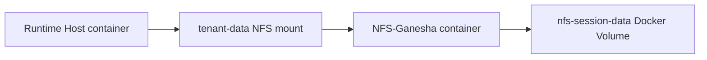

# Private Cloud Runbook

**Status:** Private Cloud application Compose contract with an independent shared Identity project
**Last verified:** 2026-08-20

## Scope

The Private Cloud application runs through `deploy/private-cloud/compose.yaml` plus exactly one storage/edge profile selected by `scripts/private-cloud-local/profile.mjs`. It owns the application PostgreSQL, Stable Ingress Gateway, Runtime Host, and application storage. ZITADEL runs in the independent `deploy/identity/compose.yaml` project and is consumed only through OIDC. No Private Cloud daemon or data service is installed directly on the workstation or in LXD.

## Session storage

The stack contains:

- `nfs-server`: digest-pinned NFS-Ganesha userspace NFSv4 server;
- `nfs-session-data`: ordinary Docker Volume containing the authoritative Session bytes;
- `tenant-data`: NFS-backed Docker Volume mounted by Runtime Host at `/var/lib/agent-runlab`.



Runtime Host therefore always uses real NFS semantics, while NFS-Ganesha and its backing data are managed by the same Docker stack. There is no external NFS configuration and no local-volume fallback for Runtime Host.

The NFS service is reachable only on the dedicated Docker network at `192.0.2.9:2049`; `127.0.0.1:12049` is exposed for local diagnostics. It is not exposed on the LAN or public ingress.

PostgreSQL remains the control-plane store. MinIO/S3 remains reserved for Artifacts, exports, support bundles, and immutable archives; it is not the active JSONL filesystem.

## Security boundary

- Gateway alone publishes the product origin at `127.0.0.1:13001`.
- PostgreSQL and Runtime Host publish no host ports.
- NFS publishes only a loopback diagnostic port and uses a dedicated Docker network.
- Runtime and NFS containers are capability-dropped, read-only, resource bounded, and use `no-new-privileges`.
- Docker socket is never mounted.
- Secrets use ignored `deploy/private-cloud/.secrets/` files.
- A Runtime Unit/Session has one active writer lease although the filesystem is shared.

## Bootstrap and operation

```bash
docker compose --env-file deploy/identity/.secrets/deployment.env \
  -f deploy/identity/compose.yaml up -d --wait
pnpm private-cloud:secrets
pnpm private-cloud:validate
pnpm private-cloud:check
pnpm private-cloud:up
```

`pnpm private-cloud:up` creates and waits for NFS-Ganesha before Runtime Host's NFS-backed volume is used. `pnpm private-cloud:down` removes containers and networks but preserves both Docker Volumes.

Configure a real Provider before non-acceptance use:

```bash
printf %s "$PROVIDER_API_KEY" > deploy/private-cloud/.secrets/llm_api_key
chmod 600 deploy/private-cloud/.secrets/llm_api_key
export RUNTIME_HOST_LLM_BASE_URL=https://provider.example/v1
export RUNTIME_HOST_LLM_MODEL=model-id
```

For protocol acceptance, add only the mock-Provider overlay; Session storage remains identical:

```bash
node scripts/private-cloud-local/compose-with-nfs.mjs \
  -f deploy/private-cloud/local/compose.acceptance.yaml \
  --profile acceptance up -d --build --wait
```

## Verification

```bash
pnpm private-cloud:validate

docker inspect agent-runlab-private-cloud-nfs-server-1 \
  --format '{{.State.Health.Status}}'

docker volume inspect \
  agent-runlab-private-cloud_tenant-data \
  agent-runlab-private-cloud_nfs-session-data
```

`tenant-data` must report:

```text
type=nfs
addr=192.0.2.9
nfsvers=4.2
device=:/
```

Validate content and POSIX operations from Runtime Host:

```bash
docker exec agent-runlab-private-cloud-runtime-host-1 sh -lc '
  find /var/lib/agent-runlab -type f | wc -l
  probe=/var/lib/agent-runlab/.nfs-probe-$$
  printf probe > "$probe"
  sync
  mv "$probe" "$probe.renamed"
  rm "$probe.renamed"
'
```

## Migration from a local tenant-data volume

1. Stop Runtime Host/Gateway writers.
2. Create a tar backup and SHA-256 digest of old `tenant-data`.
3. Restore it into `nfs-session-data`.
4. Compare every file hash.
5. Remove and recreate `tenant-data` with NFS options.
6. Start NFS, Runtime Host, and Gateway.
7. Verify file count, aggregate hash, ownership, write, `sync`, atomic rename, and Session recovery.
8. Keep the tar backup until acceptance finishes.

## Backup and restore

```bash
pnpm private-cloud:backup
```

The backup contains PostgreSQL plus tar streams for the active Session and control-data volumes. Its manifest records exact byte sizes and SHA-256 digests. Verification must restore the archives and PostgreSQL dump into disposable storage and compare logical contents; listing an archive is not restoration proof. Identity has an independent PostgreSQL lifecycle and backup because it is a separate Compose project.

## Operational requirements

- Monitor NFS container health, mount latency, capacity, inode use, and write errors.
- Test NFS container restart while Runtime Host is idle and during controlled writes.
- Back up `nfs-session-data` independently of container lifecycle.
- Never manipulate MinIO internal storage as a POSIX Session filesystem.
