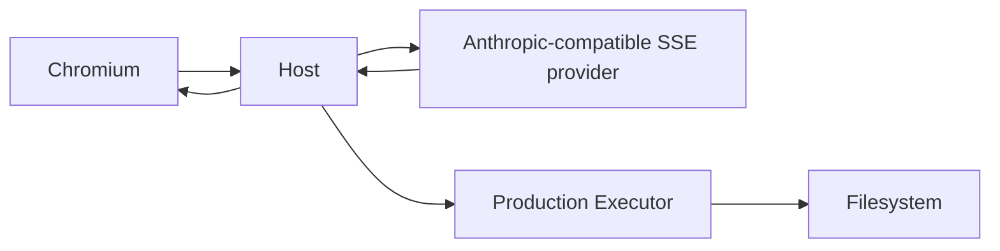

# Dashboard production profiling runbook

This runbook is the reusable procedure for investigating Dashboard performance. It intentionally separates **measurement**, **root-cause attribution**, **optimization**, and **regression gating**.

Do not start by changing React code. First reproduce the user-visible problem with a production artifact and preserve the trace.

## Tooling map

| Command | Purpose |
|---|---|
| `pnpm run perf:profile-suite` | Build a source-mapped production artifact, run history and streaming profiles, attribute CPU hotspots, then restore a normal map-free release |
| `pnpm run perf:profile-production` | Profile cold load, long-history scrolling, Composer typing, and Session switching |
| `pnpm run perf:profile-streaming` | Profile real SSE text streaming followed by eight real Executor Tool calls |
| `pnpm run perf:analyze-cpu -- ...` | Map minified CDP CPU samples back to original TypeScript sources |
| `pnpm run perf:compare -- BASE CANDIDATE` | Produce a standard A/B table from two history reports |

Implementation files live in [`scripts/performance`](../../scripts/performance/).

## Required environment

- Node.js 22+
- installed workspace dependencies
- Chromium (`CHROME_PATH` may override detection)
- production release artifacts for the direct profile commands
- Linux production Executor artifact for the streaming scenario

The suite command builds its own artifacts. Direct commands expect `release/bundle-dashboard-with-runtime.cjs` to exist.

## Recommended full investigation

### 1. Capture the baseline

```bash
pnpm run perf:profile-suite -- \
  --output /tmp/runlab-profile-baseline \
  --turns 1250
```

This performs the following sequence:

1. Builds the embedded production Dashboard with hidden source maps.
2. Creates a 5,001-event persisted Session and an eight-turn comparison Session.
3. Runs cold-load, scroll, typing, and bidirectional Session-switch profiles.
4. Starts the production Host and Executor with a same-protocol SSE provider.
5. Streams 240 Markdown chunks and executes eight real `read_file` Tools.
6. Writes source-mapped hotspot reports.
7. Restores the exact pre-profile Dashboard dist and release artifacts from a temporary backup, even when profiling fails.

Never deploy the temporary profiling build. The suite restores the exact pre-profile artifacts in `finally`; verify this if the process was externally killed.

### 2. Inspect evidence before editing

Evidence layout:

```text
/tmp/runlab-profile-baseline/
├── manifest.json
├── history/
│   ├── report.json
│   ├── cold-load-long-session.trace.json
│   ├── cold-load-long-session.cpuprofile.json
│   ├── long-transcript-scroll.trace.json
│   ├── composer-typing-240-chars.trace.json
│   ├── switch-long-to-short.trace.json
│   └── switch-short-to-long.trace.json
├── history-hotspots.md
├── streaming/
│   ├── report.json
│   ├── streaming.trace.json
│   └── streaming.cpuprofile.json
└── streaming-hotspots.md
```

Open `*.trace.json` in Chrome DevTools Performance or Perfetto. Use the generated hotspot Markdown to map sampled self-time to source files.

Review in this order:

1. Long Tasks over 50 ms.
2. Frame p95/p99/max and frames over 33/50/100 ms.
3. DOM node count and mounted virtual rows.
4. Layout and style recalculation duration.
5. Source-mapped CPU self-time.
6. Heap and garbage collection.
7. Network/provider timing only after main-thread work is understood.

A large wall-clock duration is not automatically a UI bottleneck. The streaming scenario deliberately spends about three seconds waiting for provider chunks.

### 3. Form one falsifiable root-cause statement

Good:

> The visible Inspector Trace creates one row and one minimap button per history event, producing more than 100,000 DOM descendants and a one-second Layout/GC task when switching to a 5,001-event Session.

Bad:

> React is slow; add memoization everywhere.

The statement must name:

- the user interaction;
- the measured cost;
- the owning DOM/component/function;
- evidence that rules out adjacent systems.

### 4. Make one focused optimization

Preserve product semantics. Do not make a scenario faster by hiding data, replacing production artifacts, reducing the fixture only in the candidate, or removing verification waits.

Run focused functional tests before the next browser profile.

### 5. Capture the candidate with identical parameters

```bash
pnpm run perf:profile-suite -- \
  --output /tmp/runlab-profile-candidate \
  --turns 1250
```

Use the same machine, viewport, Chromium channel, turn count, and cache policy whenever possible.

### 6. Generate the A/B report

```bash
pnpm run perf:compare -- \
  /tmp/runlab-profile-baseline/history/report.json \
  /tmp/runlab-profile-candidate/history/report.json \
  --output /tmp/runlab-profile-ab.md
```

An optional relative regression threshold is available:

```bash
pnpm run perf:compare -- BASE.json CANDIDATE.json \
  --fail-regression-percent 20
```

Relative thresholds are useful only on comparable hardware. The production profiler's structural budgets are the stable CI authority.

## Direct commands

### History and interaction profile

```bash
PERF_EVIDENCE_ROOT=/tmp/history-profile \
PERF_TURNS=1250 \
pnpm run perf:profile-production
```

Useful variables:

| Variable | Default | Meaning |
|---|---:|---|
| `PERF_TURNS` | `1250` | Four timeline entries are generated per turn |
| `PERF_DASHBOARD_PORT` | `3210` | Isolated Host port |
| `PERF_EVIDENCE_ROOT` | temporary directory | Persistent evidence destination |
| `PERF_ASSERT_BUDGET` | unset | Set to `1` to fail structural budgets |
| `PERF_KEEP_STATE` | unset | Preserve temporary Session state |
| `CHROME_PATH` | auto-detected | Chromium executable |

### Streaming and Tool profile

```bash
PERF_EVIDENCE_ROOT=/tmp/stream-profile \
pnpm run perf:profile-streaming
```

This is a real task chain:



The paid model is the only controlled boundary. Host, Executor, Socket.IO, persistence, Tool execution, filesystem reads, Dashboard rendering, and cleanup are real.

### Source-map attribution only

First create a profiling build:

```bash
RUNLAB_PROFILE_SOURCEMAP=1 pnpm run build:release-assets -- --skip-package-build
```

Then:

```bash
pnpm run perf:analyze-cpu -- \
  /tmp/profile/*.cpuprofile.json \
  --output /tmp/profile/hotspots.md \
  --top 40
```

Restore the release afterward:

```bash
RUNLAB_PROFILE_SOURCEMAP=0 pnpm run build:release-assets -- --skip-package-build
find packages/dashboard/dist -name '*.map' -print -quit | grep -q . && exit 1 || true
```

Prefer `perf:profile-suite`, which performs restoration automatically.

## Current CI budgets

The scheduled product-system lane runs a 300-turn production profile with:

```bash
PERF_TURNS=300 PERF_ASSERT_BUDGET=1 pnpm run perf:profile-production
```

Budgets:

- long-Session DOM nodes: at most 5,000;
- Reducer Trace descendants: at most 1,000;
- minimap descendants: at most 150;
- Session-switch Long Task: at most 200 ms;
- cold-load Long Task: at most 250 ms.

Wall-clock timings remain evidence rather than hard CI gates because self-hosted runner load varies.

## Adding a scenario

A new scenario must:

1. Run against the embedded production bundle.
2. Establish a deterministic visible completion condition.
3. Start profiling immediately before the user interaction.
4. Stop only after authoritative and visible completion.
5. Save a trace, CPU profile, frame summary, Long Tasks, DOM shape, heap, and artifact metadata.
6. Clean every process and temporary directory.
7. Keep external boundaries explicit.
8. Document what user complaint it reproduces.

Reuse [`profiling-utils.mjs`](../../scripts/performance/profiling-utils.mjs) for trace streaming, frame collection, CPU summaries, artifact hashes, Git revision, and Chromium metadata.

## Troubleshooting

### Executor says another instance is running

Give the profile an isolated `HOME`. Do not delete the user's real lock file. The streaming profiler already does this.

### Workspace never appears

Inspect captured Host/Executor logs. Common causes are the wrong production executable invocation, a reused port, or an Executor token mismatch.

### Controlled provider receives no request

Isolate Host `HOME`; personal model settings may override environment defaults. The streaming profiler writes a minimal isolated Agent configuration.

### Profile suite stops during package build

The suite builds workspace packages before profiling so Dashboard source maps, Host protocol types, and the embedded release are from one revision. Fix or finish any concurrent source changes that leave package builds inconsistent; do not bypass this preflight with stale `dist` output. The suite restores the pre-profile artifacts even when this build fails.

### CPU hotspots remain minified

The profile and source maps must come from the same build. The analyzer fails by default when no profile bundle URL matches a source map. Run the suite, or rebuild with `RUNLAB_PROFILE_SOURCEMAP=1` and profile before rebuilding again. Use `--allow-unmapped` only for deliberate minified fallback analysis.

### Cold-load frame count is zero

A navigation replaces the document containing the in-page RAF probe. Use Long Tasks, trace, and time-to-visible for navigation; frame probes are reliable for post-navigation interactions.

### Complete test suite has unrelated cache flakes

Rerun the failed file independently before attributing it to performance changes. Preserve the full-suite failure in the report, but do not misclassify shared IndexedDB/mock state as a product regression.

## Evidence discipline

Do not commit multi-megabyte traces to Git. Upload them as CI artifacts or retain them under an explicit evidence root. Commit:

- the profiler scripts;
- budgets;
- source-mapped hotspot summary when needed;
- A/B table;
- concise root-cause and decision documentation.
