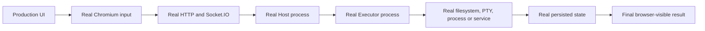

# Product E2E Harness Contract

**Status:** normative for new browser/system acceptance
**Implementation:** `scripts/product-e2e/harness.mjs`

## Required chain

Each critical journey records:

1. the real user entry action;
2. relevant HTTP/Socket.IO requests and statuses;
3. backend or filesystem side effects;
4. final visible UI state;
5. reload/reconnect persistence for durable actions;
6. an explicit failure/retry case where applicable;
7. cleanup of every temporary identity, Session, Workspace, Artifact, device subscription, and filesystem root.

A selector existing, a dialog opening, or a screenshot alone is not success.

## Reality standard

Unless a scenario declares an external-capability boundary, all links below are real:

Permitted controlled boundaries are limited to capabilities the repository cannot hermetically own: public DNS/domain routing, third-party identity, paid model providers, push networks, and physical devices. The controlled replacement must speak the same public protocol. Reports record `controlledBoundaries` and `untestedExternalCapabilities`; an omitted boundary is never silently treated as covered.

Production-shaped means the built release entry point, embedded Dashboard assets, generated installers, and release Executor binary. `tsx`, Vite dev/preview, direct store mutation, prewritten Session JSONL, mocked Socket.IO, mocked PTY, and mocked `fetch` are useful at lower layers but do not satisfy system E2E.

## Minimum pass criteria

Every system E2E report includes:

1. source revision and production artifact digest;
2. exact user entry and generated command/input, with secrets redacted;
3. process and isolated-system identities;
4. transport milestones and authoritative state transitions;
5. persisted/OS side effects and permissions where relevant;
6. final visible state;
7. reload/reconnect/restart result for durable behavior;
8. expected failure/replay behavior;
9. verified cleanup with no remaining process, service, port, instance, or data root.

## Isolation

- Every run creates a unique evidence directory under `/tmp`.
- Hosted tests use temporary identity-provider users and distinct browser contexts.
- Standalone tests use an unused Box port and temporary HOME/data/workspace roots.
- Tests never target LXD `13000` until the final release node.
- System installers run in a disposable LXD instance (or equivalent clean system), never on the developer host.
- Cleanup runs in reverse resource-creation order and is part of the pass/fail report.

## Evidence

`report.json` contains:

- named steps, duration, outcome, and serializable evidence;
- final actor URLs;
- failed HTTP responses;
- console and page errors;
- cleanup results;
- scenario-specific resource IDs, revisions, capabilities, and persistence checks.

Screenshots use stable actor/scenario names inside the same evidence directory.

## Failure policy

Unexpected HTTP `4xx/5xx`, browser console errors, page errors, incomplete cleanup, missing persistence, or an unverified final state fail the scenario. Expected denial cases must be asserted by the scenario and removed from the unexpected-response list only after their body and status are verified.

Existing focused scripts may remain during migration, but new product claims must use this harness or provide equivalent structured evidence. One-line Puppeteer scripts are not accepted as release proof.

If any required link is substituted, skipped, or inferred, the report is `incomplete`, not `passed`.
