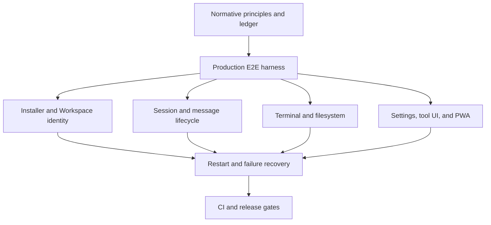

# System E2E Coverage Ledger

**Status:** normative migration ledger  
**Authority:** [`../meta/testing.md`](../meta/testing.md), [`product-e2e-harness.md`](product-e2e-harness.md), and [`critical-user-action-matrix.md`](critical-user-action-matrix.md)  
**Last audited:** 2026-08-14

This ledger prevents a lower-layer test or fixture-driven browser check from being reported as a complete product journey. `Complete` means production artifact, real user entry, real transports/processes/side effects, final visible and authoritative state, persistence/recovery, and cleanup evidence. Public domains and external providers are outside the hermetic boundary unless a separate canary is named.

| Journey | Strongest current evidence | Reality break | Status | Required system E2E |
|---|---|---|---|---|
| Add Workspace — Linux service | `scripts/product-e2e/verify-add-workspace-linux-service.mjs` | Public domain/reverse proxy is an explicit external canary; macOS/Windows are separate journeys | Complete (Linux local-origin) | Production Dashboard → copied command → clean LXD → checksum/native install → systemd active/enabled → Workspace visible → restart/replay/cleanup |
| Add Workspace — temporary | `scripts/product-e2e/verify-add-workspace-linux-temporary.mjs` | Public origin and non-Linux platforms remain separate canaries | Complete (Linux local-origin) | Dashboard command in clean LXD → Workspace online → terminate → offline/cleanup |
| New Session | `scripts/product-e2e/verify-core-workspace-journeys.mjs` | Deletion and active-turn switching remain separate scenarios | Complete (create/select/reload) | Production bundle, UI create, exact selected ID, reload, persisted cwd |
| Running Session switch | `scripts/product-e2e/verify-controlled-agent-journey.mjs` | Hover-preview stress and mobile touch remain | Complete (desktop pointer) | Active turn plus real click/hover switch to another Session without blocked UI |
| Direct/queued message | `verify-dashboard-real.mjs` | Source processes and external-provider dependency; reconnect matrix incomplete | Partial | Controlled protocol provider, production processes, ACK/queue/edit/reorder/delete/drain/reconnect |
| Files and preview | `scripts/product-e2e/verify-core-workspace-journeys.mjs` reads real bytes through UI | Binary/download/live hover preview and path denial remain | Partial | Real Executor list/read/write/binary/download, live preview update, reload, path denial |
| Git | tool/component tests | No browser task chain against a real repository | Gap | Real repo status/diff/mutation/refresh/error through production UI |
| Interactive Terminal | `scripts/product-e2e/verify-core-workspace-journeys.mjs` | Host-restart recovery is covered; Executor-process restart with an open PTY remains | Complete (input/output/resize/kill/restart) | Real Chromium keyboard → PTY echo/resize/kill/reconnect cleanup |
| Agent tool chain | `scripts/product-e2e/verify-controlled-agent-journey.mjs` | Read is complete; write/shell/test and failure paths remain | Partial | Controlled same-protocol model stream with actual read/write/shell/test tools and durable result |
| Tool intention and dot line | `scripts/product-e2e/verify-controlled-agent-journey.mjs` | Running overlay obstruction and multi-call geometry stress remain | Complete (single call/replay); Partial (stress) | Live tool call with `_intent`, running/completed UI, expanded details, reload/replay, no overlay obstruction |
| Sub-agent lifecycle | fixture-driven browser checks | No live child Session | Gap | Real child running/success/failure/cancel and parent transcript persistence |
| Custom system prompt | Core journey proves UI/disk/restart; controlled-agent journey proves provider request | External provider compatibility remains a canary | Complete (local controlled boundary) | Edit/save in production UI → disk → Host restart → new Session controlled-provider request contains prompt |
| PWA install/update/offline | `scripts/product-e2e/verify-pwa-update-reload.mjs` | v1/v2 are deterministic variants of one production build; physical iOS remains external | Complete (Chromium controlled update) | Two production builds, controlled SW update, reload latency, Session recovery, offline/reconnect |
| Restart/recovery | `scripts/product-e2e/verify-core-workspace-journeys.mjs` restarts production Host with live Executor/browser | Active turn/queued message and exactly-once recovery remain | Partial | Host/Executor restart during durable operations, reconnect and exactly-once state |
| Responsive surfaces | production-bundle Chromium geometry scripts | Mostly fixture-driven and no physical iOS keyboard | Partial | Keep Chromium matrix; physical iOS remains an explicitly reported external-device canary |
| SaaS identity/isolation | local acceptance scripts | External IdP/public origin are environment capabilities | Partial | Local same-protocol identity/two-Unit E2E plus separate external IdP/public-origin canary |

## Existing browser-script classification

| Script | Correct classification | Reason |
|---|---|---|
| `scripts/dashboard/verify-dashboard-real.mjs` | browser system integration | Built Dashboard and real processes, but source Host/Executor and an environment-dependent model boundary |
| `scripts/dashboard/verify-dashboard-mobile-pwa.mjs` | fixture-driven browser check | Production UI geometry with prewritten Session JSONL; it does not install, update, or recover a PWA |
| `scripts/dashboard/verify-dashboard-layout-scroll.mjs` | fixture-driven browser check | Real Chromium/Host with prewritten events and no Executor task chain |
| `scripts/dashboard/verify-dashboard-headless.mjs` | static/PWA browser check | Vite preview, no Host or Executor task chain |
| `scripts/dashboard/verify-tool-call.mjs` | environment-dependent browser integration | Real tool process, but it attaches to a pre-existing environment and does not own production artifact startup |
| `scripts/release/verify-release-install.mjs` | release smoke | Starts one production bundle and probes assets; no user task or OS installation lifecycle |

## Topology

Foundation precedes journeys so artifact startup, Chrome, LXD, evidence, timeout, and cleanup behavior are not reimplemented inconsistently. Recovery follows happy paths because it reuses their observable milestones. CI gates are last so an unstable scenario is not normalized as a flaky required check.
