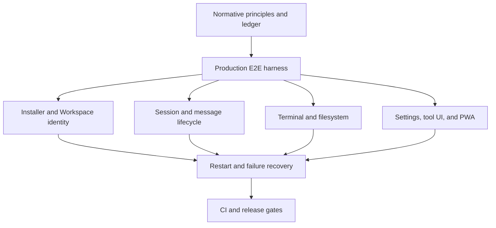

# System E2E Coverage Ledger

**Status:** normative migration ledger  
**Authority:** [`../meta/testing.md`](../meta/testing.md), [`product-e2e-harness.md`](product-e2e-harness.md), and [`critical-user-action-matrix.md`](critical-user-action-matrix.md)  
**Last audited:** 2026-08-14

This ledger prevents a lower-layer test or fixture-driven browser check from being reported as a complete product journey. `Complete` means production artifact, real user entry, real transports/processes/side effects, final visible and authoritative state, persistence/recovery, and cleanup evidence. Public domains and external providers are outside the hermetic boundary unless a separate canary is named.

| Journey | Strongest current evidence | Reality break | Status | Required system E2E |
|---|---|---|---|---|
| Add Workspace — Linux service | `scripts/product-e2e/verify-add-workspace-linux-service.mjs` | Public domain/reverse proxy is an explicit external canary; macOS/Windows are separate journeys | Complete (Linux local-origin) | Production Dashboard → copied command → clean LXD → checksum/native install → systemd active/enabled → Workspace visible → restart/replay/cleanup |
| Add Workspace — temporary | `scripts/product-e2e/verify-add-workspace-linux-temporary.mjs` | Public origin and non-Linux platforms remain separate canaries | Complete (Linux local-origin) | Dashboard command in clean LXD → Workspace online → terminate → offline/cleanup |
| New Session | `scripts/product-e2e/verify-core-workspace-journeys.mjs` covers create/select/reload; `scripts/product-e2e/verify-controlled-agent-journey.mjs` covers durable delete | Parent/child cascade delete remains with Sub-agent journey | Complete (create/select/reload/delete) | Production bundle, UI create, exact selected ID, reload, persisted cwd |
| Account/settings entry | Responsive browser checks and Settings component tests | No production task chain proves identity-aware account entry plus Settings success/error/retry without a false Dedicated account requirement | Partial | Real identity/Dedicated modes → Account and Settings entry → scroll/actions → success/error/retry |
| Agent Runtime selection | `scripts/dashboard/verify-runtime-session-picker.mjs` and Runtime metadata component/integration tests | Existing browser check stops before Session creation and does not prove the selected Runtime owns the turn | Partial | Production UI selection → remembered preference → exact Runtime in created Session and Session Info → reload |
| Running Session switch | `scripts/product-e2e/verify-controlled-agent-journey.mjs` | Hover-preview stress and mobile touch remain | Complete (desktop pointer) | Active turn plus real click/hover switch to another Session without blocked UI |
| Direct message | Controlled-agent journey proves one durable turn through production processes | It does not measure acceptance ACK under 500 ms, immediate input clearing, or timeout-restore absence | Partial | Real Host/provider → measure durable ACK latency → input clears before turn completion → no timeout restore → exactly one turn |
| Queue message | `scripts/product-e2e/verify-controlled-agent-journey.mjs` | Many-message load stress remains a performance lane, not a functional gap | Complete (edit/reorder/delete/restart/exactly-once drain) | Controlled protocol provider, production processes, queue/edit/reorder/delete/drain/reconnect |
| Files and preview | `scripts/product-e2e/verify-core-workspace-journeys.mjs` covers real text/binary/download bytes; `scripts/product-e2e/verify-controlled-agent-journey.mjs` proves live hover preview and sandbox denial UI | Large-file truncation remains a performance/limit extension | Complete (read/binary/download/live preview/denial) | Real Executor list/read/write/binary/download, live preview update, reload, path denial |
| Git | `scripts/product-e2e/verify-core-workspace-journeys.mjs` | Error/unavailable state and staged mutation remain | Partial (real status/diff only) | Real repo status/diff/staged mutation/refresh plus unavailable/empty/error states through production UI |
| Interactive Terminal | `scripts/product-e2e/verify-core-workspace-journeys.mjs` | Host-restart recovery is covered; Executor-process restart with an open PTY remains | Complete (input/output/resize/kill/restart) | Real Chromium keyboard → PTY echo/resize/kill/reconnect cleanup |
| Background Shell registry | `scripts/product-e2e/verify-controlled-agent-journey.mjs` | Executor-process restart cannot preserve an OS process and remains a cleanup/reconciliation extension | Complete (start/list/output/reload/kill) | Agent shell Tool with `run_in_background` → real Executor process → Workspace Shell UI list/output → reload → real pointer kill → terminal state |
| Artifact preview | Artifact component/API tests | No production browser journey owns real bytes through register, thumbnail, preview, download, reload, and cross-Unit denial | Partial | Isolated real artifact bytes → UI register/thumbnail/preview/download → reload → two-Unit denial |
| Agent tool chain | `scripts/product-e2e/verify-controlled-agent-journey.mjs` | Test runner command is represented by a real shell assertion; provider compatibility remains external | Complete (read/write/shell/failure) | Controlled same-protocol model stream with actual read/write/shell/test tools and durable result |
| GitHub Copilot Runtime | Unit/integration coverage plus `scripts/runtime/verify-agent-runtime-tools.mjs`; `scripts/product-e2e/verify-copilot-runtime-journey.mjs` is the official-provider UI canary | Official authentication/provider is external; isolated production artifact ownership, approval rejection, active-turn restart, Executor reconnect, and SDK-side deletion evidence are not yet hermetic | Partial (external canary) | Add a controlled same-protocol Copilot boundary to an isolated production Host/Executor journey; retain the official-provider canary for SDK/CLI compatibility |
| Tool intention and dot line | `scripts/product-e2e/verify-controlled-agent-journey.mjs` | Very large omission-count stress remains | Complete (multi-call/replay/geometry) | Live tool call with `_intent`, running/completed UI, expanded details, reload/replay, no overlay obstruction |
| Sub-agent lifecycle | `scripts/product-e2e/verify-controlled-agent-journey.mjs` | External provider compatibility remains a canary | Complete (success/provider failure/UI cancel) | Real child running/success/failure/cancel and parent transcript persistence |
| Streaming scroll | Component/browser scroll tests | No production active stream proves manual history position remains pinned while tokens/tools append and explicit return-to-bottom works | Partial | Real Chromium wheel/touch input during controlled streaming/tool activity → stable anchor → explicit return-to-bottom |
| Notifications | Component tests and Unit-scoped device API tests | No production service-worker permission/device journey covers enable/deny/error, remote toggle/test/remove, or badge clearing | Partial | Chromium permission/SW lane plus real Unit-scoped device API and navigation evidence |
| Custom system prompt | `scripts/product-e2e/verify-core-workspace-journeys.mjs` proves UI/disk/restart; `scripts/product-e2e/verify-controlled-agent-journey.mjs` proves provider request | External provider compatibility remains a canary | Complete (local controlled boundary) | Edit/save in production UI → disk → Host restart → new Session controlled-provider request contains prompt |
| PWA install/update/offline | `scripts/product-e2e/verify-pwa-update-reload.mjs` | Update/offline recovery is covered; notification-click navigation, cache identity partition, logout cleanup, and physical iOS remain | Partial (Chromium update/offline) | Two production builds, controlled SW update/offline recovery plus notification navigation and identity-partition/logout cache cleanup |
| Restart/recovery | `scripts/product-e2e/verify-core-workspace-journeys.mjs` covers Host/browser/Executor reconnect; `scripts/product-e2e/verify-controlled-agent-journey.mjs` covers active turn plus persisted queue exactly-once | Executor process restart with open PTY remains a dedicated resilience extension | Complete (Host active-turn/queue) | Host/Executor restart during durable operations, reconnect and exactly-once state |
| Responsive surfaces | `verify-dashboard-mobile-pwa.mjs` runs the production embedded bundle across desktop/mobile/iPad/standalone and now uses the real mobile Explorer → Session Info pointer path | The scenario still uses a prewritten Session fixture; physical iOS keyboard remains an external-device canary | Partial (production Chromium interaction matrix) | Move representative mobile task chains onto isolated real Host/Executor state; retain physical iOS as an explicit external-device canary |
| Dedicated benchmark/evaluation | Evaluation component/integration coverage | No production browser journey completes the default wizard and verifies persisted progress/artifacts | Partial | Dedicated production bundle → wizard → execution/progress → persisted artifacts/reload |
| Private Cloud benchmark denial | Protocol/route deny tests | No enumerated production deny matrix proves absence from every nav/route/command/Settings and denial of every raw action | Partial | Private Cloud UI absence plus enumerated HTTP/protocol denial matrix |
| Private Cloud identity/isolation | Local acceptance is wired in `.github/workflows/private-cloud-product-e2e.yml` with strict two-identity/stack preflight | Current workstation lacks the local stack and temporary identities; external IdP/public origin remain canaries | Environment-gated | Local same-protocol identity/two-Unit E2E plus separate external IdP/public-origin canary |

## Existing browser-script classification

| Script | Correct classification | Reason |
|---|---|---|
| `scripts/dashboard/verify-dashboard-real.mjs` | browser system integration | Built Dashboard and real processes, but source Host/Executor and an environment-dependent model boundary |
| `scripts/dashboard/verify-dashboard-mobile-pwa.mjs` | fixture-driven browser check | Production UI geometry with prewritten Session JSONL; it does not install, update, or recover a PWA |
| `scripts/dashboard/verify-dashboard-layout-scroll.mjs` | fixture-driven browser check | Real Chromium/Host with prewritten events and no Executor task chain |
| `scripts/dashboard/verify-dashboard-headless.mjs` | static/PWA browser check | Vite preview, no Host or Executor task chain |
| `scripts/dashboard/verify-tool-call.mjs` | environment-dependent browser integration | Real tool process, but it attaches to a pre-existing environment and does not own production artifact startup |
| `scripts/product-e2e/verify-copilot-runtime-journey.mjs` | official-provider UI external canary | Uses production UI and real Copilot SDK/CLI, Host, Executor, tools, persistence, and cleanup, but attaches to an existing deployment and cannot own external authentication/provider or process restart |
| `scripts/release/verify-release-install.mjs` | release smoke | Starts one production bundle and probes assets; no user task or OS installation lifecycle |

## Topology

Foundation precedes journeys so artifact startup, Chrome, LXD, evidence, timeout, and cleanup behavior are not reimplemented inconsistently. Recovery follows happy paths because it reuses their observable milestones. CI gates are last so an unstable scenario is not normalized as a flaky required check.
